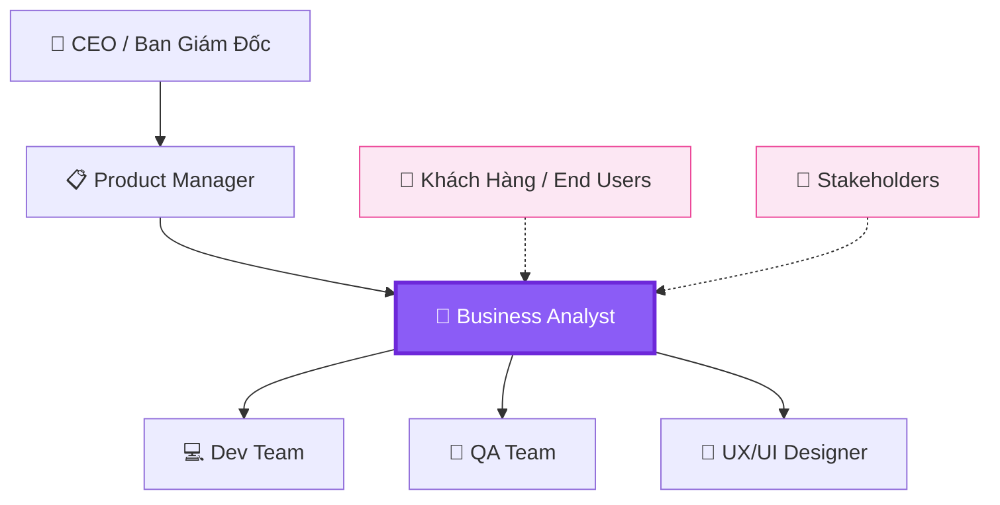
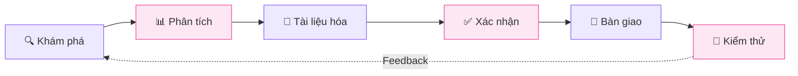
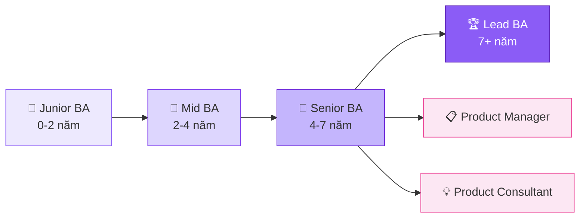

## Business Analyst là ai?

**Business Analyst (BA)** là người đóng vai trò **cầu nối** giữa các bên liên quan (stakeholders) — từ khách hàng, quản lý đến đội ngũ phát triển — để đảm bảo giải pháp công nghệ **đáp ứng đúng nhu cầu kinh doanh**.

<Callout type="info" title="Định nghĩa từ IIBA">
Theo International Institute of Business Analysis (IIBA), BA là người chịu trách nhiệm phân tích và đề xuất các giải pháp giúp tổ chức đạt được mục tiêu kinh doanh.
</Callout>

## Vị trí của BA trong tổ chức

## BA làm gì hàng ngày?

Một ngày làm việc điển hình của BA có thể bao gồm:

### 📋 Thu thập & Phân tích yêu cầu
- Phỏng vấn stakeholders để hiểu nhu cầu
- Tổ chức workshop brainstorming
- Phân tích quy trình kinh doanh hiện tại (As-Is)
- Thiết kế quy trình mới (To-Be)

### 📝 Viết tài liệu
- **BRD** (Business Requirements Document)
- **SRS** (Software Requirements Specification)
- **User Stories** & Acceptance Criteria
- Wireframe & Mockup cơ bản

### 🤝 Giao tiếp & Phối hợp
- Daily standup meetings
- Sprint planning & refinement
- Demo & UAT (User Acceptance Testing)
- Trình bày giải pháp cho stakeholders

<Callout type="tip" title="Pro tip">
BA giỏi không chỉ hỏi "Anh/chị muốn gì?" mà phải biết hỏi "Tại sao anh/chị cần điều này?" để tìm ra nhu cầu thực sự đằng sau yêu cầu.
</Callout>

## Quy trình làm việc của BA

## Kỹ năng cần có

### Hard Skills
| Kỹ năng | Mô tả | Mức độ quan trọng |
|---------|--------|:-----------------:|
| Requirements Analysis | Thu thập, phân tích, ưu tiên yêu cầu | ⭐⭐⭐⭐⭐ |
| Process Modeling | Vẽ BPMN, flowchart, data flow | ⭐⭐⭐⭐⭐ |
| Wireframing | Tạo mockup UI cơ bản | ⭐⭐⭐⭐ |
| SQL cơ bản | Truy vấn dữ liệu, verify data | ⭐⭐⭐ |
| Data Analysis | Phân tích data để đưa ra insight | ⭐⭐⭐ |

### Soft Skills
- 🗣️ **Giao tiếp** — Truyền đạt ý tưởng rõ ràng
- 👂 **Lắng nghe chủ động** — Hiểu "why" đằng sau mỗi yêu cầu
- 🧩 **Tư duy phân tích** — Phân tách vấn đề phức tạp
- 🤝 **Đàm phán** — Tìm giải pháp win-win
- 📐 **Tỉ mỉ, chi tiết** — Không bỏ sót edge cases

## Lộ trình phát triển sự nghiệp

### Mức lương tham khảo (VN, 2026)

| Level | Kinh nghiệm | Mức lương (VND/tháng) |
|-------|-------------|---------------------:|
| Junior BA | 0-2 năm | 10-18 triệu |
| Mid BA | 2-4 năm | 18-30 triệu |
| Senior BA | 4-7 năm | 30-50 triệu |
| Lead / Manager | 7+ năm | 50-80+ triệu |

<Callout type="success" title="Tin vui!">
Nghề BA đang rất hot tại Việt Nam! Nhu cầu tuyển dụng tăng đều mỗi năm, đặc biệt trong lĩnh vực Fintech, E-commerce và Healthcare.
</Callout>

## Bắt đầu từ đâu?

1. **Học kiến thức nền tảng** — Đọc BABOK Guide, tham gia khóa học online
2. **Thực hành** — Phân tích ứng dụng bạn dùng hàng ngày
3. **Xây dựng portfolio** — Tạo case study, viết user stories
4. **Networking** — Tham gia cộng đồng BA Việt Nam
5. **Ứng tuyển** — Bắt đầu với vị trí Junior BA hoặc BA Intern

---

*Chúc bạn thành công trên hành trình BA nhé! Theo dõi blog để cập nhật thêm kiến thức mới! 💜*
