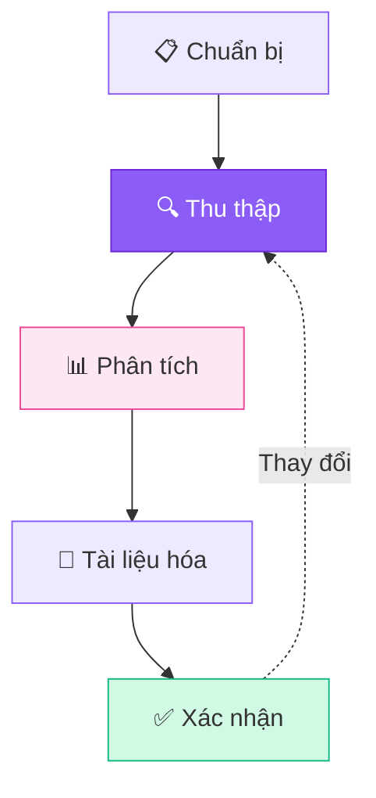
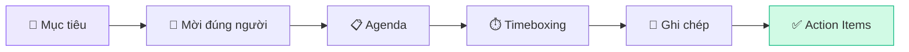

## Tại sao thu thập yêu cầu quan trọng?

Thu thập yêu cầu (Requirements Elicitation) là **bước nền tảng** trong quy trình BA. Nếu thu thập sai → phân tích sai → build sai → tốn tiền & thời gian fix.

<Callout type="warning" title="Sự thật phũ phàng">
Theo nghiên cứu của Standish Group, 68% dự án thất bại có nguyên nhân từ yêu cầu không rõ ràng hoặc thay đổi liên tục.
</Callout>

## Quy trình thu thập yêu cầu

## 5 Kỹ thuật chính

### 1. 🎙️ Phỏng vấn (Interview)

Đây là kỹ thuật **phổ biến nhất** và hiệu quả nhất khi bạn cần hiểu sâu về nhu cầu.

**Khi nào dùng:**
- Gặp stakeholder lần đầu
- Cần hiểu chi tiết quy trình nghiệp vụ
- Khai thác nhu cầu ẩn (latent needs)

**Cách thực hiện:**
1. Chuẩn bị danh sách câu hỏi (mở + đóng)
2. Ghi chép / record cuộc phỏng vấn
3. Gửi meeting notes sau 24h
4. Follow up các điểm chưa rõ

<Callout type="tip" title="Mẹo phỏng vấn">
Dùng kỹ thuật "5 Whys" — hỏi "Tại sao?" 5 lần liên tiếp để tìm ra root cause thực sự.
</Callout>

### 2. 📝 Khảo sát (Survey/Questionnaire)

Hiệu quả khi cần thu thập ý kiến từ **số lượng lớn** người dùng.

| Ưu điểm | Nhược điểm |
|----------|-----------|
| Tiếp cận nhiều người | Không khai thác sâu được |
| Dữ liệu định lượng | Tỷ lệ trả lời thấp |
| Tiết kiệm thời gian | Câu hỏi có thể bị hiểu sai |
| Dễ phân tích | Không linh hoạt |

### 3. 👀 Quan sát (Observation / Job Shadowing)

**"Đừng chỉ hỏi người dùng làm gì — hãy xem họ làm!"**

Quan sát trực tiếp giúp bạn phát hiện:
- 🔄 Các bước thừa trong quy trình
- 😓 Pain points mà users đã quen (không nhận ra)
- 🛠️ Workarounds mà users tự tạo
- 📊 Data thực tế vs data báo cáo

### 4. 🧑‍🤝‍🧑 Workshop / Brainstorming

Tập hợp nhiều stakeholders cùng thảo luận:

### 5. 📄 Phân tích tài liệu (Document Analysis)

Nghiên cứu các tài liệu có sẵn:
- 📑 SOP (Standard Operating Procedures)
- 📊 Báo cáo kinh doanh
- 🗃️ Database schema hiện tại
- 📱 Screenshots hệ thống cũ

<Callout type="success" title="Kết hợp nhiều kỹ thuật">
BA giỏi không bao giờ chỉ dùng 1 kỹ thuật! Interview để hiểu sâu → Survey để validate rộng → Observation để xác nhận thực tế.
</Callout>

## So sánh nhanh 5 kỹ thuật

| Kỹ thuật | Độ sâu | Số lượng | Thời gian | Kỹ năng cần |
|----------|:------:|:--------:|:---------:|:-----------:|
| Phỏng vấn | ⭐⭐⭐⭐⭐ | ⭐⭐ | ⭐⭐⭐ | Giao tiếp |
| Khảo sát | ⭐⭐ | ⭐⭐⭐⭐⭐ | ⭐⭐ | Thiết kế form |
| Quan sát | ⭐⭐⭐⭐ | ⭐⭐ | ⭐⭐⭐⭐ | Quan sát |
| Workshop | ⭐⭐⭐⭐ | ⭐⭐⭐ | ⭐⭐⭐ | Facilitation |
| Phân tích TL | ⭐⭐⭐ | ⭐⭐⭐ | ⭐⭐ | Nghiên cứu |

---

*Bài tiếp theo mình sẽ hướng dẫn cách viết User Stories chuẩn format nhé! 📝*
