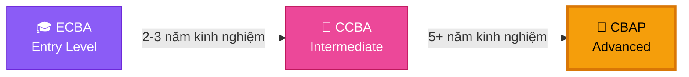
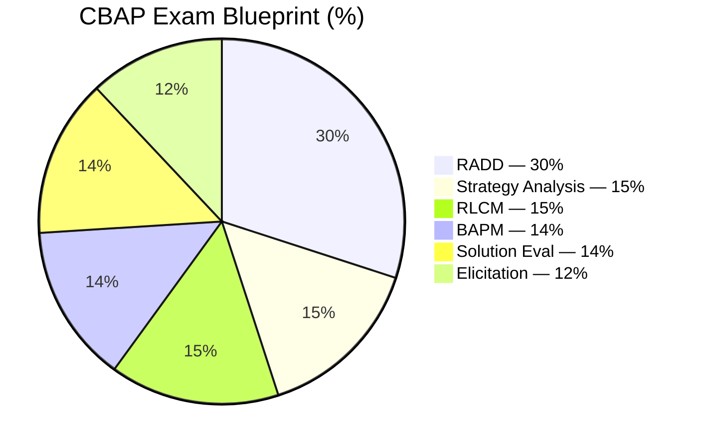
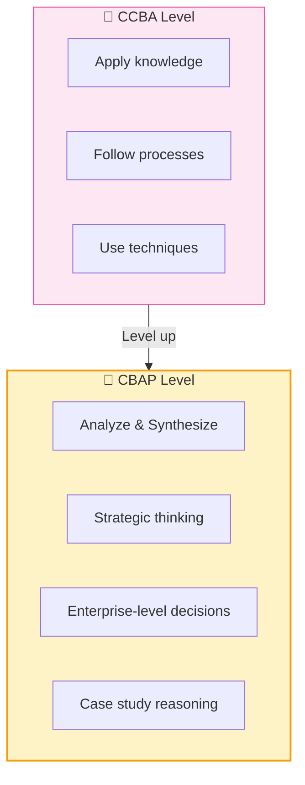
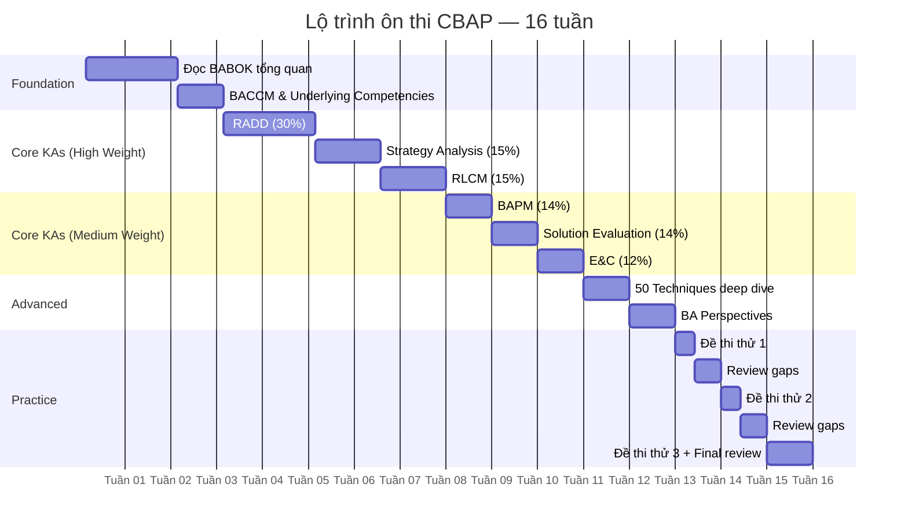
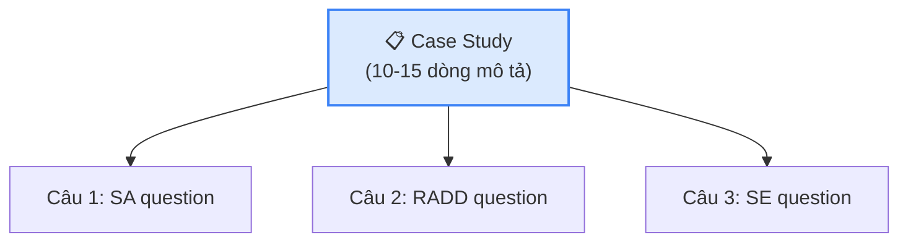
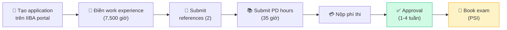

## CBAP — Certified Business Analysis Professional

CBAP (Certified Business Analysis Professional) là chứng chỉ **cao nhất** trong hệ thống chứng chỉ BA của IIBA, dành cho những Business Analyst có **kinh nghiệm sâu rộng** và muốn khẳng định năng lực chuyên môn ở tầm chiến lược.

## Yêu cầu đầu vào

### Điều kiện bắt buộc

| Yêu cầu | Chi tiết |
|---------|---------|
| **Kinh nghiệm BA** | 7,500 giờ trong 10 năm gần nhất |
| **Phủ Knowledge Areas** | Tối thiểu 900 giờ trong 4/6 KA |
| **Professional Development** | 35 giờ đào tạo BA |
| **Recommendation** | 2 thư giới thiệu từ manager/đồng nghiệp |
| **BABOK Knowledge** | Nắm vững toàn bộ BABOK Guide v3 |

<Callout type="warning" title="Yêu cầu kinh nghiệm nghiêm ngặt">
IIBA yêu cầu **7,500 giờ** (tương đương ~5 năm full-time) trong **10 năm gần nhất**. Bạn phải có ít nhất **900 giờ trong 4/6 Knowledge Areas** — không thể chỉ chuyên sâu 1-2 KA. Điều này đảm bảo CBAP holders có kinh nghiệm **toàn diện**.
</Callout>

### So sánh CCBA vs CBAP

| Tiêu chí | CCBA | CBAP |
|---------|------|------|
| Kinh nghiệm | 3,750 giờ / 7 năm | 7,500 giờ / 10 năm |
| KA coverage | 2/6 KA (900h mỗi KA) | 4/6 KA (900h mỗi KA) |
| PD hours | 21 giờ | 35 giờ |
| References | 2 | 2 |
| Số câu hỏi | 130 | 120 |
| Thời gian thi | 3 giờ | 3.5 giờ |
| Dạng câu hỏi | Scenario-based | Case study & Scenario |
| Mức độ tư duy | Application | Analysis & Synthesis |

## Cấu trúc đề thi CBAP

### Exam Blueprint

### Phân bổ câu hỏi ước tính

| Knowledge Area | Trọng số | Số câu (~) | Thời gian (~) |
|---------------|---------|-----------|--------------|
| Requirements Analysis & Design Definition | 30% | 36 | 63 min |
| Strategy Analysis | 15% | 18 | 31 min |
| Requirements Life Cycle Management | 15% | 18 | 31 min |
| BA Planning & Monitoring | 14% | 17 | 29 min |
| Solution Evaluation | 14% | 17 | 29 min |
| Elicitation & Collaboration | 12% | 14 | 25 min |
| **Tổng** | **100%** | **120** | **210 min** |

### Điểm khác biệt so với CCBA

**CBAP test at higher Bloom's Taxonomy levels:**

| Level | CCBA | CBAP |
|-------|------|------|
| Remember/Understand | ✅ | ✅ |
| Apply | ✅ ⭐ | ✅ |
| Analyze | Ít | ✅ ⭐ |
| Synthesize/Evaluate | Không | ✅ ⭐ |

## Lộ trình ôn thi 16 tuần

### Chiến lược học tập cho từng giai đoạn

**Tuần 1-3: Foundation**
- Đọc BABOK Guide v3 từ đầu đến cuối (lần 1)
- Tập trung hiểu BACCM (Business Analysis Core Concept Model)
- Nắm 6 core concepts: Change, Need, Solution, Stakeholder, Value, Context

**Tuần 4-8: Core KAs (High Weight)**
- RADD chiếm 30% → dành 2 tuần, focus modeling techniques
- Strategy Analysis 15% → 1.5 tuần, focus case study analysis
- RLCM 15% → 1.5 tuần, focus traceability & change management

**Tuần 9-11: Core KAs (Medium Weight)**
- BAPM, Solution Evaluation, E&C
- Mỗi KA 1 tuần, focus trên Input/Task/Output/Technique

**Tuần 12-13: Advanced Topics**
- Deep dive 50 Techniques — hiểu khi nào dùng, trong context nào
- BA Perspectives — Agile, BI, IT, Architecture, BPM

**Tuần 14-16: Practice & Review**
- Làm ít nhất 3 bộ đề thử đầy đủ (120 câu mỗi bộ)
- Review gaps, đọc BABOK lần 2 ở những phần yếu
- Focus case study analysis — đây là điểm khác biệt chính của CBAP

## Tài liệu học tập khuyến nghị

### Tài liệu chính
| Tài liệu | Mục đích |
|----------|---------|
| **BABOK Guide v3** | Tài liệu gốc bắt buộc từ IIBA |
| **CBAP Study Guide** (Richard Larson) | Sách ôn thi chuyên dụng |
| **CBAP/CCBA Exam Prep** (Watermark Learning) | Training course chính thức |

### Tài liệu bổ sung
| Tài liệu | Mục đích |
|----------|---------|
| **Practice Exam Simulators** | SimpliLearn, Whizlabs, Adaptive US |
| **BA Times Articles** | Case studies thực tế |
| **IIBA Webinars** | Cập nhật trends |
| **Series On thi CBAP** (batapsu.com) | 12 bài ôn thi có cấu trúc! |

## Đặc điểm câu hỏi CBAP

### Case Study-based Questions

Khác với CCBA (scenario ngắn), CBAP thường có **case study dài** với nhiều câu hỏi liên quan:

**Ví dụ Case Study:**

> *"Công ty ABC đang mở rộng thị trường sang Đông Nam Á. Hiện tại hệ thống ERP chỉ hỗ trợ đơn vị tiền USD. Team kỹ thuật đề xuất nâng cấp module Currency, trong khi bộ phận kinh doanh muốn mua phần mềm mới. CEO yêu cầu BA đánh giá cả hai phương án và đề xuất trong 2 tuần..."*

Từ case study này, đề thi có thể hỏi:
- Strategy Analysis: Phân tích Current State vs Future State
- RADD: NFR nào cần xem xét cho multi-currency?
- Solution Evaluation: Criteria đánh giá Build vs Buy?
- BAPM: BA approach cho timeline 2 tuần?

### Mức độ tư duy yêu cầu

| Level | Ví dụ câu hỏi |
|-------|-------------|
| **Analyze** | "Nguyên nhân root cause nào dẫn đến vấn đề trên?" |
| **Evaluate** | "Tiêu chí nào QUAN TRỌNG NHẤT khi đánh giá 2 phương án?" |
| **Synthesize** | "Dựa trên case study, recommendation nào TỐI ƯU cho doanh nghiệp?" |

<Callout type="info" title="Tư duy CBAP = Strategic Thinking">
CBAP không chỉ test kiến thức BABOK mà test khả năng **tư duy chiến lược** — khả năng tổng hợp thông tin từ nhiều nguồn, đánh giá trade-offs, và đưa ra recommendation có giá trị nhất cho doanh nghiệp.
</Callout>

## Kế hoạch đăng ký thi

### Quy trình đăng ký

### Chi phí

| Hạng mục | IIBA Member | Non-Member |
|---------|-----------|-----------|
| Phí thi | $325 USD | $450 USD |
| IIBA Membership | $139/năm | — |
| Training (PD) | $300-2,000 | $300-2,000 |
| Study materials | $100-300 | $100-300 |

<Callout type="tip" title="Đăng ký IIBA member trước khi thi">
Phí thành viên IIBA $139/năm, nhưng giảm phí thi $125. Nếu thi lần đầu, **đăng ký member sẽ tiết kiệm hơn**. Ngoài ra, member được access BABOK Guide online miễn phí!
</Callout>

## 📝 Tóm tắt kiến thức nổi bật

<Callout type="success" title="Key Takeaways — Bài 1">
- **CBAP** là chứng chỉ cao nhất IIBA, yêu cầu **7,500 giờ** BA experience trong 10 năm + **900 giờ × 4/6 KAs** + 35 giờ PD
- Đề thi gồm **120 câu** (scenario + case study-based) trong **3.5 giờ** — mỗi câu ~1.75 phút
- Mức tư duy: **Analysis & Synthesis** (Bloom Level 4-5) — không chỉ áp dụng mà phải **phân tích và tổng hợp**
- So với CCBA: CBAP tăng mạnh **Solution Evaluation (6%→14%)** và **Strategy Analysis (12%→15%)**
- CBAP holders kiếm cao hơn trung bình **13%** so với BA không có chứng chỉ
- Lộ trình ôn **16 tuần** — dài hơn CCBA (12 tuần) do kiến thức sâu và rộng hơn
</Callout>

---

## 📋 Bài kiểm tra trắc nghiệm — Bài 1

<Callout type="info" title="Hướng dẫn làm bài">
Làm **10 câu** bên dưới trong **17 phút** (giống tốc độ thi thật CBAP). Chọn **MỘT đáp án đúng nhất**. Đáp án ở cuối bài.
</Callout>

**Câu 1.** CBAP yêu cầu ít nhất bao nhiêu giờ kinh nghiệm BA trong bao nhiêu năm?

- A. 3,750 giờ trong 7 năm
- B. 5,000 giờ trong 8 năm
- C. 7,500 giờ trong 10 năm
- D. 10,000 giờ trong 15 năm

**Câu 2.** So với CCBA, điểm khác biệt lớn nhất trong Exam Blueprint của CBAP là:

- A. RADD tăng mạnh
- B. Elicitation tăng mạnh
- C. Solution Evaluation tăng từ 6% lên 14%
- D. BAPM giảm mạnh

**Câu 3.** CBAP kiểm tra ở mức Bloom's Taxonomy nào?

- A. Knowledge & Comprehension
- B. Application
- C. Analysis & Synthesis
- D. Evaluation

**Câu 4.** CBAP yêu cầu phân bổ kinh nghiệm ít nhất mấy Knowledge Areas?

- A. 2/6 KAs
- B. 3/6 KAs
- C. 4/6 KAs
- D. 6/6 KAs

**Câu 5.** Một Senior BA có 8 năm kinh nghiệm nhưng chỉ focus vào Elicitation và RADD. Người này có đủ điều kiện thi CBAP không?

- A. Có, vì đủ tổng giờ
- B. Không, vì cần ít nhất 900 giờ trong 4/6 KAs
- C. Có, nếu có CCBA
- D. Không, vì phải có kinh nghiệm cả 6 KAs

**Câu 6.** CBAP có bao nhiêu câu hỏi và thời gian thi bao lâu?

- A. 130 câu / 3 giờ
- B. 120 câu / 3.5 giờ
- C. 150 câu / 4 giờ
- D. 100 câu / 2.5 giờ

**Câu 7.** Tại sao CBAP tăng tỷ trọng Solution Evaluation so với CCBA?

- A. Vì SE dễ hơn
- B. Vì Senior BA cần khả năng đánh giá giải pháp ở tầm chiến lược và tối ưu hóa liên tục
- C. Vì SE có ít techniques
- D. Vì IIBA muốn thi khó hơn

**Câu 8.** Dạng câu hỏi đặc trưng của CBAP mà CCBA ít có là:

- A. True/False questions
- B. Fill-in-the-blank
- C. Case study-based questions (đọc case study dài, trả lời nhiều câu liên quan)
- D. Essay questions

**Câu 9.** Professional Development hours cho CBAP yêu cầu:

- A. 21 giờ
- B. 35 giờ
- C. 50 giờ
- D. Không yêu cầu

**Câu 10.** Điểm chung lớn nhất giữa CCBA và CBAP là:

- A. Cùng số câu hỏi
- B. Cùng thời gian thi
- C. Cả hai đều dựa trên BABOK Guide v3 và 6 Knowledge Areas
- D. Cùng yêu cầu kinh nghiệm

---

### 🔑 Đáp án & Giải thích

| Câu | Đáp án | Giải thích |
|:---:|:------:|-----------|
| 1 | **C** | CBAP: 7,500 giờ trong 10 năm gần nhất (~5 năm full-time). CCBA chỉ cần 3,750 giờ. |
| 2 | **C** | Solution Evaluation tăng từ 6% (CCBA) → 14% (CBAP) — tăng gần gấp 3, phản ánh vai trò Senior BA. |
| 3 | **C** | CBAP = Analysis & Synthesis (phân tích + tổng hợp). CCBA chỉ ở Application. |
| 4 | **C** | CBAP cần 900 giờ × 4/6 KAs — đảm bảo Senior BA có kinh nghiệm toàn diện. |
| 5 | **B** | Chỉ 2 KAs (Elicitation + RADD) không đáp ứng yêu cầu 4/6 KAs, dù có đủ tổng giờ. |
| 6 | **B** | CBAP: 120 câu / 3.5 giờ. CCBA: 130 câu / 3 giờ. CBAP ít câu hơn nhưng thời gian nhiều hơn vì case study. |
| 7 | **B** | Senior BA phải đánh giá solution ở tầm enterprise level — continuous optimization & value realization. |
| 8 | **C** | CBAP có case study-based questions — đọc scenario dài, phân tích, trả lời chuỗi câu hỏi liên quan. |
| 9 | **B** | CBAP: 35 giờ PD. CCBA: 21 giờ. Yêu cầu cao hơn phản ánh level chuyên môn. |
| 10 | **C** | Cả CCBA và CBAP đều based on BABOK v3 với 6 KAs — chỉ khác depth và Bloom's level. |

### 📊 Thang đánh giá

| Số câu đúng | Đánh giá | Hành động |
|:-----------:|---------|-----------|
| 9-10 | ⭐ Xuất sắc | Sẵn sàng cho hành trình CBAP! |
| 7-8 | ✅ Tốt | Ôn lại exam blueprint và CCBA vs CBAP differences |
| 5-6 | ⚠️ Trung bình | Đọc lại bài, focus vào eligibility requirements |
| < 5 | ❌ Cần ôn lại | Xem xét học CCBA trước nếu chưa vững nền tảng |

---

*Bắt đầu hành trình chinh phục CBAP — chứng chỉ đỉnh cao của BA! 👑*
