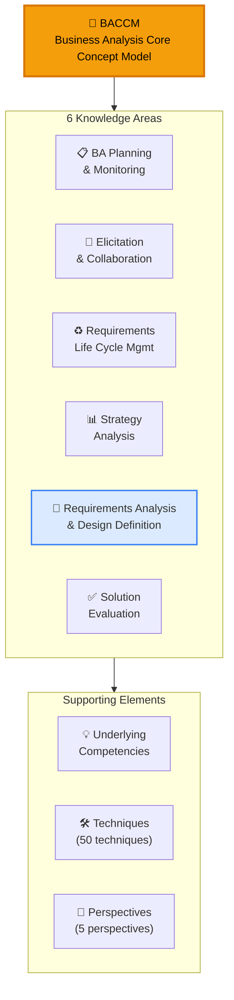
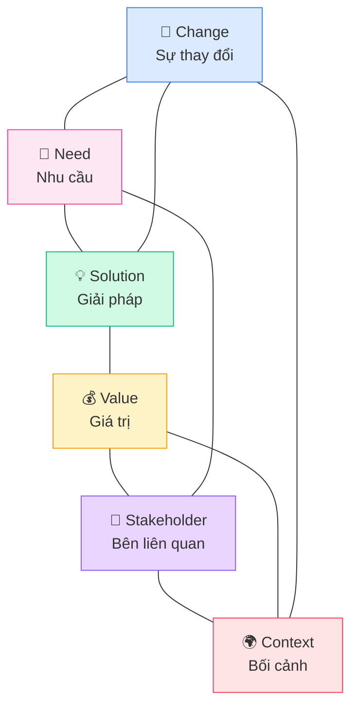
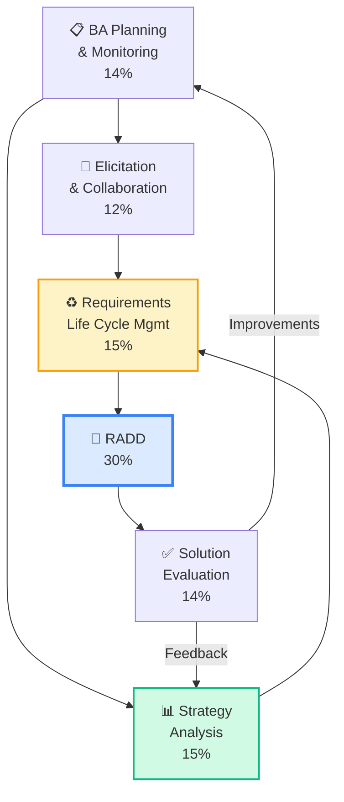
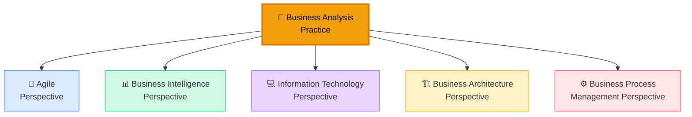
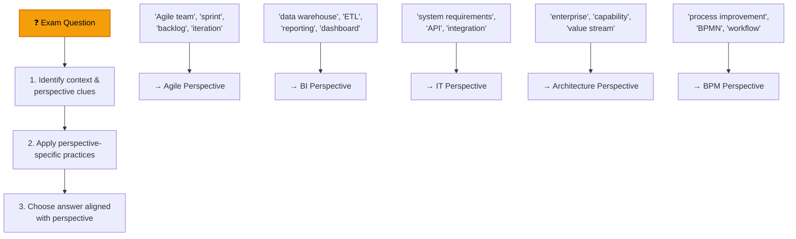
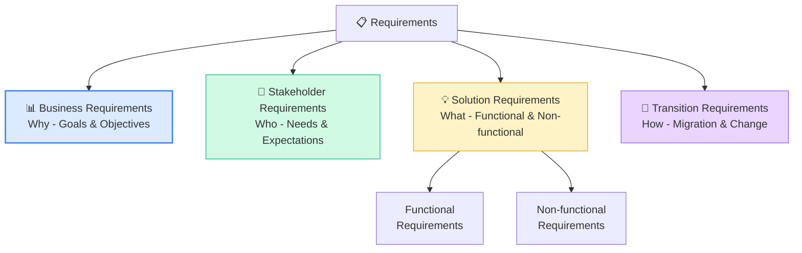
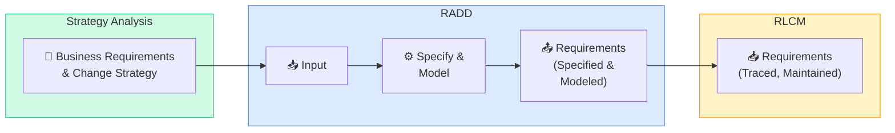

## BABOK Guide v3 — Kiến trúc tổng thể

BABOK (Business Analysis Body of Knowledge) Guide v3 là **tiêu chuẩn quốc tế** cho nghề BA. Với CBAP, bạn cần hiểu BABOK không chỉ ở mức áp dụng (apply) mà ở mức **phân tích và tổng hợp** (analyze & synthesize).

### Kiến trúc BABOK

## BACCM — Business Analysis Core Concept Model

BACCM là **nền tảng** của mọi hoạt động BA. Gồm 6 core concepts liên kết chặt chẽ:

### 6 Core Concepts chi tiết

| Concept | Definition | CBAP Focus |
|---------|-----------|-----------|
| **Change** | Act of transformation in response to a need | Hiểu change ở enterprise level, không chỉ project |
| **Need** | Problem or opportunity to be addressed | Distinguish giữa stated needs vs real needs |
| **Solution** | Specific way of satisfying needs | Evaluate multiple solutions, recommend optimal |
| **Stakeholder** | Individual/group with relationship to change | Manage complex stakeholder ecosystems |
| **Value** | Worth, importance of something to stakeholder | Quantify value, understand value conflicts |
| **Context** | Circumstances that influence the change | Analyze internal + external context factors |

<Callout type="info" title="BACCM trong CBAP exam">
Câu hỏi CBAP thường test khả năng **liên kết** giữa các core concepts. Ví dụ: "Khi context thay đổi (M&A), BA cần reassess những gì?" → Change, Stakeholder, Value đều bị ảnh hưởng.
</Callout>

## 6 Knowledge Areas — Mối quan hệ

### Flow giữa các Knowledge Areas

### 30 Tasks phân bổ theo Knowledge Area

| KA | Tasks | CBAP Weight |
|----|-------|-----------|
| **BAPM** | Plan BA Approach, Plan Stakeholder Engagement, Plan BA Governance, Plan BA Information Management, Identify BA Performance Improvements | 14% |
| **EC** | Prepare for Elicitation, Conduct Elicitation, Confirm Elicitation Results, Communicate BA Information, Manage Stakeholder Collaboration | 12% |
| **RLCM** | Trace Requirements, Maintain Requirements, Prioritize Requirements, Assess Requirements Changes, Approve Requirements | 15% |
| **SA** | Analyze Current State, Define Future State, Assess Risks, Define Change Strategy | 15% |
| **RADD** | Specify and Model Requirements, Verify Requirements, Validate Requirements, Define Requirements Architecture, Define Design Options, Analyze Potential Value and Recommend Solution | 30% |
| **SE** | Measure Solution Performance, Analyze Performance Measures, Assess Solution Limitations, Assess Enterprise Limitations, Recommend Actions to Increase Solution Value | 14% |

## 5 Perspectives — Trọng tâm CBAP

<Callout type="warning" title="Perspectives = điểm mới quan trọng trong CBAP">
CBAP test **5 BA Perspectives** sâu hơn nhiều so với CCBA. Bạn cần hiểu mỗi perspective ảnh hưởng đến BA practice như thế nào, và khi nào nên apply perspective nào.
</Callout>

### Tổng quan 5 Perspectives

### 1. Agile Perspective

| Aspect | Details |
|--------|---------|
| **Scope** | Adaptive, iterative, incremental approach |
| **BA Role** | Product Owner, embedded in Agile team |
| **Requirements** | User stories, acceptance criteria, backlog |
| **Key Practices** | Continuous elicitation, just-in-time analysis, iterative validation |
| **KA Impact** | Planning = adaptive, Elicitation = continuous, RADD = lightweight |

**CBAP Focus:** Khi nào Agile approach phù hợp? Khi nào không? Trade-offs giữa Agile vs Predictive.

### 2. Business Intelligence Perspective

| Aspect | Details |
|--------|---------|
| **Scope** | Data-driven decision making |
| **BA Role** | BI Analyst, Data Analyst |
| **Requirements** | Data requirements, reporting needs, analytics KPIs |
| **Key Practices** | Data modeling, ETL requirements, dashboard design |
| **KA Impact** | RADD = data models, SE = analytics performance |

**CBAP Focus:** BA role trong BI initiatives, data governance, analytics requirements.

### 3. Information Technology Perspective

| Aspect | Details |
|--------|---------|
| **Scope** | IT solution design and delivery |
| **BA Role** | IT Business Analyst, Systems Analyst |
| **Requirements** | Functional & Non-functional requirements, system integration |
| **Key Practices** | Use cases, system modeling, technical feasibility |
| **KA Impact** | RADD = system models, SA = build vs buy |

### 4. Business Architecture Perspective

| Aspect | Details |
|--------|---------|
| **Scope** | Enterprise-level capability mapping |
| **BA Role** | Business Architect, Enterprise BA |
| **Requirements** | Capability models, value streams, organizational design |
| **Key Practices** | Capability mapping, value chain analysis, business model canvas |
| **KA Impact** | SA = enterprise strategy, SE = enterprise value |

**CBAP Focus:** Enterprise-level thinking — đây là **trọng tâm** phân biệt CBAP vs CCBA.

### 5. Business Process Management Perspective

| Aspect | Details |
|--------|---------|
| **Scope** | Process optimization and automation |
| **BA Role** | Process Analyst, BPM Analyst |
| **Requirements** | Process models, workflow automation, process KPIs |
| **Key Practices** | BPMN modeling, process mining, lean/six sigma |
| **KA Impact** | RADD = process models, SE = process performance |

### Perspectives trong exam

## Underlying Competencies

BABOK Define 6 nhóm Underlying Competencies — đây là **nền tảng kỹ năng** mà mọi BA cần:

| Competency | Key Skills | CBAP Application |
|-----------|-----------|-----------------|
| **Analytical Thinking & Problem Solving** | Creative thinking, Decision making, Learning, Problem solving, Systems thinking, Conceptual thinking, Visual thinking | Enterprise-level problem decomposition |
| **Behavioral Characteristics** | Ethics, Personal accountability, Trustworthiness, Organization, Adaptability | Leading complex stakeholder groups |
| **Business Knowledge** | Business acumen, Industry knowledge, Organization knowledge, Solution knowledge, Methodology knowledge | Strategic decision context |
| **Communication Skills** | Verbal, Non-verbal, Written, Listening | Executive communication |
| **Interaction Skills** | Facilitation, Leadership & influencing, Teamwork, Negotiation, Conflict resolution, Teaching | Multi-level stakeholder management |
| **Tools & Technology** | Office productivity, BA tools, Communication technology | Technology-aware analysis |

<Callout type="tip" title="Underlying Competencies trong CBAP">
CBAP không test competencies trực tiếp, nhưng câu hỏi scenario thường có đáp án đúng là đáp án thể hiện **best practice** về competencies. Ví dụ: khi có conflict, đáp án "facilitate negotiation" (Interaction Skills) thường đúng hơn "escalate to management".
</Callout>

## Requirements Classification

### 4 loại Requirements

### Chi tiết và ví dụ

| Loại | Definition | CBAP Example |
|-----|-----------|-------------|
| **Business Requirements** | Statement of goals, objectives, outcomes | "Giảm thời gian xử lý đơn hàng 50% trong 12 tháng" |
| **Stakeholder Requirements** | Needs of specific stakeholders | "Nhân viên bán hàng cần tra cứu tồn kho real-time" |
| **Solution Requirements (FR)** | Capabilities the solution must have | "Hệ thống phải hỗ trợ multi-currency cho 5 loại tiền" |
| **Solution Requirements (NFR)** | Quality attributes | "Response time < 2 giây cho 99% requests" |
| **Transition Requirements** | Temporary capabilities for migration | "Data migration từ legacy system trong 48 giờ downtime" |

<Callout type="info" title="CBAP mindset: Requirements hierarchy">
CBAP test khả năng **trace** requirements từ Business → Stakeholder → Solution → Transition và ngược lại. Nếu solution requirement không trace được về business requirement, đó là **scope creep** hoặc **gold plating**.
</Callout>

## Input/Output Framework

### Hiểu mối quan hệ Input → Task → Output

Mỗi **Task** trong BABOK có:
- **Inputs**: Thông tin cần thiết để thực hiện task
- **Elements**: Guidelines và techniques để thực hiện
- **Output**: Kết quả của task (thường là input cho task khác)

<Callout type="tip" title="Mẹo thi CBAP">
Khi gặp câu hỏi "BA has completed [X], what should BA do NEXT?" — hãy nghĩ về **output** của X là **input** cho task nào tiếp theo trong flow.
</Callout>

## 📝 Tóm tắt kiến thức nổi bật

<Callout type="success" title="Key Takeaways — Bài 2">
- **BACCM** ở CBAP level: không chỉ biết 6 concepts mà phải hiểu **tương tác qua lại** giữa chúng
- **6 KA relationships**: KAs không độc lập — Output của KA này là Input của KA khác (ví dụ: SA → RADD → SE)
- **5 Perspectives**: chọn dựa trên context dự án; CBAP thường kết hợp nhiều perspectives (IT + Agile, Architecture + BPM)
- **Requirements Classification**: Business → Stakeholder → Solution (Functional + NFR) → Transition — hierarchy rõ ràng
- **Underlying Competencies**: CBAP test gián tiếp qua scenarios — đáp án đúng thường thể hiện best practice về competencies
- **Input→Task→Output framework** là chìa khóa — hiểu flow này giúp trả lời "what comes next?" questions
</Callout>

---

## 📋 Bài kiểm tra trắc nghiệm — Bài 2

<Callout type="info" title="Hướng dẫn làm bài">
Làm **10 câu** bên dưới trong **17 phút**. Chọn **MỘT đáp án đúng nhất**. Đáp án ở cuối bài.
</Callout>

**Câu 1.** Trong BACCM, khi "Context" thay đổi (ví dụ: regulation mới), điều gì xảy ra?

- A. Chỉ Solution thay đổi
- B. Tất cả 5 concepts còn lại có thể bị ảnh hưởng (Need, Change, Solution, Stakeholder, Value)
- C. Chỉ Need thay đổi
- D. Không ảnh hưởng gì nếu Solution đã deploy

**Câu 2.** Output chính của Strategy Analysis là input cho KA nào?

- A. Solution Evaluation
- B. BA Planning & Monitoring
- C. Requirements Analysis & Design Definition
- D. Elicitation & Collaboration

**Câu 3.** BA đang làm dự án enterprise transformation. Cần optimize processes VÀ redesign IT systems. Perspectives nào nên combine?

- A. Agile + BI
- B. BPM + IT
- C. Business Architecture + Agile
- D. BI + BPM

**Câu 4.** Transition Requirements khác Solution Requirements ở chỗ:

- A. Transition Requirements tồn tại vĩnh viễn
- B. Transition Requirements chỉ cần trong giai đoạn chuyển đổi và không tồn tại trong solution cuối cùng
- C. Solution Requirements cho giai đoạn chuyển đổi
- D. Không có sự khác biệt

**Câu 5.** Câu hỏi CBAP hỏi: "Khi phát hiện conflict giữa 2 stakeholders, BA nên..." — đáp án đúng thường thể hiện competency nào?

- A. Tools & Technology Knowledge
- B. Interaction Skills & Communication
- C. Analytical Thinking
- D. Business Knowledge

**Câu 6.** BABOK v3 Input→Task→Output pattern: nếu output của Task A bị delay, điều gì xảy ra?

- A. Chỉ Task A bị ảnh hưởng
- B. Task B sử dụng output đó cũng bị delay (cascading impact)
- C. Không ảnh hưởng vì Tasks độc lập
- D. Chỉ ảnh hưởng nếu cùng KA

**Câu 7.** "Value" trong BACCM được xác định bởi:

- A. BA team
- B. Development team
- C. Stakeholders — vì value là phải perception, khác nhau tùy stakeholder
- D. Project sponsor alone

**Câu 8.** Enterprise BA đang map toàn bộ capabilities của tổ chức, identify gaps, và plan transformation. Perspective nào phù hợp nhất?

- A. Agile
- B. Business Intelligence
- C. Business Architecture
- D. Information Technology

**Câu 9.** Non-Functional Requirement "Hệ thống phải compliant với GDPR" thuộc NFR category nào?

- A. Performance
- B. Security
- C. Compliance/Regulatory
- D. Availability

**Câu 10.** Tại CBAP level, BA cần hiểu capabilities ở cả 5 Perspectives vì:

- A. Đề thi hỏi riêng từng perspective
- B. Senior BA phải adapt approach dựa trên context — mỗi dự án cần perspective khác nhau hoặc combination
- C. Phải expert ở cả 5
- D. Để pass requirement 4/6 KAs

---

### 🔑 Đáp án & Giải thích

| Câu | Đáp án | Giải thích |
|:---:|:------:|-----------|
| 1 | **B** | BACCM concepts are interconnected. Context change → ripple effects across all other concepts. |
| 2 | **C** | SA outputs (business needs, future state, solution approach) feed into RADD for requirements specification. |
| 3 | **B** | BPM (optimize processes) + IT (redesign systems) = best combination for process + technology transformation. |
| 4 | **B** | Transition Reqs = temporary (data migration, training, parallel run). Once transition complete, they retire. |
| 5 | **B** | Conflict resolution = Interaction Skills & Communication competency — facilitate, negotiate, collaborate. |
| 6 | **B** | Tasks are interdependent. Output delay → cascading impact on downstream tasks that use it as input. |
| 7 | **C** | Value is in the eye of the stakeholder — different stakeholders perceive different value from same solution. |
| 8 | **C** | Business Architecture = capability mapping, value streams, enterprise-level transformation planning. |
| 9 | **C** | GDPR compliance = Regulatory/Compliance NFR category. Security is about protection mechanisms. |
| 10 | **B** | Senior BA adapts approach per context. No one perspective fits all projects — combining is common. |

### 📊 Thang đánh giá

| Số câu đúng | Đánh giá | Hành động |
|:-----------:|---------|-----------|
| 9-10 | ⭐ Xuất sắc | BABOK chuyên sâu nắm vững! |
| 7-8 | ✅ Tốt | Ôn lại KA relationships và Perspectives combinations |
| 5-6 | ⚠️ Trung bình | Đọc lại Input→Task→Output framework |
| < 5 | ❌ Cần ôn lại | BABOK foundation là nền tảng CBAP — cần nắm chắc |

---

*Tiếp theo: BA Planning & Monitoring nâng cao cho CBAP 👉*
