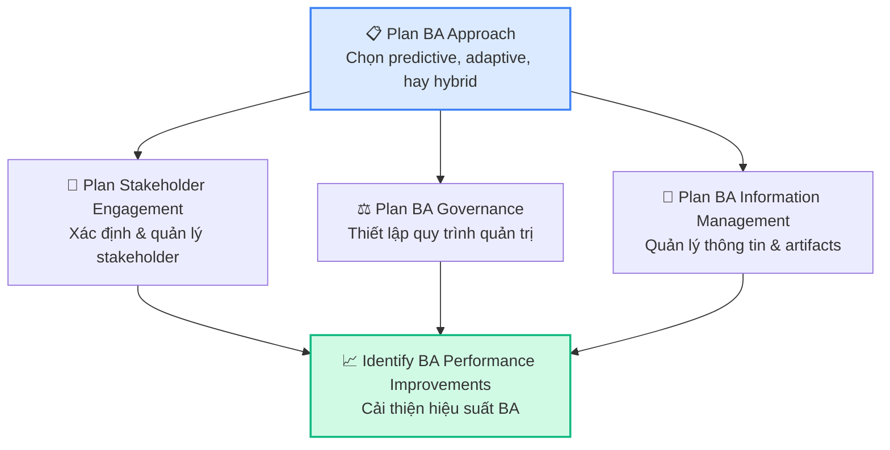
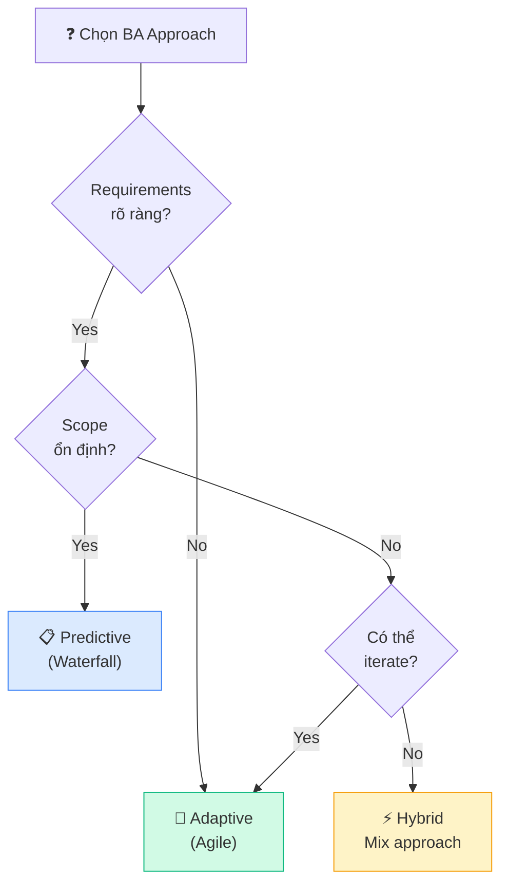
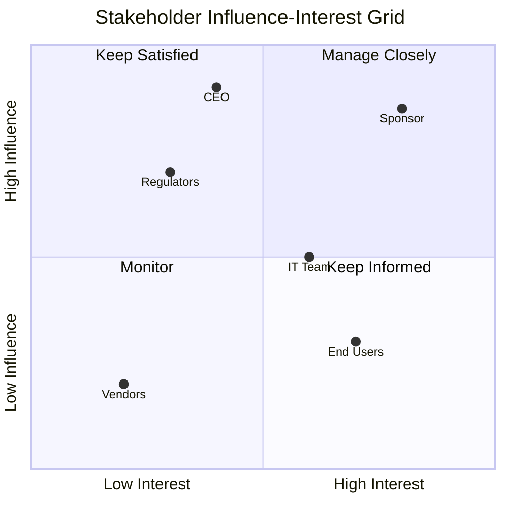
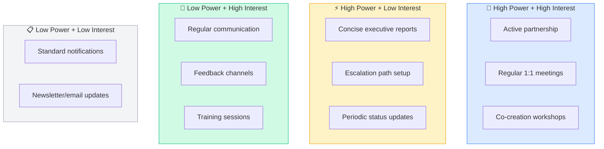
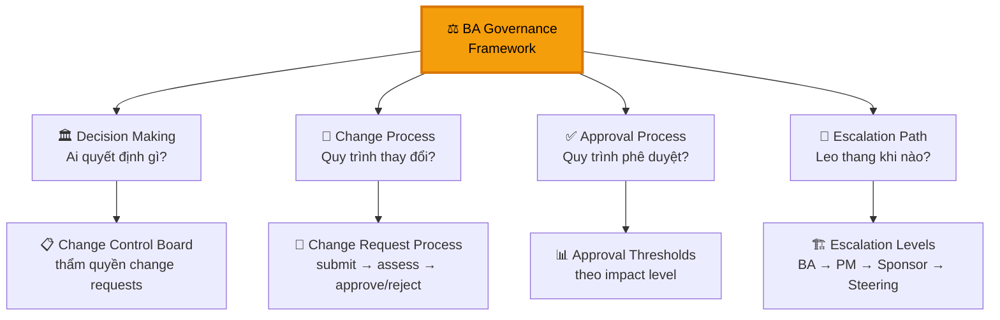
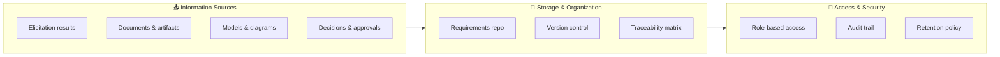
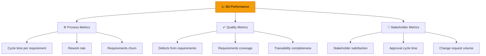
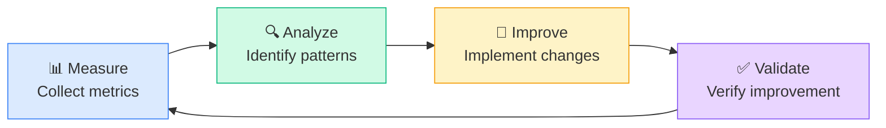

## BA Planning & Monitoring — CBAP Level (14%)

Ở level CBAP, BAPM không chỉ là **lập kế hoạch** mà còn là **quản trị chiến lược** hoạt động BA — từ việc chọn approach phù hợp đến tối ưu hóa hiệu suất BA liên tục.

### 5 Tasks trong BAPM

## Task 1: Plan BA Approach

### Chọn BA Approach

### CBAP-level: Enterprise BA Approach

| Factor | Predictive | Adaptive | CBAP Consideration |
|--------|----------|---------|-------------------|
| **Scope** | Fixed, well-defined | Evolving | Enterprise scope → often hybrid |
| **Stakeholders** | Limited, identified | Dynamic, emerging | More stakeholders = more engagement planning |
| **Timeline** | Fixed deadlines | Flexible iterations | Regulatory deadlines → predictive milestones |
| **Risk** | Low uncertainty | High uncertainty | Enterprise risk → governance focus |
| **Deliverables** | Formal documents | Working software + stories | Enterprise needs traceability → formal + agile |
| **BA Team** | Individual BA | BA embedded in team | Enterprise → BA CoE (Center of Excellence) |

<Callout type="info" title="CBAP-level thinking">
Ở level CBAP, câu hỏi không chỉ "chọn approach nào" mà là **"tại sao approach này phù hợp với enterprise context"** và **"trade-offs là gì"**.
</Callout>

### BA Deliverables Planning

| Approach | Key Deliverables |
|---------|-----------------|
| **Predictive** | BRD, SRS, RTM, Use Case Specs, Test Cases |
| **Adaptive** | User Stories, Acceptance Criteria, Product Backlog, Story Maps |
| **Hybrid** | Vision Document + User Stories, Formal RTM + Agile Backlog |

## Task 2: Plan Stakeholder Engagement

### Stakeholder Analysis Matrix — CBAP Level

### RACI Matrix

| Activity | Sponsor | BA | PM | Dev Team | Users |
|---------|---------|----|----|---------|-------|
| Define Business Objectives | **A** | R | C | I | C |
| Elicit Requirements | C | **A/R** | C | C | **R** |
| Prioritize Requirements | **A** | R | C | C | R |
| Validate Solution | C | **R** | C | R | **A** |
| Approve Requirements | **A** | R | I | I | C |

- **R** = Responsible, **A** = Accountable, **C** = Consulted, **I** = Informed

### Stakeholder Engagement Strategies

<Callout type="tip" title="CBAP exam tip: Stakeholder conflict">
Câu hỏi CBAP thường đặt BA vào tình huống **stakeholder conflict phức tạp** — nhiều stakeholder cùng ảnh hưởng cao nhưng mâu thuẫn. Đáp án đúng thường là **facilitate negotiation** hoặc **escalate to governance body**, KHÔNG BAO GIỜ là "BA quyết định".
</Callout>

## Task 3: Plan BA Governance

### Governance Framework

### Decision Rights Matrix

| Decision Type | Authority | BA Role |
|-------------|----------|---------|
| Business priority | Sponsor/Executive | Facilitate, recommend |
| Requirements content | Subject Matter Expert | Elicit, analyze, document |
| Requirements approval | Business Owner | Present, facilitate review |
| Design decisions | Solution Architect | Provide requirements context |
| Change requests (Low) | BA + PM | Assess impact, approve |
| Change requests (High) | CCB/Steering Committee | Prepare assessment, present |

## Task 4: Plan BA Information Management

### Information Architecture

### Requirements Repository Structure

| Repository Element | Purpose | CBAP Consideration |
|-------------------|---------|-------------------|
| **Requirements Baseline** | Approved set of requirements | Enterprise may have multiple baselines |
| **Version History** | Track changes over time | Regulatory compliance → mandatory |
| **Traceability Matrix** | Link requirements to business goals | End-to-end traceability required |
| **Requirements Attributes** | Metadata (priority, status, author) | Standardized across enterprise |
| **Glossary** | Business terminology definitions | Enterprise-wide consistency |

## Task 5: Identify BA Performance Improvements

### Performance Metrics for BA

### Continuous Improvement Cycle

### Enterprise-level Improvements

| Area | Current State Example | Improvement |
|-----|---------------------|-------------|
| **Process** | Ad-hoc requirements gathering | Standardized elicitation templates |
| **Tools** | Scattered documents in email | Centralized requirements management tool |
| **Skills** | Individual BA expertise varies | BA CoE with training program |
| **Communication** | Status updates via email | Automated dashboards |
| **Governance** | No change control | Formal CCB with defined thresholds |

## Câu hỏi CBAP thường gặp về BAPM

### Câu hỏi mẫu 1
> BA đang work trong enterprise với 4 ongoing projects, mỗi project dùng different approach. BA nên:
>
> A. Standardize tất cả về 1 approach  
> B. **Tailor BA approach cho mỗi project based on context** ✅  
> C. Dùng project lớn nhất làm chuẩn  
> D. Để PM quyết định approach

### Câu hỏi mẫu 2
> Requirements process cho enterprise có nhiều defects. BA nên:
>
> A. Training team ngay  
> B. **Analyze root cause trước, sau đó propose improvements** ✅  
> C. Thay đổi tool  
> D. Thuê thêm BA

### Câu hỏi mẫu 3
> Stakeholder mới join project muộn, yêu cầu thay đổi nhiều requirements. BA nên:
>
> A. Reject tất cả changes  
> B. Accept tất cả vì stakeholder mới có perspective mới  
> C. **Assess impact, discuss with governance body** ✅  
> D. Delay project để incorporate changes

<Callout type="success" title="Key takeaway">
BAPM ở CBAP level = **Enterprise BA governance** + **Continuous improvement** + **Strategic stakeholder management**. Luôn nghĩ ở góc độ "enterprise level", không chỉ "project level".
</Callout>

## 📝 Tóm tắt kiến thức nổi bật

<Callout type="success" title="Key Takeaways — Bài 3">
- BAPM ở CBAP chiếm **14%** (vs 12% ở CCBA) — yêu cầu tư duy **enterprise-level planning**
- **Enterprise BA Approach**: Không chỉ plan cho 1 dự án mà cho toàn bộ BA capability của tổ chức
- **Stakeholder Analysis Matrix + RACI**: ở CBAP phải xử lý stakeholder phức tạp — cross-functional, multi-level, external
- **Governance Framework**: Decision authority, escalation matrix, change control board, approval workflows
- **Performance Improvement Cycle**: Measure → Analyze → Improve → Monitor → Repeat
- BA Performance được đo qua: Requirements Quality, Stakeholder Satisfaction, Rework Rate, Cycle Time
</Callout>

---

## 📋 Bài kiểm tra trắc nghiệm — Bài 3

<Callout type="info" title="Hướng dẫn làm bài">
Làm **10 câu** bên dưới trong **17 phút**. Đáp án ở cuối bài.
</Callout>

**Câu 1.** Enterprise BA Manager nhận thấy các project BAs dùng inconsistent requirements templates. BA Manager nên:

- A. Bỏ qua — mỗi dự án khác nhau
- B. Standardize templates và establish BA methodology across enterprise
- C. Chỉ đạo BAs copy template tốt nhất
- D. Thuê consultant thay đổi

**Câu 2.** Stakeholder A (VP) và Stakeholder B (Director) có conflicting requirements. Governance framework nên chỉ ra:

- A. VP luôn đúng vì cấp cao hơn
- B. Decision authority matrix xác định ai có quyền quyết định cho scope này
- C. BA tự quyết định
- D. Escalate lên CEO mọi conflicts

**Câu 3.** BA performance metric "Cycle Time from requirement stated to approved" đang tăng. Root cause có thể nhất là:

- A. Requirements quá phức tạp
- B. Approval process có bottleneck hoặc stakeholder unavailability
- C. BA team thiếu người
- D. Tools không tốt

**Câu 4.** Cross-functional project cần input từ Finance, IT, Operations, Legal. Engagement strategy phù hợp nhất:

- A. Họp riêng từng department
- B. Stakeholder mapping + tailored engagement plan per group + cross-functional workshops
- C. Gửi survey cho tất cả
- D. Chỉ làm việc với IT vì là technology project

**Câu 5.** Khi nào BA nên sử dụng Adaptive approach thay vì Predictive?

- A. Khi regulatory requirements nghiêm ngặt
- B. Khi requirements volatile, feedback sớm critical, và stakeholders available
- C. Khi budget cố định
- D. Khi team chưa có kinh nghiệm Agile

**Câu 6.** BA Governance Board reject một change request. BA nên:

- A. Implement anyway vì stakeholder muốn
- B. Document decision, communicate rationale to stakeholders, archive request
- C. Escalate lên higher management
- D. Resubmit cùng request

**Câu 7.** Enterprise BA Center of Excellence (CoE) có vai trò:

- A. Thay thế project BAs
- B. Standardize practices, mentoring, tool governance, knowledge sharing across organization
- C. Chỉ quản lý budget
- D. Chỉ recruitment

**Câu 8.** BA đo stakeholder satisfaction = 3.2/5 (target 4.0). Improvement action phù hợp nhất:

- A. Thay đổi stakeholders
- B. Analyze dissatisfaction themes, adjust communication approach, increase transparency
- C. Gửi fewer reports
- D. Ignore — 3.2 cũng OK

**Câu 9.** Information Management ở enterprise level cần bao gồm:

- A. Chỉ document storage
- B. Storage, access control, versioning, retention policy, traceability, cross-project reuse
- C. Chỉ naming conventions
- D. Chỉ tools selection

**Câu 10.** Plan BA Approach cho enterprise transformation (3-year program) nên:

- A. Cố định approach từ đầu, không thay đổi
- B. Adaptive approach cho toàn bộ 3 năm
- C. Phase-based approach: may use different approaches per phase based on maturity and needs
- D. Không cần approach — quá dài để plan

---

### 🔑 Đáp án & Giải thích

| Câu | Đáp án | Giải thích |
|:---:|:------:|-----------|
| 1 | **B** | Enterprise BA Manager → standardize across org = governance responsibility. |
| 2 | **B** | Governance = decision authority matrix → who decides for what scope. Không phải seniority wins. |
| 3 | **B** | Cycle time increase → process bottleneck (approval queue, stakeholder unavailability). |
| 4 | **B** | Cross-functional → map stakeholders, tailor engagement, use cross-functional workshops for alignment. |
| 5 | **B** | Adaptive when: volatile requirements, need early feedback, stakeholders engaged and available. |
| 6 | **B** | Rejected CR → document decision rationale, communicate transparently, archive for future reference. |
| 7 | **B** | CoE = center to standardize, mentor, govern tools, share knowledge — not replace BAs. |
| 8 | **B** | Analyze root cause of dissatisfaction → adjust approach → improve experience. |
| 9 | **B** | Enterprise IM = comprehensive: storage, access, versioning, retention, traceability, cross-project reuse. |
| 10 | **C** | Long program → phase-based, adapt approach per phase maturity. Not one-size-fits-all. |

### 📊 Thang đánh giá

| Số câu đúng | Đánh giá | Hành động |
|:-----------:|---------|-----------|
| 9-10 | ⭐ Xuất sắc | BAPM nâng cao nắm vững! |
| 7-8 | ✅ Tốt | Ôn lại Enterprise governance và CoE |
| 5-6 | ⚠️ Trung bình | Đọc lại Stakeholder Analysis ở enterprise level |
| < 5 | ❌ Cần ôn lại | BAPM 14% — focus vào enterprise-level thinking |

---

*Tiếp theo: Elicitation & Collaboration nâng cao 👉*
