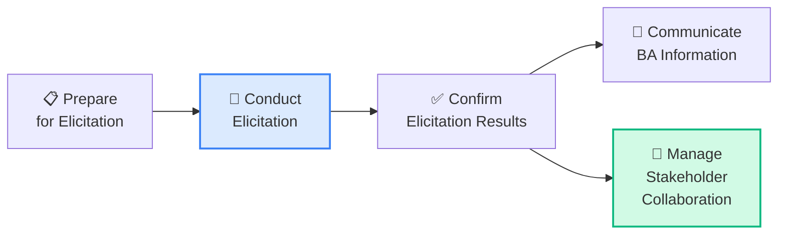
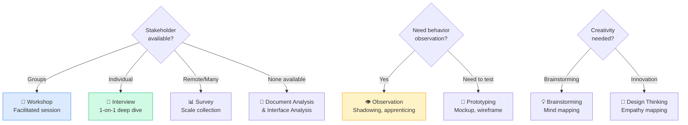
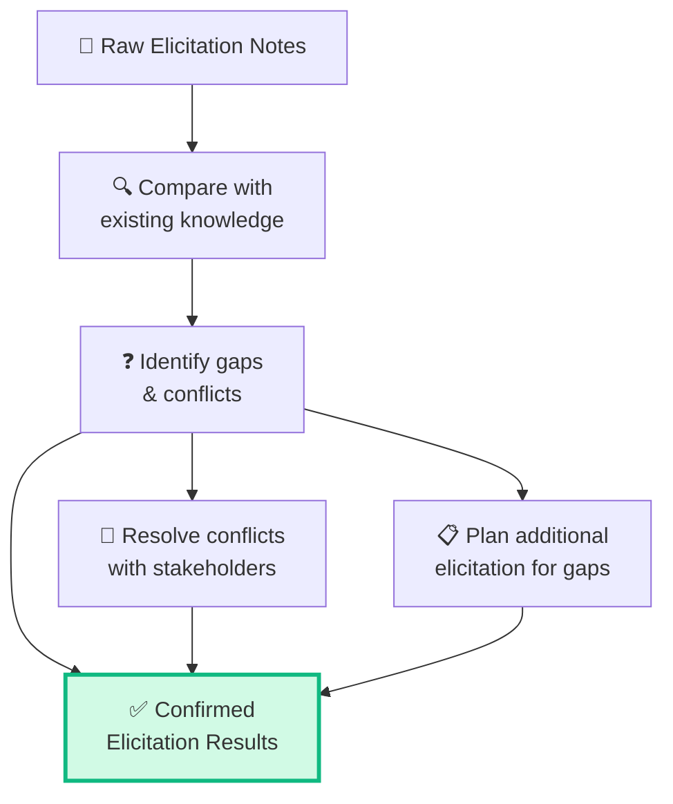
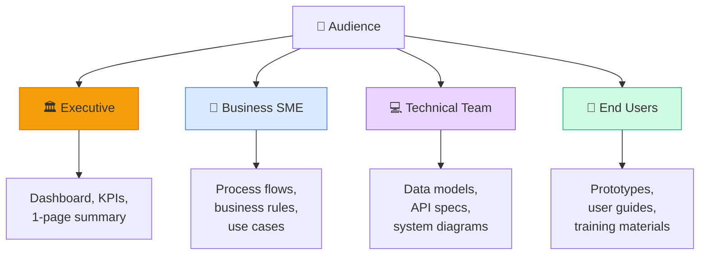
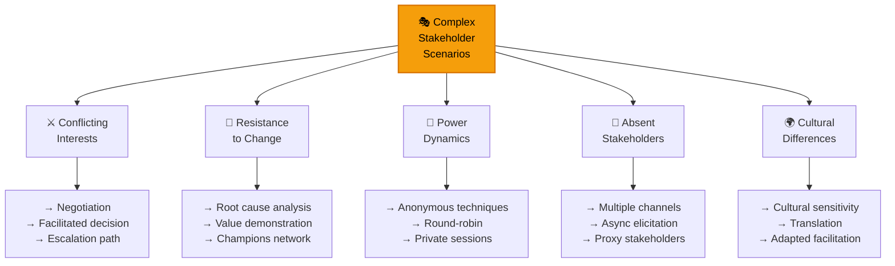
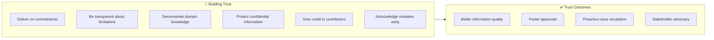
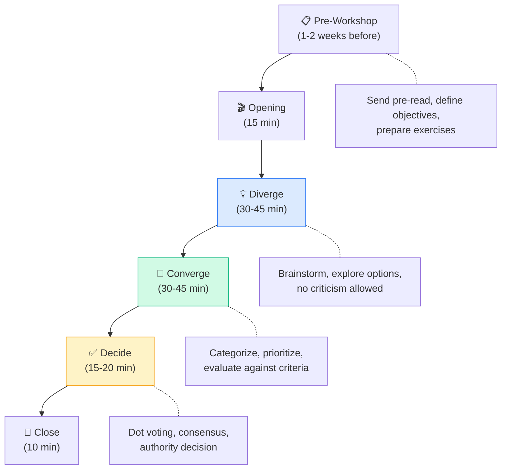

## Elicitation & Collaboration — CBAP Level (12%)

Mặc dù E&C chỉ chiếm 12% trong CBAP (thấp nhất), đây lại là KA **xuyên suốt** — mọi KA khác đều cần elicitation và collaboration. CBAP test ở mức **advanced facilitation** và **complex stakeholder management**.

### 5 Tasks trong E&C

## Task 1-2: Prepare & Conduct Elicitation

### Chọn kỹ thuật theo context — CBAP Decision Matrix

### CBAP-level: Advanced Elicitation Strategies

| Technique | CCBA Level | CBAP Level |
|----------|-----------|-----------|
| **Interview** | Ask prepared questions | Adapt dynamically, probe for hidden needs, identify unstated assumptions |
| **Workshop** | Facilitate structured session | Design workshop series for complex problems, manage power dynamics |
| **Observation** | Watch & document | Ethnographic observation, identify process inefficiencies stakeholders can't articulate |
| **Prototyping** | Create mockups | Use prototypes to validate business model viability, not just UI |
| **Survey** | Distribute questionnaire | Design statistically valid surveys, analyze quantitative data |

### Elicitation Planning Template

| Planning Element | CBAP Consideration |
|-----------------|-------------------|
| **Objectives** | tied to business goals, not just "gather requirements" |
| **Scope** | Bounded by business capability being analyzed |
| **Participants** | Include diverse perspectives (operational, strategic, technical) |
| **Logistics** | Multi-site, multi-timezone, cultural considerations |
| **Risks** | Stakeholder unavailability, bias, power dynamics |
| **Supporting materials** | Pre-read materials, models, data for discussion |
| **Confirmation approach** | How to validate findings with participants |

## Task 3: Confirm Elicitation Results

### Confirmation Workflow

### Common Confirmation Issues

| Issue | Root Cause | CBAP Response |
|------|-----------|-------------|
| **Conflicting information** | Different perspectives | Organize reconciliation session, find common ground |
| **Incomplete information** | Wrong stakeholders or technique | Identify right stakeholders, adjust technique |
| **Ambiguous statements** | Vague language | Use modeling to clarify, create precise definitions |
| **Assumed context** | Stakeholder knows too much | Use "5 Whys" to surface assumptions |
| **Political filtering** | Stakeholder has agenda | Triangulate with multiple sources |

<Callout type="warning" title="CBAP trap: Confirmation ≠ Approval">
Confirm Elicitation Results chỉ xác nhận **BA đã hiểu đúng** những gì stakeholder nói. Nó KHÔNG phải approve requirements. Approval nằm trong RLCM (Requirements Life Cycle Management).
</Callout>

## Task 4: Communicate BA Information

### Communication Strategy Matrix

### Communication Formality Spectrum

| Informal | Semi-formal | Formal |
|---------|-----------|--------|
| Verbal updates | Email summaries | BRD/SRS documents |
| Whiteboard sketches | Wiki/Confluence pages | Signed-off specifications |
| Instant messaging | Meeting minutes | Governance reports |
| Stand-up updates | Status presentations | Compliance documentation |

**CBAP guideline:** Choose formality level based on:
- Regulatory requirements
- Organizational culture
- Stakeholder expectations
- Audit requirements
- Project risk level

## Task 5: Manage Stakeholder Collaboration

### Complex Stakeholder Scenarios

### Conflict Resolution Framework — CBAP Level

| Strategy | When to Use | Example |
|---------|------------|---------|
| **Collaborate** (Win-Win) | Time available, relationship important | Sponsor & Users disagree on priority → Workshop to find alignment |
| **Compromise** (Lose-Lose partial) | Equal power, acceptable outcome | Both departments want different features → Split scope |
| **Accommodate** (Yield) | Relationship more important | SME wrong on minor detail → Accept to maintain trust |
| **Compete** (Win-Lose) | Urgent decision, you're right | Safety requirement → Insist despite resistance |
| **Avoid** (Withdraw) | Trivial issue, emotions high | Cosmetic argument → Table for later |

<Callout type="tip" title="CBAP exam: Conflict resolution">
Trong CBAP exam, đáp án đúng cho conflict resolution thường là **Collaborate** hoặc **Compromise**. CBAP hiếm khi chọn **Compete** hay **Avoid** trừ khi scenario rõ ràng.
</Callout>

### Building Trust Strategies

## Advanced Facilitation Techniques

### Multi-stakeholder Workshop Design

### Facilitation Anti-patterns

| Anti-pattern | Problem | CBAP Solution |
|-------------|---------|-------------|
| **HIPPO** (Highest Paid Person's Opinion) | Senior dominates | Anonymous voting, written input first |
| **Groupthink** | No dissenting views | Devil's advocate role, anonymous survey |
| **Analysis Paralysis** | Can't decide | Timeboxed decisions, "good enough" criteria |
| **Scope Creep** | Discussion wanders | Parking lot, strict agenda, time keeper |
| **Silent Majority** | Quiet voices ignored | Round-robin, breakout groups, online polls |

<Callout type="info" title="CBAP Facilitation mindset">
Master facilitator = **neutral**, **objective**, **process-focused**. BA facilitates nhưng KHÔNG quyết định. BA đảm bảo **best decision emerges** từ group, không phải force BA's opinion.
</Callout>

## Câu hỏi CBAP thường gặp về E&C

### Scenario 1
> BA đang facilitate workshop cho 15 stakeholders từ 3 departments khác nhau. Hai nhóm có quyền lợi đối lập về scope. BA nên:
>
> A. Breakout groups → synthesize findings  
> B. **Set decision criteria first, then evaluate options objectively** ✅  
> C. Ask sponsor to decide  
> D. Cancel workshop, interview individually

### Scenario 2
> Sau elicitation, BA nhận ra stakeholder A nói X nhưng stakeholder B nói ngược lại. BA nên:
>
> A. Chọn version của stakeholder có quyền cao hơn  
> B. **Tổ chức reconciliation session để identify root of disagreement** ✅  
> C. Document cả hai version  
> D. Hỏi PM quyết định

### Scenario 3
> Key stakeholder liên tục không có thời gian cho elicitation sessions. BA nên:
>
> A. Skip stakeholder, dùng available info  
> B. Escalate lên sponsor ngay  
> C. **Offer múltiple alternatives: async surveys, brief focused calls, document review** ✅  
> D. Delay project until stakeholder available

## 📝 Tóm tắt kiến thức nổi bật

<Callout type="success" title="Key Takeaways — Bài 4">
- E&C ở CBAP giảm xuống **12%** (vs 20% CCBA) — nhưng câu hỏi phức tạp hơn nhiều
- **Complex Stakeholder Scenarios**: Multi-party conflicts, political dynamics, cultural barriers, remote/distributed teams
- **Conflict Resolution Framework**: Collaborate (best) → Compromise → Accommodate → Compete → Avoid — biết khi nào dùng mỗi loại
- **Advanced Facilitation**: Ground rules, parking lot, timeboxing, round-robin, anonymous voting, dot voting
- **Anti-patterns**: BA biased, leading questions, ignoring minority views, not confirming understanding
- **Reconciliation**: Khi stakeholders disagree → identify root of disagreement → find shared goals → negotiate
</Callout>

---

## 📋 Bài kiểm tra trắc nghiệm — Bài 4

<Callout type="info" title="Hướng dẫn làm bài">
Làm **10 câu** bên dưới trong **17 phút**. Đáp án ở cuối bài.
</Callout>

**Câu 1.** Enterprise project với 50+ stakeholders across 8 departments. BA nên manage communication bằng cách:

- A. Email blast cho tất cả
- B. Segmented communication plan — tailor message, format, frequency per stakeholder group
- C. Họp toàn thể hàng tuần
- D. Delegate cho PM

**Câu 2.** Country Manager (remote, khác timezone) rất quan trọng nhưng chỉ available 30 phút/tuần. BA nên:

- A. Skip họ
- B. Prepare highly focused agenda, send pre-read, maximize the 30 minutes
- C. Delay project
- D. Gửi email dài

**Câu 3.** Trong workshop, quiet stakeholders không phát biểu vì bị dominate bởi senior managers. BA-facilitator nên:

- A. Để tự nhiên — senior có quyền
- B. Use anonymous voting, written inputs, round-robin, breakout groups
- C. Cancel workshop
- D. Nói riêng với senior managers yêu cầu im lặng

**Câu 4.** Stakeholder A nói "system must handle 1000 orders/day", Stakeholder B nói "500 orders/day is enough". BA phát hiện root cause là họ đang talking about different regions. BA nên:

- A. Chọn 1000 để safe
- B. Average: 750
- C. Clarify scope per region, document both as separate requirements with clear context
- D. Escalate cho PM

**Câu 5.** BA nhận phản hồi rằng requirements documentation "too technical" cho business stakeholders. BA should:

- A. Keep as is — documentation should be technical
- B. Create different views: business summary for executives, detailed specs for dev team
- C. Remove technical details
- D. Only write user stories

**Câu 6.** Cultural difference: stakeholders from one culture avoid saying "no" directly. BA should:

- A. Ignore cultural differences
- B. Adapt elicitation approach — use indirect questions, observe body language, provide written options
- C. Only work with stakeholders from familiar cultures
- D. Force direct communication

**Câu 7.** After elicitation, BA realizes 40% of gathered information contradicts existing documentation. FIRST step:

- A. Trust documentation over stakeholders
- B. Trust stakeholders over documentation
- C. Identify discrepancies, investigate root cause — documentation may be outdated OR stakeholders may be mistaken
- D. Ignore contradictions

**Câu 8.** BA is facilitating a heated discussion. One stakeholder makes it personal. BA should:

- A. Let it play out
- B. Redirect to issues and facts, maintain ground rules, take a break if needed
- C. End the meeting immediately
- D. Side with the other person

**Câu 9.** Distributed team across 4 timezones. Synchronous workshops are challenging. BA should:

- A. Force everyone into one timezone
- B. Combine async methods (surveys, document reviews) with short focused sync sessions in overlapping hours
- C. Only do async
- D. Cancel collaboration, BA decides alone

**Câu 10.** BA anti-pattern "Confirmation Bias" means:

- A. BA confirms all elicitation results
- B. BA unconsciously seeks information that confirms pre-existing assumptions
- C. BA asks confirmation questions
- D. Stakeholder confirms requirements

---

### 🔑 Đáp án & Giải thích

| Câu | Đáp án | Giải thích |
|:---:|:------:|-----------|
| 1 | **B** | 50+ stakeholders → segmented communication plan, tailored per group. |
| 2 | **B** | Time-constrained stakeholder → maximize efficiency: focused agenda, pre-read, concise format. |
| 3 | **B** | Facilitation techniques to include quiet voices: anonymous input, written, round-robin. |
| 4 | **C** | Root cause = different context (regions). Clarify and document with proper scope. |
| 5 | **B** | Different audiences need different views — business summary vs detailed specs. |
| 6 | **B** | Cultural sensitivity = adapt approach. Use indirect methods when direct "no" is culturally avoided. |
| 7 | **C** | Contradictions → investigate root cause. Both sources could be wrong. Don't blindly trust either. |
| 8 | **B** | Professional facilitation: redirect to facts, enforce ground rules, break if emotions escalate. |
| 9 | **B** | Distributed teams → hybrid approach: async + focused sync in overlapping hours. |
| 10 | **B** | Confirmation Bias = seeking/favoring info that confirms what you already believe. Must be aware to avoid. |

### 📊 Thang đánh giá

| Số câu đúng | Đánh giá | Hành động |
|:-----------:|---------|-----------|
| 9-10 | ⭐ Xuất sắc | Advanced E&C nắm vững! |
| 7-8 | ✅ Tốt | Ôn lại distributed teams và cultural sensitivity |
| 5-6 | ⚠️ Trung bình | Focus vào conflict resolution và facilitation techniques |
| < 5 | ❌ Cần ôn lại | E&C scenarios complex — luyện thêm case studies |

---

*Tiếp theo: Requirements Life Cycle Management nâng cao 👉*
