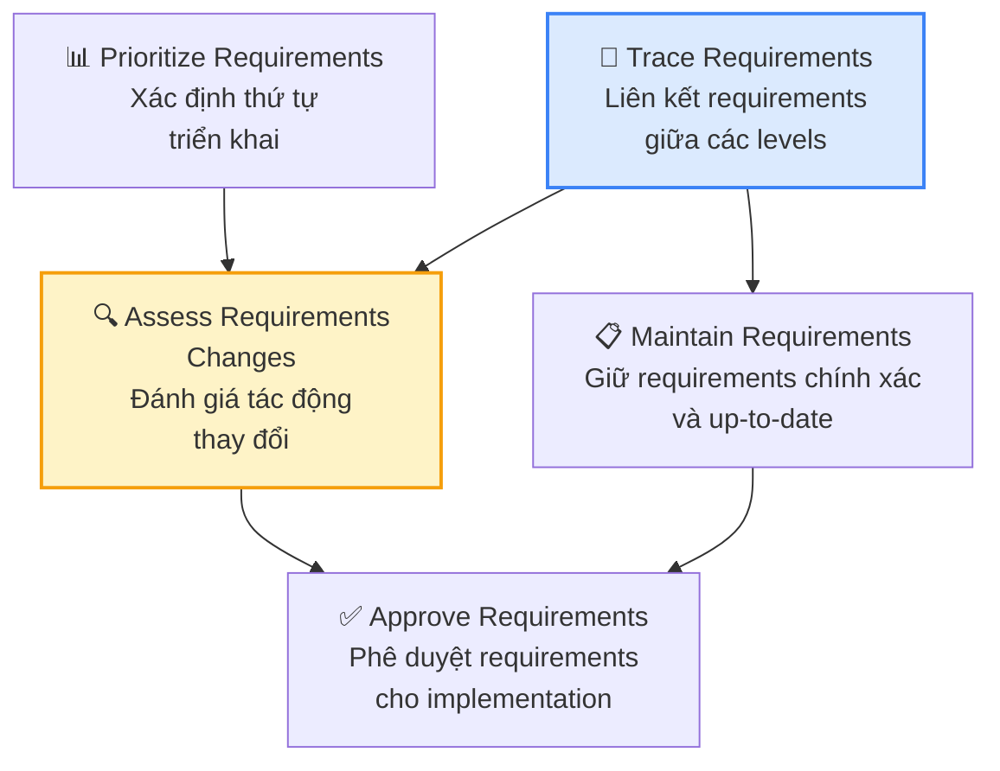
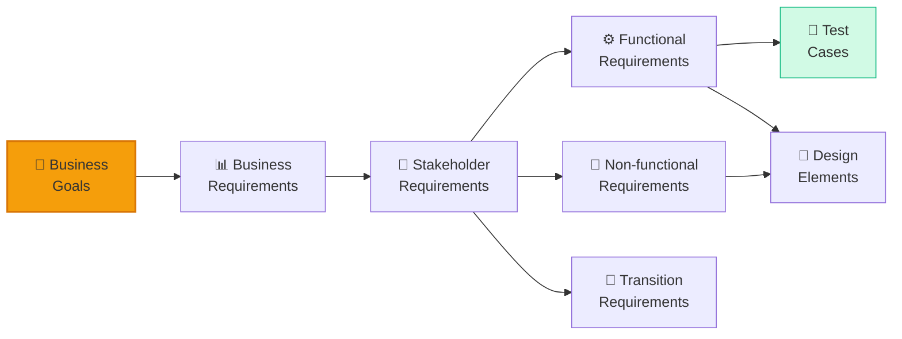
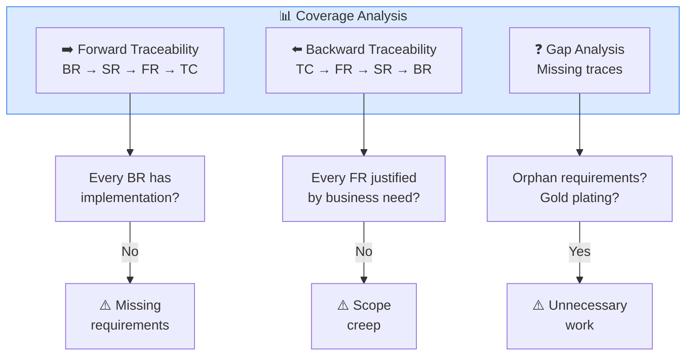
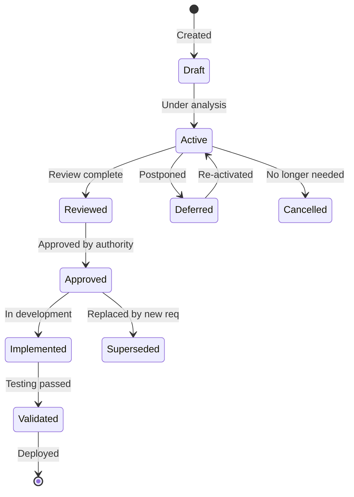
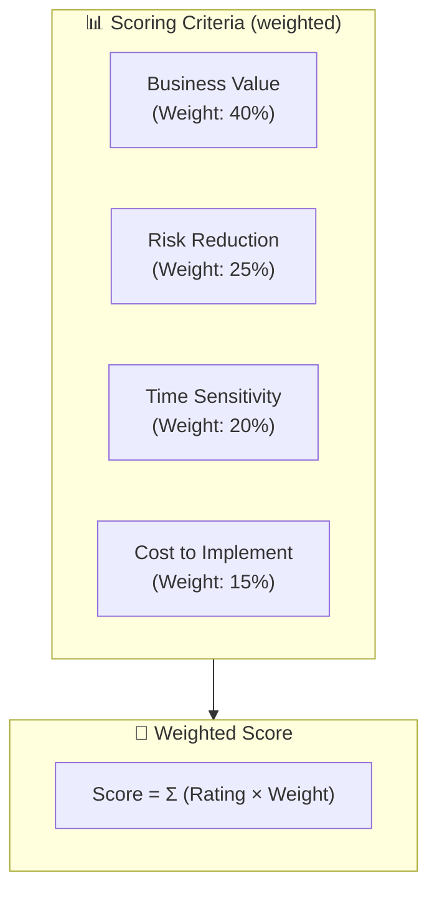
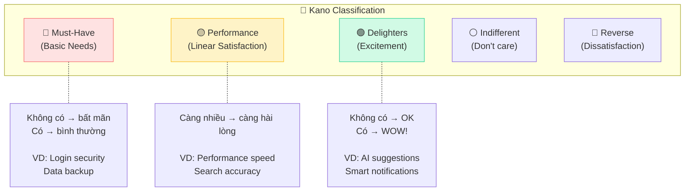
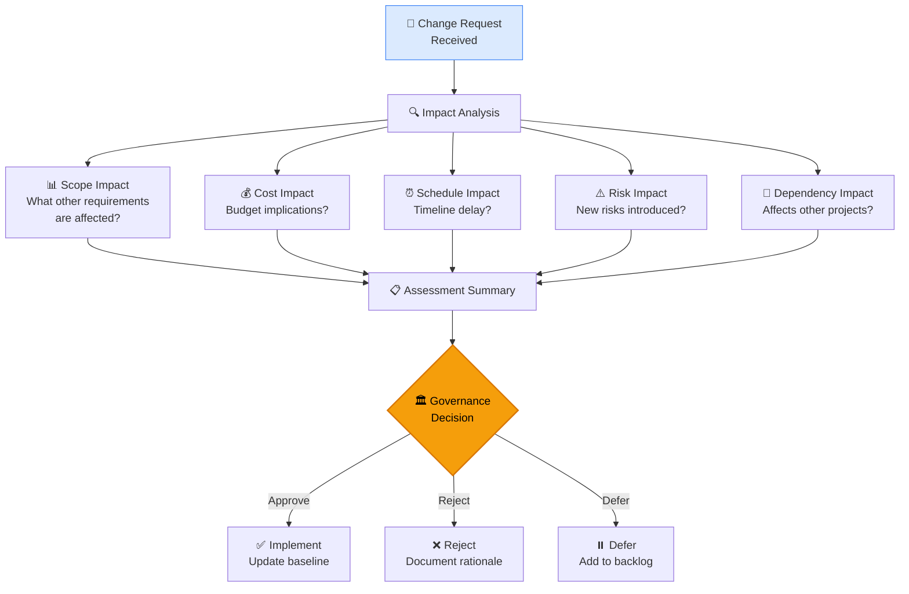
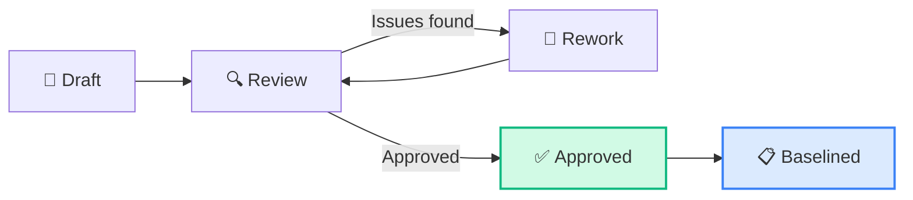

## Requirements Life Cycle Management — CBAP Level (15%)

RLCM chiếm **15%** trong CBAP (tăng từ 18% trong CCBA) nhưng ở mức độ khó hơn: test khả năng quản lý requirements ở **enterprise level**, cross-project traceability, và complex change governance.

### 5 Tasks trong RLCM

## Task 1: Trace Requirements — Enterprise Level

### End-to-End Traceability

### Traceability Matrix — CBAP Level

| Requirement ID | Business Goal | Stakeholder Req | Functional Req | Test Case | Status |
|---------------|-------------|----------------|---------------|----------|--------|
| BR-001 | Tăng revenue 20% | SR-001, SR-002 | FR-001~005 | TC-001~010 | Approved |
| BR-002 | Giảm cost 15% | SR-003 | FR-006~008 | TC-011~015 | In Review |
| BR-003 | Compliance SOX | SR-004, SR-005 | FR-009~012, NFR-001 | TC-016~025 | Draft |

### Traceability Relationships

| Relationship | Direction | Purpose | CBAP Application |
|-------------|----------|---------|-----------------|
| **Derive** | Parent → Child | BR derives SR, SR derives FR | Validate completeness (mọi BR có SR?) |
| **Satisfy** | Child → Parent | FR satisfies SR | Validate coverage (mọi SR có FR?) |
| **Verify** | Test → Requirement | TC verifies FR | Test coverage analysis |
| **Refine** | Detailed ← Abstract | Design refines FR | Ensure design implements all requirements |
| **Conflict** | Req ↔ Req | Two requirements conflict | Identify and resolve conflicts early |

<Callout type="warning" title="Traceability gaps = Risk">
Trong CBAP, **untraced requirements** là red flag. Nếu một Business Requirement không trace được xuống Functional Requirements → missing implementation. Nếu một FR không trace ngược về BR → **gold plating** (scope creep).
</Callout>

### Coverage Analysis

## Task 2: Maintain Requirements

### Requirements States

### Reuse & Enterprise Standards

| Practice | Description | CBAP Benefit |
|---------|-----------|-------------|
| **Requirements Reuse** | Identify common patterns across projects | Reduce elicitation time, ensure consistency |
| **Templates** | Standardized requirement formats | Enterprise-wide quality standards |
| **Glossary** | Enterprise business term definitions | Eliminate ambiguity across teams |
| **Architecture Standards** | Enterprise NFR baselines (security, performance) | Compliance by default |
| **Patterns Library** | Common solution patterns | Accelerate design phase |

<Callout type="tip" title="CBAP reuse strategy">
Senior BA (CBAP level) nên **proactively identify** reusable requirements. Ví dụ: security requirements cho mọi web application, compliance requirements cho financial services, accessibility requirements cho public-facing apps.
</Callout>

## Task 3: Prioritize Requirements — Advanced

### Prioritization Techniques Comparison

| Technique | Best For | CBAP Use Case |
|----------|---------|-------------|
| **MoSCoW** | Quick categorization | Sprint planning, release scoping |
| **Timeboxing** | Fixed deadline | "Phải ship trong Q1, what fits?" |
| **Weighted Scoring** | Multiple criteria | Enterprise portfolio prioritization |
| **Kano Model** | User satisfaction | Product strategy, feature selection |
| **Cost of Delay** | Economic impact | ROI-based prioritization |
| **Buy a Feature** | Stakeholder consensus | Budget allocation games |
| **100-Point Method** | Group decision | Workshop-based prioritization |

### Weighted Scoring Matrix

**Ví dụ thực tế:**

| Requirement | Business Value (40%) | Risk (25%) | Time (20%) | Cost (15%) | **Total** |
|-----------|-----|------|------|------|---------|
| Multi-currency | 9 × 40 = 360 | 7 × 25 = 175 | 8 × 20 = 160 | 5 × 15 = 75 | **770** |
| Mobile app | 8 × 40 = 320 | 3 × 25 = 75 | 6 × 20 = 120 | 7 × 15 = 105 | **620** |
| Chatbot | 5 × 40 = 200 | 2 × 25 = 50 | 3 × 20 = 60 | 8 × 15 = 120 | **430** |

### Kano Model

## Task 4: Assess Requirements Changes

### Change Impact Analysis Framework

### Change Impact Assessment Template

| Impact Area | Before Change | After Change | Delta | Risk Level |
|-----------|-------------|------------|-------|-----------|
| **Scope** | 25 FRs | 28 FRs | +3 | 🟡 Medium |
| **Schedule** | 6 months | 7 months | +1 month | 🔴 High |
| **Budget** | $500K | $580K | +$80K | 🟡 Medium |
| **Quality** | 95% coverage | 90% coverage | -5% | 🟡 Medium |
| **Dependencies** | None | API team impact | New dep | 🔴 High |

### Enterprise Change Governance

| Change Level | Impact | Authority | BA Role |
|-------------|--------|----------|---------|
| **Minor** | < 5% budget, no schedule impact | BA + PM | Approve directly |
| **Moderate** | 5-20% budget, < 2 week delay | CCB + Sponsor | Prepare assessment, present |
| **Major** | > 20% budget or scope | Steering Committee | Comprehensive impact analysis |
| **Critical** | Business objective affected | Executive sponsor | Strategic assessment & recommendation |

<Callout type="info" title="CBAP change management">
CBAP test khả năng **assess ripple effects** — một change ảnh hưởng requirements nào khác? Cần dùng traceability matrix để identify all affected requirements, tests, designs, và stakeholders.
</Callout>

## Task 5: Approve Requirements

### Approval Workflow

### Approval Criteria

| Criterion | Description | Check |
|----------|-----------|-------|
| **Complete** | All necessary requirements captured | Traceability forward & backward |
| **Consistent** | No contradictions between requirements | Cross-reference analysis |
| **Feasible** | Technically and economically viable | SME & architect review |
| **Testable** | Can be verified/validated | Test case traceability |
| **Unambiguous** | Single interpretation | Glossary, models, examples |
| **Traceable** | Linked to business objectives | RTM coverage check |
| **Prioritized** | Clear implementation order | MoSCoW or weighted scoring |

### Signoff — RACI for Approval

| Requirement Type | Approver | Reviewer | BA Role |
|-----------------|---------|---------|---------|
| Business Requirements | Executive Sponsor | Business Unit Leaders | Facilitate, document |
| Stakeholder Requirements | Business Owner | End Users, SMEs | Elicit, analyze, present |
| Solution Requirements | Technical Lead + Business Owner | Development Team | Specify, validate |
| Transition Requirements | Operations Manager | Support Team | Plan, coordinate |

## Câu hỏi CBAP thường gặp về RLCM

### Scenario 1
> Enterprise có 5 projects chia sẻ cùng customer database. Project A muốn thay đổi data model. BA nên:
>
> A. Approve change cho project A  
> B. **Assess impact on all 5 projects trước khi quyết định** ✅  
> C. Reject change vì ảnh hưởng quá nhiều  
> D. Chỉ assess project A và project trực tiếp liên quan

### Scenario 2
> 60% requirements đã approved nhưng business objective thay đổi. BA nên:
>
> A. Tiếp tục với requirements hiện tại  
> B. **Review ALL requirements against new objective, re-prioritize** ✅  
> C. Chỉ review 40% chưa approved  
> D. Start over from scratch

### Scenario 3
> Stakeholder complain rằng approved requirement không phản ánh đúng business need. BA nên:
>
> A. Refuse vì đã approved  
> B. **Investigate root cause: elicitation issue? Changed need? Misunderstanding?** ✅  
> C. Create change request ngay  
> D. Re-do elicitation

<Callout type="success" title="Key takeaway">
RLCM ở CBAP level = **Enterprise traceability** + **Cross-project impact analysis** + **Governance at scale**. Mọi quyết định phải xét đến **ripple effects** across enterprise.
</Callout>

## 📝 Tóm tắt kiến thức nổi bật

<Callout type="success" title="Key Takeaways — Bài 5">
- RLCM ở CBAP chiếm **15%** — focus vào **enterprise traceability** và **governance at scale**
- **End-to-end Traceability**: Business Objective → Business Req → Stakeholder Req → Solution Req → Test Case → Implementation
- **Cross-project Impact Analysis**: Thay đổi 1 requirement có thể ripple across multiple projects
- **Kano Model**: Dissatisfiers (must-have) → Satisfiers (more-is-better) → Delighters (unexpected value)
- **Enterprise Change Governance**: Change Control Board (CCB), formal change request process, impact assessment templates
- **Requirements Reuse**: Enterprise requirement repository cho cross-project leverage
- **Approved vs Baselined + change control** = core concept ở mọi level
</Callout>

---

## 📋 Bài kiểm tra trắc nghiệm — Bài 5

<Callout type="info" title="Hướng dẫn làm bài">
Làm **10 câu** bên dưới trong **17 phút**. Đáp án ở cuối bài.
</Callout>

**Câu 1.** Enterprise có 5 projects sharing a common platform. Requirement change in Project A may impact Projects B-E. BA should:

- A. Only assess impact on Project A
- B. Perform cross-project impact analysis to identify ripple effects across all 5 projects
- C. Let each project BA handle independently
- D. Reject the change to avoid complexity

**Câu 2.** Kano Model phân loại customer needs. Feature "fast page load time" thuộc category nào?

- A. Delighter — surprises customers
- B. Dissatisfier — expected, absence causes dissatisfaction
- C. Satisfier — more is better
- D. Indifferent — doesn't matter

**Câu 3.** Change Control Board (CCB) bao gồm ai?

- A. Chỉ BA team
- B. Cross-functional representatives: business sponsors, technical leads, BA, PM, impacted stakeholders
- C. Chỉ senior management
- D. Chỉ development team

**Câu 4.** BA discovers requirement REQ-042 has no traceability to any business objective. BA should:

- A. Keep it — stakeholder wrote it
- B. Challenge the requirement — investigate if it's truly needed, link to objective or remove
- C. Assign a random business objective
- D. Remove immediately without discussion

**Câu 5.** Enterprise requirement repository benefits include:

- A. Chỉ saving storage space
- B. Requirement reuse, consistency, reduced rework, cross-project visibility
- C. Replacing BA work
- D. Chỉ version control

**Câu 6.** BA needs to prioritize 50 requirements from 4 stakeholder groups with conflicting priorities. Best approach:

- A. Let highest-ranking stakeholder decide all
- B. Weighted scoring combining business value, urgency, cost, risk, with consensus sessions
- C. First-come first-served
- D. Random selection

**Câu 7.** Requirement traceability matrix shows a business requirement with NO downstream solution requirements. This means:

- A. Requirement is too abstract
- B. Gap in analysis — business requirement not yet decomposed into solution requirements
- C. Business requirement is invalid
- D. No action needed

**Câu 8.** Enterprise change governance requires impact assessment for each change. Which impact is MOST OFTEN overlooked?

- A. Cost impact
- B. Schedule impact
- C. Impact on other projects and enterprise systems (ripple effects)
- D. Technical feasibility

**Câu 9.** Requirements status "Verified" vs "Validated": cái nào xảy ra trước?

- A. Validated trước
- B. Verified trước — check quality, then Validated — check business fit
- C. Xảy ra đồng thời
- D. Không cần cả hai

**Câu 10.** BA retiring requirements from a legacy system being replaced. Key consideration is:

- A. Delete all requirements immediately
- B. Ensure smooth transition: map legacy reqs to new system, identify gaps, plan data migration
- C. Archive without mapping
- D. Let dev team handle

---

### 🔑 Đáp án & Giải thích

| Câu | Đáp án | Giải thích |
|:---:|:------:|-----------|
| 1 | **B** | Shared platform → cross-project impact analysis mandatory. Changes ripple. |
| 2 | **B** | Fast page load = expected basic quality. Absence = frustration. It's a Dissatisfier/Must-Have. |
| 3 | **B** | CCB = cross-functional: sponsors, tech leads, BA, PM, impacted stakeholders. |
| 4 | **B** | No traceability to business objective → challenge: is it really needed? Link it or remove. |
| 5 | **B** | Repository enables: reuse, consistency, reduced rework, cross-project visibility and governance. |
| 6 | **B** | Weighted scoring = objective, data-driven prioritization with stakeholder consensus. |
| 7 | **B** | Business req with no solution reqs = analysis gap. Needs to be decomposed. |
| 8 | **C** | Cross-project/enterprise ripple effects most often overlooked — each project thinks in isolation. |
| 9 | **B** | Verify (quality check) → Validate (business fit check). Verify first. |
| 10 | **B** | Legacy retirement → map old to new, identify gaps, plan migration. Not just delete. |

### 📊 Thang đánh giá

| Số câu đúng | Đánh giá | Hành động |
|:-----------:|---------|-----------|
| 9-10 | ⭐ Xuất sắc | RLCM enterprise-level nắm vững! |
| 7-8 | ✅ Tốt | Ôn lại cross-project impact và Kano Model |
| 5-6 | ⚠️ Trung bình | Focus enterprise governance và traceability |
| < 5 | ❌ Cần ôn lại | RLCM 15% — key differences vs CCBA level |

---

*Tiếp theo: Strategy Analysis nâng cao — Phần 1 👉*
