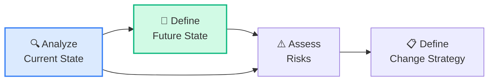
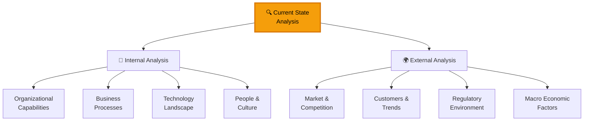
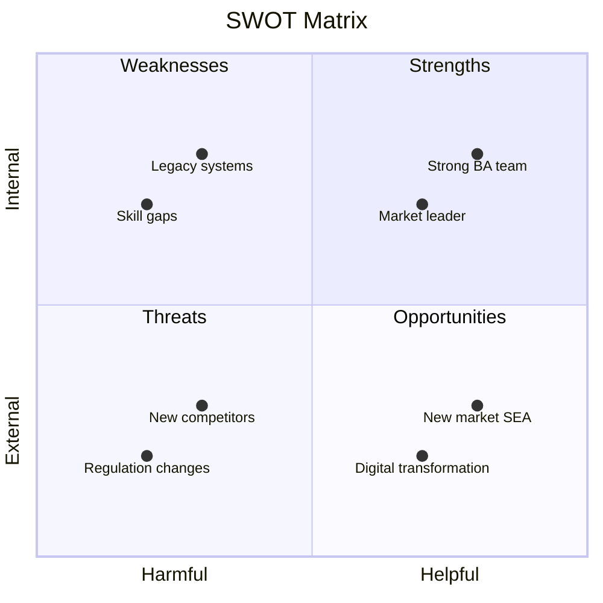
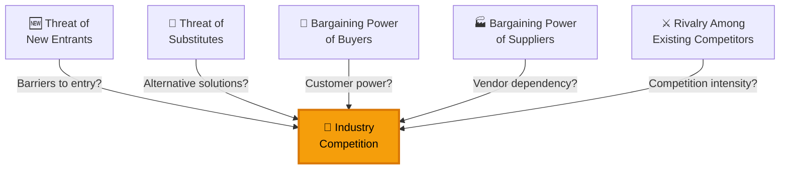
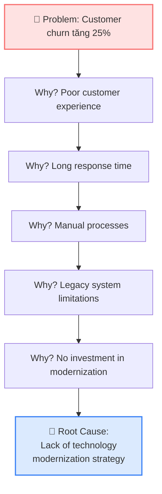
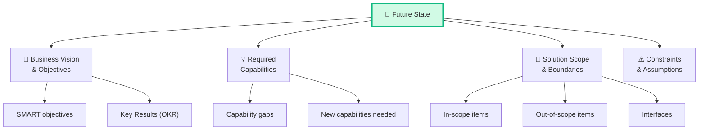
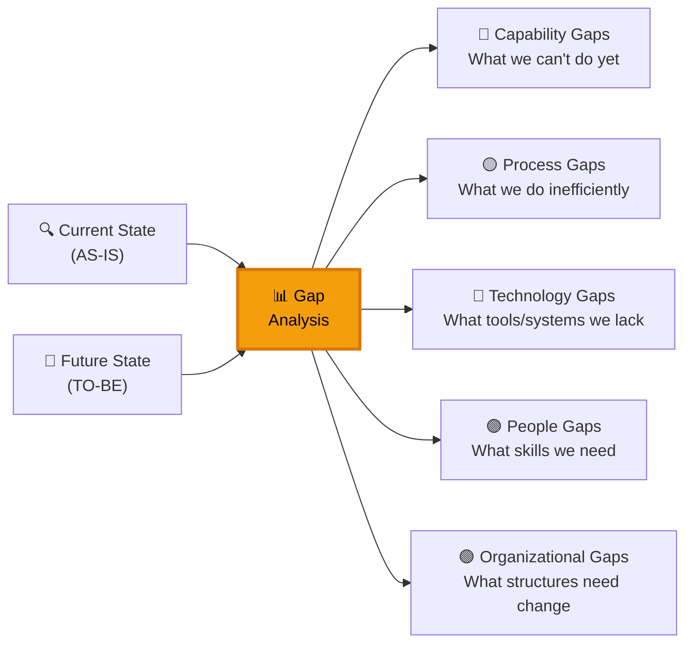
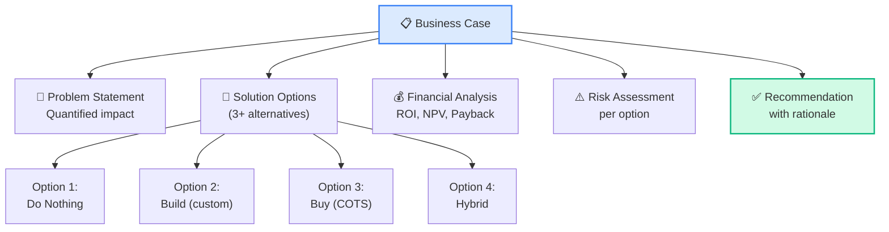

## Strategy Analysis — CBAP Level (15%)

Strategy Analysis chiếm **15%** trong CBAP (tăng từ 12% trong CCBA), phản ánh kỳ vọng CBAP holders phải có **strategic thinking** mạnh. Đây là KA thể hiện rõ nhất sự khác biệt giữa "senior BA" (CCBA) và "strategic BA" (CBAP).

### 4 Tasks trong Strategy Analysis

## Task 1: Analyze Current State

### Framework phân tích Current State

### SWOT Analysis — Enterprise Level

### SWOT Strategies

| Strategy | Combination | CBAP Action |
|---------|-----------|-------------|
| **SO** (Maximize-Maximize) | Strengths + Opportunities | Leverage BA team → expand to SEA market |
| **WO** (Minimize-Maximize) | Weaknesses + Opportunities | Address legacy → enable digital transformation |
| **ST** (Maximize-Minimize) | Strengths + Threats | Use market position → defend against competitors |
| **WT** (Minimize-Minimize) | Weaknesses + Threats | Fix skill gaps → prepare for regulation changes |

### PESTLE Analysis

| Factor | Description | CBAP Example |
|--------|-----------|-------------|
| **P**olitical | Government policies, stability | Healthcare: Policy changes affect compliance |
| **E**conomic | Growth, inflation, exchange rates | Banking: Interest rate changes affect loan products |
| **S**ocial | Demographics, culture, trends | Retail: Gen Z shopping behavior shifts |
| **T**echnological | Innovation, automation, disruption | Insurance: AI/ML for claims processing |
| **L**egal | Legislation, compliance, standards | Finance: GDPR, SOX compliance requirements |
| **E**nvironmental | Sustainability, climate, resources | Manufacturing: Carbon reporting requirements |

### Porter's Five Forces

### Root Cause Analysis — CBAP Level

<Callout type="info" title="CBAP: Root cause vs Symptoms">
CBAP test khả năng phân biệt **root cause** vs **symptoms**. "Customer churn tăng" là symptom. "Lack of technology modernization" là root cause. Đáp án đúng luôn address root cause, không phải symptoms.
</Callout>

## Task 2: Define Future State

### Future State Components

### SMART Objectives

| Element | Bad Example | SMART Example |
|---------|-----------|-------------|
| **S**pecific | "Cải thiện service" | "Giảm thời gian xử lý đơn hàng" |
| **M**easurable | "Tốt hơn" | "Từ 48h xuống 12h" |
| **A**chievable | "Hoàn toàn tự động" | "Tự động 80% đơn hàng tiêu chuẩn" |
| **R**elevant | "Mọi quy trình" | "Quy trình đơn hàng online" |
| **T**ime-bound | "Sớm nhất có thể" | "Hoàn thành trong Q4 2026" |

### Business Model Canvas — CBAP Tool

| Block | Current State | Future State |
|-------|-------------|-------------|
| **Customer Segments** | B2B large enterprise | B2B + B2C SMB expansion |
| **Value Proposition** | On-premise ERP | Cloud-based SaaS ERP |
| **Channels** | Direct sales | Direct + Partner + Online |
| **Revenue Streams** | License + maintenance | Subscription (MRR) |
| **Key Resources** | On-prem infrastructure | Cloud infrastructure + DevOps |
| **Key Activities** | Customization projects | Product development + support |
| **Key Partnerships** | Few resellers | Cloud providers + ecosystem |
| **Cost Structure** | High CAPEX | Lower OPEX, scalable |

## Gap Analysis — Enterprise Level

### Gap Analysis Framework

### Gap Analysis Matrix

| Area | Current State | Future State | Gap | Priority |
|-----|-------------|-------------|-----|---------|
| **Order Processing** | Manual, 48h | Automated, 12h | Process automation | 🔴 High |
| **Customer Portal** | None | Self-service portal | New capability | 🔴 High |
| **Reporting** | Excel-based | Real-time dashboard | BI platform | 🟡 Medium |
| **Mobile Access** | None | Mobile app | New channel | 🟡 Medium |
| **Data Integration** | File-based ETL | Real-time API | Integration platform | 🟢 Low |

### Business Case Development

### Financial Analysis Methods

| Method | Formula | Use Case |
|--------|---------|---------|
| **ROI** | (Benefits - Costs) / Costs × 100% | Quick comparison between options |
| **NPV** | Σ [Cash Flow / (1+r)^t] | Long-term investment comparison |
| **Payback Period** | Initial Investment / Annual Cash Flow | Time to recover investment |
| **IRR** | Rate where NPV = 0 | Compare with hurdle rate |

**Ví dụ tính ROI:**

| Item | Option A (Build) | Option B (Buy) |
|-----|----------------:|---------------:|
| Initial Cost | -$500,000 | -$300,000 |
| Annual Benefit | $200,000 | $150,000 |
| Annual Maintenance | -$50,000 | -$80,000 |
| Net Annual Benefit | $150,000 | $70,000 |
| 3-Year ROI | **($450K-$500K)/$500K = -10%** | **($210K-$300K)/$300K = -30%** |
| 5-Year ROI | **($750K-$500K)/$500K = 50%** ✅ | **($350K-$300K)/$300K = 17%** |

<Callout type="tip" title='CBAP exam: "Do Nothing" option'>
Luôn include "Do Nothing" (status quo) trong options analysis. Đây là **baseline** để so sánh. Nếu "Do Nothing" cost < thay đổi → có thể hợp lý! CBAP test khả năng **objective evaluation**, kể cả khi stakeholder muốn thay đổi.
</Callout>

## Câu hỏi CBAP thường gặp về SA (Part 1)

### Scenario 1
> Công ty phân tích current state cho thấy 3 root causes. Executive muốn address cả 3 cùng lúc nhưng budget hạn chế. BA nên:
>
> A. Address root cause lớn nhất  
> B. **Analyze cost-benefit cho từng root cause, recommend phased approach** ✅  
> C. Yêu cầu thêm budget  
> D. Address tất cả với reduced scope

### Scenario 2
> BA đang define future state objectives. Stakeholder nói "muốn hệ thống nhanh hơn". BA nên:
>
> A. Document "improve system speed"  
> B. **Probe for specifics: "Nhanh hơn nghĩa là gì? Từ bao lâu xuống bao lâu?"** ✅  
> C. Dùng industry benchmark  
> D. Để technical team define

### Scenario 3
> SWOT analysis reveal strength lớn nhất là "experienced team" và opportunity lớn nhất là "market expansion". BA nên recommend:
>
> A. WT strategy  
> B. WO strategy  
> C. **SO strategy — leverage experienced team for market expansion** ✅  
> D. ST strategy

<Callout type="success" title="Key takeaway">
Strategy Analysis Part 1 = **Understand where we are** (Current State) + **Define where we want to be** (Future State) + **Quantify the gap** (Gap Analysis) + **Build the case** (Business Case). Mọi recommendation phải dựa trên **data và analysis**, không phải intuition.
</Callout>

## 📝 Tóm tắt kiến thức nổi bật

<Callout type="success" title="Key Takeaways — Bài 6">
- SA ở CBAP chiếm **15%** (vs 12% CCBA) — yêu cầu **enterprise-level strategic thinking**
- **SWOT + PESTLE + Porter's Five Forces**: Ba frameworks chiến lược kết hợp cho Current State Analysis toàn diện
- **Root Cause Analysis**: Fishbone (Ishikawa) + 5 Whys — dig deep, don't treat symptoms
- **Future State**: SMART Objectives + Business Model Canvas → clear, measurable destination
- **Gap Analysis**: Current → Future → identify gaps → define actions to bridge
- **Business Case**: Problem → Options → Financial Analysis (ROI, NPV, Payback) → Recommendation → Risk Assessment
- Mọi recommendation phải dựa trên **data và analysis**, không phải intuition
</Callout>

---

## 📋 Bài kiểm tra trắc nghiệm — Bài 6

<Callout type="info" title="Hướng dẫn làm bài">
Làm **10 câu** bên dưới trong **17 phút**. Đáp án ở cuối bài.
</Callout>

**Câu 1.** PESTLE Analysis examines which external factors?

- A. Product, Engineering, Sales, Testing, Legal, Ethics
- B. Political, Economic, Social, Technological, Legal, Environmental
- C. People, Evaluation, Strategy, Timing, Leadership, Execution
- D. Project, Estimation, Scope, Timeline, Limitations, Effort

**Câu 2.** Porter's Five Forces reveals "New entrants have low barriers." This means:

- A. Good for the company — easy to expand
- B. Threat — new competitors can enter easily, increasing competition
- C. No impact
- D. Opportunity for partnerships

**Câu 3.** Business objective: "Reduce operational costs by 25% within 18 months through process automation." Is this SMART?

- A. Yes — it has S (reduce costs), M (25%), A (feasible), R (business-relevant), T (18 months)
- B. No — missing Specific
- C. No — missing Measurable
- D. No — missing Time-bound

**Câu 4.** NPV = $500,000 for Option A, NPV = -$100,000 for Option B. BA should:

- A. Choose cheaper option
- B. Recommend Option A — positive NPV means returns exceed investment
- C. Choose Option B — negative NPV means less risk
- D. Need more information

**Câu 5.** Business Case should include all EXCEPT:

- A. Problem statement
- B. Financial analysis (ROI, NPV)
- C. Risk assessment
- D. Detailed technical implementation design

**Câu 6.** Root Cause Analysis: Customer complaints about late deliveries. 5 Whys reveals it's because warehouse staff don't know which orders are urgent. Root cause is:

- A. Slow delivery trucks
- B. Lack of order priority visibility in the warehouse system
- C. Too many orders
- D. Understaffed warehouse

**Câu 7.** Gap Analysis identifies 3 critical gaps. BA should:

- A. Address all gaps simultaneously
- B. Prioritize gaps by business impact and define phased action plan
- C. Report gaps and wait for management
- D. Only address the easiest gap

**Câu 8.** SWOT: Company has weak digital capabilities (W) but customers want digital-first experience (O). Strategy should be:

- A. SO — leverage strengths
- B. WO — invest to overcome weakness and exploit opportunity
- C. ST — use strength against threats
- D. WT — defensive

**Câu 9.** ROI formula is:

- A. (Cost - Gain) / Cost × 100
- B. (Gain - Cost) / Cost × 100%
- C. Gain / Cost
- D. Cost / Gain × 100%

**Câu 10.** Business Model Canvas includes which value-focused component?

- A. Gantt Chart
- B. Value Propositions — what unique value the business delivers to customers
- C. RACI Matrix
- D. ERD

---

### 🔑 Đáp án & Giải thích

| Câu | Đáp án | Giải thích |
|:---:|:------:|-----------|
| 1 | **B** | PESTLE = Political, Economic, Social, Technological, Legal, Environmental. |
| 2 | **B** | Low barriers to entry = threat of new entrants high → more competition. |
| 3 | **A** | Has all SMART components: S (operational costs), M (25%), A (process automation is feasible), R (business-relevant), T (18 months). |
| 4 | **B** | Positive NPV = value creation. Negative NPV = value destruction. Choose positive NPV. |
| 5 | **D** | Business Case = strategic level. Detailed technical design belongs in solution design phase, not business case. |
| 6 | **B** | 5 Whys reached: warehouse staff can't see priority → need priority visibility in system. |
| 7 | **B** | Prioritize by business impact, create phased plan. Don't try everything at once. |
| 8 | **B** | Weakness + Opportunity = WO strategy — invest to overcome weakness and capture opportunity. |
| 9 | **B** | ROI = (Gain - Cost) / Cost × 100%. Gain $150K, Cost $100K → ROI = 50%. |
| 10 | **B** | Business Model Canvas has "Value Propositions" — the core of what business offers. |

### 📊 Thang đánh giá

| Số câu đúng | Đánh giá | Hành động |
|:-----------:|---------|-----------|
| 9-10 | ⭐ Xuất sắc | SA Part 1 nắm vững! |
| 7-8 | ✅ Tốt | Ôn lại PESTLE và Financial Analysis formulas |
| 5-6 | ⚠️ Trung bình | Focus Business Case structure và SWOT strategies |
| < 5 | ❌ Cần ôn lại | SA 15% — strategic thinking là key differentiator ở CBAP |

---

*Tiếp theo: Strategy Analysis nâng cao — Phần 2: Risk & Change Strategy 👉*
