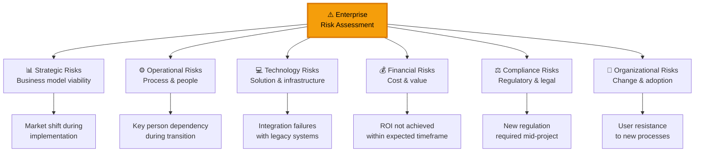
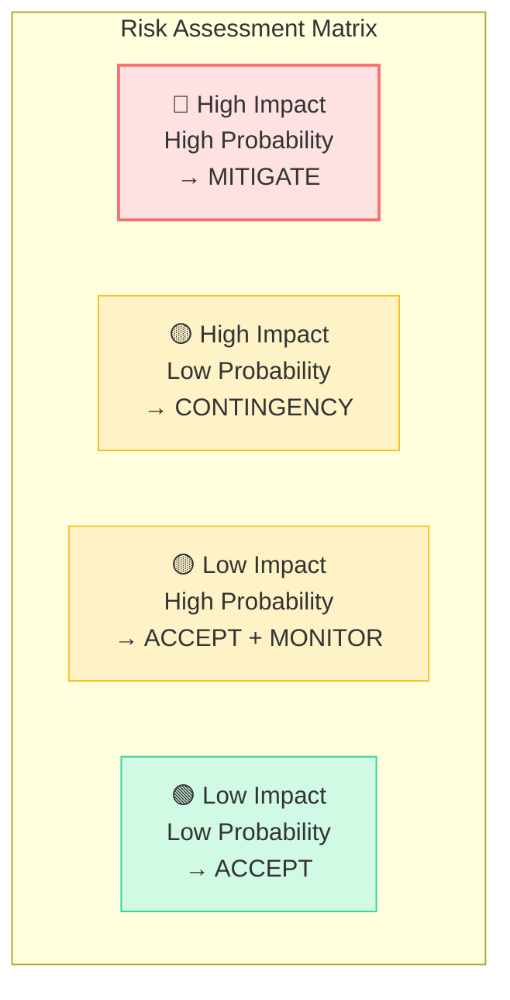
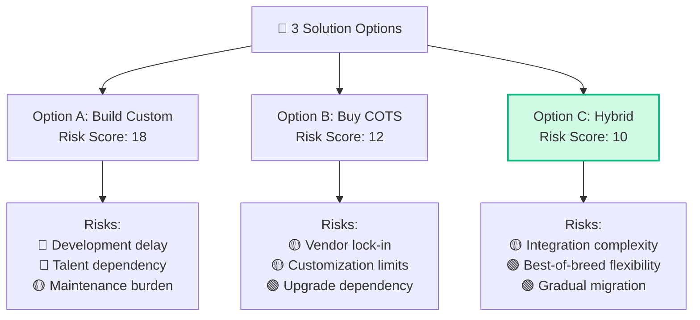
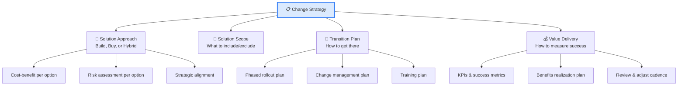
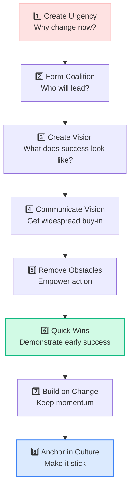
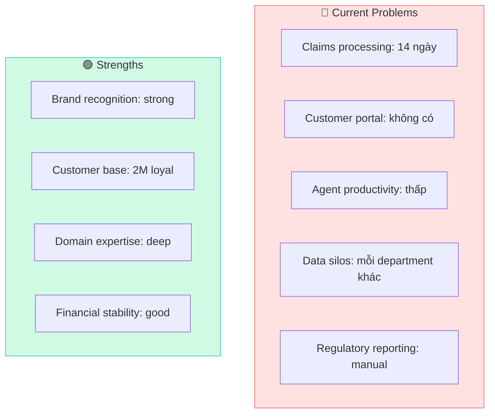
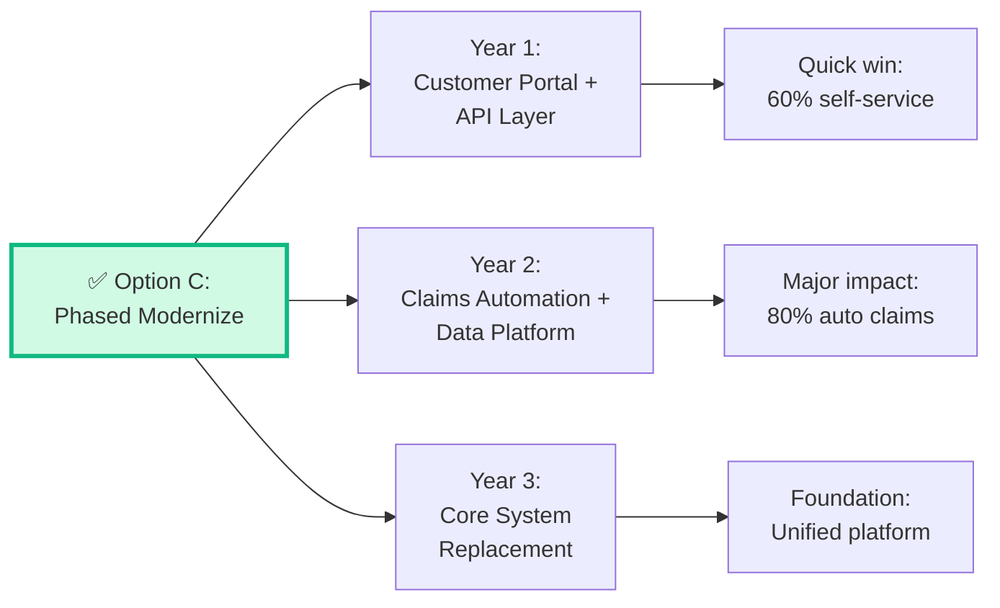

## Task 3: Assess Risks — Enterprise Level

Risk assessment ở CBAP level yêu cầu khả năng đánh giá risk đa chiều — không chỉ project risks mà còn **enterprise risks**, **strategic risks**, và **operational risks**.

### Risk Categories

### Risk Assessment Matrix

### Risk Register — Enterprise Template

| Risk ID | Category | Description | Probability | Impact | Score | Response | Owner |
|---------|---------|-----------|------------|--------|-------|----------|-------|
| R-001 | Technology | Legacy API incompatibility | High (4) | High (4) | 16 | **Mitigate**: POC integration early | Tech Lead |
| R-002 | Organizational | User adoption < 50% | Medium (3) | High (4) | 12 | **Mitigate**: Change management program | Change Manager |
| R-003 | Financial | Cloud costs exceed estimate | Medium (3) | Medium (3) | 9 | **Accept**: Buffer 20% budget | Finance |
| R-004 | Strategic | Competitor launches similar product | Low (2) | High (4) | 8 | **Contingency**: Accelerate key differentiators | Product Owner |
| R-005 | Compliance | GDPR audit requirement | Low (2) | High (5) | 10 | **Mitigate**: Privacy by design | Compliance |

### Risk Response Strategies

| Strategy | Description | CBAP Application |
|---------|-----------|-----------------|
| **Avoid** | Eliminate the risk entirely | Change scope to exclude risky element |
| **Mitigate** | Reduce probability or impact | Early POC, phased rollout, training |
| **Transfer** | Shift risk to third party | Insurance, outsource, SLA with vendor |
| **Accept** | Acknowledge and prepare | Budget contingency, monitoring plan |
| **Exploit** (Opportunity) | Maximize positive risk | Accelerate to capture market window |
| **Enhance** (Opportunity) | Increase probability of positive outcome | Add features to increase adoption |

<Callout type="warning" title="CBAP: Risk ≠ Issue">
**Risk** = something that MIGHT happen (future). **Issue** = something that HAS happened (present). CBAP test khả năng distinguish giữa risk management (proactive) và issue management (reactive). BA nên **proactively identify risks**, không chỉ react to issues.
</Callout>

### Risk-Based Decision Making

## Task 4: Define Change Strategy

### Change Strategy Components

### Build vs Buy Decision Framework

| Factor | Build (Custom) | Buy (COTS/SaaS) | Hybrid |
|--------|:-------------:|:---------------:|:------:|
| **Unique business process** | ✅ Best | ❌ Poor | 🟡 OK |
| **Speed to market** | ❌ Slow | ✅ Fast | 🟡 Medium |
| **Total Cost of Ownership** | ❌ High long-term | ✅ Predictable | 🟡 Variable |
| **Competitive advantage** | ✅ Differentiator | ❌ Same as competitors | 🟡 Partial |
| **Maintenance** | ❌ Internal team needed | ✅ Vendor handles | 🟡 Shared |
| **Flexibility** | ✅ Full control | ❌ Vendor roadmap | 🟡 Core + custom |
| **Integration** | ✅ Native fit | ❌ Adapter needed | 🟡 API-based |
| **Risk** | 🔴 Development risk | 🟡 Vendor risk | 🟡 Integration risk |

### Transition Planning

```mermaid
graph LR
    subgraph Phase1["Phase 1: Foundation"]
        P1_1["Core platform setup"]
        P1_2["Data migration plan"]
        P1_3["Pilot group selection"]
    end

    subgraph Phase2["Phase 2: Pilot"]
        P2_1["Pilot deployment"]
        P2_2["User acceptance testing"]
        P2_3["Feedback collection"]
    end

    subgraph Phase3["Phase 3: Rollout"]
        P3_1["Gradual department rollout"]
        P3_2["Training delivery"]
        P3_3["Support setup"]
    end

    subgraph Phase4["Phase 4: Stabilize"]
        P4_1["Full deployment"]
        P4_2["Legacy decommission"]
        P4_3["Benefits measurement"]
    end

    Phase1 --> Phase2 --> Phase3 --> Phase4

    style Phase1 fill:#DBEAFE,stroke:#3B82F6,color:#333
    style Phase2 fill:#D1FAE5,stroke:#10B981,color:#333
    style Phase3 fill:#FEF3C7,stroke:#F59E0B,color:#333
    style Phase4 fill:#E9D5FF,stroke:#8B5CF6,color:#333
```

### Change Management — Kotter's 8 Steps

<Callout type="info" title="CBAP & Change Management">
BA không phải Change Manager, nhưng CBAP test hiểu biết về change management principles. BA cần biết khi nào recommend change management support và cách integrate BA activities với change management.
</Callout>

## Enterprise Case Study

### Case Study: Digital Transformation — XYZ Insurance

> **Background:** XYZ Insurance có 5,000 nhân viên, hệ thống COBOL mainframe 25 năm tuổi, 2 triệu khách hàng. CEO muốn "digital transformation" trong 3 năm.

#### 1. Current State Analysis

#### 2. Future State Definition

| Objective | Current | Target | Timeline |
|----------|---------|--------|---------|
| Claims processing time | 14 days | 3 days (80% auto) | Year 2 |
| Customer self-service | 0% | 60% of interactions | Year 1 |
| Agent productivity | Baseline | +40% improvement | Year 2 |
| Data integration | 5 silos | 1 unified platform | Year 3 |
| Regulatory reporting | 3 days manual | Real-time automated | Year 2 |

#### 3. Solution Options Analysis

| Criterion (Weight) | Option A: Big Bang Replace | Option B: Wrap & Extend | Option C: Phased Modernize |
|:---|:---:|:---:|:---:|
| Risk (30%) | 🔴 2/10 | 🟡 6/10 | 🟢 8/10 |
| Cost (25%) | 🔴 3/10 | 🟡 5/10 | 🟡 6/10 |
| Speed (20%) | 🔴 3/10 | 🟢 7/10 | 🟡 5/10 |
| Strategic fit (15%) | 🟢 9/10 | 🟡 5/10 | 🟢 8/10 |
| Change mgmt (10%) | 🔴 2/10 | 🟢 7/10 | 🟡 6/10 |
| **Weighted Score** | **3.65** | **5.85** | **6.65** ✅ |

#### 4. Recommendation

**Rationale:** Option C scored highest vì:
- **Risk phân tán** qua 3 năm, không "all-or-nothing"
- **Quick wins** trong Year 1 build momentum
- **Learning** từ mỗi phase cải thiện phases sau
- **Change management** dễ hơn với gradual approach

#### 5. Risk Mitigation Plan

| Top Risk | Mitigation | Contingency |
|---------|-----------|------------|
| Legacy data quality issues | Data cleansing sprint Year 0 | Manual correction during migration |
| Vendor capability mismatch | Detailed POC before contract | Short-term contract with exit clause |
| Staff resistance | Change champions network | Parallel systems during transition |
| Budget overrun | Phase gate reviews, buffer | Descope non-essential features |
| Regulatory non-compliance | Compliance review per phase | Regulatory advisor on team |

<Callout type="tip" title="Case study approach for CBAP">
Khi gặp case study trong CBAP exam, follow framework: **Current State → Future State → Gap → Options → Risk → Recommendation**. Luôn evaluate ≥3 options (including "Do Nothing"). Recommendation phải có **quantified rationale**, không chỉ "feels right".
</Callout>

## Câu hỏi CBAP thường gặp về SA (Part 2)

### Scenario 1
> BA đã identify 5 risks. Sponsor muốn mitigate tất cả. BA nên:
>
> A. Mitigate all 5  
> B. **Prioritize by risk score (probability × impact), focus budget on top risks** ✅  
> C. Chỉ mitigate highest risk  
> D. Accept all risks

### Scenario 2
> Business case cho thấy Option A có ROI cao nhất nhưng risk cao nhất. Option B có ROI vừa phải nhưng risk thấp. BA nên:
>
> A. Recommend Option A (highest ROI)  
> B. **Present both options with risk-adjusted analysis, let stakeholders decide** ✅  
> C. Recommend Option B (lowest risk)  
> D. Propose modified Option A with mitigations

### Scenario 3
> Sau Year 1 of 3-year plan, 2 out of 5 objectives achieved. Budget spent: 50%. BA nên:
>
> A. Continue as planned  
> B. **Re-assess: analyze why objectives missed, adjust plan for Year 2-3** ✅  
> C. Report failure to sponsor  
> D. Cut scope for remaining objectives

<Callout type="success" title="Key takeaway">
Strategy Analysis Part 2 = **Risk-informed decision making** + **Change strategy at enterprise level** + **Case study-based reasoning**. CBAP BA recommends nhưng luôn presents **options with trade-offs** để stakeholder make informed decisions.
</Callout>

## 📝 Tóm tắt kiến thức nổi bật

<Callout type="success" title="Key Takeaways — Bài 7">
- **Risk Categories**: Strategic, Operational, Financial, Technical, Regulatory, Organizational
- **Risk Register**: ID → Description → Probability → Impact → Score → Response → Owner → Status
- **4 Risk Response Strategies**: Avoid (eliminate), Mitigate (reduce), Transfer (third party), Accept (acknowledge)
- **Change Strategy**: Build vs Buy vs Partner vs Open Source — evaluate holistically
- **Transition Planning**: Phased rollout → Parallel run → Big bang — choose based on risk tolerance
- **Kotter's 8 Steps**: Urgency → Coalition → Vision → Communicate → Empower → Quick Wins → Consolidate → Anchor
- Enterprise case study approach: analyze entire business scenario, not just one requirement
</Callout>

---

## 📋 Bài kiểm tra trắc nghiệm — Bài 7

<Callout type="info" title="Hướng dẫn làm bài">
Làm **10 câu** bên dưới trong **17 phút**. Đáp án ở cuối bài.
</Callout>

**Câu 1.** Risk: "Key vendor may go bankrupt." Category và response:

- A. Technical risk → Mitigate
- B. Financial/Strategic risk → Transfer or Mitigate (backup vendor, contract SLAs)
- C. Operational risk → Accept
- D. Regulatory risk → Avoid

**Câu 2.** Kotter's "Create Urgency" step means:

- A. Rush implementation
- B. Help stakeholders understand WHY change is needed and what happens if NOT changed
- C. Set aggressive deadlines
- D. Fire resistant employees

**Câu 3.** Phased rollout cho enterprise system migration means:

- A. Deploy to all locations at once
- B. Gradually deploy to groups/regions, learn from each phase before expanding
- C. Deploy fastest features first
- D. Only deploy to IT department

**Câu 4.** Risk probability = Medium, Impact = High. Risk score = Medium-High. Response should be:

- A. Accept — it's only medium probability
- B. Mitigate — reduce probability or impact to acceptable level
- C. Ignore
- D. Transfer everything to insurance

**Câu 5.** Build vs Buy analysis: company has unique competitive advantage in their process. Best option:

- A. Buy off-the-shelf → faster
- B. Build custom → preserve competitive advantage, full control
- C. SaaS → cheapest
- D. Open Source → free

**Câu 6.** Transition from legacy to new system requires data migration. Key risk:

- A. UI not pretty enough
- B. Data loss, corruption, or mapping errors during migration
- C. Users prefer old system
- D. Training takes time

**Câu 7.** Year 1 of 3-year transformation: 2/5 objectives achieved, 50% budget spent. BA should recommend:

- A. Continue as planned
- B. Re-assess: analyze why 3 objectives missed, adjust strategy for Years 2-3
- C. Cancel the program
- D. Double the budget

**Câu 8.** Parallel run deployment means:

- A. Old and new system run simultaneously until new system is proven stable
- B. Deploy new system and immediately retire old
- C. Run features in parallel
- D. Two teams working at same time

**Câu 9.** Change resistance from middle management. Most effective approach:

- A. Mandate compliance from top
- B. Involve middle managers early as change champions, show benefits to their teams
- C. Replace resistant managers
- D. Ignore them

**Câu 10.** Enterprise risk register should be reviewed:

- A. Only at project start
- B. Regularly throughout the program — risk landscape changes over time
- C. Only when risks materialize
- D. Only at project end for lessons learned

---

### 🔑 Đáp án & Giải thích

| Câu | Đáp án | Giải thích |
|:---:|:------:|-----------|
| 1 | **B** | Vendor bankruptcy = financial/strategic risk. Response: multi-vendor strategy, contract protections. |
| 2 | **B** | Create urgency = build compelling case for WHY change is needed. Not rushing. |
| 3 | **B** | Phased = gradual deployment, learn & adjust each phase. Lower risk than big bang. |
| 4 | **B** | Medium probability × High impact = Medium-High → Mitigate is appropriate. |
| 5 | **B** | Unique competitive advantage → build custom to preserve. Off-the-shelf levels the playing field. |
| 6 | **B** | Data migration = highest risk: data loss, corruption, incorrect mapping. Must plan extensively. |
| 7 | **B** | Missed objectives → re-assess root cause, adjust remaining plan. Don't blindly continue. |
| 8 | **A** | Parallel run = both systems simultaneously until new system proven. Safety net approach. |
| 9 | **B** | Involve middle managers as change champions = engagement + ownership. Top-down mandate creates resistance. |
| 10 | **B** | Risk landscape evolves — regular reviews catch emerging risks and update responses. |

### 📊 Thang đánh giá

| Số câu đúng | Đánh giá | Hành động |
|:-----------:|---------|-----------|
| 9-10 | ⭐ Xuất sắc | SA Part 2 nắm vững! |
| 7-8 | ✅ Tốt | Ôn lại Kotter's 8 Steps và transition strategies |
| 5-6 | ⚠️ Trung bình | Focus risk register và change management |
| < 5 | ❌ Cần ôn lại | Enterprise change strategy = core CBAP skill |

---

*Tiếp theo: RADD nâng cao — Phần 1: Requirements Specification & Modeling 👉*
