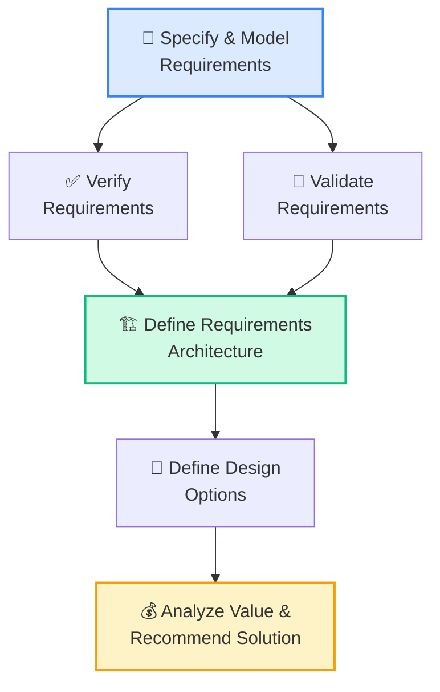
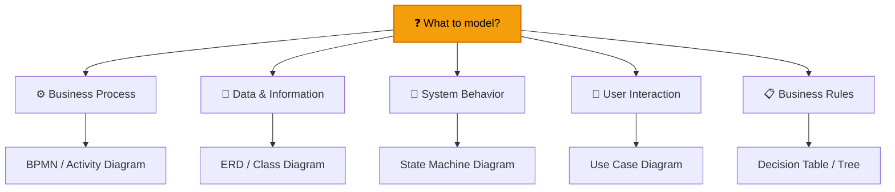
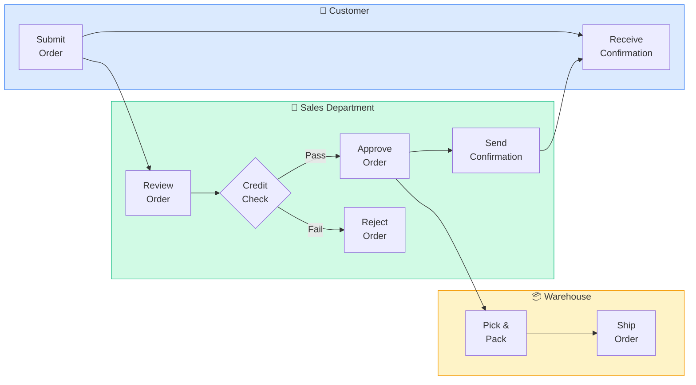
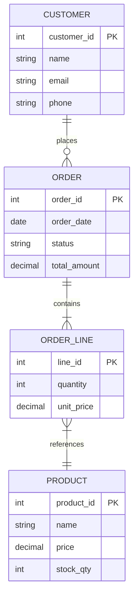
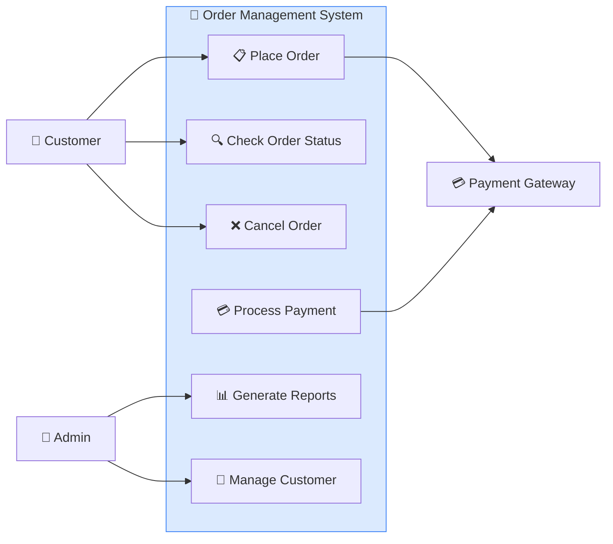
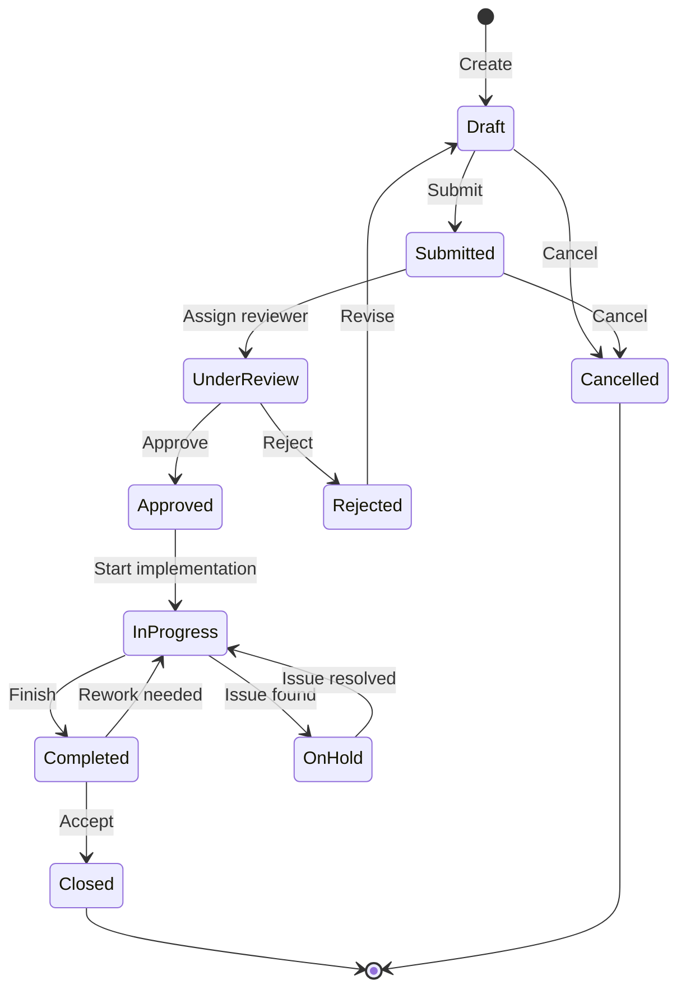
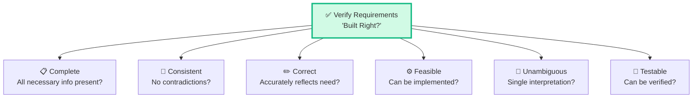
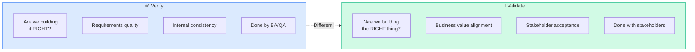

## RADD — CBAP Level (30%)

RADD chiếm **30%** trong CBAP — KA quan trọng nhất, chiếm gần 1/3 đề thi. Ở CBAP level, RADD test khả năng **advanced modeling**, **enterprise-level design**, và **strategic requirement decisions**.

### 6 Tasks trong RADD

## Task 1: Specify & Model Requirements

### Modeling Technique Selection Guide

### 1. BPMN (Business Process Model and Notation)

**CBAP-level BPMN** đòi hỏi hiểu sâu về pools, lanes, message flows, và sub-processes.

**BPMN Element Levels:**

| Level | Elements | CBAP Depth |
|-------|---------|-----------|
| **Basic** | Tasks, Gateways, Start/End Events | ✅ Must know |
| **Intermediate** | Pools, Lanes, Message Events, Sub-processes | ✅ Must know |
| **Advanced** | Compensation, Error handling, Complex gateways | 🟡 Good to know |
| **Executable** | Data objects, Service tasks, Script tasks | ⚪ Not tested |

### 2. ERD (Entity-Relationship Diagram)

**Cardinality Rules:**

| Symbol | Meaning | Example |
|--------|---------|---------|
| `||--||` | One to One | Customer — CustomerProfile |
| `\|\|--o\{` | One to Many (optional) | Customer — Orders (0..*) |
| `\|\|--\|\{` | One to Many (required) | Order — OrderLines (1..*) |
| `\}|--\|\{` | Many to Many | Student — Course |

### 3. Use Case Diagram — Enterprise

### Use Case Specification Template

| Element | Content |
|---------|---------|
| **UC ID** | UC-001 |
| **Name** | Place Order |
| **Actor** | Customer |
| **Precondition** | Customer logged in, cart not empty |
| **Main Flow** | 1. Customer reviews cart → 2. Selects shipping → 3. Enters payment → 4. Confirms order → 5. System generates order |
| **Alternative Flow** | 3a. Payment declined → Show error → Retry |
| **Exception Flow** | 2a. Item out of stock → Notify → Remove item |
| **Postcondition** | Order created, confirmation email sent |
| **Business Rules** | BR-001: Min order $10, BR-002: Free shipping > $50 |

### 4. State Diagram

### 5. Decision Table

**Business Rule: Discount Calculation**

| Condition 1: Customer Type | Condition 2: Order Amount | Condition 3: Season | **Action: Discount** |
|:---:|:---:|:---:|:---:|
| VIP | ≥ $1000 | Holiday | **25%** |
| VIP | ≥ $1000 | Regular | **20%** |
| VIP | < $1000 | Any | **15%** |
| Regular | ≥ $1000 | Holiday | **15%** |
| Regular | ≥ $1000 | Regular | **10%** |
| Regular | < $1000 | Holiday | **10%** |
| Regular | < $1000 | Regular | **5%** |
| New | Any | Any | **5%** |

<Callout type="info" title="Decision Tables vs Decision Trees">
**Decision Table**: Best khi nhiều conditions kết hợp, cần đảm bảo completeness (mọi combination đều có action).
**Decision Tree**: Best khi conditions có hierarchy rõ ràng, dễ visualize flow.
CBAP có thể hỏi: "_Given this business rule, which representation is more appropriate?_"
</Callout>

## Task 2: Verify Requirements

### Verification Checklist

### Requirements Quality Attributes

| Attribute | Bad Example ❌ | Good Example ✅ |
|----------|-------------|--------------|
| **Specific** | "System should be fast" | "Page load < 2 seconds for 95th percentile" |
| **Measurable** | "Easy to use" | "New user completes task in < 5 minutes without help" |
| **Consistent** | "All users can view AND only admins can view" | "Admins can view all data; users can view own data" |
| **Feasible** | "100% uptime" | "99.9% uptime (8.76 hours downtime/year)" |
| **Testable** | "System should handle heavy load" | "System supports 10,000 concurrent users" |
| **Atomic** | "System shall allow login and manage profile" | "FR-001: System shall allow login. FR-002: System shall allow profile management." |

### Verification Techniques

| Technique | How It Works | Best For |
|----------|-------------|---------|
| **Peer Review** | Another BA reviews specifications | Catching omissions, ambiguity |
| **Walkthrough** | Author presents to reviewers | Complex requirements understanding |
| **Inspection** | Formal review with checklist | Critical/regulated requirements |
| **Prototyping** | Build mockup to verify understanding | UI/UX requirements |
| **Modeling** | Create models to verify consistency | Data & process requirements |

## Task 3: Validate Requirements

### Verify vs Validate

### Validation Techniques

| Technique | Description | CBAP Level |
|----------|-----------|-----------|
| **Structured Walkthrough** | Walk stakeholders through requirements | Validate understanding |
| **Prototyping** | Interactive prototype review | Validate UX/workflow |
| **Acceptance Criteria Review** | Review pass/fail criteria | Validate testability |
| **Day-in-the-Life Testing** | Simulate real usage scenario | Validate completeness |
| **Business Rules Validation** | Test rules with real data scenarios | Validate correctness |

<Callout type="warning" title="CBAP trap: Verify ≠ Validate">
Đây là câu bẫy phổ biến nhất trong CBAP exam. **Verify** = check quality (BA có thể tự làm). **Validate** = check business value (PHẢI có stakeholder). Nếu câu hỏi nói "check with stakeholder" → Validate. Nếu nói "check for completeness/consistency" → Verify.
</Callout>

## Non-functional Requirements (NFRs)

### NFR Categories — Enterprise Level

| Category | Sub-types | CBAP Example |
|---------|----------|-------------|
| **Performance** | Response time, Throughput, Latency | "API response < 200ms for 99th percentile" |
| **Reliability** | Availability, MTBF, MTTR | "99.9% uptime, MTTR < 30 minutes" |
| **Security** | Authentication, Authorization, Encryption | "Multi-factor authentication for admin functions" |
| **Scalability** | Vertical, Horizontal, Data volume | "Support 10x current user base without architecture change" |
| **Usability** | Learnability, Accessibility, Efficiency | "WCAG 2.1 AA compliance" |
| **Maintainability** | Modularity, Testability, Modifiability | "New module deployment without system restart" |
| **Portability** | Adaptability, Installability | "Support major browsers, iOS 15+, Android 12+" |
| **Compliance** | Regulatory, Standards, Audit | "GDPR compliant, SOC 2 Type II certified" |

<Callout type="tip" title="NFRs often determine architecture">
NFRs thường quyết định **kiến trúc** giải pháp. "99.99% availability" → cần redundancy, failover. "10,000 concurrent users" → cần horizontal scaling. BA phải elicit NFRs sớm để architect có thể design phù hợp.
</Callout>

## Câu hỏi CBAP thường gặp về RADD (Part 1)

### Scenario 1
> BA document: "System shall display order information quickly and efficiently." QA nói requirement không testable. BA nên:
>
> A. Add test: "QA verify system displays order info"  
> B. **Rewrite: "System shall display order details within 2 seconds of request"** ✅  
> C. Remove requirement  
> D. Ask stakeholder to define "quickly"

### Scenario 2
> BA cần model một process phức tạp với 3 departments, message passing, và error handling. Technique tốt nhất:
>
> A. Flowchart  
> B. Use Case Diagram  
> C. **BPMN with pools, lanes, and message events** ✅  
> D. State Diagram

### Scenario 3
> Validation session với stakeholders reveals requirement bị miss. BA nên:
>
> A. **Add requirement, re-verify, trace to business objective** ✅  
> B. Skip vì đã pass verification  
> C. Add to next phase  
> D. Create change request

## 📝 Tóm tắt kiến thức nổi bật

<Callout type="success" title="Key Takeaways — Bài 8">
- RADD ở CBAP chiếm **30%** — vẫn là KA lớn nhất, nhưng ở level **enterprise modeling**
- **Advanced BPMN**: Pools, lanes, sub-processes, error events, compensation, message flows
- **ERD with Mermaid**: Entity relationships (1:1, 1:N, M:N), attributes, inheritance
- **Use Case Specification**: Preconditions → Main Flow → Alternative Flows → Exception Flows → Postconditions
- **Verify vs Validate**: Verify = quality check (correct, complete, consistent, testable) → Validate = business fit
- **NFR Categories**: Performance, Security, Availability, Scalability, Usability, Maintainability, Compliance
- Model selection depends on context: data model (ERD), process model (BPMN), behavior model (State/Use Case)
</Callout>

---

## 📋 Bài kiểm tra trắc nghiệm — Bài 8

<Callout type="info" title="Hướng dẫn làm bài">
Làm **10 câu** bên dưới trong **17 phút**. Đáp án ở cuối bài.
</Callout>

**Câu 1.** Enterprise integration: 3 systems need to share customer data. BA needs to model the data structure across systems. Best model:

- A. BPMN process diagram
- B. Enterprise Data Model (ERD across systems showing shared entities)
- C. Use Case Diagram
- D. State Diagram

**Câu 2.** Use Case specification has "Main Flow" and "Alternative Flow". The difference:

- A. No difference
- B. Main Flow = happy path (normal); Alternative Flow = valid but different path (still reaches goal)
- C. Alternative Flow = error scenarios only
- D. Main Flow is optional

**Câu 3.** BA discovers requirement REQ-101 is "Complete" and "Correct" but fails "Consistent" check. This means:

- A. Requirement is fine
- B. REQ-101 contradicts another requirement — needs to be resolved
- C. Requirement needs more detail
- D. Requirement failed validation

**Câu 4.** BPMN Sub-process is used when:

- A. Process is too simple
- B. A complex portion of a process needs to be encapsulated and potentially reused
- C. Process has no activities
- D. Only for manual processes

**Câu 5.** NFR: "System must encrypt all data at rest and in transit using AES-256." This drives which design decision?

- A. Database schema design
- B. Security architecture — encryption layers, key management, SSL/TLS configuration
- C. UI design
- D. Process flow design

**Câu 6.** BA needs to model an entity (Insurance Claim) that goes through states: Filed → Under Review → More Info Needed → Approved/Denied → Closed. Best model:

- A. ERD
- B. BPMN
- C. State Machine Diagram
- D. Use Case Diagram

**Câu 7.** Verification checklist item: "Is the requirement testable?" Requirement: "System should be user-friendly." Result:

- A. Pass — user-friendly is testable
- B. Fail — "user-friendly" is subjective, not measurable, not testable
- C. Pass — with surveys
- D. Not applicable

**Câu 8.** Enterprise has 20 APIs for different services. BA needs to model how they interact. Best model:

- A. ERD
- B. System Integration Diagram / Interface Map
- C. State Diagram
- D. Decision Table

**Câu 9.** Exception Flow in Use Case means:

- A. Regular path
- B. Error handling path — when something goes wrong and system needs to recover
- C. Alternative happy path
- D. Admin-only path

**Câu 10.** BA finished modeling. Stakeholder says "I don't understand the ERD." BA should:

- A. Explain database concepts
- B. Create alternative visualization (simpler diagram or natural language description) appropriate for stakeholder's level
- C. Skip stakeholder review
- D. Remove ERD from documentation

---

### 🔑 Đáp án & Giải thích

| Câu | Đáp án | Giải thích |
|:---:|:------:|-----------|
| 1 | **B** | Cross-system data sharing → Enterprise Data Model showing shared entities and relationships. |
| 2 | **B** | Main Flow = normal path. Alternative Flow = valid variation. Exception Flow = error/failure. |
| 3 | **B** | Fails Consistent = contradicts another requirement. BA must investigate and resolve conflict. |
| 4 | **B** | Sub-process = encapsulate complex portion. Enables modularity and reuse. |
| 5 | **B** | Encryption NFR → security architecture decisions: encryption algorithms, key management, TLS. |
| 6 | **C** | Entity with lifecycle states → State Machine Diagram is ideal. |
| 7 | **B** | "User-friendly" is subjective → not testable. Should be "Task completion rate > 90% by first-time users." |
| 8 | **B** | Multiple APIs interacting → System Integration / Interface Map shows connections and data flows. |
| 9 | **B** | Exception Flow = error handling, unexpected situations, system recovery. |
| 10 | **B** | Adapt communication to audience — create appropriate visualization for non-technical stakeholders. |

### 📊 Thang đánh giá

| Số câu đúng | Đánh giá | Hành động |
|:-----------:|---------|-----------|
| 9-10 | ⭐ Xuất sắc | RADD Part 1 enterprise level nắm vững! |
| 7-8 | ✅ Tốt | Ôn lại Use Case specification và NFR-to-design mapping |
| 5-6 | ⚠️ Trung bình | RADD 30% — cần ôn model selection và verification |
| < 5 | ❌ Cần ôn lại | RADD quyết định pass/fail — invest heavily here |

---

*Tiếp theo: RADD nâng cao — Phần 2: Solution Design & Architecture 👉*
