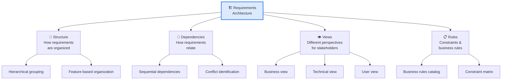
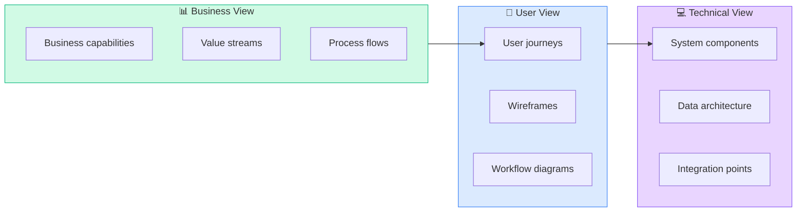
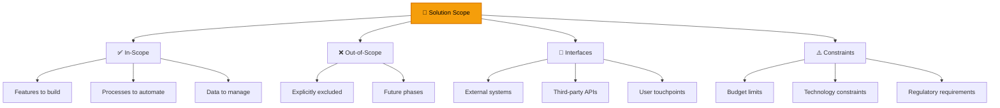
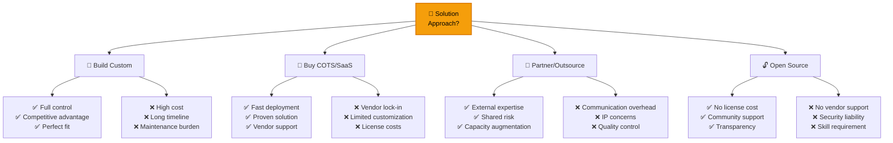
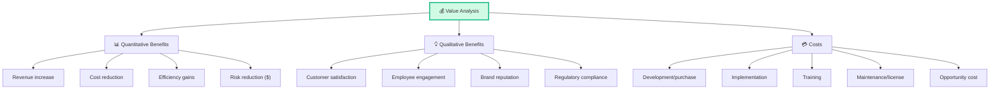
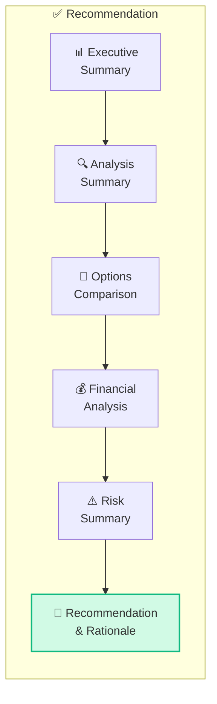
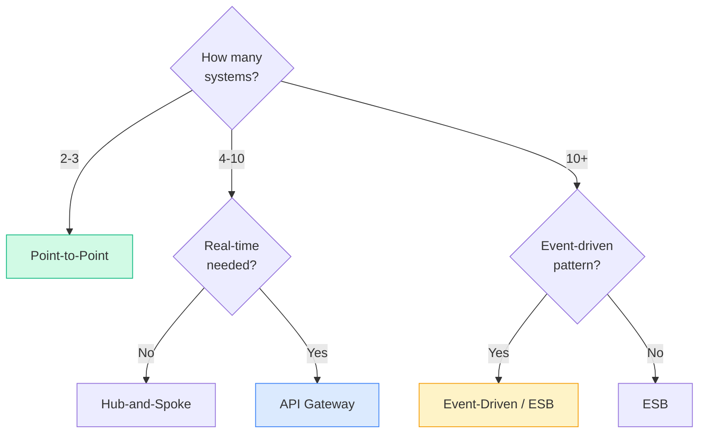

## Task 4: Define Requirements Architecture

Requirements Architecture mô tả **cấu trúc tổng thể** của requirements — cách chúng liên kết, phụ thuộc nhau, và tạo thành hệ thống hoàn chỉnh.

### Requirements Architecture Components

### Requirements Dependency Analysis

| Dependency Type | Description | Impact | CBAP Action |
|---------------|-----------|--------|------------|
| **Necessity** | A requires B to work | B must be delivered before or with A | Ensure B in same or earlier release |
| **Enhancement** | A enhanced by B but works without | B adds value but not critical | Prioritize B if budget allows |
| **Conflict** | A contradicts B | Cannot have both | Resolve with stakeholders |
| **Substitution** | A replaces B | Only need one | Choose based on value/cost |
| **Shared Resource** | A and B use same resource | Potential bottleneck | Resource allocation planning |

### Architecture Views for Different Stakeholders

<Callout type="info" title="CBAP: Requirements Architecture ≠ Solution Architecture">
Requirements Architecture tổ chức **what the system needs to do**. Solution Architecture tổ chức **how the system will do it**. BA owns Requirements Architecture. Solution Architect owns Solution Architecture. CBAP BA cần collaborate với architect nhưng không quyết định technical architecture.
</Callout>

## Task 5: Define Design Options

### Solution Scope Definition

### Design Options Evaluation

| Evaluation Criterion | Weight | Why It Matters |
|---------------------|--------|---------------|
| **Business Value** | 25% | Does it deliver the expected value? |
| **Technical Feasibility** | 20% | Can it be built with current capabilities? |
| **Cost** | 20% | Total cost of ownership (build + maintain) |
| **Risk** | 15% | Likelihood of failure or complications |
| **Time to Market** | 10% | How quickly can value be delivered? |
| **Scalability** | 10% | Can it grow with the business? |

### Build vs Buy vs Partner vs Open Source

### NFR Impact on Design

| NFR | Design Implication | CBAP Analysis |
|-----|-------------------|-------------|
| **High Availability (99.99%)** | Multi-region deployment, Auto-failover | Cost increases ~3x vs single region |
| **Large Data Volume (TB+)** | Distributed database, Data partitioning | Need specialized data architecture |
| **Real-time Processing** | Event-driven architecture, Streaming | More complex than batch processing |
| **Multi-tenant** | Data isolation, Tenant configuration | Security & performance trade-offs |
| **Regulatory Compliance** | Audit logging, Data residency | Constrains hosting & data flow options |

<Callout type="tip" title="CBAP: NFRs drive design decisions">
Câu hỏi CBAP thường cho scenario với NFR constraints và hỏi: "Which design option best addresses these constraints?" BA phải hiểu **trade-offs** giữa NFRs (ví dụ: security vs usability, performance vs cost).
</Callout>

## Task 6: Analyze Potential Value & Recommend Solution

### Value Analysis Framework

### Financial Analysis — CBAP Calculations

**NPV (Net Present Value) Example:**

| Year | Cash Flow | Discount Factor (10%) | Present Value |
|-----|----------:|---------------------:|-------------:|
| 0 | -$500,000 | 1.000 | -$500,000 |
| 1 | $150,000 | 0.909 | $136,350 |
| 2 | $200,000 | 0.826 | $165,200 |
| 3 | $250,000 | 0.751 | $187,750 |
| 4 | $300,000 | 0.683 | $204,900 |
| 5 | $300,000 | 0.621 | $186,300 |
| **NPV** | | | **$380,500** ✅ |

> NPV > 0 → Project is financially viable at 10% discount rate.

**Payback Period:**

| Year | Cumulative Cash Flow |
|------|--------------------:|
| 0 | -$500,000 |
| 1 | -$350,000 |
| 2 | -$150,000 |
| 3 | +$100,000 ← **Payback in Year 3** |

### Recommendation Structure

### Options Comparison Template

| Criterion | Weight | Option A: Build | Option B: Buy | Option C: Hybrid |
|----------|:-----:|:-----:|:-----:|:-----:|
| Business value | 25% | 9 (225) | 6 (150) | 8 (200) |
| Feasibility | 20% | 5 (100) | 8 (160) | 7 (140) |
| Cost (inverse) | 20% | 3 (60) | 7 (140) | 5 (100) |
| Risk (inverse) | 15% | 3 (45) | 6 (90) | 7 (105) |
| Time to market | 10% | 3 (30) | 9 (90) | 6 (60) |
| Scalability | 10% | 8 (80) | 5 (50) | 7 (70) |
| **Total** | | **540** | **680** | **675** |

**Recommendation:** Option B (Buy) has highest weighted score, but Option C (Hybrid) is very close and offers better long-term scalability. Recommend **Option C** with Phase 1 using COTS for core, Phase 2 building custom differentiators.

### Multi-criteria Decision Analysis (MCDA)

| Step | Activity | CBAP BA Role |
|------|---------|-------------|
| 1 | Define evaluation criteria | Facilitate with stakeholders |
| 2 | Assign weights to criteria | Consensus-building with decision makers |
| 3 | Score each option per criterion | Objective assessment with evidence |
| 4 | Calculate weighted scores | Present transparently |
| 5 | Sensitivity analysis | Test "what if weights change?" |
| 6 | Present recommendation | Clear rationale with trade-offs |

<Callout type="warning" title="CBAP: BA recommends, stakeholders decide">
BA provides **analysis and recommendation**, but **decision authority** belongs to stakeholders. CBAP penalizes answers where BA makes unilateral decisions. Always present options, analysis, and recommendation — then let the appropriate authority decide.
</Callout>

## Enterprise Integration Considerations

### Integration Patterns

| Pattern | Description | When to Use |
|---------|-----------|-----------|
| **Point-to-Point** | Direct connection between systems | Few integrations, simple |
| **Hub-and-Spoke** | Central integration hub | Multiple systems, central control |
| **ESB (Enterprise Service Bus)** | Middleware for routing, transformation | Enterprise-level, complex routing |
| **API Gateway** | Centralized API management | Microservices, REST APIs |
| **Event-Driven** | Publish-subscribe pattern | Real-time, loose coupling |

### Integration Decision Matrix

## Câu hỏi CBAP thường gặp về RADD (Part 2)

### Scenario 1
> BA phân tích 3 options cho ERP replacement. CFO muốn cheapest, CTO muốn most scalable, COO muốn fastest to deploy. BA nên:
>
> A. Choose cheapest (CFO has budget authority)  
> B. Choose most scalable (long-term value)  
> C. **Present weighted scoring with all criteria, facilitate consensus** ✅  
> D. Let CEO decide without analysis

### Scenario 2
> NPV analysis shows positive NPV but payback period is 4 years. Stakeholder concerned. BA nên:
>
> A. Ignore concern, NPV is positive  
> B. **Show sensitivity analysis: what if benefits realized 20% faster?** ✅  
> C. Find cheaper option  
> D. Reduce scope to shorten payback

### Scenario 3
> Two requirements conflict: "All data encrypted at rest" (security) vs "Sub-second database query response" (performance). BA nên:
>
> A. Prioritize security over performance  
> B. Prioritize performance over security  
> C. **Analyze trade-offs, find design solution that balances both** ✅  
> D. Remove one requirement

<Callout type="success" title="Key takeaway">
RADD Part 2 = **Architecture thinking** + **Options analysis with evidence** + **Value-based recommendation**. CBAP BA phải luôn **quantify value**, **present options transparently**, và **recommend with clear rationale**.
</Callout>

## 📝 Tóm tắt kiến thức nổi bật

<Callout type="success" title="Key Takeaways — Bài 9">
- **Requirements Architecture** = cấu trúc tổng thể requirements — dependencies, traceability, grouping
- **Dependency Analysis**: Identify requirement dependencies (mandatory, optional, derived, subset, implementation)
- **Design Options Analysis**: Build vs Buy vs Outsource → sử dụng NPV, MCDA, Total Cost of Ownership (TCO), Risk-adjusted ROI
- **Solution Recommendation**: Not just "which option" but WHY — traceability to business objectives, feasibility, risk, cost
- **Enterprise Architecture Alignment**: Requirements phải align với EA principles — mọi solution decision cần xét enterprise context
- **Transition Requirements**: Bridge từ current state → future state: data migration, training, parallel running, rollback
- CBAP level: BA **drives** architecture decisions, không chỉ document them
</Callout>

---

## 📋 Bài kiểm tra trắc nghiệm — Bài 9

<Callout type="info" title="Hướng dẫn làm bài">
Làm **10 câu** bên dưới trong **17 phút**. Chọn MỘT đáp án đúng nhất.
</Callout>

**Câu 1.** BA phát hiện REQ-201 phụ thuộc vào REQ-105, nhưng REQ-105 đang bị deferred. Impact:

- A. REQ-201 có thể tiếp tục bình thường
- B. REQ-201 cũng phải bị deferred hoặc phải tìm alternative để remove dependency
- C. REQ-105 tự động được prioritize lại
- D. Dependency không quan trọng ở CBAP level

**Câu 2.** Enterprise đang chọn giữa Build custom CRM vs Buy Salesforce vs Outsource development. Best approach:

- A. Chọn option rẻ nhất
- B. Multi-Criteria Decision Analysis (MCDA) với criteria: cost, time, risk, strategic fit, customizability, TCO
- C. CEO quyết định
- D. Build luôn vì custom flexibility

**Câu 3.** Solution recommendation report nên include:

- A. Chỉ option được chọn
- B. All evaluated options, evaluation criteria, scoring, rationale for recommendation, risks, and traceability to business objectives
- C. Chỉ financial analysis
- D. Chỉ technical feasibility

**Câu 4.** Requirements Architecture khác với Requirements List ở điểm nào?

- A. Giống nhau
- B. Architecture shows structure, relationships, dependencies, and hierarchy — List is just enumeration
- C. List phức tạp hơn
- D. Architecture chỉ cho technical requirements

**Câu 5.** Transition requirement: "All 50K customer records must be migrated from legacy CRM to new system with zero data loss." This is:

- A. Functional requirement
- B. Transition requirement — specific to the migration from current to future state
- C. Non-functional requirement
- D. Business requirement

**Câu 6.** NPV analysis: Option A has NPV = $2M over 5 years; Option B has NPV = $1.5M over 5 years but higher strategic alignment. BA should:

- A. Always choose highest NPV
- B. Present both options with NPV AND strategic alignment scores — let stakeholders make informed decision
- C. Choose Option B automatically
- D. Request more budget

**Câu 7.** BA needs to ensure new solution aligns with Enterprise Architecture. Best approach:

- A. Skip EA review — too slow
- B. Engage Enterprise Architect early, map solution to EA principles, identify reusable enterprise components
- C. Build first, align later
- D. Only align if mandated by PMO

**Câu 8.** Requirements dependency type: REQ-301 "User must log in" → REQ-302 "User can view dashboard." The dependency:

- A. No dependency
- B. Mandatory/Prerequisite — REQ-302 cannot be fulfilled without REQ-301 being implemented first
- C. Optional dependency
- D. Inverse dependency

**Câu 9.** Total Cost of Ownership (TCO) analysis includes:

- A. Only initial purchase cost
- B. Initial cost + implementation + training + maintenance + support + infrastructure + eventual decommissioning over 5-10 years
- C. Only annual licensing
- D. Only implementation cost

**Câu 10.** BA finished solution recommendation. Stakeholder challenges: "Why didn't you consider cloud option?" BA should:

- A. Defend original recommendation
- B. Acknowledge gap, evaluate cloud option against same criteria, update recommendation if needed — maintain traceability
- C. Reject feedback
- D. Start over completely

---

### 🔑 Đáp án & Giải thích

| Câu | Đáp án | Giải thích |
|:---:|:------:|-----------|
| 1 | **B** | Dependency analysis — nếu prerequisite bị deferred, dependent requirement cũng bị ảnh hưởng. |
| 2 | **B** | MCDA = structured comparison across weighted criteria — not just cost. |
| 3 | **B** | Complete recommendation includes all options, criteria, rationale, risks, traceability. |
| 4 | **B** | Architecture = structured view with relationships and dependencies. List = flat enumeration. |
| 5 | **B** | Data migration = transition requirement — only relevant during state change, not ongoing. |
| 6 | **B** | NPV is one input. Strategic alignment is another. Present holistic view for informed decision. |
| 7 | **B** | EA alignment early prevents costly rework. Reuse enterprise components. |
| 8 | **B** | Login is prerequisite for dashboard — mandatory dependency. |
| 9 | **B** | TCO = complete lifecycle cost over full ownership period. |
| 10 | **B** | Address feedback, evaluate missing option, update if warranted — demonstrate thoroughness. |

### 📊 Thang đánh giá

| Số câu đúng | Đánh giá | Hành động |
|:-----------:|---------|-----------|
| 9-10 | ⭐ Xuất sắc | Solution design & architecture nắm vững! |
| 7-8 | ✅ Tốt | Ôn lại MCDA và dependency analysis |
| 5-6 | ⚠️ Trung bình | Cần ôn requirements architecture và TCO concepts |
| < 5 | ❌ Cần ôn lại | RADD P2 quan trọng — re-read carefully |

---

*Tiếp theo: Solution Evaluation nâng cao 👉*
