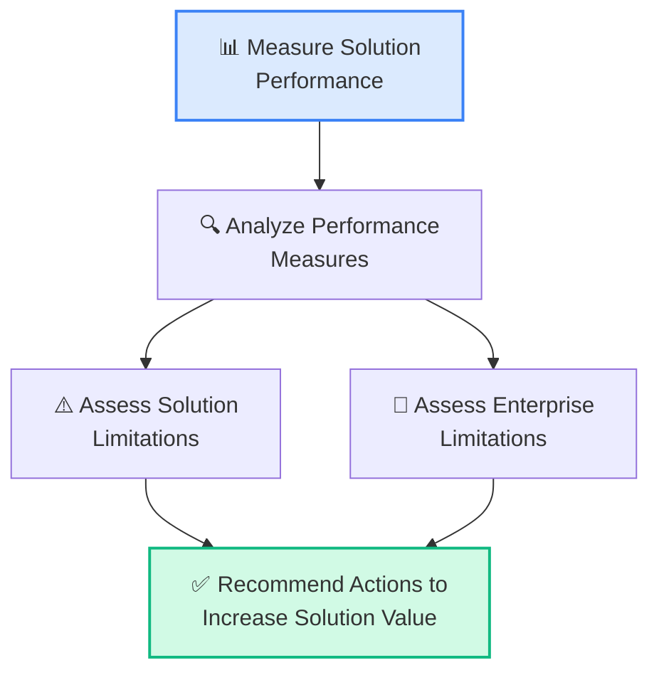
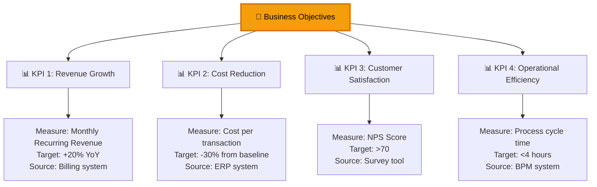
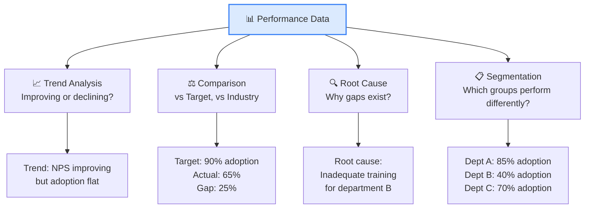
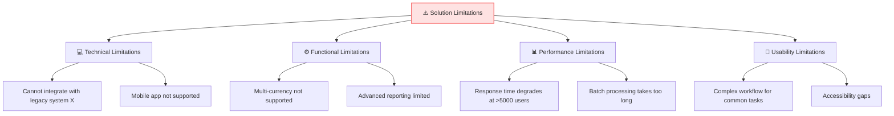
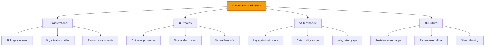
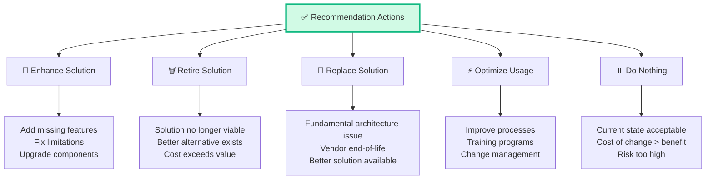
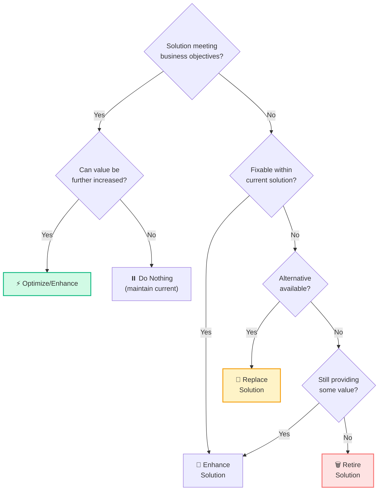
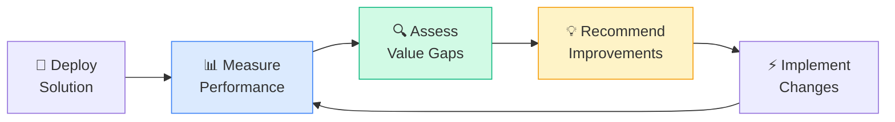

## Solution Evaluation — CBAP Level (14%)

Solution Evaluation chiếm **14%** trong CBAP (tăng đáng kể từ 6% trong CCBA). Đây là KA yêu cầu **strategic evaluation** — đánh giá giải pháp không chỉ ở mức "có hoạt động không" mà ở mức "có tạo ra giá trị enterprise-level không".

### 5 Tasks trong SE

## Task 1: Measure Solution Performance

### KPI Framework Design

### Measurement Design — SMART Metrics

| Element | Description | CBAP Example |
|---------|-----------|-------------|
| **Specific** | Clear what is being measured | "Average order processing time" not "speed" |
| **Measurable** | Quantifiable | "47 minutes" not "fast" |
| **Achievable** | Realistic target | "50% reduction" not "100% reduction" |
| **Relevant** | Connected to business objective | Processing time → customer satisfaction |
| **Time-bound** | When to measure | "By Q4 2026" with monthly tracking |

### Balanced Scorecard for Solution Evaluation

| Perspective | KPI | Baseline | Target | Actual | Status |
|-----------|-----|---------|--------|--------|--------|
| **Financial** | ROI | 0% | 30% | 25% | 🟡 |
| **Customer** | NPS | 45 | 70 | 72 | 🟢 |
| **Process** | Cycle time | 48h | 12h | 8h | 🟢 |
| **Learning** | Adoption rate | 0% | 90% | 65% | 🔴 |

## Task 2: Analyze Performance Measures

### Performance Analysis Framework

### Variance Analysis

| KPI | Target | Actual | Variance | Analysis |
|-----|--------|--------|---------|---------|
| Processing time | 12h | 8h | **+33%** ✅ | Over-performing, possible further optimization |
| Adoption rate | 90% | 65% | **-28%** ❌ | Under-performing, needs intervention |
| Error rate | &lt;2% | 3.5% | **-43%** ❌ | Process issue, needs root cause analysis |
| Cost savings | $200K | $180K | **-10%** 🟡 | Close to target, monitor |

<Callout type="info" title="CBAP: Analysis vs Measurement">
**Measurement** = collecting data. **Analysis** = interpreting data to make decisions. CBAP tests **analysis** — "Given these metrics, what does it tell us? What should BA recommend?"
</Callout>

## Task 3: Assess Solution Limitations

### Solution Limitations Assessment

### Limitation Impact Assessment

| Limitation | Affected Stakeholders | Business Impact | Severity | Workaround? |
|-----------|---------------------|----------------|---------|------------|
| No multi-currency | International customers | Revenue loss ~$500K/year | 🔴 High | Manual conversion (costly) |
| Slow at 5000+ users | All users during peak | Productivity loss | 🟡 Medium | Stagger usage times |
| No mobile app | Field sales team | Competitive disadvantage | 🟡 Medium | Mobile browser (poor UX) |
| Complex workflows | New employees | Extended onboarding | 🟢 Low | Training program |

## Task 4: Assess Enterprise Limitations

### Enterprise Limitations — Beyond the Solution

### Solution vs Enterprise Limitations

| Issue | Solution Limitation? | Enterprise Limitation? | BA Action |
|------|:---:|:---:|---------|
| System can't handle 10K users | ✅ | | Spec upgrade requirement |
| Users don't use the system | | ✅ | Change management |
| Data is inaccurate | | ✅ | Data governance program |
| Missing feature X | ✅ | | Enhancement request |
| Teams don't share information | | ✅ | Organizational change |
| System crashes under load | ✅ | | Performance fix |

<Callout type="warning" title="CBAP: Solution vs Enterprise Limitations">
Đây là **điểm khác biệt quan trọng nhất** ở CBAP level. CCBA test solution limitations (hệ thống thiếu gì). CBAP test **enterprise limitations** (tổ chức thiếu gì) — vì giải pháp hoàn hảo cũng thất bại nếu tổ chức chưa ready.
</Callout>

## Task 5: Recommend Actions to Increase Solution Value

### Action Categories

### Decision Framework: What to Recommend

### Benefits Realization Plan

| Benefit | Metric | Baseline | Target | Timeline | Owner | Status |
|--------|--------|---------|--------|---------|-------|--------|
| Revenue growth | MRR | $500K | $600K | Q2 2026 | Sales VP | 🟡 Track |
| Cost reduction | COGS | $300K/mo | $200K/mo | Q3 2026 | Ops Director | 🟢 On track |
| Adoption | Active users | 40% | 90% | Q4 2026 | Change Lead | 🔴 At risk |
| Satisfaction | NPS | 45 | 70 | Q1 2027 | Product Owner | 🟢 On track |

### Continuous Value Optimization

## Câu hỏi CBAP thường gặp về SE

### Scenario 1
> Giải pháp deployed 6 tháng. Revenue tăng 15% (target 20%), nhưng customer satisfaction tăng từ NPS 45 lên 75 (target 70). BA nên:
>
> A. Report as failure (revenue miss)  
> B. **Report balanced view: NPS exceeded, revenue improving — analyze why revenue gap** ✅  
> C. Report as success (NPS exceeded)  
> D. Wait thêm 6 tháng

### Scenario 2
> User adoption chỉ 40% sau 3 tháng triển khai. Technical metrics đều đạt (performance, uptime). BA identify root cause:
>
> A. **Enterprise limitation: lack of change management & training** ✅  
> B. Solution limitation: missing features  
> C. Technical limitation: slow system  
> D. Project failure

### Scenario 3
> Solution 5 năm tuổi, maintenance cost tăng mỗi năm, vendor end-of-life in 2 years. Business value still positive. BA nên:
>
> A. Continue until end-of-life  
> B. **Start planning replacement NOW with transition strategy** ✅  
> C. Negotiate vendor extension  
> D. Build internal replacement

### Scenario 4
> BA phát hiện solution limitations nhưng cũng find enterprise limitations. BA nên address nào trước?
>
> A. Solution limitations (easier to fix)  
> B. Enterprise limitations (bigger impact)  
> C. **Both in parallel: solution fixes + organizational changes** ✅  
> D. Let management decide order

<Callout type="success" title="Key takeaway">
Solution Evaluation ở CBAP = **Strategic value assessment** + **Enterprise-level analysis** + **Continuous optimization**. BA không chỉ đo "hệ thống có chạy không" mà đo "tổ chức có nhận được VALUE không". Và khi value thiếu, phân biệt rõ: do solution hay do enterprise.
</Callout>

## 📝 Tóm tắt kiến thức nổi bật

<Callout type="success" title="Key Takeaways — Bài 10">
- Solution Evaluation chiếm **14%** CBAP — significant increase from CCBA (6%)
- **5 Tasks SE**: Measure Solution Performance → Analyze Performance Measures → Assess Solution Limitations → Assess Enterprise Limitations → Recommend Actions
- **Solution Performance** = actual value delivered vs expected value (KPIs, metrics, Balanced Scorecard)
- **Solution Limitations** = issues within the solution itself (bugs, usability, performance bottlenecks)
- **Enterprise Limitations** = issues in the organization preventing solution success (culture, process, skills gap)
- **Recommend Actions**: Replace, Improve, Retire, Do Nothing — phải justify với ROI và strategic alignment
- **Balanced Scorecard**: Financial + Customer + Internal Process + Learning & Growth — 4 perspectives evaluation
- CBAP: BA proactively identifies improvement opportunities, not just reports problems
</Callout>

---

## 📋 Bài kiểm tra trắc nghiệm — Bài 10

<Callout type="info" title="Hướng dẫn làm bài">
Làm **10 câu** bên dưới trong **17 phút**. Chọn MỘT đáp án đúng nhất.
</Callout>

**Câu 1.** Solution deployed 6 months ago. KPI: "Reduce order processing time from 48h to 24h." Measured: 36h. Assessment:

- A. Solution thành công hoàn toàn
- B. Partial success — improved 25% nhưng chưa đạt target 50% improvement. BA should investigate root causes of remaining gap
- C. Solution thất bại — cần replace
- D. KPI sai — cần thay đổi target

**Câu 2.** User satisfaction survey shows 65% satisfaction (target: 80%). Investigation reveals users struggle with UI. This is:

- A. Enterprise limitation
- B. Solution limitation — product usability issue within the solution itself
- C. External market factor
- D. Training issue only

**Câu 3.** Same scenario, but investigation reveals users weren't trained properly despite training being planned. This is:

- A. Solution limitation
- B. Enterprise limitation — organizational failure to execute training plan
- C. Vendor issue
- D. Budget issue

**Câu 4.** Balanced Scorecard evaluates solution from 4 perspectives. A reporting dashboard shows high usage (Internal Process), good adoption (Learning & Growth), revenue increase (Financial), but customer complaints increase. Conclusion:

- A. Solution is successful — 3 of 4 positive
- B. Customer perspective failing — BA must investigate complaints, which may undermine long-term financial gains
- C. Ignore complaints
- D. Replace solution immediately

**Câu 5.** Solution recommendation options: Replace, Improve, Retire, Do Nothing. When is "Do Nothing" appropriate?

- A. Never appropriate
- B. When cost of change exceeds benefit, solution is meeting minimum requirements, and no strategic driver for improvement
- C. When stakeholders are busy
- D. When budget is available

**Câu 6.** Enterprise deploys new ERP. 3 months later, Finance team uses ERP but Sales team still uses Excel. Root cause analysis:

- A. ERP doesn't have Sales features
- B. Change management failure — Sales team resistance, likely due to insufficient stakeholder engagement and change readiness assessment
- C. Budget issue
- D. Technical incompatibility

**Câu 7.** BA recommends "Improve" for existing solution. What should the recommendation include?

- A. Just "improve it"
- B. Specific improvement areas, estimated cost, expected value improvement, timeline, risks, and comparison with Replace/Retire alternatives
- C. Only cost estimate
- D. Only technical changes

**Câu 8.** Solution has high operational costs but delivers strong strategic value. Recommendation assessment:

- A. Retire immediately — too expensive
- B. Analyze total value (strategic + operational) — high costs may be justified if strategic value significantly outweighs them. Consider optimization to reduce costs while maintaining value
- C. Ignore costs
- D. Replace with cheaper solution

**Câu 9.** Measuring solution performance: BA selects metrics but realizes some KPIs measure output (reports generated) not outcome (decisions improved). CBAP-level approach:

- A. Output metrics are sufficient
- B. Shift focus to outcome metrics — measure actual business impact (decision quality, time-to-decision, revenue from better decisions)
- C. Use both equally
- D. Remove all metrics

**Câu 10.** Post-implementation review reveals solution meets all original requirements but business environment changed significantly. Market shifted. Best approach:

- A. Solution is successful because it meets requirements
- B. Requirements were correct at the time but are now outdated — reassess solution value against CURRENT business needs, potentially triggering new initiative
- C. Blame requirements team
- D. Continue as planned

---

### 🔑 Đáp án & Giải thích

| Câu | Đáp án | Giải thích |
|:---:|:------:|-----------|
| 1 | **B** | 36h vs target 24h: improved but gap remains. Investigate root causes like process bottlenecks or integration issues. |
| 2 | **B** | UI usability = solution limitation — issue within the product itself. |
| 3 | **B** | Training not executed = enterprise limitation — organizational execution failure. |
| 4 | **B** | BSC requires ALL 4 perspectives. Customer complaints threaten long-term sustainability. |
| 5 | **B** | "Do Nothing" is valid when improvement cost > benefit and minimum needs are met. |
| 6 | **B** | Adoption failure = change management issue. Technical solution works but people don't adopt. |
| 7 | **B** | Complete recommendation: what, how much, expected value, timeline, risks, alternatives comparison. |
| 8 | **B** | Total value analysis. Strategic value may justify operational costs. Optimize if possible. |
| 9 | **B** | CBAP level: outcome metrics > output metrics. Measure actual business impact. |
| 10 | **B** | Requirements met ≠ value delivered. Business context changed → reassess against current needs. |

### 📊 Thang đánh giá

| Số câu đúng | Đánh giá | Hành động |
|:-----------:|---------|-----------|
| 9-10 | ⭐ Xuất sắc | Solution Evaluation strategic thinking excellent! |
| 7-8 | ✅ Tốt | Ôn lại BSC 4 perspectives và Solution vs Enterprise limitations |
| 5-6 | ⚠️ Trung bình | SE 14% — cần nắm vững outcome vs output metrics |
| < 5 | ❌ Cần ôn lại | Re-study SE tasks và recommendation framework |

---

*Tiếp theo: BA Perspectives — Agile, BI, IT & Architecture 👉*
