## 5 BA Perspectives — Trọng tâm CBAP

BABOK v3 define 5 **Perspectives** — mỗi perspective là một "lens" (góc nhìn) mà BA sử dụng để thực hiện công việc. Mỗi perspective ảnh hưởng đến cách BA thực hiện các task trong 6 Knowledge Areas.

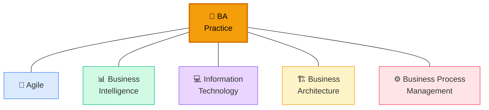

## 1. Agile Perspective 🔄

### BA trong Agile Context

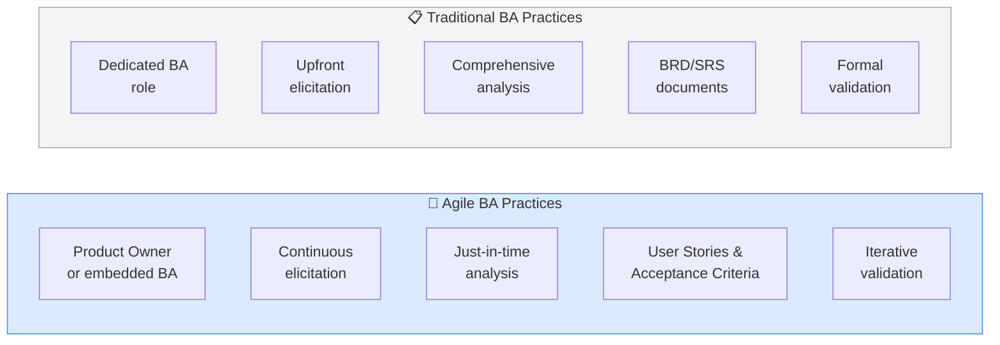

### Agile vs Predictive: KA Impact

| Knowledge Area | Predictive Approach | Agile Approach |
|---------------|-------------------|---------------|
| **BAPM** | Detailed BA plan upfront | Adaptive planning, retrospectives |
| **E&C** | Formal interviews, workshops | Daily collaboration, demos |
| **RLCM** | Formal change control | Backlog grooming, sprint planning |
| **SA** | Comprehensive business case | Vision, MVP definition |
| **RADD** | Full BRD/SRS | User stories, spikes, prototypes |
| **SE** | Post-deployment evaluation | Sprint reviews, continuous feedback |

### User Story Format

```
As a [role/persona]
I want to [action/capability]
So that [business value/outcome]
```

**Acceptance Criteria (Given-When-Then):**

```
Given [precondition/context]
When [action/trigger]
Then [expected outcome]
```

**CBAP-level User Story Splitting:**

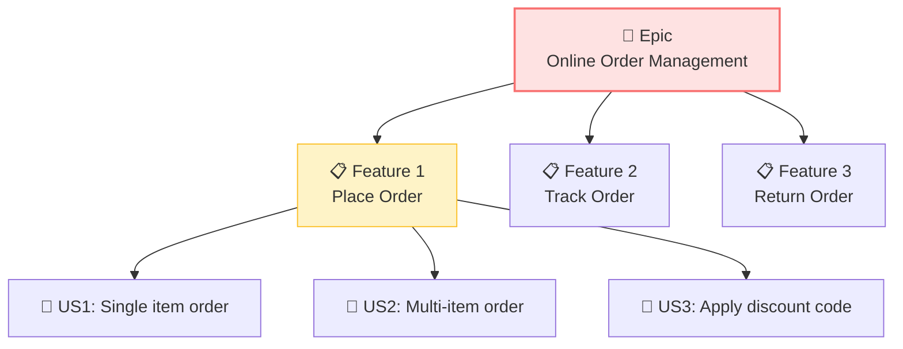

### Agile Frameworks & BA Role

| Framework | BA Role | Key Activities |
|----------|---------|---------------|
| **Scrum** | Product Owner or BA in Scrum Team | Backlog management, sprint planning, demos |
| **Kanban** | BA in flow | Continuous analysis, WIP limit management |
| **SAFe** | Product Owner (team) or Product Manager (portfolio) | PI Planning, feature definition, enablers |
| **XP** | On-site customer representative | User stories, acceptance tests |

<Callout type="info" title="CBAP: When NOT to use Agile">
CBAP test judgment: khi nào Agile **không** phù hợp? Regulatory (cần formal documentation), Safety-critical (cần upfront analysis), Fixed-scope contracts (limited flexibility), Distributed teams with time zone challenges.
</Callout>

## 2. Business Intelligence Perspective 📊

### BA trong BI Context

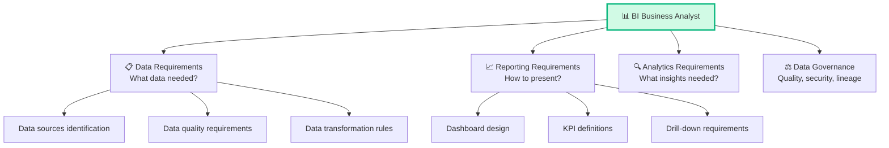

### BI Architecture Layers

```mermaid
graph LR
    subgraph Sources["📥 Data Sources"]
        S1["ERP"]
        S2["CRM"]
        S3["External APIs"]
    end

    subgraph Integration["🔄 Integration"]
        ETL["ETL/ELT\nProcessing"]
    end

    subgraph Storage["💾 Data Storage"]
        DW["Data\nWarehouse"]
        DL["Data\nLake"]
    end

    subgraph Analytics["📊 Analytics"]
        OLAP["OLAP\nCubes"]
        ML["ML/AI\nModels"]
    end

    subgraph Presentation["📈 Presentation"]
        DASH["Dashboards"]
        REPORT["Reports"]
        SELF["Self-service\nAnalytics"]
    end

    Sources --> Integration --> Storage --> Analytics --> Presentation

    style Integration fill:#DBEAFE,stroke:#3B82F6,color:#333
    style Storage fill:#D1FAE5,stroke:#10B981,color:#333
```

### BI KA Impact

| Knowledge Area | BI Perspective Application |
|---------------|--------------------------|
| **BAPM** | Plan data analysis approach, data governance |
| **E&C** | Elicit data needs from analysts and executives |
| **RLCM** | Manage evolving analytical requirements |
| **SA** | Data-driven current/future state analysis |
| **RADD** | Data models, ETL specs, dashboard wireframes |
| **SE** | Measure analytics adoption, data quality metrics |

## 3. Information Technology Perspective 💻

### BA trong IT Context

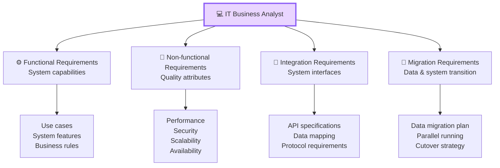

### IT BA vs Business BA

| Aspect | IT BA | Business BA |
|--------|------|-----------|
| **Primary stakeholders** | Dev team, Architects, QA | Business users, Executives |
| **Deliverables** | SRS, Use Cases, Data Models | BRD, Process Flows, Business Cases |
| **Language** | Technical specifications | Business language |
| **Focus** | How to implement | What to implement |
| **KA Weight** | Heavy on RADD | Balanced across all KAs |

### System Context Diagram

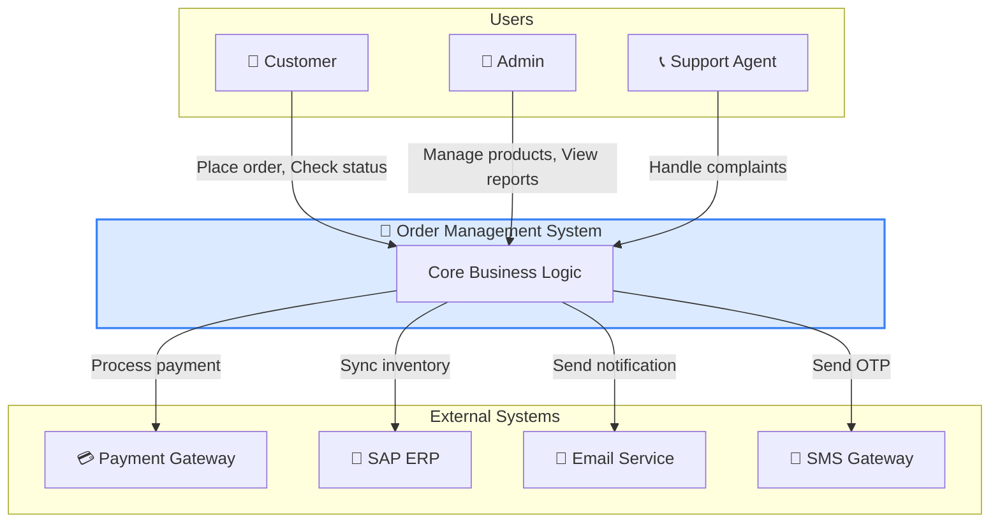

## 4. Business Architecture Perspective 🏗️

### Enterprise-Level BA

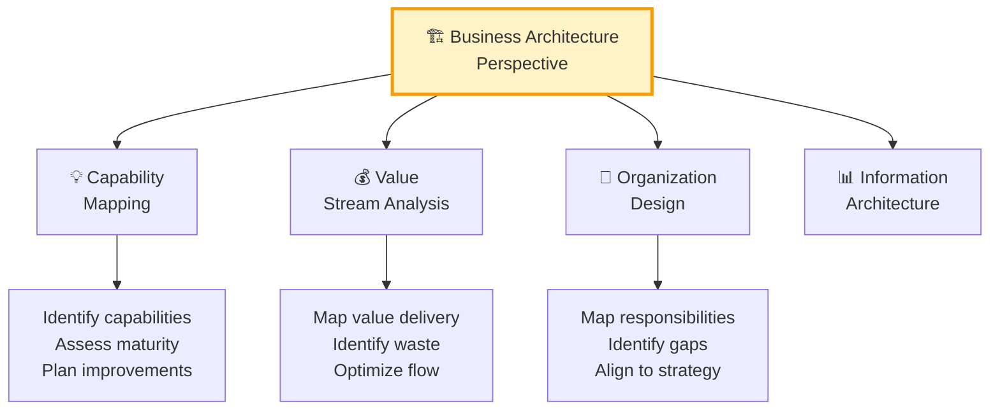

### Capability Map Example

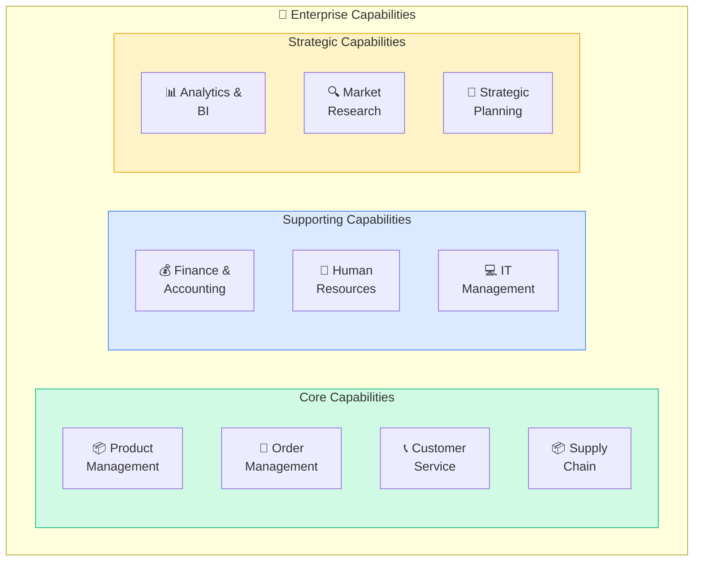

### Value Stream Mapping

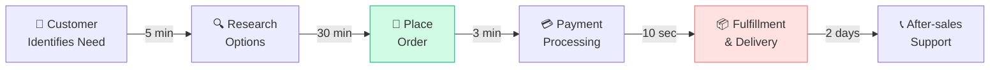

<Callout type="tip" title="Business Architecture = CBAP differentiator">
Business Architecture perspective là **most strategic** perspective. CBAP test khả năng think at **enterprise level**: không chỉ 1 project, mà cả portfolio. Hiểu capability mapping, value streams, và enterprise strategy alignment.
</Callout>

## 5. Business Process Management Perspective ⚙️

### BPM Lifecycle

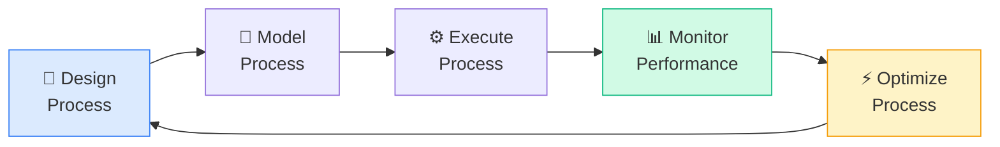

### Process Improvement Methodologies

| Methodology | Focus | BA Application |
|-----------|-------|---------------|
| **Lean** | Eliminate waste | Value stream mapping, identify non-value-add steps |
| **Six Sigma** | Reduce variation | DMAIC (Define, Measure, Analyze, Improve, Control) |
| **Lean Six Sigma** | Combine both | Fast waste elimination + quality improvement |
| **BPR** | Radical redesign | Rethink entire process from scratch |
| **Kaizen** | Continuous small improvements | Incremental process optimization |

### Process Automation Decision

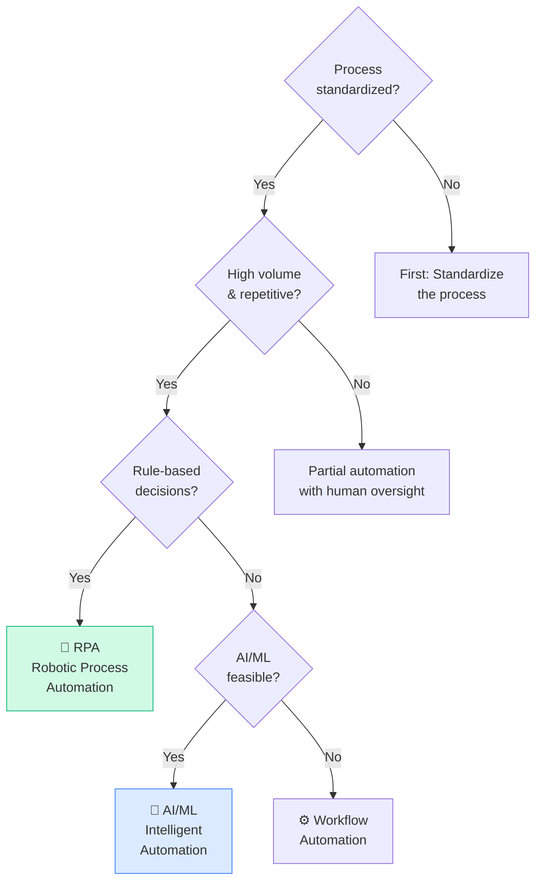

## Cross-Perspective Comparison

### How Perspectives Affect BA Deliverables

| Deliverable | Agile | BI | IT | Architecture | BPM |
|------------|:-----:|:--:|:--:|:----------:|:---:|
| **Business Case** | Lean Canvas | Data-driven ROI | Technical feasibility | Capability assessment | Process ROI |
| **Requirements** | User Stories | Data specs | SRS | Capability requirements | Process specs |
| **Models** | Story maps | Data models | System diagrams | Capability maps | BPMN diagrams |
| **Validation** | Sprint demo | Dashboard review | UAT | Strategic alignment | Process simulation |
| **Evaluation** | Velocity/burnup | Analytics adoption | System performance | Capability maturity | Process KPIs |

## Câu hỏi CBAP thường gặp về Perspectives

### Scenario 1
> Organization bắt đầu Agile transformation. BA vẫn produce detailed BRD. BA nên:
>
> A. Continue BRD (proven method)  
> B. **Adapt to Agile: user stories, continuous collaboration, just-in-time analysis** ✅  
> C. Produce both BRD and user stories  
> D. Let Scrum Master handle requirements

### Scenario 2
> CEO muốn "data-driven decision making". Currently, reports are manual Excel. BA nên:
>
> A. Build custom dashboards  
> B. **BI perspective: assess data maturity, define data strategy, then solution** ✅  
> C. Buy BI tool immediately  
> D. Hire data analysts

### Scenario 3
> Enterprise has 20 departments each with unique processes for the same business function. BA nên:
>
> A. Document all 20 processes  
> B. **Business Architecture: map capabilities, identify common patterns, standardize** ✅  
> C. Let each department continue  
> D. Force one process on all

<Callout type="success" title="Key takeaway">
Perspectives guide HOW to apply BA practices. CBAP BA phải biết **chọn đúng perspective** based on context — và thường kết hợp nhiều perspectives. Ví dụ: IT + Agile cho software projects, Architecture + BPM cho enterprise transformation.
</Callout>

## 📝 Tóm tắt kiến thức nổi bật

<Callout type="success" title="Key Takeaways — Bài 11">
- **5 Perspectives**: Agile, Business Intelligence (BI), Information Technology (IT), Business Architecture (BA), Business Process Management (BPM)
- Mỗi Perspective ảnh hưởng cách thực hiện **tất cả 6 KAs** — không phải KA riêng biệt
- **Agile**: Iterative, user stories, backlog, continuous delivery, collaborative, adaptive planning
- **BI**: Data-centric, analytics, reporting, data warehousing, ETL, data quality, dashboards
- **IT**: Systems-focused, architecture, integration, security, infrastructure, SDLC
- **Business Architecture**: Enterprise-level modeling, value streams, capability maps, strategic alignment
- **BPM**: Process-oriented, BPMN, process optimization, automation, continuous improvement
- CBAP combines perspectives — real projects use 2-3 perspectives simultaneously
- Perspective selection depends on: project type, organizational context, stakeholder focus, solution nature
</Callout>

---

## 📋 Bài kiểm tra trắc nghiệm — Bài 11

<Callout type="info" title="Hướng dẫn làm bài">
Làm **10 câu** bên dưới trong **17 phút**. Chọn MỘT đáp án đúng nhất.
</Callout>

**Câu 1.** Project: Build real-time customer analytics dashboard. Primary perspective:

- A. BPM — focus on processes
- B. Business Intelligence — data-centric, analytics, dashboards, reporting
- C. IT — systems only
- D. Agile — always in sprints

**Câu 2.** Organization wants to map all business capabilities to identify redundancies across 5 divisions. Best perspective:

- A. Agile
- B. IT
- C. Business Architecture — enterprise capability mapping, value streams, strategic alignment
- D. BI

**Câu 3.** BA on Agile project adds user stories to backlog. When does Requirements Analysis happen?

- A. Big upfront phase before Sprint 1
- B. Continuously — requirements are elaborated just-in-time, refined in backlog grooming, analyzed during sprint planning
- C. Never in Agile
- D. Only at the end

**Câu 4.** Project needs: automated loan approval process + data analytics on approval rates. Perspectives needed:

- A. Only BPM
- B. BPM (process automation) + BI (analytics and reporting) — combined perspectives
- C. Only IT
- D. Only Agile

**Câu 5.** IT Perspective: BA specifying requirements for API integration between 3 systems. Critical modeling technique:

- A. Value Stream Map
- B. Interface/Integration Diagram — showing systems, APIs, data flows, protocols, error handling
- C. User Story Map
- D. Capability Map

**Câu 6.** BPM Perspective: BA identifies process step taking 5 days that could be automated to 2 hours. This is:

- A. Requirements elicitation finding
- B. Process optimization opportunity — BPM perspective identifies waste, bottlenecks, automation candidates for continuous improvement
- C. Bug report
- D. Training issue

**Câu 7.** Enterprise has 3 projects: (1) Migrate to cloud, (2) Build customer loyalty program, (3) Optimize supply chain. Respective primary perspectives:

- A. All Agile
- B. (1) IT — infrastructure/architecture, (2) BI + Agile — analytics + iterative delivery, (3) BPM — process optimization
- C. All BPM
- D. All Business Architecture

**Câu 8.** BA using Business Architecture perspective creates Value Stream Map. This helps:

- A. Debug code
- B. Visualize end-to-end value delivery, identify which stages add value vs waste, align initiatives to strategic capabilities
- C. Track sprints
- D. Monitor servers

**Câu 9.** Agile perspective: Product Owner and BA disagree on story priority. BA should:

- A. BA decides — always
- B. Facilitate discussion using value vs complexity analysis, present data-driven prioritization, but PO has final decision on backlog priority
- C. Escalate to management
- D. Remove stories from backlog

**Câu 10.** Project started with IT perspective (system migration). During analysis, BA discovers significant process changes needed. What should change?

- A. Ignore process changes — scope is IT only
- B. Expand to include BPM perspective — system migration that changes processes needs both IT and BPM to ensure successful adoption
- C. Cancel project
- D. Start over with BPM only

---

### 🔑 Đáp án & Giải thích

| Câu | Đáp án | Giải thích |
|:---:|:------:|-----------|
| 1 | **B** | Analytics dashboard = BI perspective — data, metrics, reporting, visualization. |
| 2 | **C** | Enterprise capability mapping = Business Architecture perspective. |
| 3 | **B** | Agile = continuous, just-in-time analysis. No big upfront phase. |
| 4 | **B** | Process automation (BPM) + data analytics (BI) = combined perspectives. |
| 5 | **B** | API integration → Interface/Integration Diagram showing system connections. |
| 6 | **B** | BPM identifies optimization opportunities — eliminate waste, automate. |
| 7 | **B** | Match perspective to project nature: cloud=IT, loyalty+analytics=BI+Agile, supply chain=BPM. |
| 8 | **B** | Value Stream Map = end-to-end value delivery visualization. |
| 9 | **B** | BA facilitates with data; PO owns backlog priority in Agile. |
| 10 | **B** | Expanding perspectives when project scope evolves — IT + BPM combined. |

### 📊 Thang đánh giá

| Số câu đúng | Đánh giá | Hành động |
|:-----------:|---------|-----------|
| 9-10 | ⭐ Xuất sắc | Perspectives mastery — biết khi nào dùng perspective nào! |
| 7-8 | ✅ Tốt | Ôn lại combined perspectives scenarios |
| 5-6 | ⚠️ Trung bình | Cần phân biệt rõ 5 perspectives và khi nào combine |
| < 5 | ❌ Cần ôn lại | Re-study each perspective's focus area |

---

*Tiếp theo: Chiến lược thi CBAP — Case Study & Tips thực chiến 👉*
