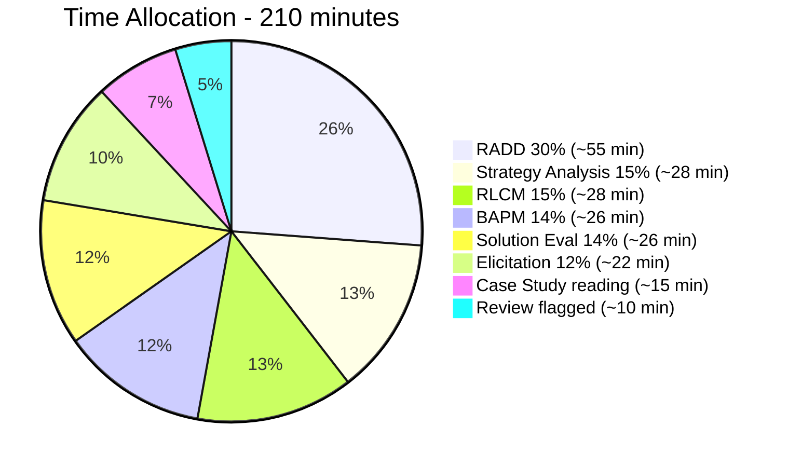
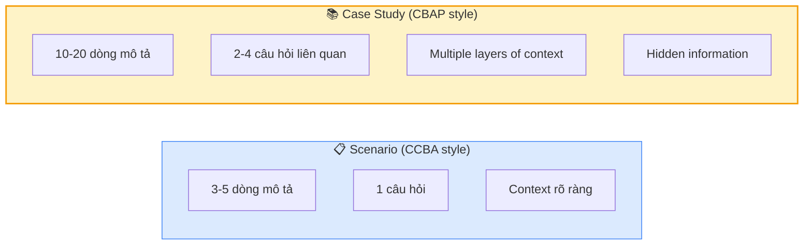
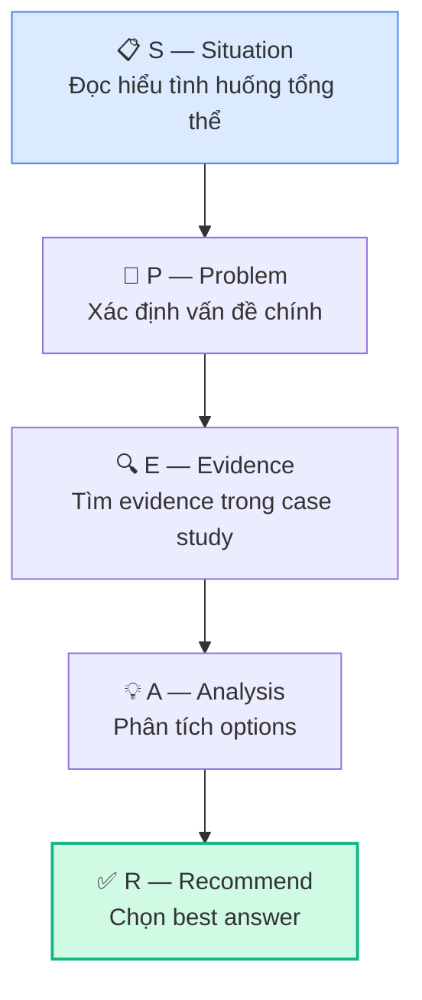
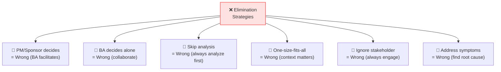

## Chiến lược tổng thể cho kỳ thi CBAP

### Thông số đề thi

| Thông số | Chi tiết |
|---------|---------|
| Số câu | 120 câu multiple choice |
| Thời gian | 210 phút (3.5 giờ) |
| Thời gian/câu | ~1.75 phút/câu |
| Dạng câu | Case study + Scenario-based |
| Pass/Fail | Không công bố điểm, chỉ Pass/Fail |
| Mức tư duy | Analysis & Synthesis (Bloom's higher levels) |

### So sánh với CCBA

| Aspect | CCBA | CBAP |
|--------|------|------|
| Số câu | 130 | 120 |
| Thời gian | 3h (1.4 min/câu) | 3.5h (1.75 min/câu) |
| Dạng câu | Scenario | Case study + Scenario |
| Tư duy | Application | Analysis & Synthesis |
| Câu hỏi | "BA nên làm gì?" | "Tại sao? Trade-offs?" |
| Trick level | Medium | High |

### Phân bổ thời gian

## Kỹ thuật giải Case Study

### Case Study vs Scenario

### Framework giải Case Study: SPEAR

### Step-by-step Case Study Approach

**Step 1: Quick Scan (30 giây)**
- Đọc lướt case study → nắm context tổng thể
- Identify: Industry? Organization size? Current situation?

**Step 2: Read Questions First (15 giây/câu)**
- Đọc TẤT CẢ câu hỏi liên quan đến case study
- Biết cần tìm thông tin gì

**Step 3: Deep Read (60 giây)**
- Đọc kỹ case study với lens từ câu hỏi
- Highlight keywords: stakeholders, problems, constraints, objectives

**Step 4: Answer (30 giây/câu)**
- Match evidence từ case study → answer options
- Eliminate wrong answers first

### Case Study Ví dụ

> **Case Study: TechFlow Solutions**
>
> TechFlow Solutions là công ty SaaS với 500 nhân viên, cung cấp HR management platform cho 2,000 khách hàng SMB. Revenue $50M/năm, tăng trưởng 15% YoY.
>
> Gần đây, churn rate tăng từ 5% lên 12%. Customer surveys cho thấy: (1) UI cũ kỹ, (2) thiếu mobile app, (3) reporting hạn chế. Competitor mới ra mắt product với AI-powered analytics.
>
> CEO muốn "digital transformation" nhưng CTO lo ngại vì technical debt lớn — 60% codebase là monolith 8 năm tuổi. CFO muốn giữ EBITDA margin >20%.
>
> BA team gồm 3 người, đang dùng predictive approach. Development team 30 engineers, mới bắt đầu học Agile.

**Câu 1 (Strategy Analysis):**
> Với current state trên, điều gì BA nên analyze FIRST?
>
> A. Competitor product features  
> B. **Root cause analysis — tại sao churn tăng, beyond survey results** ✅  
> C. Technology options for modernization  
> D. Budget for digital transformation

**Giải thích:** Trước khi jump vào solutions, BA cần understand DEEP root cause. Survey cho 3 reasons nhưng đó là **symptoms**. Root cause có thể deeper — ví dụ: product-market fit shift, onboarding issues, competitor pricing...

**Câu 2 (BAPM):**
> Team đang dùng predictive approach, dev team mới bắt đầu Agile. BA approach nào phù hợp?
>
> A. Full Agile ngay  
> B. Giữ predictive  
> C. **Hybrid: predictive cho strategy/planning, adaptive cho feature delivery** ✅  
> D. Agile cho features mới, predictive cho legacy

**Giải thích:** Team chưa mature trong Agile → full Agile rủi ro cao. Nhưng predictive không phù hợp cho market đang thay đổi nhanh. Hybrid balance cả hai.

**Câu 3 (RADD):**
> CFO yêu cầu "giữ EBITDA >20%". Constraint này ảnh hưởng đến RADD như thế nào?
>
> A. Không ảnh hưởng — RADD chỉ về requirements  
> B. **Ảnh hưởng solution scope & design options — phải optimize cost** ✅  
> C. Chỉ ảnh hưởng Strategy Analysis  
> D. Ảnh hưởng prioritization only

**Câu 4 (Solution Evaluation):**
> Sau 12 tháng, churn giảm từ 12% xuống 8% (target 5%), mobile app adoption 60%, NPS tăng từ 30 lên 55. BA nên:
>
> A. Report failure  
> B. Report success  
> C. **Report mixed results: trend positive, analyze remaining gap, recommend next actions** ✅  
> D. Request more budget

## CBAP-specific Question Patterns

### Pattern 1: "BEST" questions (Analysis level)

> "What is the BEST approach for BA in this situation?"

**Trick:** Tất cả 4 options đều "đúng" ở một mức nào đó. Cần chọn **most comprehensive** và **most strategic** answer.

### Pattern 2: "WHY" questions (Synthesis level)

> "Why should BA choose approach X over approach Y?"

**Trick:** Test khả năng giải thích **rationale**, không chỉ biết answer.

### Pattern 3: "PRIORITY" questions (Evaluation level)

> "Given limited resources, which should BA prioritize?"

**Trick:** Test khả năng evaluate trade-offs và make **value-based decisions**.

### Pattern 4: Hidden Information questions

> Case study mention "team mới bắt đầu Agile" → Don't choose option requiring mature Agile practice

**Trick:** Thông tin quan trọng thường **embedded** trong case study, không highlight.

## Elimination Strategies — CBAP Level

### CBAP Green Flags ✅

- "Analyze first, then recommend"
- "Facilitate stakeholder consensus"
- "Assess impact across enterprise"
- "Consider trade-offs"
- "Present options with evidence"
- "Strategic alignment check"
- "Value-based prioritization"
- "Root cause, not symptoms"

## Đề thi thử nâng cao — 10 câu Case Study

### Case Study: Global Manufacturing Corp (GMC)

> GMC sản xuất electronics, 10,000 nhân viên, 5 nhà máy ở 3 quốc gia. Revenue $2B. Đang dùng SAP ERP (on-premise, version cũ), Excel-based reporting. Mỗi nhà máy có quy trình riêng cho cùng một business function. IT department 200 người, skill gap trong cloud & modern technologies. Board approved $50M cho "Industry 4.0" initiative.

**Câu 1:** BA approach nào phù hợp cho initiative này?
> A. Pure Agile with 2-week sprints  
> B. Pure Waterfall with detailed BRD  
> C. **Hybrid: Predictive for enterprise architecture, Adaptive for component delivery** ✅  
> D. Let each factory choose own approach

**Câu 2:** Perspective nào BA nên áp dụng PRIMARY?
> A. Agile Perspective  
> B. IT Perspective  
> C. BPM Perspective  
> D. **Business Architecture Perspective** ✅

**Câu 3:** "Mỗi nhà máy có quy trình riêng" — đây là dạng limitation gì?
> A. Solution limitation  
> B. **Enterprise limitation — organizational silos** ✅  
> C. Technology limitation  
> D. Resource limitation

**Câu 4:** Với $50M budget, BA nên recommend cách nào?
> A. Replace entire SAP  
> B. Keep SAP, add IoT layer  
> C. **Phase 1: Standardize processes + Cloud migration. Phase 2: IoT + Analytics** ✅  
> D. Buy new modern ERP

**Câu 5:** Skill gap trong IT là risk. Response strategy nào phù hợp?
> A. **Mitigate: Training program + strategic hiring + partner with consulting firm** ✅  
> B. Accept: Use current team as-is  
> C. Transfer: Outsource 100% to vendor  
> D. Avoid: Don't adopt cloud

**Câu 6:** Traceability challenge khi 5 factories, 3 countries. BA nên:
> A. Separate traceability per factory  
> B. **Enterprise-wide traceability matrix linking business objectives → capabilities → requirements → tests across all factories** ✅  
> C. Let each factory manage own  
> D. Only trace at business objective level

**Câu 7:** CFO hỏi "ROI khi nào đạt?" — BA cần analysis gì?
> A. Simple ROI calculation  
> B. **NPV analysis with phased cash flows, sensitivity analysis for key assumptions** ✅  
> C. Payback period only  
> D. Compare with industry benchmarks

**Câu 8:** Sau Phase 1 complete, adoption ở 3 factories cao (80%+) nhưng 2 factories ở quốc gia khác chỉ 30%. BA nên:
> A. Force adoption  
> B. Skip low-adoption factories  
> C. **Assess root cause: culture? language? training? local regulations?** ✅  
> D. Extend timeline

**Câu 9:** Board muốn add AI/ML component nhưng current data quality poor. BA nên:
> A. Start AI/ML project anyway  
> B. **Recommend data governance program as prerequisite, then AI/ML** ✅  
> C. Buy AI/ML tool immediate  
> D. Reject AI/ML idea

**Câu 10:** Measure "Industry 4.0" success — KPIs nào comprehensive nhất?
> A. ROI and cost savings only  
> B. OEE (Overall Equipment Effectiveness) only  
> C. **Balanced Scorecard: Financial (ROI), Process (OEE), Customer (quality), Learning (adoption, skill development)** ✅  
> D. Employee satisfaction survey

## 15 Tips vàng cho CBAP

1. **Đọc BABOK 2+ lần** — không có shortcut
2. **Hiểu WHY, không chỉ WHAT** — CBAP test reasoning
3. **Case study: context is king** — mọi thông tin đều có ý nghĩa
4. **Root cause over symptoms** — always dig deeper
5. **BA facilitates, doesn't decide** — even at senior level
6. **Enterprise thinking** — beyond project scope
7. **Trade-offs are expected** — no perfect answer
8. **"Do Nothing" is valid** — always consider status quo
9. **Financial analysis matters** — NPV, ROI, Payback
10. **Perspectives guide approach** — match perspective to context
11. **Verify ≠ Validate** — know the difference cold
12. **Solution vs Enterprise limitations** — critical distinction
13. **Change management awareness** — BA isn't Change Manager
14. **Traceability end-to-end** — BR → SR → FR → TC
15. **Practice with case studies** — not just individual questions

## Checklist trước ngày thi

- [ ] Đọc BABOK Guide v3 ít nhất 2 lần
- [ ] Hoàn thành 12 bài trong series này
- [ ] Làm ít nhất 3 bộ đề thử đầy đủ (120 câu)
- [ ] Đạt >75% consistently trong practice exams
- [ ] Nắm vững 5 Perspectives và khi nào apply
- [ ] Hiểu 30 Tasks: Input → Task → Output
- [ ] Thành thạo 50 Techniques theo context
- [ ] Có thể giải thích WHY cho mọi answer
- [ ] "Case study mindset" → tìm hidden information
- [ ] Kiểm tra logistics (online procs / test center)
- [ ] Ngủ đủ giấc, tinh thần thoải mái

## 📝 Tóm tắt kiến thức nổi bật

<Callout type="success" title="Key Takeaways — Bài 12">
- **120 câu / 3.5 giờ** → ~1.75 phút/câu. Time management là critical skill
- **Case Study format**: Đọc scenario → xác định KA → áp dụng concept → chọn đáp án best
- **Eliminate distractors**: Loại 2 đáp án sai rõ → focus 2 còn lại → chọn MOST appropriate
- **Keyword spotting**: "FIRST," "BEST," "MOST likely," "NEXT step" → mỗi keyword đòi hỏi tư duy khác
- **KA Distribution**: RADD 30% > Strategy Analysis 19% > BA Planning 14% = SE 14% > Elicitation 12% > RLM 11%
- **Common traps**: Over-reading scenarios, rushing through case studies, changing answers without reason
- **Day-of strategy**: Chia 120 câu thành 4 blocks × 30 câu, review flagged câu cuối mỗi block
- Master cả 5 Perspectives — câu hỏi có thể kết hợp perspective với KA bất kỳ
</Callout>

---

## 📋 Bài kiểm tra trắc nghiệm — Bài 12

<Callout type="info" title="Hướng dẫn làm bài">
Làm **10 câu** bên dưới trong **17 phút**. Đây là câu hỏi tổng hợp cross-KA, simulation đề thi thật.
</Callout>

**Câu 1.** Case Study: Large bank wants to replace core banking system. 200 stakeholders across 8 departments. BA's FIRST step:

- A. Start writing requirements immediately
- B. Plan BA approach — identify stakeholders, define governance, select elicitation strategy, plan communication
- C. Build prototype
- D. Conduct user acceptance testing

**Câu 2.** During elicitation workshop, VP of Sales and VP of Operations have conflicting requirements about order priority logic. BA's BEST response:

- A. Choose the VP with higher authority
- B. Document both perspectives, facilitate analysis of business impact of each approach, escalate with data-driven recommendation if unresolved
- C. Postpone indefinitely
- D. Average both requirements

**Câu 3.** BA discovers approved requirement "System must process 1000 orders/second" contradicts infrastructure constraint of max 500/second. NEXT step:

- A. Ignore constraint
- B. Raise to stakeholders — present gap, evaluate options (infrastructure upgrade, requirement revision, phased approach), get decision with impact analysis
- C. Delete requirement
- D. Change infrastructure without approval

**Câu 4.** Post-implementation: Solution meets all functional requirements but users report 40% adoption rate. Root cause analysis reveals poor change management. This is:

- A. Solution limitation
- B. Enterprise limitation — organizational readiness and change management failure
- C. Vendor problem
- D. Technical defect

**Câu 5.** Project uses Agile + BI perspectives. Sprint 5 review reveals analytics dashboard shows wrong calculations. BA should:

- A. Fix in next release
- B. Prioritize as high-severity defect — analytics errors destroy trust in BI solutions, impacting decision-making across organization
- C. Add to backlog bottom
- D. Ignore — cosmetic issue

**Câu 6.** Strategy Analysis: Business case shows NPV = $5M but requires organizational restructuring. 3 department heads resist. BEST approach:

- A. Force restructuring — NPV justifies it
- B. Address resistance through stakeholder engagement, present benefits per department, develop transition plan with support, consider phased approach to reduce disruption
- C. Cancel project
- D. Skip restructuring

**Câu 7.** RADD: BA created comprehensive requirements package (150 requirements, 20 models). Stakeholder says "I need to see the big picture, not details." BA should:

- A. Send all 150 requirements
- B. Create executive-level Requirements Architecture view — high-level groupings, key dependencies, traceability to business objectives
- C. Remove details
- D. Schedule 4-hour review meeting

**Câu 8.** Exam technique: Question stem says "MOST likely reason the project failed." 2 plausible answers: (A) Poor requirements validation, (C) Insufficient stakeholder engagement. How to decide:

- A. Always choose (A)
- B. Re-read scenario for clues — look for keywords about stakeholder involvement vs requirement quality. Choose the option MOST directly supported by scenario facts
- C. Choose randomly
- D. Skip question

**Câu 9.** BA Planning: Enterprise has 50 BA practitioners. Senior management asks BA to establish BA Center of Excellence (CoE). FIRST deliverable:

- A. Training schedule
- B. BA Standards and Governance Framework — define methodology, templates, quality standards, roles, and escalation paths
- C. Tool selection
- D. Hiring plan

**Câu 10.** Requirements Lifecycle: Requirement approved 2 years ago. Business environment changed. Requirement still in baseline. BA discovers it's no longer relevant. BEST action:

- A. Leave it — it's approved
- B. Initiate requirement retirement — document rationale, assess impact on dependent requirements, get stakeholder approval, update baseline
- C. Delete without notice
- D. Mark as low priority

---

### 🔑 Đáp án & Giải thích

| Câu | Đáp án | Giải thích |
|:---:|:------:|-----------|
| 1 | **B** | BA Planning always FIRST — plan approach before executing. |
| 2 | **B** | Document, analyze impact, facilitate — don't pick sides without data. |
| 3 | **B** | Gap between requirement and constraint → escalate with options and impact analysis. |
| 4 | **B** | Users not adopting = enterprise limitation (change management), not solution defect. |
| 5 | **B** | BI analytics errors = high severity — wrong data → wrong decisions → enterprise impact. |
| 6 | **B** | Change resistance requires stakeholder engagement, not force. Phased approach reduces risk. |
| 7 | **B** | Adapt communication level — executives need architecture view, not details. |
| 8 | **B** | Exam technique: re-read scenario, find supporting evidence, choose MOST supported answer. |
| 9 | **B** | CoE FIRST needs governance and standards framework — foundation for everything else. |
| 10 | **B** | Proper requirement retirement: document, impact assess, approve, update baseline. |

### 📊 Thang đánh giá

| Số câu đúng | Đánh giá | Hành động |
|:-----------:|---------|-----------|
| 9-10 | ⭐ Xuất sắc | Sẵn sàng thi CBAP! Cross-KA thinking vững! |
| 7-8 | ✅ Tốt | Ôn lại 1 vòng KA yếu nhất |
| 5-6 | ⚠️ Trung bình | Cần thêm practice — focus elimination technique |
| < 5 | ❌ Cần ôn lại | Quay lại review từ bài 1-11 trước khi thi |

<Callout type="success" title="Bạn đã sẵn sàng cho CBAP!">
Nếu bạn đã hoàn thành toàn bộ 12 bài, đọc BABOK 2 lần, làm đề thử đạt >75%, và **hiểu được WHY** đằng sau mỗi đáp án — bạn **hoàn toàn có thể pass CBAP**! 

CBAP không chỉ là chứng chỉ — nó chứng minh bạn có khả năng tư duy chiến lược, phân tích toàn diện, và tạo ra giá trị doanh nghiệp. 👑
</Callout>

---

*Chúc bạn chinh phục CBAP thành công! 👑🏆*
