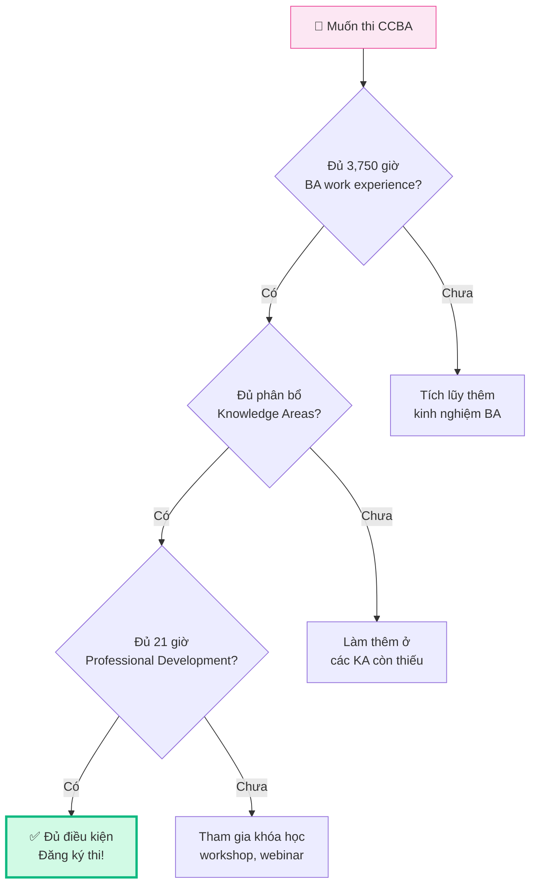
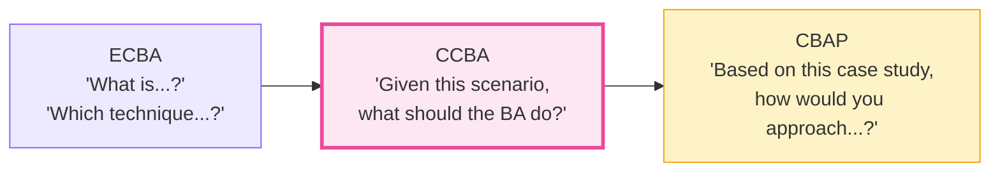
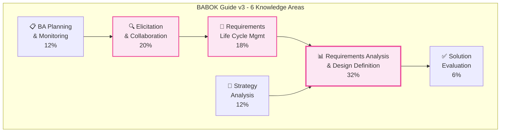
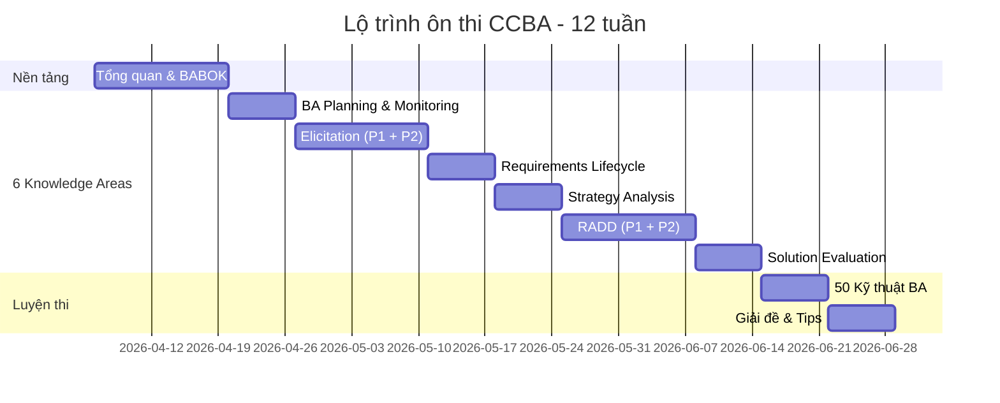

## CCBA — Chứng chỉ "bước ngoặt" cho BA

**Certification of Capability in Business Analysis (CCBA)** là chứng chỉ cấp trung (intermediate) của IIBA, đánh dấu bước chuyển mình từ một BA "biết làm" sang BA "có năng lực được công nhận quốc tế". Nếu ECBA là bước đầu tiên, thì CCBA chính là cột mốc quan trọng xác nhận bạn đủ khả năng **ứng dụng kiến thức BA** vào các dự án thực tế.

<Callout type="info" title="Số liệu thú vị">
Theo IIBA Global State of Business Analysis Report, BA có chứng chỉ CCBA kiếm cao hơn trung bình **11%** so với BA không có chứng chỉ. Tại Việt Nam, CCBA holder thường được ưu tiên cho vị trí Mid-Senior BA tại các công ty đa quốc gia.
</Callout>

## Yêu cầu thi CCBA chi tiết

### Điều kiện tiên quyết

### Chi tiết từng yêu cầu

| Tiêu chí | Chi tiết | Lưu ý |
|----------|---------|-------|
| **Kinh nghiệm** | 3,750 giờ trong 7 năm gần nhất | ≈ 2 năm full-time BA work |
| **Phân bổ KA** | 900 giờ × 2 KAs **hoặc** 500 giờ × 4 KAs | Không cần cover cả 6 KAs |
| **Professional Dev** | 21 giờ trong 4 năm gần nhất | Workshops, courses, webinars, self-study |
| **References** | Cung cấp người tham khảo | Đồng nghiệp hoặc quản lý |
| **Code of Conduct** | Đồng ý tuân thủ | Đạo đức nghề nghiệp IIBA |
| **Phí thi** | $250 (member) / $450 (non-member) | Tiết kiệm ~$200 nếu đăng ký thành viên |

<Callout type="tip" title="Mẹo tính giờ kinh nghiệm">
- 1 năm full-time ≈ 1,800–2,000 giờ BA work
- Không chỉ tính giờ viết tài liệu, mà bao gồm: elicitation, analysis, stakeholder meetings, UAT coordination...
- Kể cả khi title không phải "Business Analyst" — miễn là công việc liên quan đến BA tasks
</Callout>

## Cấu trúc đề thi CCBA

### Tổng quan

- **130 câu hỏi** trắc nghiệm (multiple choice)
- **3 giờ** làm bài
- Dạng câu hỏi: **Scenario-based** (tình huống thực tế)
- Thi online (remote proctoring) hoặc tại trung tâm PSI
- Kết quả: **Pass / Fail** (không công bố điểm cụ thể)

### Tỷ trọng đề thi theo Knowledge Area

| Knowledge Area | Tỷ trọng | Số câu ước tính |
|---------------|:--------:|:---------------:|
| Requirements Analysis & Design Definition (RADD) | **32%** | ~42 câu |
| Elicitation & Collaboration (EC) | **20%** | ~26 câu |
| Requirements Life Cycle Management (RLCM) | **18%** | ~23 câu |
| BA Planning & Monitoring (BAPM) | **12%** | ~16 câu |
| Strategy Analysis (SA) | **12%** | ~16 câu |
| Solution Evaluation (SE) | **6%** | ~8 câu |

<Callout type="warning" title="Trọng tâm ôn thi">
**RADD (32%)** chiếm gần 1/3 đề thi — đây là Knowledge Area quan trọng nhất! Kết hợp với Elicitation (20%) và RLCM (18%), ba KA này chiếm **70% đề thi**. Hãy ưu tiên ôn kỹ 3 KA này.
</Callout>

### Đặc điểm câu hỏi CCBA

Khác với ECBA (kiểm tra kiến thức), CCBA tập trung vào **ứng dụng thực tế**:

**Ví dụ câu hỏi CCBA:**

> Một công ty đã sử dụng một ứng dụng nhiều năm nhưng vẫn còn một component phải nhập liệu thủ công. Một dự án được khởi động để tự động hóa chức năng này, ảnh hưởng đến nhiều business units. **Bước đầu tiên** của BA là gì?
>
> A. Lên lịch requirements workshop  
> B. Mô hình hóa scope các yêu cầu  
> C. **Thực hiện stakeholder analysis** ✅  
> D. Ưu tiên hóa business requirements

→ Đáp án C: Trước khi làm bất cứ điều gì, BA cần hiểu ai là stakeholder, ai bị ảnh hưởng, ai có quyền quyết định.

## 6 Knowledge Areas — Tổng quan

CCBA dựa trên **BABOK Guide v3** (Business Analysis Body of Knowledge), bao gồm 6 Knowledge Areas:

### 1. Business Analysis Planning & Monitoring (12%)
Lập kế hoạch cách tiếp cận BA, xác định stakeholder, lên kế hoạch hoạt động BA và theo dõi tiến độ.

### 2. Elicitation & Collaboration (20%)
Thu thập yêu cầu từ stakeholder bằng nhiều kỹ thuật (interview, workshop, observation...) và phối hợp hiệu quả.

### 3. Requirements Life Cycle Management (18%)
Quản lý yêu cầu xuyên suốt vòng đời dự án — trace, maintain, prioritize, approve, và quản lý thay đổi.

### 4. Strategy Analysis (12%)
Phân tích tình trạng hiện tại (current state), định nghĩa tương lai mong muốn (future state), đánh giá rủi ro và đề xuất chiến lược thay đổi.

### 5. Requirements Analysis & Design Definition (32%)
Phân tích, mô hình hóa, verify và validate yêu cầu. Định nghĩa thiết kế giải pháp từ yêu cầu.

### 6. Solution Evaluation (6%)
Đánh giá hiệu quả giải pháp sau khi triển khai, xác định performance gaps và đề xuất cải tiến.

## Lộ trình ôn thi 12 tuần

### Phân bổ thời gian chi tiết

| Tuần | Nội dung | Thời gian/ngày | Trọng tâm |
|:----:|---------|:--------------:|----------|
| 1-2 | Bài 1-2: Tổng quan + BABOK | 1-2 giờ | Hiểu cấu trúc tổng thể |
| 3 | Bài 3: BA Planning & Monitoring | 1-2 giờ | Tasks, Input/Output |
| 4-5 | Bài 4-5: Elicitation & Collaboration | 2-3 giờ | Kỹ thuật thu thập + Stakeholder |
| 6 | Bài 6: Requirements Life Cycle | 1-2 giờ | Traceability, Prioritization |
| 7 | Bài 7: Strategy Analysis | 1-2 giờ | Current/Future State, SWOT |
| 8-9 | Bài 8-9: RADD | 2-3 giờ | ⭐ KA quan trọng nhất |
| 10 | Bài 10: Solution Evaluation | 1 giờ | Assessment, Optimization |
| 11 | Bài 11: 50 Kỹ thuật BA | 2-3 giờ | Flashcards, practice |
| 12 | Bài 12: Chiến lược + Đề thử | 2-3 giờ | Giải đề, quản lý thời gian |

## Tài liệu ôn thi khuyến nghị

### Tài liệu bắt buộc
1. **BABOK Guide v3** — "Kinh thánh" của BA, nguồn chính cho đề thi
2. **CCBA Certification Handbook** — Hướng dẫn chi tiết từ IIBA

### Tài liệu bổ sung
3. **CBAP/CCBA Study Guide** (Susan Weese & Terri Wagner) — Sách ôn thi phổ biến nhất
4. **Business Analysis for Practitioners** (PMI) — Góc nhìn thực tế
5. **Series ôn thi CCBA trên BA Tập Sự** — Bạn đang đọc đây! 😊

### Công cụ luyện thi
- 🧠 **Flashcards** — Ôn thuật ngữ, techniques
- 📝 **Practice exams** — Watermark Learning, BA Blocks
- 👥 **Study groups** — Cộng đồng BA Việt Nam

## Lời khuyên từ người đã thi đỗ

<Callout type="success" title="Tips vàng">
1. **Đọc BABOK ít nhất 2 lần** — Lần 1 đọc hiểu, lần 2 ghi chú trọng tâm
2. **Tập trung vào RADD (32%)** — Đây là KA "nặng" nhất, quyết định pass/fail
3. **Hiểu Techniques theo context** — Không chỉ nhớ tên, phải biết _khi nào dùng_
4. **Luyện scenario questions** — Đừng chỉ học thuộc, phải _tư duy như BA_
5. **Quản lý thời gian** — 130 câu / 180 phút = ~1.4 phút/câu, không được dừng lâu ở 1 câu
</Callout>

## 📝 Tóm tắt kiến thức nổi bật

<Callout type="success" title="Key Takeaways — Bài 1">
- **CCBA** là chứng chỉ trung cấp (intermediate) của IIBA, yêu cầu **3,750 giờ** kinh nghiệm BA trong 7 năm + 21 giờ Professional Development
- Đề thi gồm **130 câu scenario-based** trong **3 giờ** (~1.4 phút/câu), kết quả Pass/Fail
- **3 KA trọng tâm** chiếm 70% đề: RADD (32%) + Elicitation (20%) + RLCM (18%)
- Mức tư duy: **Application** — áp dụng kiến thức vào tình huống thực tế, không chỉ nhớ lý thuyết
- Kinh nghiệm BA tính cả khi job title không phải "Business Analyst" — miễn công việc liên quan BA tasks
- CCBA holders kiếm cao hơn trung bình **11%** so với BA không có chứng chỉ
</Callout>

---

## 📋 Bài kiểm tra trắc nghiệm — Bài 1

<Callout type="info" title="Hướng dẫn làm bài">
Làm **10 câu** bên dưới trong **14 phút** (giống tốc độ thi thật). Chọn **MỘT đáp án đúng nhất** cho mỗi câu. Đáp án và giải thích ở cuối bài.
</Callout>

**Câu 1.** CCBA yêu cầu tối thiểu bao nhiêu giờ kinh nghiệm BA?

- A. 1,500 giờ trong 5 năm
- B. 3,750 giờ trong 7 năm
- C. 7,500 giờ trong 10 năm
- D. 2,000 giờ trong 3 năm

**Câu 2.** Đề thi CCBA có bao nhiêu câu hỏi và thời gian bao lâu?

- A. 120 câu / 3.5 giờ
- B. 50 câu / 1 giờ
- C. 130 câu / 3 giờ
- D. 150 câu / 4 giờ

**Câu 3.** Knowledge Area nào chiếm tỷ trọng lớn nhất trong đề thi CCBA?

- A. Elicitation & Collaboration (20%)
- B. Requirements Analysis & Design Definition (32%)
- C. Strategy Analysis (12%)
- D. Requirements Life Cycle Management (18%)

**Câu 4.** Mức độ tư duy (Bloom's Taxonomy) mà CCBA kiểm tra chủ yếu là:

- A. Knowledge — nhớ lại kiến thức
- B. Comprehension — hiểu khái niệm
- C. Application — áp dụng vào tình huống
- D. Synthesis — tổng hợp và sáng tạo

**Câu 5.** Một QA Lead có 4 năm kinh nghiệm, trong đó thường xuyên phân tích requirements, viết test cases từ user stories, và tham gia UAT. Người này có thể tính kinh nghiệm BA để thi CCBA không?

- A. Không, vì job title không phải BA
- B. Có, nếu công việc liên quan đến BA tasks
- C. Chỉ tính 50% số giờ
- D. Phải có bằng BA mới được thi

**Câu 6.** CCBA yêu cầu phân bổ kinh nghiệm Knowledge Areas như thế nào?

- A. 900 giờ trong tất cả 6 KAs
- B. 900 giờ × 2 KAs HOẶC 500 giờ × 4 KAs
- C. 500 giờ trong 6 KAs
- D. Không yêu cầu phân bổ cụ thể

**Câu 7.** So với ECBA, điểm khác biệt chính của đề thi CCBA là:

- A. CCBA dùng câu hỏi knowledge-based
- B. CCBA dùng câu hỏi scenario-based
- C. CCBA có phần viết luận
- D. CCBA thi vấn đáp

**Câu 8.** BA đang lập kế hoạch ôn thi CCBA. Với thời gian hạn chế, nên ưu tiên ôn KA nào trước?

- A. Solution Evaluation vì ít câu nhất, dễ lấy điểm
- B. BA Planning & Monitoring vì là bước đầu tiên
- C. RADD vì chiếm 32% đề thi
- D. Ôn đều tất cả KAs

**Câu 9.** Professional Development hours cho CCBA yêu cầu:

- A. 35 giờ trong 4 năm
- B. 21 giờ trong 4 năm
- C. 21 giờ trong 7 năm
- D. 50 giờ không giới hạn thời gian

**Câu 10.** Kết quả thi CCBA được thông báo như thế nào?

- A. Điểm cụ thể từ 0-100%
- B. Pass / Fail không công bố điểm
- C. Xếp hạng A/B/C/D
- D. Pass với điểm từng KA chi tiết

---

### 🔑 Đáp án & Giải thích

| Câu | Đáp án | Giải thích |
|:---:|:------:|-----------|
| 1 | **B** | CCBA yêu cầu 3,750 giờ trong 7 năm gần nhất (≈2 năm full-time). 7,500 giờ là yêu cầu của CBAP. |
| 2 | **C** | CCBA: 130 câu / 3 giờ. CBAP: 120 câu / 3.5 giờ. ECBA: 50 câu / 1 giờ. |
| 3 | **B** | RADD chiếm 32% — gần 1/3 đề thi, là KA quan trọng nhất trong CCBA. |
| 4 | **C** | CCBA kiểm tra mức Application (Bloom's Level 3) — áp dụng kiến thức vào scenario. CBAP mới yêu cầu Analysis & Synthesis. |
| 5 | **B** | IIBA tính theo công việc thực tế, không theo job title. QA Lead làm BA tasks (phân tích requirements, viết test cases từ user stories) được tính. |
| 6 | **B** | CCBA yêu cầu 900 giờ × 2 KAs HOẶC 500 giờ × 4 KAs — không cần cover cả 6 KAs. |
| 7 | **B** | ECBA dùng knowledge-based questions (nhớ kiến thức). CCBA nâng lên scenario-based (áp dụng vào tình huống). |
| 8 | **C** | RADD 32% quyết định pass/fail. Ưu tiên: RADD → Elicitation → RLCM (tổng 70% đề). |
| 9 | **B** | CCBA: 21 giờ PD trong 4 năm gần nhất. CBAP mới yêu cầu 35 giờ. |
| 10 | **B** | IIBA chỉ thông báo Pass/Fail, không công bố điểm cụ thể hay điểm từng Knowledge Area. |

### 📊 Thang đánh giá

| Số câu đúng | Đánh giá | Hành động |
|:-----------:|---------|-----------|
| 9-10 | ⭐ Xuất sắc | Sẵn sàng học tiếp bài 2! |
| 7-8 | ✅ Tốt | Ôn lại phần KA weights và yêu cầu thi |
| 5-6 | ⚠️ Trung bình | Đọc lại bài này, đặc biệt phần Exam Blueprint |
| < 5 | ❌ Cần ôn lại | Đọc kỹ lại toàn bộ bài và ghi chú trọng tâm |

---

## Tiếp theo

Bài tiếp theo chúng ta sẽ đi sâu vào **BABOK Guide v3** — cấu trúc, khái niệm nền tảng, và cách các Knowledge Areas liên kết với nhau. Đây là nền tảng để hiểu toàn bộ nội dung thi CCBA.

---

*Hãy bắt đầu hành trình chinh phục CCBA cùng BA Tập Sự! 🏅*
