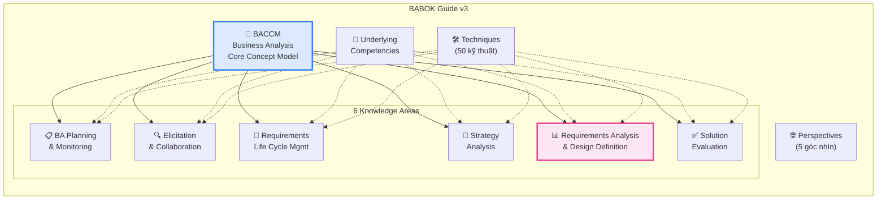
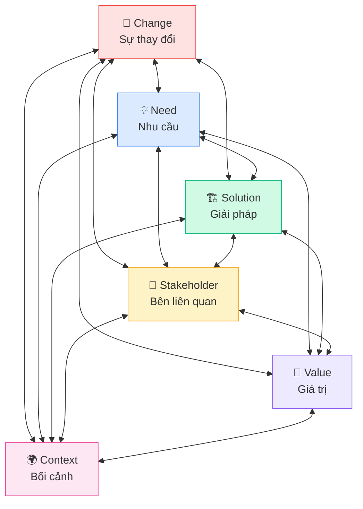
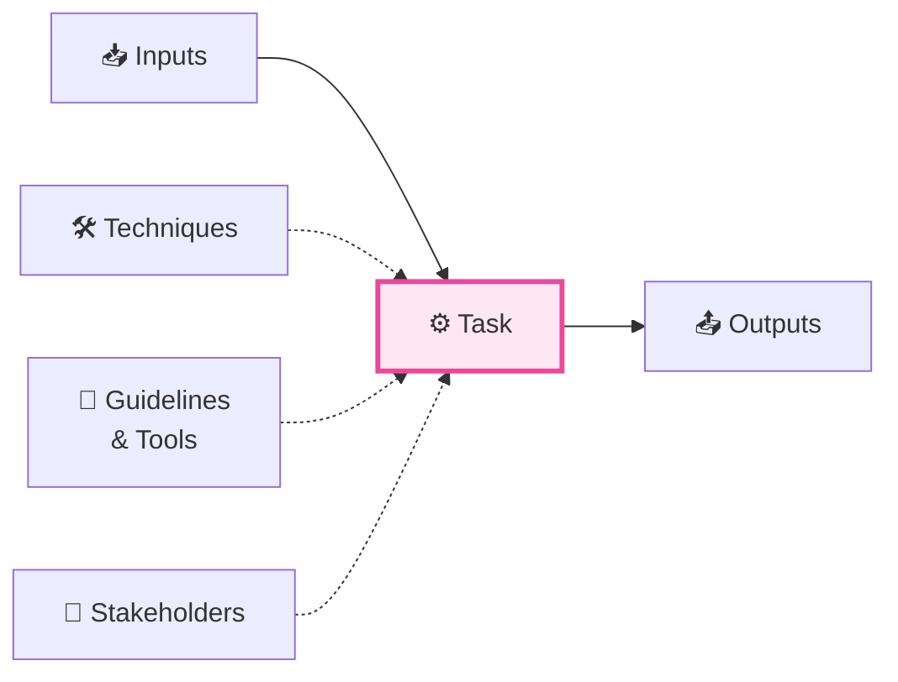
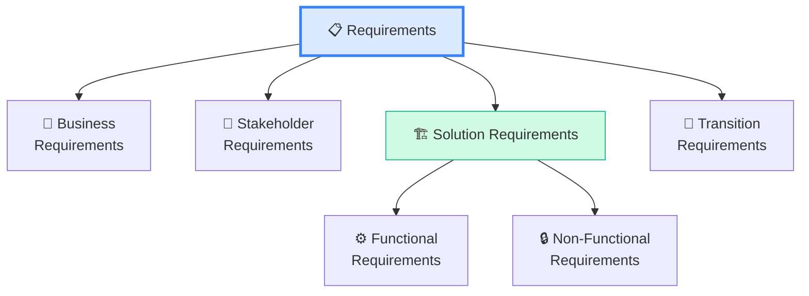

## BABOK Guide v3 là gì?

**Business Analysis Body of Knowledge (BABOK) Guide v3** là tài liệu tham chiếu chuẩn quốc tế của IIBA, mô tả toàn bộ kiến thức và năng lực cần thiết cho nghề Business Analysis. Đây là **nguồn chính để ra đề thi CCBA** — mọi câu hỏi đều dựa trên nội dung BABOK.

<Callout type="warning" title="Quan trọng">
BABOK không phải là methodology hay framework — nó là **knowledge standard** (tiêu chuẩn kiến thức). BABOK mô tả **"what a BA does"**, không phải **"how to do it in a specific project"**.
</Callout>

## Cấu trúc tổng thể BABOK Guide v3



BABOK v3 bao gồm:
- **1 Core Concept Model** (BACCM) — 6 khái niệm cốt lõi
- **6 Knowledge Areas** — 30 Tasks
- **50 Techniques** — Kỹ thuật áp dụng xuyên suốt
- **Underlying Competencies** — Năng lực nền tảng
- **5 Perspectives** — Góc nhìn theo context

## Business Analysis Core Concept Model (BACCM)

BACCM là **mô hình khái niệm cốt lõi** của Business Analysis, gồm 6 khái niệm liên kết chặt chẽ:



| Khái niệm | Định nghĩa | Ví dụ |
|-----------|-----------|-------|
| **Change** | Hành động chuyển đổi để đáp ứng nhu cầu | Tự động hóa quy trình nhập liệu |
| **Need** | Vấn đề hoặc cơ hội cần giải quyết | Giảm lỗi nhập liệu thủ công 50% |
| **Solution** | Cách thức đáp ứng nhu cầu trong context | Hệ thống OCR tự động đọc hóa đơn |
| **Stakeholder** | Cá nhân/nhóm có liên quan đến change | BA, Dev, End users, Sponsor |
| **Value** | Giá trị mang lại cho stakeholder | Tiết kiệm 100 giờ/tháng, giảm chi phí |
| **Context** | Hoàn cảnh ảnh hưởng đến change | Ngành tài chính, quy định pháp lý |

<Callout type="tip" title="Mẹo nhớ BACCM">
**"CCNSSV"** — Change, Context, Need, Solution, Stakeholder, Value. Hoặc nhớ theo câu: **"Changes in Context create Needs for Solutions that deliver Value to Stakeholders"**
</Callout>

## 6 Knowledge Areas — Chi tiết cấu trúc

Mỗi Knowledge Area được cấu trúc thống nhất theo pattern:



### Tổng quan 30 Tasks trong 6 Knowledge Areas

#### 1. BA Planning & Monitoring (5 Tasks)
| Task | Mô tả |
|------|--------|
| Plan BA Approach | Xác định cách tiếp cận BA cho dự án |
| Plan Stakeholder Engagement | Lên kế hoạch giao tiếp stakeholder |
| Plan BA Governance | Thiết lập quy trình quản trị BA |
| Plan BA Information Management | Quản lý thông tin BA |
| Identify BA Performance Improvements | Nhận diện cải tiến hiệu suất BA |

#### 2. Elicitation & Collaboration (5 Tasks)
| Task | Mô tả |
|------|--------|
| Prepare for Elicitation | Chuẩn bị thu thập yêu cầu |
| Conduct Elicitation | Thực hiện thu thập |
| Confirm Elicitation Results | Xác nhận kết quả thu thập |
| Communicate BA Information | Truyền đạt thông tin BA |
| Manage Stakeholder Collaboration | Quản lý phối hợp stakeholder |

#### 3. Requirements Life Cycle Management (5 Tasks)
| Task | Mô tả |
|------|--------|
| Trace Requirements | Theo dõi mối liên hệ giữa yêu cầu |
| Maintain Requirements | Duy trì yêu cầu qua thay đổi |
| Prioritize Requirements | Ưu tiên hóa yêu cầu |
| Assess Requirements Changes | Đánh giá thay đổi yêu cầu |
| Approve Requirements | Phê duyệt yêu cầu |

#### 4. Strategy Analysis (5 Tasks)
| Task | Mô tả |
|------|--------|
| Analyze Current State | Phân tích tình trạng hiện tại |
| Define Future State | Xác định trạng thái tương lai |
| Assess Risks | Đánh giá rủi ro |
| Define Change Strategy | Xác định chiến lược thay đổi |
| *(Implicit)* Define Transition Requirements | Yêu cầu chuyển đổi |

#### 5. Requirements Analysis & Design Definition (6 Tasks)
| Task | Mô tả |
|------|--------|
| Specify and Model Requirements | Đặc tả và mô hình hóa yêu cầu |
| Verify Requirements | Kiểm tra chất lượng yêu cầu |
| Validate Requirements | Xác nhận yêu cầu đáp ứng mục tiêu |
| Define Requirements Architecture | Xác định kiến trúc yêu cầu |
| Define Design Options | Xác định các phương án thiết kế |
| Analyze Potential Value & Recommend Solution | Phân tích giá trị và đề xuất giải pháp |

#### 6. Solution Evaluation (5 Tasks)
| Task | Mô tả |
|------|--------|
| Measure Solution Performance | Đo lường hiệu suất giải pháp |
| Analyze Performance Measures | Phân tích kết quả đo lường |
| Assess Solution Limitations | Đánh giá hạn chế giải pháp |
| Assess Enterprise Limitations | Đánh giá hạn chế tổ chức |
| Recommend Actions to Increase Solution Value | Đề xuất cải tiến giá trị |

## Mối quan hệ giữa các Knowledge Areas

```mermaid
graph TB
    BAPM["📋 BA Planning\n& Monitoring"] -->|Kế hoạch BA| EC
    EC["🔍 Elicitation\n& Collaboration"] -->|Requirements\n(Stated)| RLCM
    RLCM["🔄 Requirements\nLife Cycle Mgmt"] -->|Requirements\n(Approved)| RADD
    SA["🎯 Strategy\nAnalysis"] -->|Business Need\nFuture State| RADD
    RADD["📊 RADD"] -->|Design\nOptions| SE
    SE["✅ Solution\nEvaluation"] -->|Performance\nData| SA

    BAPM -.->|Governance| RLCM
    EC -.->|Collaboration| SA
    SE -.->|Feedback| EC

    style RADD fill:#FCE7F3,stroke:#EC4899,color:#333,stroke-width:3px
```

**Luồng chính:**
1. **BAPM** → Lập kế hoạch cách làm BA
2. **EC** → Thu thập yêu cầu từ stakeholder
3. **RLCM** → Quản lý yêu cầu đã thu thập
4. **SA** → Phân tích chiến lược, xác định business need
5. **RADD** → Phân tích chi tiết yêu cầu, thiết kế giải pháp
6. **SE** → Đánh giá giải pháp sau triển khai → phản hồi ngược

## Requirements Classification (Phân loại yêu cầu)

BABOK phân loại yêu cầu thành **4 loại chính**:



| Loại | Mô tả | Ví dụ |
|------|--------|-------|
| **Business Requirements** | Mục tiêu cấp cao của tổ chức | "Tăng doanh thu online 30%" |
| **Stakeholder Requirements** | Nhu cầu cụ thể của bên liên quan | "Users cần xem báo cáo real-time" |
| **Functional Requirements** | Chức năng hệ thống phải có | "Hệ thống cho phép filter theo ngày" |
| **Non-Functional Requirements** | Chất lượng hệ thống | "Page load < 2 giây" |
| **Transition Requirements** | Yêu cầu chuyển đổi tạm thời | "Migrate data từ hệ thống cũ" |

## Underlying Competencies

Ngoài 6 Knowledge Areas, BABOK còn định nghĩa **Underlying Competencies** — những năng lực nền tảng mà BA cần có:

| Competency | Mô tả |
|-----------|--------|
| **Analytical Thinking & Problem Solving** | Tư duy phân tích, giải quyết vấn đề |
| **Behavioural Characteristics** | Đạo đức, khả năng thích ứng, tổ chức |
| **Business Knowledge** | Hiểu biết về ngành, tổ chức, giải pháp |
| **Communication Skills** | Giao tiếp bằng lời và bằng văn bản |
| **Interaction Skills** | Teamwork, facilitation, leadership, negotiation |
| **Tools & Technology** | Sử dụng công cụ và công nghệ |

## 5 Perspectives trong BABOK

BABOK v3 giới thiệu 5 **Perspectives** — các góc nhìn khác nhau khi áp dụng BA:

| Perspective | Mô tả | Khi nào dùng |
|------------|--------|-------------|
| **Agile** | BA trong môi trường Agile/Scrum | Dự án iterative, adaptive |
| **Business Intelligence** | BA cho phân tích dữ liệu | Data warehouse, reporting |
| **Information Technology** | BA cho dự án IT | Software development |
| **Business Architecture** | BA ở tầm enterprise | Chiến lược tổ chức |
| **Business Process Management** | BA cho quy trình kinh doanh | Process improvement |

<Callout type="info" title="Lưu ý cho kỳ thi CCBA">
Perspectives không xuất hiện trực tiếp trong đề thi CCBA, nhưng giúp bạn hiểu **context** của câu hỏi scenario. Ví dụ: nếu scenario nói về sprint, retrospective — bạn biết đó là Agile context.
</Callout>

## 📝 Tóm tắt kiến thức nổi bật

<Callout type="success" title="Key Takeaways — Bài 2">
- **BACCM** gồm 6 khái niệm cốt lõi: Change, Need, Solution, Stakeholder, Value, Context — liên kết chặt chẽ
- **6 Knowledge Areas** chứa tổng **30 Tasks**, mỗi Task có Input → Task → Output
- **4 loại Requirements**: Business Requirements → Stakeholder Requirements → Solution Requirements (Functional + Non-Functional) → Transition Requirements
- **5 Perspectives**: Agile, Business Intelligence, IT, Business Architecture, BPM — chọn theo context dự án
- **Underlying Competencies**: Analytical Thinking, Communication, Behavioral, Business Knowledge, Tools & Technology
- BABOK v3 là "kinh thánh" cho kỳ thi — mọi câu hỏi đều dựa trên BABOK
</Callout>

## Tóm tắt & Checklist ôn tập

### Những gì cần nắm vững từ bài này:
- [ ] Hiểu cấu trúc tổng thể BABOK v3
- [ ] Nắm 6 khái niệm trong BACCM
- [ ] Liệt kê được 6 Knowledge Areas và Tasks chính
- [ ] Phân biệt 4 loại Requirements
- [ ] Hiểu mối quan hệ giữa các KAs
- [ ] Biết 5 Perspectives và khi nào áp dụng

---

## 📋 Bài kiểm tra trắc nghiệm — Bài 2

<Callout type="info" title="Hướng dẫn làm bài">
Làm **10 câu** bên dưới trong **14 phút**. Chọn **MỘT đáp án đúng nhất**. Đáp án ở cuối bài.
</Callout>

**Câu 1.** BACCM bao gồm bao nhiêu khái niệm cốt lõi?

- A. 4 khái niệm
- B. 5 khái niệm
- C. 6 khái niệm
- D. 8 khái niệm

**Câu 2.** Trong BACCM, khái niệm nào mô tả "sự chuyển đổi từ trạng thái hiện tại sang trạng thái mong muốn"?

- A. Need
- B. Change
- C. Solution
- D. Value

**Câu 3.** Yêu cầu "Hệ thống phải xử lý được 10,000 transactions/giây" thuộc loại nào?

- A. Business Requirement
- B. Stakeholder Requirement
- C. Functional Requirement
- D. Non-Functional Requirement

**Câu 4.** BABOK v3 có tổng cộng bao nhiêu Knowledge Areas và bao nhiêu Tasks?

- A. 5 KAs, 25 Tasks
- B. 6 KAs, 30 Tasks
- C. 7 KAs, 35 Tasks
- D. 6 KAs, 50 Tasks

**Câu 5.** Một dự án phát triển phần mềm cho ngân hàng cần tuân thủ quy định bảo mật nghiêm ngặt. Perspective phù hợp nhất là:

- A. Agile
- B. Business Intelligence
- C. Information Technology
- D. Business Process Management

**Câu 6.** "Khách hàng cần xem lịch sử giao dịch 12 tháng gần nhất trên app mobile" thuộc loại requirement nào?

- A. Business Requirement
- B. Stakeholder Requirement
- C. Functional Requirement
- D. Transition Requirement

**Câu 7.** Trong BACCM, "Context" đề cập đến:

- A. Bối cảnh kỹ thuật của giải pháp
- B. Các hoàn cảnh ảnh hưởng đến change
- C. Ngữ cảnh giao tiếp với stakeholder
- D. Tình huống sử dụng requirements

**Câu 8.** Transition Requirements được sử dụng khi nào?

- A. Trong suốt vòng đời dự án
- B. Chỉ trong giai đoạn chuyển đổi từ solution hiện tại sang solution mới
- C. Chỉ khi viết BRD
- D. Khi define business objectives

**Câu 9.** BA đang làm dự án chuyển đổi số cho công ty sản xuất, cần tối ưu quy trình nghiệp vụ. Perspective nào phù hợp nhất?

- A. Agile
- B. Business Intelligence
- C. Business Architecture
- D. Business Process Management

**Câu 10.** Underlying Competency nào QUAN TRỌNG NHẤT khi BA cần phân tích và mô hình hóa quy trình phức tạp?

- A. Communication
- B. Analytical Thinking & Problem Solving
- C. Behavioral Characteristics
- D. Tools & Technology Knowledge

---

### 🔑 Đáp án & Giải thích

| Câu | Đáp án | Giải thích |
|:---:|:------:|-----------|
| 1 | **C** | BACCM = 6 core concepts: Change, Need, Solution, Stakeholder, Value, Context. |
| 2 | **B** | Change = sự chuyển đổi. Need = nhu cầu. Solution = giải pháp. Value = giá trị mang lại. |
| 3 | **D** | Performance requirement (10,000 TPS) là Non-Functional Requirement — liên quan quality/constraint, không phải behavior. |
| 4 | **B** | BABOK v3: 6 Knowledge Areas × trung bình 5 Tasks = 30 Tasks tổng cộng. 50 là số Techniques. |
| 5 | **C** | IT Perspective phù hợp cho dự án cần tuân thủ quy định bảo mật, tích hợp hệ thống, kiến trúc kỹ thuật. |
| 6 | **B** | "Khách hàng cần..." thể hiện nhu cầu của một stakeholder cụ thể → Stakeholder Requirement. |
| 7 | **B** | Context = circumstances that influence, surround, and interact with the change — bối cảnh rộng hơn. |
| 8 | **B** | Transition Requirements chỉ cần trong giai đoạn chuyển đổi (data migration, training, parallel run...), không tồn tại lâu dài. |
| 9 | **D** | BPM Perspective tập trung vào tối ưu quy trình nghiệp vụ. Business Architecture nhìn ở tầm chiến lược rộng hơn. |
| 10 | **B** | Analytical Thinking & Problem Solving là competency cốt lõi cho phân tích và mô hình hóa quy trình. |

### 📊 Thang đánh giá

| Số câu đúng | Đánh giá | Hành động |
|:-----------:|---------|-----------|
| 9-10 | ⭐ Xuất sắc | Nền tảng vững chắc! |
| 7-8 | ✅ Tốt | Ôn lại BACCM và Requirements Classification |
| 5-6 | ⚠️ Trung bình | Đọc lại bài, đặc biệt phần Perspectives |
| < 5 | ❌ Cần ôn lại | BABOK v3 là nền tảng — cần nắm chắc trước khi tiếp tục |

---

## Tiếp theo

Bài tiếp theo sẽ đi sâu vào **Knowledge Area đầu tiên: Business Analysis Planning & Monitoring** — nơi mọi hoạt động BA bắt đầu, từ lập kế hoạch approach đến stakeholder engagement.

---

*Nắm vững BABOK = nắm vững nền tảng thi CCBA! 📚*
