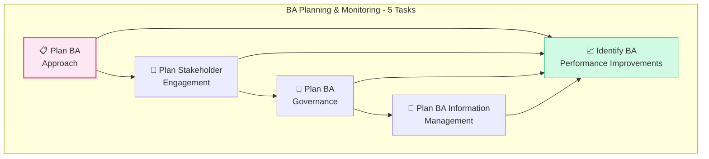
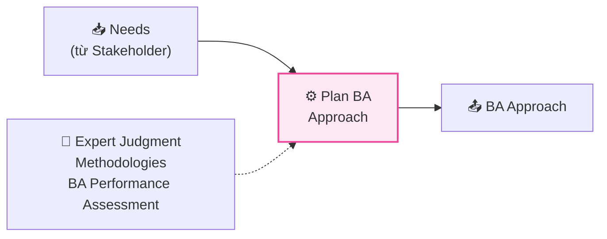
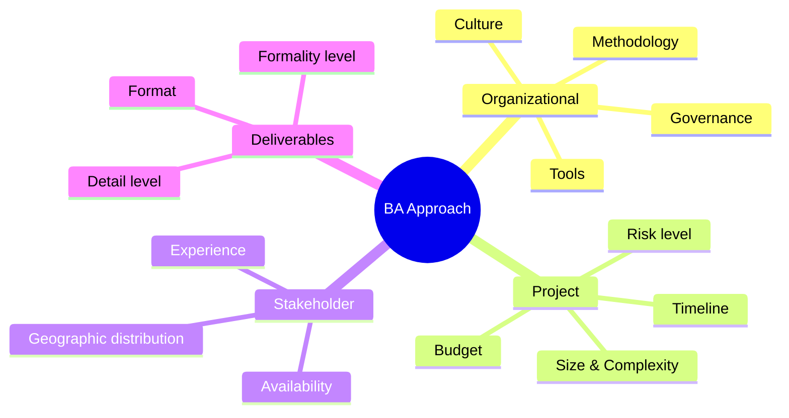
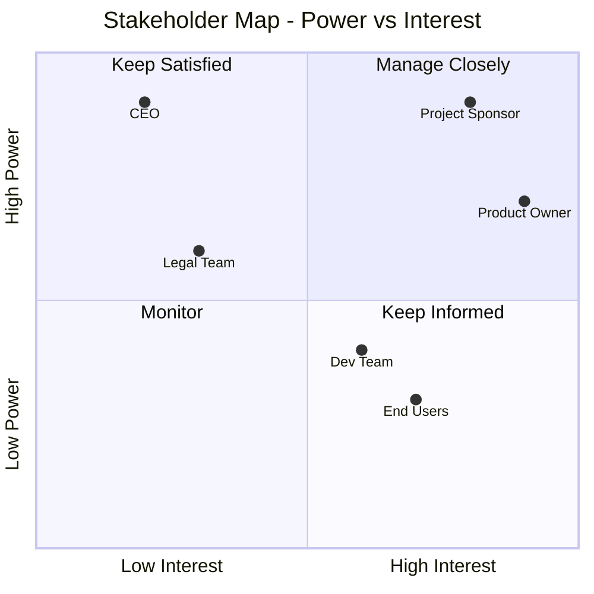
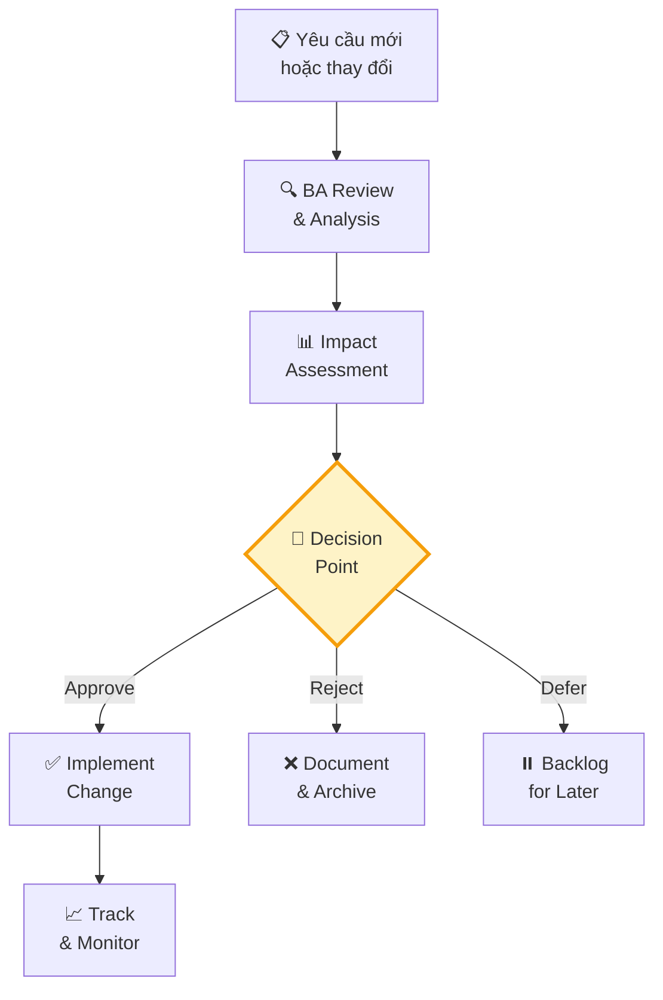
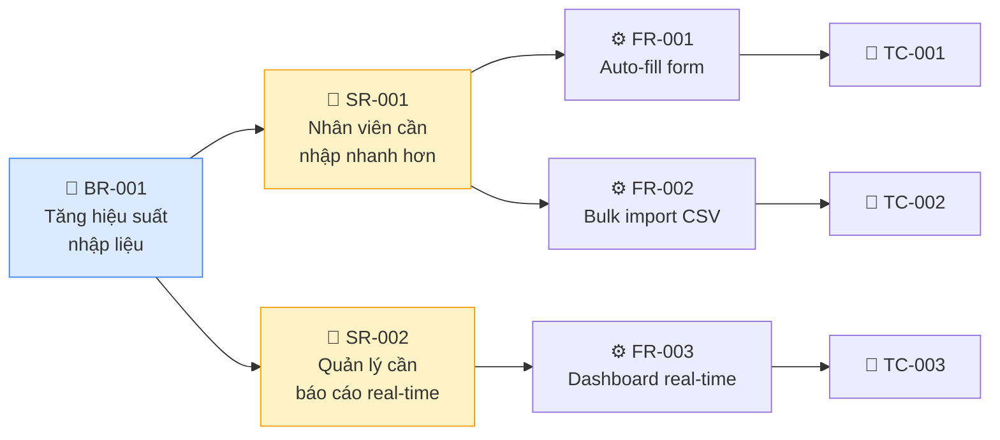
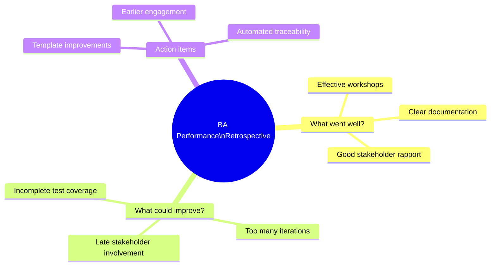

## Tổng quan BA Planning & Monitoring

**BA Planning & Monitoring (BAPM)** là Knowledge Area đầu tiên trong BABOK, chiếm **12% đề thi CCBA** (~16 câu). Đây là nền tảng mà mọi hoạt động BA được xây dựng — trước khi thu thập yêu cầu, bạn cần biết **"sẽ làm BA như thế nào"**.

## Task 1: Plan Business Analysis Approach

### Mục đích
Xác định **cách tiếp cận BA** phù hợp cho dự án — predictive (plan-driven) hay adaptive (change-driven)?

### Input → Task → Output

### Predictive vs Adaptive Approach

| | Predictive (Plan-driven) | Adaptive (Change-driven) |
|---|----------------------|----------------------|
| **Khi nào** | Scope rõ ràng, ít thay đổi | Scope không chắc chắn, nhiều thay đổi |
| **Deliverables** | BRD, SRS, formal documents | User Stories, Backlog items |
| **Timing** | Upfront planning | Iterative, rolling-wave |
| **Approval** | Formal sign-off | Continuous validation |
| **Ví dụ** | Hệ thống ngân hàng, regulated | Mobile app, startup product |

<Callout type="tip" title="Mẹo thi CCBA">
Đề thi thường cho scenario rồi hỏi "BA nên chọn approach nào?" → Xem có keywords nào: "regulated", "fixed scope" → **Predictive**. "Uncertain", "changing requirements", "iterative" → **Adaptive**.
</Callout>

### Các yếu tố ảnh hưởng đến BA Approach

## Task 2: Plan Stakeholder Engagement

### Mục đích
Xác định stakeholder nào liên quan, phân tích ảnh hưởng của họ, và lên kế hoạch giao tiếp phù hợp.

### Stakeholder Analysis — RACI Matrix

| Stakeholder | R (Responsible) | A (Accountable) | C (Consulted) | I (Informed) |
|------------|:-:|:-:|:-:|:-:|
| Project Sponsor | | ✅ | ✅ | |
| Business Analyst | ✅ | | | |
| Dev Team | | | ✅ | ✅ |
| End Users | | | ✅ | ✅ |
| QA Team | | | | ✅ |

### Stakeholder Map

### Communication Plan

| Stakeholder | Phương thức | Tần suất | Nội dung |
|------------|-----------|---------|---------|
| Sponsor | 1-on-1 meeting | Hàng tuần | Status, risks, decisions |
| Product Owner | Daily standup | Hàng ngày | Progress, blockers |
| Dev Team | Sprint planning | Mỗi sprint | Requirements detail |
| End Users | Workshop | Khi cần | Validation, feedback |

## Task 3: Plan BA Governance

### Mục đích
Thiết lập **quy trình ra quyết định** cho hoạt động BA — ai phê duyệt gì, khi nào, và như thế nào.

### Governance Framework

### Các thành phần Governance

| Thành phần | Mô tả | Ví dụ |
|-----------|--------|-------|
| **Decision Rights** | Ai có quyền quyết định | Sponsor approves business req, PO approves user stories |
| **Escalation Process** | Quy trình leo thang | Conflict → BA Lead → PM → Sponsor |
| **Change Control** | Kiểm soát thay đổi | Change Request form, Impact analysis |
| **Prioritization Process** | Cách ưu tiên yêu cầu | MoSCoW, Business Value vs Effort |
| **Approval Process** | Quy trình phê duyệt | Review meeting, Sign-off checklist |

## Task 4: Plan BA Information Management

### Mục đích
Xác định cách **lưu trữ, truy cập và quản lý** thông tin BA trong suốt dự án.

### Các yếu tố cần lên kế hoạch

| Yếu tố | Câu hỏi cần trả lời | Ví dụ |
|--------|---------------------|-------|
| **Organization** | Thông tin lưu ở đâu? | Confluence, SharePoint, Jira |
| **Level of Abstraction** | Mức độ chi tiết? | High-level (roadmap) vs Detail (user story) |
| **Traceability** | Liên kết giữa các artifacts? | Business req → User story → Test case |
| **Reuse** | Có thể tái sử dụng không? | Template library, pattern catalog |
| **Storage & Access** | Ai được truy cập? | Team folder, restricted access |
| **Versioning** | Quản lý phiên bản? | v1.0, v1.1, change log |

### Traceability Matrix ví dụ

## Task 5: Identify BA Performance Improvements

### Mục đích
Đánh giá hiệu quả của chính hoạt động BA và tìm cách **cải tiến liên tục**.

### Performance Metrics cho BA

| Metric | Cách đo | Target |
|--------|---------|--------|
| **Requirements Quality** | Số defects do missed requirements | < 5% |
| **Rework Rate** | % requirements phải sửa lại | < 10% |
| **Stakeholder Satisfaction** | Survey sau project | > 4/5 |
| **Elicitation Efficiency** | # sessions cần để confirm requirements | Giảm theo thời gian |
| **Time to Approval** | Thời gian từ draft đến approve | < 5 business days |

### BA Retrospective Questions

<Callout type="info" title="Câu hỏi thường gặp trong đề thi">
"BA nhận thấy số lượng defects liên quan đến requirements tăng cao. BA nên làm gì?" → Đáp án thường là: **Identify BA Performance Improvements** — xem lại quy trình BA, root cause analysis, cải tiến.
</Callout>

## Techniques thường dùng trong BAPM

| Technique | Dùng cho Task | Mô tả |
|----------|:------------:|--------|
| **Brainstorming** | T1, T5 | Tạo ý tưởng, tìm giải pháp |
| **RACI Matrix** | T2 | Phân công vai trò stakeholder |
| **Stakeholder List/Map** | T2 | Xác định và phân tích stakeholder |
| **Process Modelling** | T1 | Mô hình hóa quy trình BA |
| **Estimation** | T1 | Ước lượng effort BA |
| **Reviews** | T5 | Đánh giá chất lượng BA work |
| **Lessons Learned** | T5 | Rút kinh nghiệm |
| **Risk Analysis** | T1, T3 | Phân tích rủi ro |
| **Interviews** | T2, T5 | Thu thập feedback |
| **Survey** | T5 | Đánh giá satisfaction |

## 📝 Tóm tắt kiến thức nổi bật

<Callout type="success" title="Key Takeaways — Bài 3">
- **BAPM có 5 Tasks**: Plan BA Approach, Plan Stakeholder Engagement, Plan BA Governance, Plan BA Information Management, Identify BA Performance Improvements
- **Predictive vs Adaptive**: Predictive cho dự án scope rõ ràng, ít thay đổi; Adaptive cho dự án uncertainty cao, cần feedback sớm
- **Stakeholder Analysis**: Dùng RACI Matrix (Responsible/Accountable/Consulted/Informed) + Power/Interest Grid
- **Governance Framework**: Quy định quyền phê duyệt, escalation path, change control process
- **BA Performance**: Đo bằng Requirements Quality, Rework Rate, Stakeholder Satisfaction, Time to Approval
- BAPM chiếm **12% đề thi** (~16 câu) — focus vào khi nào chọn approach nào
</Callout>

## Tóm tắt & Checklist ôn tập

- [ ] Hiểu rõ 5 Tasks trong BAPM
- [ ] Phân biệt Predictive vs Adaptive approach
- [ ] Nắm vững Stakeholder Analysis (RACI, Power/Interest Grid)
- [ ] Hiểu Governance framework và quy trình phê duyệt
- [ ] Biết cách lập kế hoạch Information Management
- [ ] Nắm các Performance Metrics cho BA

---

## 📋 Bài kiểm tra trắc nghiệm — Bài 3

<Callout type="info" title="Hướng dẫn làm bài">
Làm **10 câu** bên dưới trong **14 phút**. Chọn **MỘT đáp án đúng nhất**. Đáp án ở cuối bài.
</Callout>

**Câu 1.** Một dự án mới có scope rõ ràng, regulatory requirements nghiêm ngặt, và sponsor yêu cầu deliverables chi tiết trước khi bắt đầu. BA nên chọn approach nào?

- A. Adaptive approach với user stories
- B. Predictive approach với comprehensive planning
- C. Hybrid approach
- D. Không cần plan approach

**Câu 2.** Stakeholder nào thuộc nhóm "Manage Closely" trong Power/Interest Grid?

- A. High Power, Low Interest
- B. Low Power, High Interest
- C. High Power, High Interest
- D. Low Power, Low Interest

**Câu 3.** Trong RACI Matrix, chữ "A" (Accountable) có nghĩa là:

- A. Người thực hiện công việc
- B. Người chịu trách nhiệm cuối cùng về kết quả
- C. Người được tham vấn ý kiến
- D. Người được thông báo kết quả

**Câu 4.** BA nhận thấy số lượng defects liên quan đến requirements tăng cao. Theo BAPM, BA nên thực hiện Task nào?

- A. Plan BA Approach
- B. Plan Stakeholder Engagement
- C. Plan BA Governance
- D. Identify BA Performance Improvements

**Câu 5.** Một startup đang phát triển sản phẩm mới, chưa rõ thị trường sẽ phản ứng thế nào. BA nên chọn approach nào?

- A. Predictive với BRD đầy đủ
- B. Adaptive với iterative delivery và feedback loops
- C. Waterfall với phase gates
- D. Không cần approach, bắt đầu code ngay

**Câu 6.** Plan BA Information Management bao gồm quyết định về:

- A. Chỉ nơi lưu trữ documents
- B. Nơi lưu trữ, level of detail, access rights, và versioning
- C. Chỉ tools sử dụng
- D. Chỉ naming conventions

**Câu 7.** Một stakeholder cấp C-level có quyền lực cao nhưng ít quan tâm đến chi tiết dự án. Chiến lược engagement phù hợp là:

- A. Manage Closely — họp hàng ngày
- B. Keep Satisfied — cập nhật định kỳ, không overwhelm
- C. Keep Informed — gửi email summary
- D. Monitor — không cần tương tác

**Câu 8.** BA Governance framework xác định:

- A. Chỉ quy trình phê duyệt requirements
- B. Decision rights, escalation paths, change control, và approval workflows
- C. Chỉ RACI matrix
- D. Chỉ communication plan

**Câu 9.** Khi nào BA nên thay đổi BA approach giữa dự án?

- A. Không bao giờ — approach phải cố định
- B. Khi stakeholder yêu cầu
- C. Khi performance assessment cho thấy approach hiện tại không hiệu quả
- D. Mỗi phase mới phải đổi approach

**Câu 10.** BA đo Rework Rate = 25%. Target là < 10%. Nguyên nhân có thể nhất là:

- A. Team development kém
- B. Requirements chưa đủ chi tiết hoặc chưa validate đúng
- C. Budget không đủ
- D. Timeline quá ngắn

---

### 🔑 Đáp án & Giải thích

| Câu | Đáp án | Giải thích |
|:---:|:------:|-----------|
| 1 | **B** | Scope rõ ràng + regulatory + deliverables chi tiết → Predictive approach phù hợp. |
| 2 | **C** | High Power + High Interest = Manage Closely — cần tương tác thường xuyên, involve trong decisions. |
| 3 | **B** | Accountable = chịu trách nhiệm cuối cùng (chỉ có 1 người). Responsible = người thực hiện. |
| 4 | **D** | Defects tăng → cần cải tiến performance BA → Identify BA Performance Improvements. |
| 5 | **B** | Uncertainty cao, cần feedback sớm → Adaptive approach với iterative delivery. |
| 6 | **B** | Information Management bao gồm: storage, level of detail, access rights, versioning, traceability, reuse. |
| 7 | **B** | High Power + Low Interest = Keep Satisfied — cập nhật đủ để họ hài lòng, không overwhelm với details. |
| 8 | **B** | Governance = toàn bộ framework quản trị: decision rights, escalation, change control, approvals. |
| 9 | **C** | BA approach có thể thay đổi khi performance assessment cho thấy không hiệu quả — continuous improvement. |
| 10 | **B** | Rework Rate cao thường do requirements quality kém — chưa elicit đủ hoặc chưa validate đúng. |

### 📊 Thang đánh giá

| Số câu đúng | Đánh giá | Hành động |
|:-----------:|---------|-----------|
| 9-10 | ⭐ Xuất sắc | BAPM đã nắm vững! |
| 7-8 | ✅ Tốt | Ôn lại Predictive vs Adaptive và Stakeholder Grid |
| 5-6 | ⚠️ Trung bình | Đọc lại bài, focus vào 5 Tasks và relationships |
| < 5 | ❌ Cần ôn lại | Học kỹ lại toàn bộ BAPM Knowledge Area |

---

## Tiếp theo

Bài tiếp theo sẽ đi vào **Elicitation & Collaboration (Phần 1)** — Knowledge Area chiếm 20% đề thi, tập trung vào các **kỹ thuật thu thập yêu cầu** hiệu quả.

---

*Plan well, execute better! 📋*
