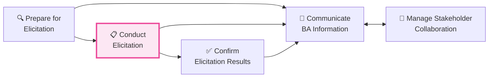
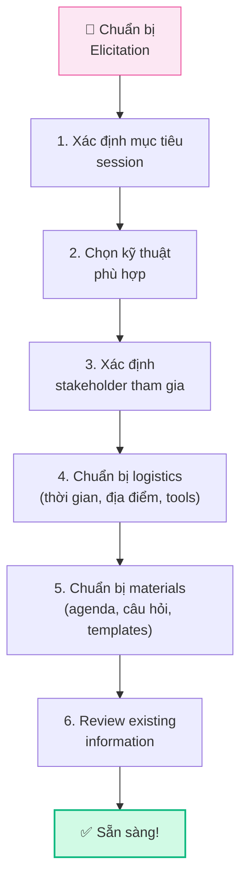
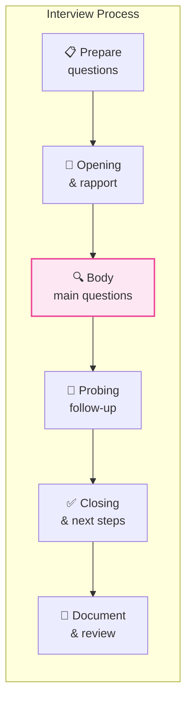
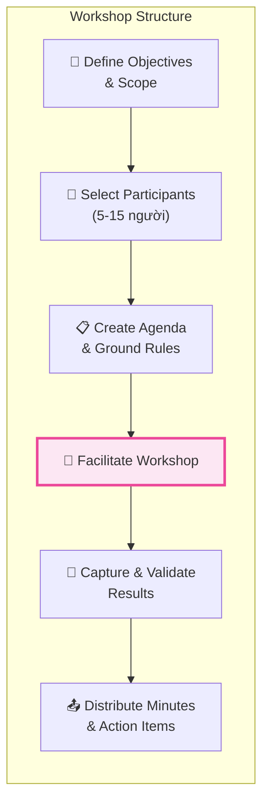
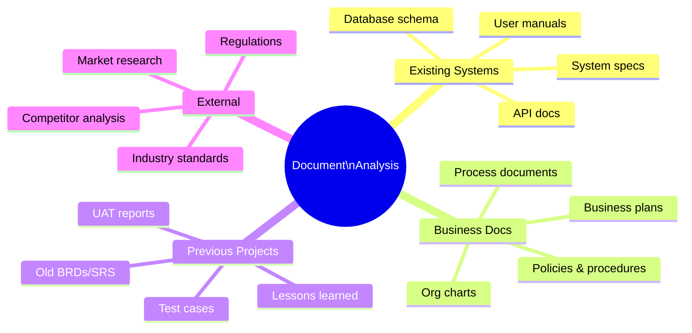
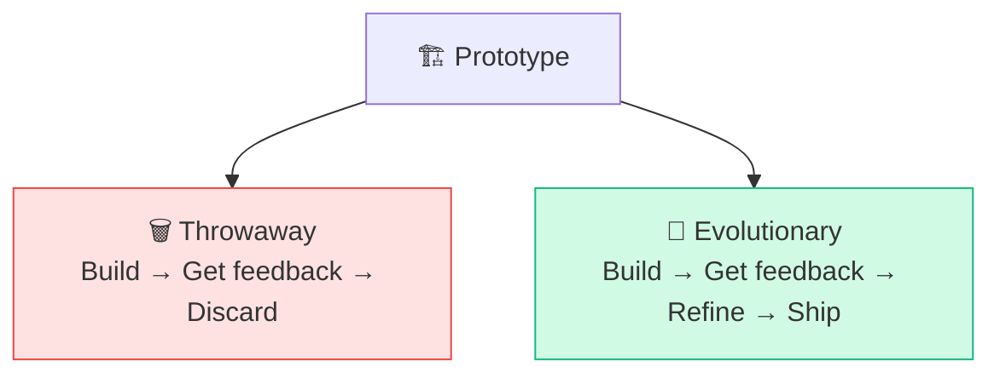
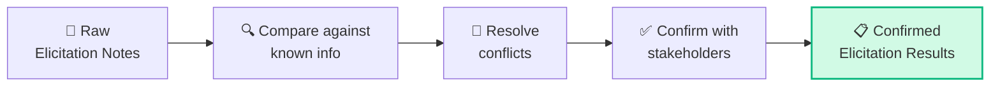

## Tổng quan Elicitation & Collaboration

**Elicitation & Collaboration (EC)** chiếm **20% đề thi CCBA** (~26 câu) — là Knowledge Area quan trọng thứ hai. EC bao gồm toàn bộ hoạt động **thu thập thông tin** từ stakeholder và **phối hợp** để đảm bảo mọi người hiểu đúng yêu cầu.

<Callout type="info" title="Elicitation ≠ chỉ hỏi">
Elicitation không chỉ là "hỏi stakeholder muốn gì". Nó bao gồm: **nghiên cứu tài liệu, quan sát quy trình, tổ chức workshop, prototyping, khảo sát** và nhiều kỹ thuật khác.
</Callout>

## 5 Tasks trong Elicitation & Collaboration

### Phần 1 (bài này): Tasks 1-3 — Thu thập yêu cầu
### Phần 2 (bài sau): Tasks 4-5 — Giao tiếp & Phối hợp

## Task 1: Prepare for Elicitation

### Mục đích
Chuẩn bị kỹ lưỡng trước khi thu thập yêu cầu để đảm bảo **hiệu quả tối đa** cho mỗi elicitation session.

### Checklist chuẩn bị

### Chọn kỹ thuật Elicitation phù hợp

| Kỹ thuật | Khi nào dùng | Ưu điểm | Nhược điểm |
|----------|-------------|---------|-----------|
| **Interview** | Cần thông tin chi tiết từ 1-2 người | Deep dive, linh hoạt | Tốn thời gian, bias |
| **Workshop** | Cần consensus từ nhiều stakeholder | Nhanh, collaborative | Khó organize, dominance |
| **Observation** | Muốn hiểu quy trình thực tế | Chính xác, phát hiện gaps | Tốn thời gian, Hawthorne effect |
| **Survey** | Thu thập từ số lượng lớn | Scalable, anonymous | Low response rate, shallow |
| **Document Analysis** | Có tài liệu hiện hữu | Quick, independent | Outdated docs, gaps |
| **Prototyping** | Yêu cầu khó mô tả bằng lời | Visual, instant feedback | Time to build, scope creep |
| **Brainstorming** | Cần ý tưởng mới | Creative, inclusive | May lack focus |
| **Focus Group** | Cần feedback từ nhóm target | Diverse perspectives | Groupthink risk |

## Task 2: Conduct Elicitation

### 8 Kỹ thuật Elicitation chi tiết

### 1. Interview (Phỏng vấn)

**Loại câu hỏi:**

| Loại | Mô tả | Ví dụ |
|------|--------|-------|
| **Open-ended** | Cho phép trả lời tự do | "Hãy mô tả quy trình hiện tại?" |
| **Closed-ended** | Trả lời Yes/No hoặc chọn | "Bạn phê duyệt bao nhiêu đơn/ngày?" |
| **Probing** | Đào sâu thêm chi tiết | "Tại sao bước đó lại quan trọng?" |
| **Leading** | Gợi ý câu trả lời (TRÁNH!) | "Chắc bạn cũng thấy hệ thống chậm?" |
| **Hypothetical** | Tình huống giả định | "Nếu hệ thống tự động hóa bước đó?" |

<Callout type="warning" title="Tránh Leading Questions">
Trong đề thi CCBA, nếu thấy lựa chọn liên quan đến **leading questions** hoặc **biased elicitation**, đó thường là đáp án **SAI**.
</Callout>

### 2. Requirements Workshop

**Vai trò trong Workshop:**

| Vai trò | Trách nhiệm |
|---------|-------------|
| **Facilitator** | Điều phối, giữ focus, quản lý thời gian |
| **Scribe** | Ghi chép nội dung thảo luận |
| **Participants** | Đóng góp ý kiến, ra quyết định |
| **Observer** | Quan sát, không tham gia trực tiếp |
| **Timekeeper** | Theo dõi thời gian |

### 3. Observation (Quan sát)

**2 loại Observation:**

| | Active Observation | Passive Observation |
|---|-------------------|-------------------|
| **BA làm gì** | Hỏi câu hỏi trong lúc quan sát | Chỉ quan sát, không can thiệp |
| **Ưu điểm** | Hiểu rõ "why" behind actions | Thấy quy trình tự nhiên nhất |
| **Nhược điểm** | Có thể làm gián đoạn | Có thể bỏ sót "why" |
| **Khi nào** | Cần hiểu logic nghiệp vụ | Cần hiểu actual workflow |

<Callout type="tip" title="Hawthorne Effect">
Khi biết bị quan sát, người ta thường **thay đổi hành vi**. BA cần nhận biết điều này và có thể kết hợp nhiều phương pháp để verify.
</Callout>

### 4. Document Analysis (Phân tích tài liệu)

**Các loại tài liệu cần review:**

### 5. Prototyping

**Các loại Prototype:**

| Loại | Fidelity | Tools | Khi nào |
|------|---------|-------|--------|
| **Sketches** | Very low | Giấy, bút | Idea exploration |
| **Wireframe** | Low | Balsamiq, Figma | Structure & layout |
| **Mockup** | Medium | Figma, Adobe XD | Visual design |
| **Interactive Prototype** | High | Figma, InVision | User testing |
| **Working Prototype** | Very high | Code | Technical validation |

**Throwaway vs Evolutionary:**

### 6. Survey / Questionnaire

**Best Practices:**
- Giới hạn **10-15 câu hỏi** (max 20)
- Mix **open-ended** và **closed-ended** questions
- Dùng **Likert scale** cho đánh giá (1-5)
- **Pilot test** trước khi gửi
- Đặt **deadline** rõ ràng
- Gửi **reminder** 1-2 lần

### 7. Brainstorming

**Quy tắc Brainstorming:**
1. ✅ Khuyến khích mọi ý tưởng (không phê bình)
2. ✅ Quantity over quality (càng nhiều càng tốt)
3. ✅ Build on others' ideas
4. ✅ Wild ideas welcome
5. ❌ Không đánh giá trong quá trình brainstorm
6. ❌ Không thảo luận chi tiết (đó là bước sau)

### 8. Interface Analysis

Phân tích các **điểm giao tiếp** giữa hệ thống với thế giới bên ngoài:
- User interfaces (UI)
- System-to-system interfaces (API)
- Hardware interfaces
- External system interfaces

## Task 3: Confirm Elicitation Results

### Mục đích
Đảm bảo thông tin thu thập được là **chính xác, đầy đủ và được đồng thuận** bởi stakeholder.

### Quy trình xác nhận

### Các vấn đề thường gặp khi xác nhận

| Vấn đề | Nguyên nhân | Giải pháp |
|--------|-----------|---------|
| **Conflicting requirements** | Stakeholder khác nhau, goals khác nhau | Negotiate, prioritize, escalate |
| **Ambiguous requirements** | Ngôn ngữ mơ hồ | Clarify, use examples, prototype |
| **Missing requirements** | Stakeholder quên hoặc assume | Cross-reference, review checklist |
| **Gold plating** | Thêm feature không được yêu cầu | Validate against business objectives |
| **Assumptions** | Stakeholder assume BA biết | Document & validate assumptions |

<Callout type="tip" title="Confirmed ≠ Approved">
**Confirmed Elicitation Results** = stakeholder đồng ý rằng BA đã ghi chép đúng. **Approved Requirements** = stakeholder đồng ý rằng requirements đó sẽ được implement. Hai khái niệm này khác nhau!
</Callout>

## Elicitation Techniques — Ma trận tổng hợp

| Kỹ thuật | Prepare | Conduct | Confirm | Số stakeholder | Effort |
|----------|:-------:|:-------:|:-------:|:--------------:|:------:|
| Interview | ⭐⭐ | ⭐⭐⭐ | ⭐⭐ | 1-3 | Medium |
| Workshop | ⭐⭐⭐ | ⭐⭐⭐ | ⭐⭐ | 5-15 | High |
| Observation | ⭐⭐ | ⭐⭐⭐ | ⭐ | 1-5 | High |
| Survey | ⭐⭐⭐ | ⭐ | ⭐ | 10-1000+ | Low |
| Document Analysis | ⭐ | ⭐⭐ | ⭐ | 0 | Low |
| Prototyping | ⭐⭐⭐ | ⭐⭐⭐ | ⭐⭐⭐ | 3-10 | Very High |
| Brainstorming | ⭐⭐ | ⭐⭐ | ⭐ | 5-15 | Medium |
| Focus Group | ⭐⭐⭐ | ⭐⭐⭐ | ⭐⭐ | 6-12 | High |

## Ví dụ Scenario câu hỏi CCBA

> **Scenario:** Một BA đang thu thập yêu cầu cho chức năng máy móc từ một stakeholder. Stakeholder cố gắng giải thích các bước trong quy trình nhưng dù nhiều lần cố gắng, BA vẫn không hiểu được. Kỹ thuật nào sẽ giúp BA hiểu yêu cầu?
>
> A. Review paper prototype  
> B. Use graphic user interface  
> C. **Observe the product in use** ✅  
> D. Interview the operator
>
> → Đáp án C: Khi **lời nói không đủ** để truyền đạt, **quan sát trực tiếp** (observation) là kỹ thuật phù hợp nhất.

## 📝 Tóm tắt kiến thức nổi bật

<Callout type="success" title="Key Takeaways — Bài 4">
- Elicitation & Collaboration chiếm **20% đề thi** (~26 câu) — KA lớn thứ 2
- **8 kỹ thuật Elicitation chính**: Interviews, Workshops, Observation, Document Analysis, Prototyping, Surveys, Brainstorming, Interface Analysis
- **Interview question types**: Open-ended (khám phá), Closed-ended (xác nhận), Probing (đào sâu), Hypothetical (tình huống) — **tránh Leading questions**
- **Workshop**: 5-15 người, cần Facilitator + Scribe, ground rules, structured agenda
- **Observation**: Active (tham gia) vs Passive (quan sát) — cẩn thận Hawthorne Effect
- **Prototyping**: Throwaway (khám phá) vs Evolutionary (phát triển dần)
- **Confirm Elicitation Results**: Luôn validate với stakeholder trước khi sử dụng
</Callout>

## Tóm tắt & Checklist ôn tập

- [ ] Nắm vững 3 Tasks đầu tiên của EC
- [ ] Phân biệt 8 kỹ thuật Elicitation và khi nào dùng
- [ ] Hiểu Interview techniques (open, closed, probing, leading)
- [ ] Biết cách tổ chức Workshop hiệu quả
- [ ] Phân biệt Active vs Passive Observation
- [ ] Hiểu Throwaway vs Evolutionary Prototyping
- [ ] Nắm quy trình Confirm Elicitation Results

---

## 📋 Bài kiểm tra trắc nghiệm — Bài 4

<Callout type="info" title="Hướng dẫn làm bài">
Làm **10 câu** bên dưới trong **14 phút**. Chọn **MỘT đáp án đúng nhất**. Đáp án ở cuối bài.
</Callout>

**Câu 1.** BA cần hiểu quy trình xử lý đơn hàng phức tạp mà stakeholder không thể mô tả rõ bằng lời. Kỹ thuật nào phù hợp nhất?

- A. Interview
- B. Survey
- C. Observation
- D. Document Analysis

**Câu 2.** Trong workshop, BA nên giới hạn số lượng participants trong khoảng nào?

- A. 2-3 người
- B. 5-15 người
- C. 20-30 người
- D. Không giới hạn

**Câu 3.** BA muốn thu thập ý kiến từ 500 users trải rộng 10 chi nhánh. Kỹ thuật nào hiệu quả nhất?

- A. Interviews từng người
- B. Workshop tại mỗi chi nhánh
- C. Surveys/Questionnaires
- D. Observation

**Câu 4.** Câu hỏi "Bạn có hài lòng với hệ thống hiện tại không?" là loại:

- A. Open-ended question
- B. Closed-ended question
- C. Probing question
- D. Hypothetical question

**Câu 5.** BA quan sát user làm việc và nhận thấy user thay đổi hành vi khi biết mình đang được quan sát. Hiện tượng này gọi là:

- A. Confirmation Bias
- B. Hawthorne Effect
- C. Anchoring Effect
- D. Observer Bias

**Câu 6.** BA muốn validate requirements với stakeholder bằng cách tạo một mock-up UI đơn giản, không có code thật. Đây là:

- A. Evolutionary Prototyping
- B. Throwaway Prototyping
- C. Interface Analysis
- D. Document Analysis

**Câu 7.** Task "Confirm Elicitation Results" nhằm mục đích chính là:

- A. Ghi chép lại thông tin đã thu thập
- B. Xác nhận rằng thông tin thu thập chính xác và đầy đủ
- C. Phân tích requirements
- D. Prioritize requirements

**Câu 8.** Câu hỏi interview nào là Leading Question (cần tránh)?

- A. "Bạn nghĩ gì về quy trình hiện tại?"
- B. "Bạn có đồng ý quy trình hiện tại quá chậm không?"
- C. "Nếu có thể thay đổi, bạn muốn thay đổi điều gì?"
- D. "Mô tả một ngày làm việc điển hình của bạn?"

**Câu 9.** BA đang phân tích hệ thống cũ để hiểu business rules hiện tại. Kỹ thuật phù hợp nhất là:

- A. Brainstorming
- B. Workshop
- C. Document Analysis
- D. Prototyping

**Câu 10.** Interface Analysis được sử dụng khi nào?

- A. Khi cần hiểu UI/UX của hệ thống
- B. Khi cần xác định các điểm tương tác giữa hệ thống với external systems hoặc users
- C. Khi cần thiết kế database
- D. Khi cần test hệ thống

---

### 🔑 Đáp án & Giải thích

| Câu | Đáp án | Giải thích |
|:---:|:------:|-----------|
| 1 | **C** | Observation phù hợp khi stakeholder không thể articulate quy trình — BA quan sát trực tiếp. |
| 2 | **B** | Workshop hiệu quả nhất với 5-15 người — đủ đa dạng quan điểm, không quá đông để quản lý. |
| 3 | **C** | Surveys/Questionnaires hiệu quả nhất cho số lượng lớn, phân bổ rộng — chi phí thấp, scalable. |
| 4 | **B** | "Có/Không" = Closed-ended question. Open-ended sẽ hỏi "Ý kiến của bạn về hệ thống..." |
| 5 | **B** | Hawthorne Effect = người bị quan sát thay đổi hành vi khi biết đang bị quan sát. |
| 6 | **B** | Throwaway Prototype = mock-up đơn giản để validate, không phát triển tiếp. Evolutionary sẽ build thật dần. |
| 7 | **B** | Confirm = xác nhận accuracy và completeness của elicited information với stakeholder. |
| 8 | **B** | "Bạn có đồng ý... quá chậm không?" = leading — gợi ý đáp án mong muốn, tạo bias. |
| 9 | **C** | Document Analysis = xem xét tài liệu hiện có (system docs, business rules, reports) để hiểu as-is. |
| 10 | **B** | Interface Analysis xác định boundaries và interactions giữa solution với external entities. |

### 📊 Thang đánh giá

| Số câu đúng | Đánh giá | Hành động |
|:-----------:|---------|-----------|
| 9-10 | ⭐ Xuất sắc | Elicitation techniques đã nắm vững! |
| 7-8 | ✅ Tốt | Ôn lại Prototyping types và Interview questions |
| 5-6 | ⚠️ Trung bình | Đọc lại phần technique selection matrix |
| < 5 | ❌ Cần ôn lại | EC chiếm 20% đề — cần đầu tư thêm thời gian |

---

## Tiếp theo

Bài tiếp theo sẽ đi vào **Elicitation & Collaboration (Phần 2)** — tập trung vào **Communicate BA Information** và **Manage Stakeholder Collaboration** — kỹ năng giao tiếp và quản lý stakeholder hiệu quả.

---

*Thu thập đúng yêu cầu = nửa thành công! 🔍*
