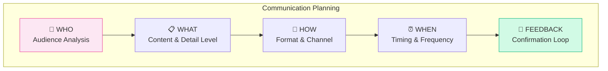
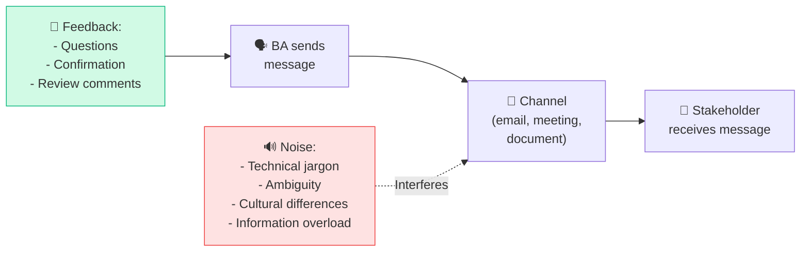
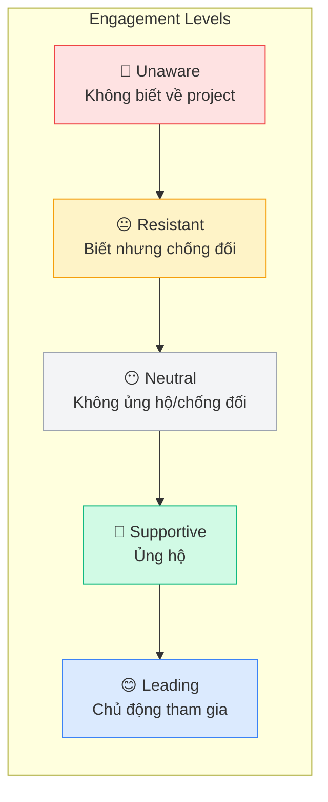
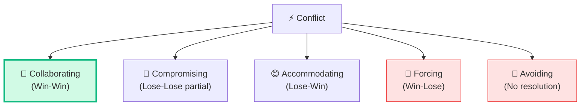
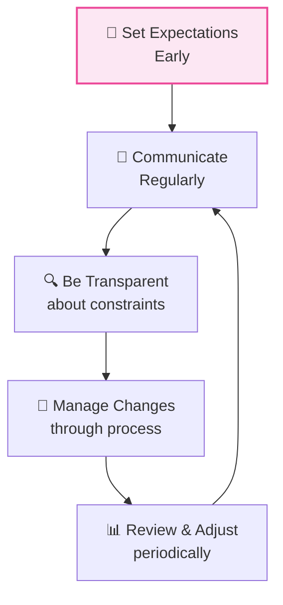
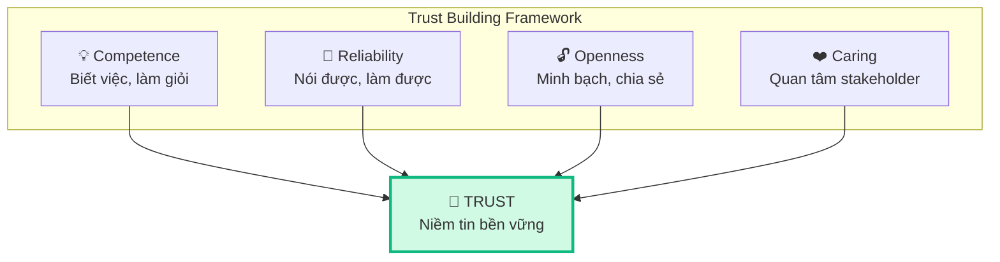

## Phần 2: Communicate & Collaborate

Bài trước chúng ta đã tìm hiểu 3 Tasks đầu tiên về **thu thập yêu cầu**. Bài này tập trung vào 2 Tasks còn lại — **giao tiếp thông tin BA** và **quản lý phối hợp stakeholder** — kỹ năng thường bị đánh giá thấp nhưng cực kỳ quan trọng.

## Task 4: Communicate BA Information

### Mục đích
Đảm bảo thông tin BA được **truyền đạt đúng**, đến **đúng người**, vào **đúng thời điểm**, bằng **đúng format**.

### Communication Framework

### Tailoring Communication theo Audience

| Audience | Detail Level | Format | Language |
|---------|:----------:|--------|---------|
| **Executive / Sponsor** | High-level summary | Presentation, Dashboard | Business terms, ROI |
| **Product Owner** | Medium detail | User Stories, Backlog | Feature-focused |
| **Dev Team** | Technical detail | SRS, Acceptance Criteria | Technical specs |
| **End Users** | Practical, visual | Prototypes, Guides | Simple, step-by-step |
| **QA Team** | Test-focused | Test Cases, Scenarios | Edge cases, conditions |

<Callout type="tip" title="Golden Rule of BA Communication">
**"Communicate requirements at the right level of abstraction for each audience."** Executive không cần biết database schema. Developer không cần biết business strategy.
</Callout>

### Formats truyền đạt thông tin

| Format | Khi nào dùng | Ưu điểm |
|--------|-------------|---------|
| **Written (Formal)** | BRD, SRS, formal sign-off | Audit trail, reference |
| **Written (Informal)** | Email, Slack, comments | Quick, asynchronous |
| **Verbal (Formal)** | Presentation, review meeting | Interactive, Q&A |
| **Verbal (Informal)** | Hallway conversation, standup | Fast, relationship building |
| **Visual** | Diagrams, prototypes, mockups | Easy to understand |
| **Workshop** | Complex topics, decisions | Collaborative, consensus |

### Communication Gaps thường gặp

## Task 5: Manage Stakeholder Collaboration

### Mục đích
Xây dựng và duy trì **mối quan hệ làm việc hiệu quả** với stakeholder, xử lý xung đột, và quản lý kỳ vọng.

### Stakeholder Engagement Assessment

### Quản lý xung đột giữa Stakeholders

#### 5 Conflict Resolution Strategies

| Strategy | Khi nào dùng | Kết quả |
|----------|-------------|---------|
| **Collaborating** ⭐ | Có thời gian, cả 2 bên quan trọng | Win-Win, best outcome |
| **Compromising** | Áp lực thời gian, cần quick resolution | Partial satisfaction |
| **Accommodating** | Vấn đề quan trọng hơn với bên kia | Preserve relationship |
| **Forcing** | Khẩn cấp, quyết định executive | Fast but may damage relationship |
| **Avoiding** | Vấn đề nhỏ, sẽ tự giải quyết | Tạm thời ổn, có thể quay lại |

<Callout type="warning" title="Đề thi CCBA">
Đề thi CCBA thường ưu tiên **Collaborating** (win-win) là đáp án đúng. **Forcing** và **Avoiding** hiếm khi là đáp án đúng trừ trường hợp cực kỳ đặc biệt.
</Callout>

### Xử lý Stakeholder khó

| Tình huống | Chiến lược |
|-----------|----------|
| **Stakeholder không available** | Escalate, tìm delegate, async communication |
| **Stakeholder chống đối dự án** | Hiểu root cause, show value, involve early |
| **Stakeholder quá dominant** | Ground rules, round-robin, anonymous input |
| **Stakeholder thụ động** | Direct questions, 1-on-1 meetings, prototype |
| **Conflicting stakeholders** | Identify shared goals, mediate, escalate if needed |
| **Stakeholder scope creep** | Reference business case, prioritize, change control |

### Expectation Management

**Key principles:**
1. **Set early** — Đặt kỳ vọng ngay từ đầu dự án
2. **Be honest** — Thẳng thắn về constraints và risks
3. **Communicate often** — Cập nhật thường xuyên, không để surprise
4. **Under-promise, over-deliver** — Hứa ít, làm nhiều hơn
5. **Document agreements** — Ghi chép mọi thỏa thuận

## Building Trust — Xây dựng niềm tin

### Các công cụ collaboration phổ biến

| Công cụ | Mục đích | Ví dụ |
|---------|---------|-------|
| **Requirements Management** | Quản lý, trace yêu cầu | Jira, Azure DevOps, IBM DOORS |
| **Wiki/Documentation** | Shared documentation | Confluence, Notion, SharePoint |
| **Communication** | Giao tiếp hàng ngày | Slack, Teams, Email |
| **Modeling** | Vẽ diagram, process | Lucidchart, Draw.io, Visio |
| **Prototyping** | UI/UX mockup | Figma, Balsamiq, Adobe XD |
| **Whiteboard** | Brainstorm, workshop | Miro, FigJam, physical board |

## Ví dụ Scenario câu hỏi CCBA

> **Scenario:** Trong một dự án phát triển website đặt phòng khách sạn, hai BA được phân công: BA1 phụ trách "Login", BA2 phụ trách "Registration". Mối quan hệ traceability giữa requirements của BA2 và BA1 là gì?
>
> A. Derives - Necessity  
> B. Derives - Effort  
> C. **Depends - Necessity** ✅  
> D. Depends - Effort
>
> → Đáp án C: Registration **phụ thuộc** vào Login (người dùng phải đăng ký trước khi đăng nhập), và đây là phụ thuộc **bắt buộc** (necessity).

## Techniques cho Elicitation & Collaboration

| Technique | Task | Mô tả |
|----------|:----:|--------|
| **Interviews** | T1-T3 | Phỏng vấn 1-on-1 hoặc nhóm nhỏ |
| **Workshops** | T1-T3 | Hội thảo thu thập yêu cầu |
| **Observation** | T2, T3 | Quan sát quy trình thực tế |
| **Prototyping** | T2, T3 | Tạo mẫu thử để validate |
| **Survey/Questionnaire** | T2, T3 | Khảo sát số lượng lớn |
| **Document Analysis** | T1, T2 | Phân tích tài liệu hiện có |
| **Brainstorming** | T2 | Tạo ý tưởng nhóm |
| **Focus Groups** | T2, T3 | Nhóm thảo luận chuyên sâu |
| **Stakeholder List/Map** | T4, T5 | Danh sách & phân tích stakeholder |
| **Collaborative Games** | T2, T5 | Trò chơi nhóm để thu thập ý tưởng |

## 📝 Tóm tắt kiến thức nổi bật

<Callout type="success" title="Key Takeaways — Bài 5">
- **Communicate BA Information**: Tailor nội dung theo audience — Executive (high-level, business value) vs Dev Team (technical detail)
- **5 Conflict Resolution Strategies**: Collaborating (win-win, ưu tiên) → Compromising (partial) → Accommodating (preserve relationship) → Forcing (urgent) → Avoiding (cool down)
- **Stakeholder Engagement Levels**: Unaware → Resistant → Neutral → Supportive → Leading — mục tiêu đưa lên Leading
- **Difficult Stakeholders**: Unavailable (escalate), Resistant (show value), Dominant (ground rules), Passive (direct questions), Conflicting (shared goals)
- **Trust Building**: Competence + Reliability + Openness + Caring → Trust bền vững
- **Communication Framework**: WHO → WHAT → HOW → WHEN → FEEDBACK
</Callout>

## Tóm tắt & Checklist ôn tập

- [ ] Hiểu cách tailor communication theo từng audience
- [ ] Nắm 5 Conflict Resolution Strategies và khi nào dùng
- [ ] Biết cách quản lý stakeholder khó
- [ ] Hiểu Stakeholder Engagement levels
- [ ] Nắm vững Expectation Management principles
- [ ] Biết cách xây dựng và duy trì Trust

---

## 📋 Bài kiểm tra trắc nghiệm — Bài 5

<Callout type="info" title="Hướng dẫn làm bài">
Làm **10 câu** bên dưới trong **14 phút**. Chọn **MỘT đáp án đúng nhất**. Đáp án ở cuối bài.
</Callout>

**Câu 1.** Hai stakeholder không đồng ý về priority của requirements. BA muốn tìm giải pháp win-win cho cả hai. Chiến lược conflict resolution nào phù hợp?

- A. Forcing
- B. Avoiding
- C. Collaborating
- D. Accommodating

**Câu 2.** BA cần trình bày kết quả phân tích cho CEO. Cách communication phù hợp nhất là:

- A. Technical documentation chi tiết
- B. Executive summary với business impact và ROI
- C. User stories với acceptance criteria
- D. ERD và process flow chi tiết

**Câu 3.** Một stakeholder senior liên tục bỏ meeting, không respond email. BA nên:

- A. Bỏ qua và tiếp tục không có input của họ
- B. Escalate lên sponsor/manager và tìm delegate
- C. Gửi email cc toàn bộ team để push
- D. Tự giả sử requirements của họ

**Câu 4.** Stakeholder đang ở mức engagement "Resistant". BA nên:

- A. Ép buộc họ tham gia
- B. Bỏ qua họ
- C. Tìm hiểu nguyên nhân resistance và show value
- D. Thay thế họ bằng stakeholder khác

**Câu 5.** Trong workshop, hai bên tranh luận gay gắt. Deadline rất gấp, không có thời gian thảo luận thêm. Chiến lược nào phù hợp nhất?

- A. Collaborating — tìm win-win
- B. Avoiding — hoãn thảo luận
- C. Compromising — mỗi bên nhượng bộ một phần
- D. Accommodating — một bên nhường hoàn toàn

**Câu 6.** BA giao tiếp với Development Team. Nên dùng format nào?

- A. High-level business case
- B. User stories với acceptance criteria và technical specifications
- C. Executive dashboard
- D. Marketing materials

**Câu 7.** BA hứa deliver requirements document vào thứ 6, nhưng nhận ra không kịp. Theo Expectation Management, BA nên:

- A. Không nói gì, deliver trễ
- B. Communicate sớm, explain, và propose new timeline
- C. Deliver bản chưa hoàn chỉnh đúng hạn
- D. Blame team không provide information kịp

**Câu 8.** Conflict Resolution strategy nào BA nên TRÁNH sử dụng thường xuyên?

- A. Collaborating
- B. Compromising
- C. Forcing
- D. Accommodating

**Câu 9.** BA phát hiện 2 stakeholder groups có requirements mâu thuẫn. Bước đầu tiên BA nên làm là:

- A. Chọn requirements của group có quyền lực cao hơn
- B. Identify shared goals và common ground giữa 2 groups
- C. Escalate cho PM quyết định
- D. Bỏ requirements mâu thuẫn

**Câu 10.** Yếu tố nào KHÔNG phải là thành phần của Trust Building?

- A. Competence — năng lực chuyên môn
- B. Reliability — đáng tin cậy
- C. Authority — quyền lực
- D. Openness — cởi mở, minh bạch

---

### 🔑 Đáp án & Giải thích

| Câu | Đáp án | Giải thích |
|:---:|:------:|-----------|
| 1 | **C** | Collaborating tìm giải pháp win-win — cả hai bên đều hài lòng. Đây là strategy ưu tiên trong BABOK. |
| 2 | **B** | CEO cần executive summary với business impact, ROI — không cần technical details. |
| 3 | **B** | Unavailable stakeholder → escalate lên sponsor/manager, tìm delegate — không tự assume. |
| 4 | **C** | Resistant stakeholder cần hiểu WHY — tìm root cause, demonstrate value, build trust dần. |
| 5 | **C** | Deadline gấp + tranh luận gay gắt → Compromising (nhượng bộ một phần) là pragmatic nhất. |
| 6 | **B** | Dev team cần user stories, acceptance criteria, technical specs — actionable và detailed. |
| 7 | **B** | Under-promise, over-deliver. Khi không kịp → communicate sớm, transparent, đề xuất timeline mới. |
| 8 | **C** | Forcing (ép buộc) nên tránh — chỉ dùng khi urgent/safety. Thường xuyên forcing sẽ mất trust. |
| 9 | **B** | Luôn tìm shared goals/common ground trước — sau đó mới negotiate differences. |
| 10 | **C** | Trust = Competence + Reliability + Openness + Caring. Authority không phải thành phần của trust. |

### 📊 Thang đánh giá

| Số câu đúng | Đánh giá | Hành động |
|:-----------:|---------|-----------|
| 9-10 | ⭐ Xuất sắc | Communication & Stakeholder Management nắm vững! |
| 7-8 | ✅ Tốt | Ôn lại Conflict Resolution strategies |
| 5-6 | ⚠️ Trung bình | Đọc lại Engagement Levels và Communication Framework |
| < 5 | ❌ Cần ôn lại | Đây là phần quan trọng — soft skills quyết định nhiều câu thi |

---

## Tiếp theo

Bài tiếp theo sẽ đi vào **Requirements Life Cycle Management (18%)** — quản lý vòng đời yêu cầu, bao gồm traceability, prioritization, change management và approval process.

---

*BA giỏi = giao tiếp giỏi! 🤝*
