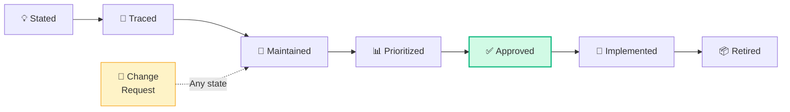
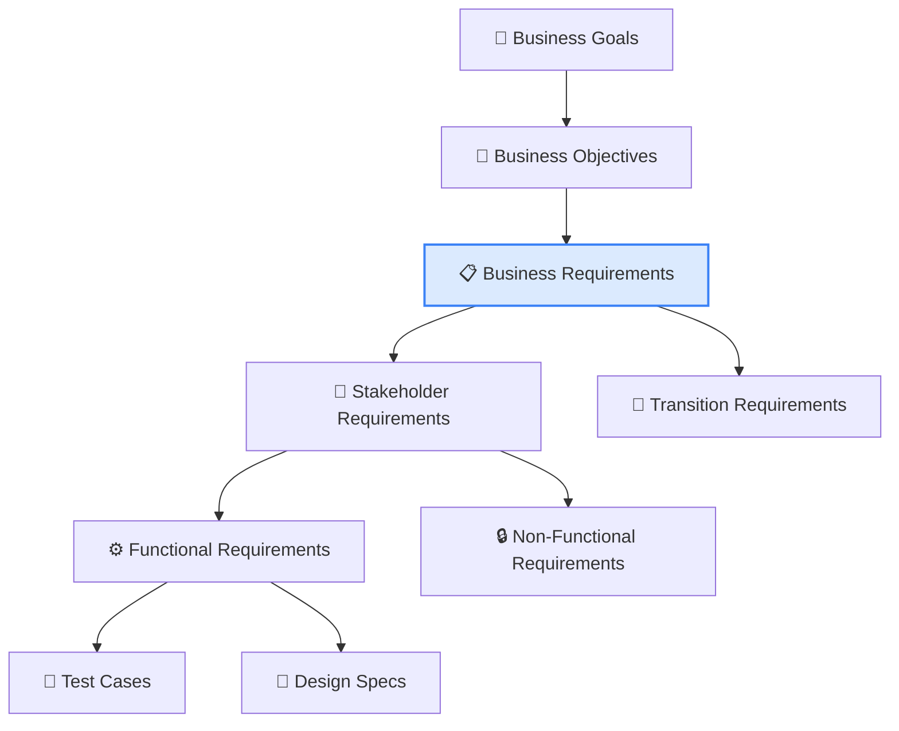
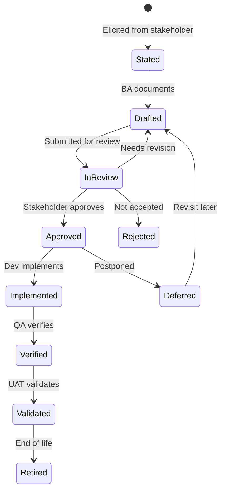
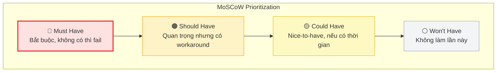
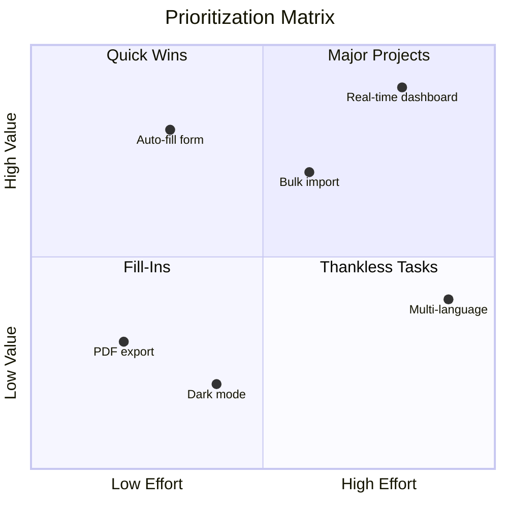
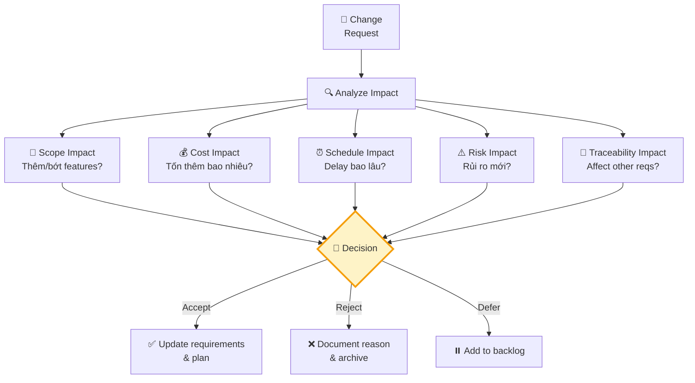
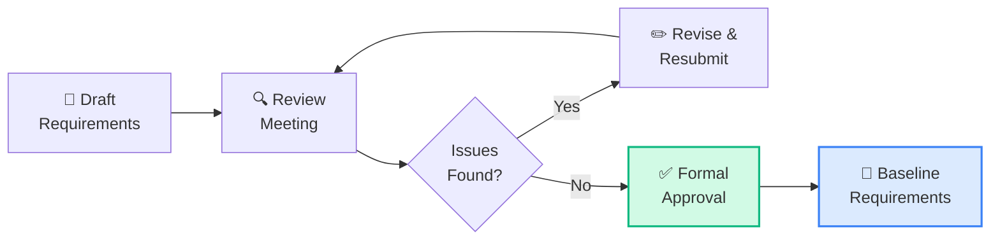

## Tổng quan Requirements Life Cycle Management

**Requirements Life Cycle Management (RLCM)** chiếm **18% đề thi CCBA** (~23 câu). RLCM quản lý yêu cầu xuyên suốt **toàn bộ vòng đời** — từ khi phát sinh, qua phân tích, phê duyệt, triển khai, cho đến khi retire.

## 5 Tasks trong RLCM

### Task 1: Trace Requirements

#### Mục đích
Thiết lập và duy trì **mối liên hệ** (relationships) giữa các yêu cầu ở các cấp độ khác nhau, và giữa yêu cầu với các artifacts khác.

#### Traceability Relationships

#### 4 loại Traceability Relationships

| Relationship | Ý nghĩa | Ví dụ |
|-------------|---------|-------|
| **Derive** | Requirement B được suy ra từ A | Business req → Functional req |
| **Depends** | B phụ thuộc vào A để thực hiện | Login depends on Registration |
| **Satisfy** | B đáp ứng/thỏa mãn A | Test case satisfies requirement |
| **Cover** | B bao phủ nội dung của A | Design covers requirement |

#### Traceability Matrix

| Req ID | Business Req | Stakeholder Req | Functional Req | Test Case | Status |
|:------:|:-----------:|:--------------:|:--------------:|:---------:|:------:|
| BR-001 | Tăng hiệu suất | — | — | — | Approved |
| SR-001 | ← BR-001 | Nhập nhanh hơn | — | — | Approved |
| FR-001 | ← BR-001 | ← SR-001 | Auto-fill form | TC-001 | In Dev |
| FR-002 | ← BR-001 | ← SR-001 | Bulk import | TC-002 | Draft |

<Callout type="tip" title="Forward vs Backward Traceability">
- **Forward traceability**: Business req → Functional req → Test case (đảm bảo mọi yêu cầu được implement & test)
- **Backward traceability**: Test case → Functional req → Business req (đảm bảo mọi thứ đều có nguồn gốc)
- **Bi-directional**: Tốt nhất, nhưng tốn effort nhất
</Callout>

### Task 2: Maintain Requirements

#### Mục đích
Đảm bảo requirements luôn **chính xác, nhất quán và up-to-date** qua các thay đổi.

#### Requirements States

#### Requirements Attributes cần duy trì

| Attribute | Mô tả | Ví dụ |
|----------|--------|-------|
| **ID** | Định danh duy nhất | REQ-001, US-042 |
| **Name/Title** | Tên ngắn gọn | "Auto-fill customer form" |
| **Description** | Mô tả chi tiết | As a user, I want... |
| **Status** | Trạng thái hiện tại | Draft, Approved, Implemented |
| **Priority** | Mức độ ưu tiên | Must, Should, Could, Won't |
| **Owner** | Người chịu trách nhiệm | Product Owner |
| **Source** | Nguồn gốc yêu cầu | Customer interview 03/15 |
| **Version** | Phiên bản | v1.2 |
| **Rationale** | Lý do tồn tại | Giảm lỗi nhập liệu 50% |
| **Dependencies** | Các yêu cầu phụ thuộc | Depends on REQ-003 |

### Task 3: Prioritize Requirements

#### Mục đích
Xác định **thứ tự ưu tiên** của requirements dựa trên business value, risk, cost, dependencies.

#### Kỹ thuật Prioritization

##### MoSCoW Method

| Category | Tỷ lệ khuyến nghị | Ví dụ |
|----------|:--:|-------|
| **Must** | 60% | Đăng nhập, thanh toán, bảo mật |
| **Should** | 20% | Báo cáo nâng cao, notification |
| **Could** | 20% | Dark mode, export PDF |
| **Won't** | — | Multi-language (v2) |

##### Business Value vs Implementation Effort

##### Timeboxing/Budgeting
- Ấn định **thời gian/ngân sách cố định**
- Ưu tiên requirements cho đến khi hết capacity
- Phổ biến trong Agile (Sprint capacity)

##### Voting/Multi-Voting
- Mỗi stakeholder được N votes
- Phân bổ votes cho requirements quan trọng nhất
- Simple, democratic, nhưng có thể bị bias

<Callout type="info" title="Factors ảnh hưởng đến Priority">
- **Business value** — Giá trị kinh doanh mang lại
- **Risk** — Rủi ro nếu không implement
- **Cost** — Chi phí implementation
- **Dependencies** — Phụ thuộc vào requirements khác
- **Time sensitivity** — Deadline, regulatory, market window
- **Stakeholder agreement** — Đồng thuận các bên
</Callout>

### Task 4: Assess Requirements Changes

#### Mục đích
Đánh giá **tác động** của thay đổi yêu cầu trước khi quyết định accept/reject.

#### Change Assessment Process

#### Impact Analysis Template

| Aspect | Questions | Example |
|--------|----------|---------|
| **Scope** | Thêm/bớt features nào? | Thêm 2 user stories, ảnh hưởng 3 existing |
| **Cost** | Budget thêm bao nhiêu? | +$15,000 development |
| **Schedule** | Delay bao lâu? | +2 weeks, push release date |
| **Quality** | Ảnh hưởng quality? | Cần thêm 30 test cases |
| **Resources** | Cần thêm resources? | +1 developer for 2 sprints |
| **Risk** | Rủi ro mới? | Integration risk with legacy system |
| **Dependencies** | Requirements bị ảnh hưởng? | FR-005, FR-008 affected |

### Task 5: Approve Requirements

#### Mục đích
Đảm bảo requirements được **chính thức phê duyệt** bởi stakeholder có thẩm quyền trước khi implement.

#### Approval Process

#### Approval Methods

| Method | Formality | Khi nào |
|--------|:---------:|--------|
| **Sign-off document** | Cao | Regulated, large projects |
| **Email confirmation** | Trung bình | Standard projects |
| **Sprint review accept** | Thấp | Agile projects |
| **Verbal agreement** | Rất thấp | Small changes, informal |

<Callout type="warning" title="Baseline vs Approved">
- **Approved**: Stakeholder đồng ý requirement đó đúng
- **Baselined**: Set of approved requirements được "đóng băng" tại một thời điểm, mọi thay đổi sau đó phải qua change control
</Callout>

## Ví dụ Scenario câu hỏi CCBA

> **Scenario:** Bản nháp đầu tiên của requirements specification đã hoàn thành và sẵn sàng để stakeholders review nhằm đảm bảo requirements và designs đã được định nghĩa đúng. Kỹ thuật nào sẽ đảm bảo requirements đã được xác định **đúng**?
>
> A. Brainstorm measurable evaluation criteria  
> B. **Apply a checklist to verify quality** ✅  
> C. Evaluate the alignment with solution scope  
> D. Create list of assumptions to support requirements
>
> → Đáp án B: Sử dụng **review checklist** để verify quality of requirements — đây là kỹ thuật phổ biến nhất để kiểm tra chất lượng yêu cầu.

## Techniques cho RLCM

| Technique | Task | Mô tả |
|----------|:----:|--------|
| **Traceability Matrix** | T1 | Ma trận theo dõi mối liên hệ requirements |
| **Business Rules Analysis** | T2 | Phân tích và maintain business rules |
| **MoSCoW** | T3 | Phân loại Must/Should/Could/Won't |
| **Timeboxing** | T3 | Ưu tiên theo capacity |
| **Voting** | T3 | Bỏ phiếu ưu tiên |
| **Impact Analysis** | T4 | Đánh giá tác động thay đổi |
| **Reviews** | T5 | Kiểm tra chất lượng requirements |
| **Decision Analysis** | T4, T5 | Phân tích quyết định |

## 📝 Tóm tắt kiến thức nổi bật

<Callout type="success" title="Key Takeaways — Bài 6">
- RLCM chiếm **18% đề thi** (~23 câu) — KA lớn thứ 3
- **5 Tasks**: Trace Requirements, Maintain Requirements, Prioritize Requirements, Assess Requirements Changes, Approve Requirements
- **Traceability**: 4 relationships — Derive, Depends, Satisfy, Cover; bi-directional (forward + backward)
- **MoSCoW**: Must Have (60%) / Should Have (20%) / Could Have (20%) / Won't Have (0%) — ưu tiên Must trước
- **Change Assessment**: Impact Analysis xem xét Scope, Cost, Schedule, Quality, Risk, Dependencies
- **Approved ≠ Baselined**: Approved = đồng ý implement; Baselined = frozen set, thay đổi phải qua change control
- Mỗi requirement cần **6+ attributes**: ID, Status, Priority, Owner, Rationale, Dependencies
</Callout>

## Tóm tắt & Checklist ôn tập

- [ ] Hiểu 5 Tasks trong RLCM và luồng lifecycle
- [ ] Nắm 4 loại Traceability Relationships
- [ ] Biết cách duy trì Requirements Attributes
- [ ] Nắm vững MoSCoW và các kỹ thuật Prioritization
- [ ] Hiểu Change Assessment Process
- [ ] Phân biệt Approved vs Baselined

---

## 📋 Bài kiểm tra trắc nghiệm — Bài 6

<Callout type="info" title="Hướng dẫn làm bài">
Làm **10 câu** bên dưới trong **14 phút**. Chọn **MỘT đáp án đúng nhất**. Đáp án ở cuối bài.
</Callout>

**Câu 1.** Requirements đã được baselined. Stakeholder yêu cầu thêm feature mới. BA nên làm gì TRƯỚC TIÊN?

- A. Thêm vào requirements document
- B. Từ chối vì đã baselined
- C. Đánh giá impact của change request
- D. Chuyển cho PM quyết định

**Câu 2.** Trong MoSCoW, "Must Have" requirements chiếm khoảng bao nhiêu %?

- A. 100% — tất cả đều must have
- B. 80%
- C. 60%
- D. 40%

**Câu 3.** Traceability relationship "Derive" có nghĩa là:

- A. Requirement A phụ thuộc vào requirement B
- B. Requirement A được tạo ra/chi tiết hóa từ requirement B
- C. Requirement A thỏa mãn requirement B
- D. Requirement A bao phủ requirement B

**Câu 4.** BA đang maintain requirements. Attribute nào KHÔNG phải là attributes chuẩn?

- A. Status
- B. Priority
- C. Developer name
- D. Rationale

**Câu 5.** Sự khác biệt chính giữa "Approved" và "Baselined" requirements là:

- A. Không có sự khác biệt
- B. Approved = đồng ý implement; Baselined = frozen, mọi thay đổi phải qua change control
- C. Baselined xảy ra trước Approved
- D. Approved chỉ áp dụng cho Functional Requirements

**Câu 6.** Stakeholder A muốn Feature X là Must Have, Stakeholder B muốn Feature Y là Must Have, nhưng budget chỉ đủ cho 1. BA nên:

- A. Chọn feature của stakeholder cấp cao hơn
- B. Sử dụng kỹ thuật prioritization dựa trên business value
- C. Loại bỏ cả hai features
- D. Để development team quyết định

**Câu 7.** Forward traceability giúp:

- A. Theo dõi requirement nguồn gốc từ đâu
- B. Theo dõi requirement được implement và test ở đâu
- C. Tìm requirements bị trùng lặp
- D. Đánh giá chất lượng requirements

**Câu 8.** Khi assess một change request, BA cần đánh giá impact lên:

- A. Chỉ scope
- B. Chỉ scope và cost
- C. Scope, cost, schedule, quality, risk, và dependencies
- D. Chỉ technical feasibility

**Câu 9.** Requirement status flow đúng là:

- A. Draft → Approved → Stated → Implemented
- B. Stated → Draft → Reviewed → Approved → Implemented → Retired
- C. Approved → Draft → Implemented
- D. Implemented → Approved → Retired

**Câu 10.** BA phát hiện 2 requirements mâu thuẫn nhau trong traceability matrix. Bước tiếp theo là:

- A. Xóa requirement mới hơn
- B. Analyze conflict, communicate with stakeholders, resolve
- C. Giữ cả hai, để team tự quyết
- D. Escalate lên senior management

---

### 🔑 Đáp án & Giải thích

| Câu | Đáp án | Giải thích |
|:---:|:------:|-----------|
| 1 | **C** | Baselined = change control. Bước đầu tiên luôn là assess impact trước khi quyết định accept/reject. |
| 2 | **C** | Guideline: Must ~60%, Should ~20%, Could ~20%, Won't 0%. Must > 80% = scope creep risk. |
| 3 | **B** | Derive = requirement con được tạo/chi tiết hóa từ requirement cha (Business → Stakeholder → Solution). |
| 4 | **C** | Standard attributes: ID, Status, Priority, Owner, Rationale, Dependencies. "Developer name" không phải requirement attribute. |
| 5 | **B** | Approved = stakeholders agree to implement. Baselined = frozen snapshot, changes require formal change control. |
| 6 | **B** | BA sử dụng objective prioritization (Business Value vs Effort, MoSCoW consensus) — không quyết định dựa trên seniority. |
| 7 | **B** | Forward traceability: Business Req → Functional Req → Design → Test Cases → Implementation. |
| 8 | **C** | Impact analysis phải comprehensive: scope, cost, schedule, quality, risk, dependencies với requirements khác. |
| 9 | **B** | Stated → Draft → Reviewed → Approved → Implemented → Retired — lifecycle đầy đủ. |
| 10 | **B** | Conflicting requirements → analyze root cause → communicate với stakeholders liên quan → resolve. Không tự quyết. |

### 📊 Thang đánh giá

| Số câu đúng | Đánh giá | Hành động |
|:-----------:|---------|-----------|
| 9-10 | ⭐ Xuất sắc | RLCM nắm vững! |
| 7-8 | ✅ Tốt | Ôn lại Traceability types và Change Assessment |
| 5-6 | ⚠️ Trung bình | Đọc lại MoSCoW và Approved vs Baselined |
| < 5 | ❌ Cần ôn lại | RLCM 18% đề thi — cần đầu tư thêm |

---

## Tiếp theo

Bài tiếp theo sẽ đi vào **Strategy Analysis (12%)** — phân tích chiến lược, bao gồm Current State, Future State, Risk Assessment và Change Strategy.

---

*Quản lý tốt requirements = quản lý tốt dự án! 🔄*
