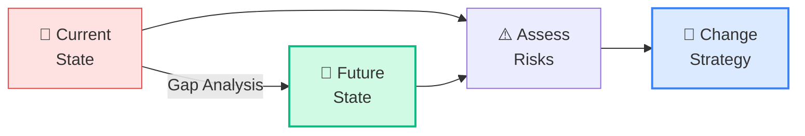
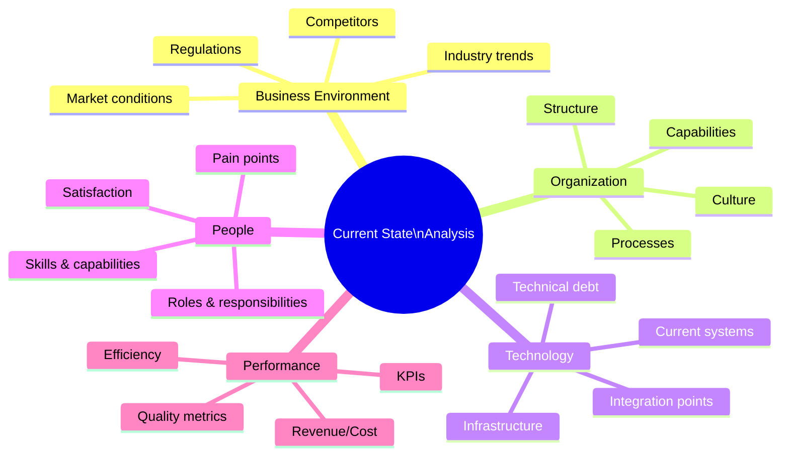
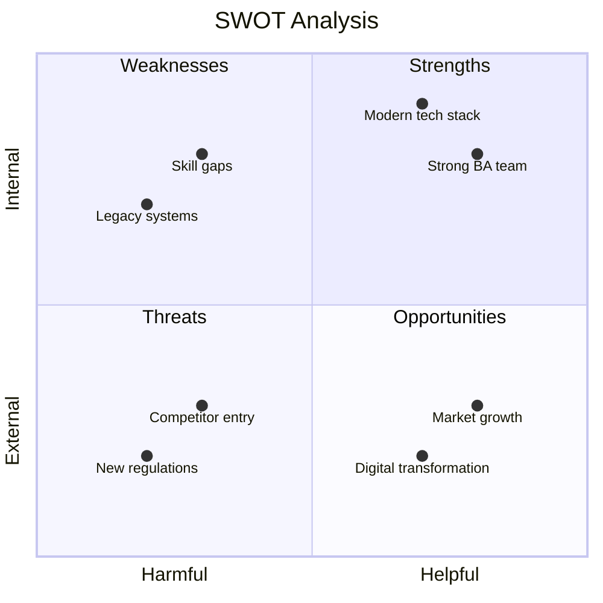
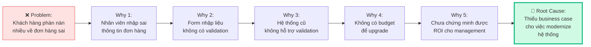
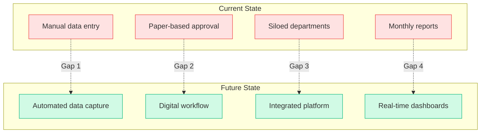
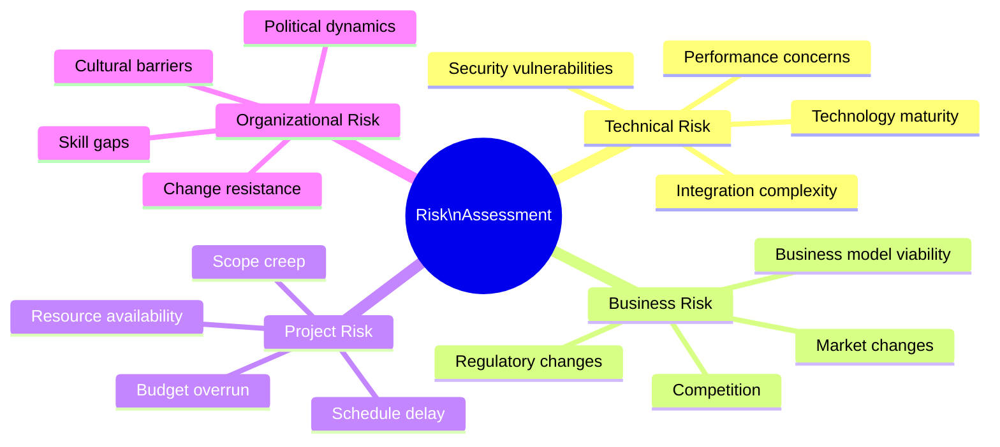
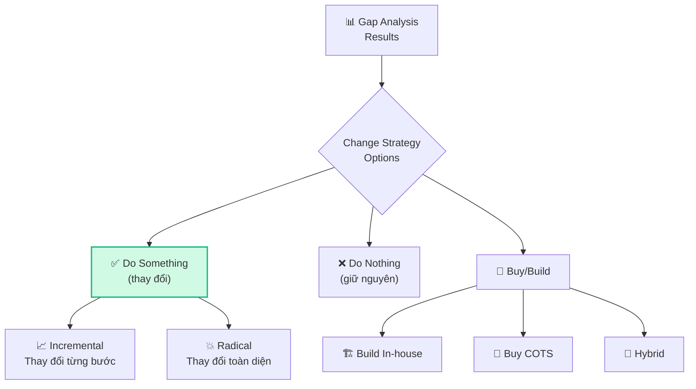

## Tổng quan Strategy Analysis

**Strategy Analysis (SA)** chiếm **12% đề thi CCBA** (~16 câu). Đây là Knowledge Area tập trung vào **tư duy cấp chiến lược** — hiểu tình trạng hiện tại, định nghĩa tương lai mong muốn, đánh giá rủi ro, và xác định chiến lược thay đổi.

## 5 Tasks trong Strategy Analysis

### Task 1: Analyze Current State

#### Mục đích
Hiểu rõ **tình trạng hiện tại** của tổ chức — quy trình, hệ thống, con người, vấn đề — trước khi đề xuất thay đổi.

#### Các thành phần cần phân tích

#### SWOT Analysis

| Quadrant | Mô tả | Chiến lược |
|----------|--------|----------|
| **Strengths** (Internal, Helpful) | Điểm mạnh nội bộ | Leverage & Maximize |
| **Weaknesses** (Internal, Harmful) | Điểm yếu nội bộ | Improve & Minimize |
| **Opportunities** (External, Helpful) | Cơ hội bên ngoài | Exploit & Capitalize |
| **Threats** (External, Harmful) | Đe dọa bên ngoài | Mitigate & Monitor |

**4 chiến lược SWOT:**

| | Opportunities | Threats |
|---|:---:|:---:|
| **Strengths** | **SO**: Dùng S để khai thác O | **ST**: Dùng S để chống T |
| **Weaknesses** | **WO**: Khắc phục W để tận dụng O | **WT**: Giảm W, tránh T |

<Callout type="tip" title="Câu hỏi thi CCBA về SWOT">
Đề thi thường hỏi: "Trong SWOT, quadrant ST đại diện cho giao điểm của gì?" → **Current Strengths với Current Threats** (dùng điểm mạnh hiện tại để đối phó mối đe dọa).
</Callout>

#### Root Cause Analysis

### Task 2: Define Future State

#### Mục đích
Xác định **trạng thái mong muốn** trong tương lai — tổ chức sẽ như thế nào sau khi thay đổi được triển khai.

#### Gap Analysis: Current → Future

#### Future State Components

| Component | Mô tả | Ví dụ |
|----------|--------|-------|
| **Business Goals** | Mục tiêu kinh doanh cấp cao | Tăng doanh thu 20% |
| **Business Objectives** | Mục tiêu cụ thể, đo lường được (SMART) | Giảm thời gian xử lý đơn hàng từ 2h xuống 30 phút |
| **Capabilities** | Năng lực cần có | Automated order processing |
| **Solution Scope** | Phạm vi giải pháp | ERP module + API integration |
| **Constraints** | Ràng buộc | Budget $500K, timeline 12 months |
| **Assumptions** | Giả định | IT team available, data quality OK |

<Callout type="info" title="SMART Objectives">
Business Objectives phải **SMART**: Specific (Cụ thể), Measurable (Đo được), Achievable (Khả thi), Relevant (Liên quan), Time-bound (Có thời hạn).
</Callout>

### Task 3: Assess Risks

#### Risk Categories

#### Risk Assessment Matrix

| | Low Impact | Medium Impact | High Impact |
|---|:-:|:-:|:-:|
| **High Probability** | 🟡 Medium | 🟠 High | 🔴 Critical |
| **Medium Probability** | 🟢 Low | 🟡 Medium | 🟠 High |
| **Low Probability** | 🟢 Low | 🟢 Low | 🟡 Medium |

#### Risk Response Strategies

| Strategy | Mô tả | Ví dụ |
|----------|--------|-------|
| **Avoid** | Loại bỏ nguyên nhân rủi ro | Chọn công nghệ mature thay vì cutting-edge |
| **Transfer** | Chuyển rủi ro cho bên khác | Outsource, insurance |
| **Mitigate** | Giảm xác suất hoặc tác động | Pilot program, phased rollout |
| **Accept** | Chấp nhận rủi ro | Documented risk, contingency plan |

### Task 4: Define Change Strategy

#### Change Strategy Options

#### Solution Options Evaluation

| Criteria | Option A: Build | Option B: Buy (COTS) | Option C: Hybrid |
|---------|:---:|:---:|:---:|
| **Initial Cost** | $$$$ | $$ | $$$ |
| **Time to Market** | 12 months | 3 months | 6 months |
| **Customization** | 100% | Limited | Medium |
| **Maintenance** | Internal team | Vendor | Shared |
| **Risk** | High | Low | Medium |
| **Fit with needs** | Perfect | 80% | 90% |
| **Score** | ⭐⭐ | ⭐⭐⭐ | ⭐⭐⭐⭐ |

#### Business Case Components

| Section | Nội dung |
|---------|---------|
| **Problem Statement** | Vấn đề cần giải quyết |
| **Proposed Solution** | Giải pháp đề xuất |
| **Benefits** | Lợi ích mang lại (quantified) |
| **Costs** | Chi phí triển khai |
| **ROI Analysis** | Return on Investment |
| **Risk Assessment** | Rủi ro và mitigation |
| **Timeline** | Kế hoạch triển khai |
| **Recommendation** | Đề xuất quyết định |

## Techniques cho Strategy Analysis

| Technique | Task | Mô tả |
|----------|:----:|--------|
| **SWOT Analysis** | T1 | Phân tích điểm mạnh/yếu/cơ hội/đe dọa |
| **PESTLE Analysis** | T1 | Political, Economic, Social, Tech, Legal, Environmental |
| **Root Cause Analysis** | T1 | 5 Whys, Fishbone diagram |
| **Benchmarking** | T1, T2 | So sánh với industry best practices |
| **Gap Analysis** | T2 | So sánh current vs future state |
| **Decision Analysis** | T4 | Đánh giá options |
| **Financial Analysis** | T4 | ROI, NPV, Payback period |
| **Risk Analysis** | T3 | Probability × Impact matrix |
| **Feasibility Analysis** | T4 | Technical, operational, financial feasibility |

## Ví dụ Scenario câu hỏi CCBA

> **Scenario:** BA đã định nghĩa future state cho một tổ chức tài chính, phù hợp với tầm nhìn tổng thể. Đâu là ví dụ về **business objective** trong future state?
>
> A. Ghi nhận chi tiết khách hàng để báo cáo  
> B. Phát triển portal mới để bán sản phẩm và dịch vụ  
> C. **Tăng doanh số 30% vào cuối năm sau** ✅  
> D. Tạo help text tốt hơn trên portal hiện tại
>
> → Đáp án C: Business objective phải **SMART** — cụ thể, đo lường được, có thời hạn. Chỉ có C đáp ứng đủ tiêu chí.

## 📝 Tóm tắt kiến thức nổi bật

<Callout type="success" title="Key Takeaways — Bài 7">
- Strategy Analysis chiếm **12% đề thi** (~16 câu)
- **4 Tasks**: Analyze Current State, Define Future State, Assess Risks, Define Change Strategy
- **SWOT Analysis**: 4 strategies — SO (khai thác), ST (đối phó), WO (cải thiện), WT (phòng thủ)
- **Gap Analysis**: So sánh Current State vs Future State → xác định gaps → define actions
- **SMART Objectives**: Specific, Measurable, Achievable, Relevant, Time-bound
- **Risk Assessment**: Probability × Impact → Response Strategies: Avoid, Mitigate, Transfer, Accept
- **Solution Options**: Đánh giá theo Feasibility, Cost, Benefit, Risk, Time-to-Value
</Callout>

## Tóm tắt & Checklist ôn tập

- [ ] Hiểu 4 Tasks chính trong Strategy Analysis
- [ ] Nắm vững SWOT Analysis và 4 chiến lược (SO, ST, WO, WT)
- [ ] Biết cách làm Gap Analysis (Current → Future)
- [ ] Hiểu Risk Assessment Matrix & Response Strategies
- [ ] Nắm các tiêu chí đánh giá Solution Options
- [ ] Biết SMART Objectives

---

## 📋 Bài kiểm tra trắc nghiệm — Bài 7

<Callout type="info" title="Hướng dẫn làm bài">
Làm **10 câu** bên dưới trong **14 phút**. Chọn **MỘT đáp án đúng nhất**. Đáp án ở cuối bài.
</Callout>

**Câu 1.** BA đang phân tích tình trạng hiện tại của doanh nghiệp. Task nào trong Strategy Analysis BA đang thực hiện?

- A. Define Future State
- B. Analyze Current State
- C. Assess Risks
- D. Define Change Strategy

**Câu 2.** Công ty có đội BA mạnh (Strength) nhưng thị trường đang giảm (Threat). SWOT strategy phù hợp là:

- A. SO — leverage strength, exploit opportunity
- B. ST — use strength to counter threat
- C. WO — overcome weakness to use opportunity
- D. WT — minimize weakness and avoid threat

**Câu 3.** Business objective "Tăng doanh số" không phải SMART vì thiếu yếu tố nào?

- A. Specific và Measurable
- B. Achievable
- C. Relevant
- D. Time-bound

**Câu 4.** Trong Risk Assessment, risk có Probability = High, Impact = High nên được response bằng:

- A. Accept — chấp nhận rủi ro
- B. Avoid hoặc Mitigate — giảm thiểu hoặc tránh
- C. Transfer — chuyển cho bên khác
- D. Ignore — bỏ qua

**Câu 5.** Gap Analysis nhằm mục đích:

- A. Đánh giá performance của team
- B. Xác định khoảng cách giữa Current State và Future State
- C. Phân tích financial metrics
- D. Đánh giá stakeholder engagement

**Câu 6.** BA đã xác định Future State gồm mục tiêu SMART. Bước tiếp theo theo Strategy Analysis là:

- A. Bắt đầu implement ngay
- B. Assess Risks liên quan đến change
- C. Quay lại Analyze Current State
- D. Viết test cases

**Câu 7.** Root Cause Analysis technique phù hợp nhất là:

- A. SWOT Analysis
- B. Fishbone Diagram (Ishikawa)
- C. Stakeholder Map
- D. RACI Matrix

**Câu 8.** Risk response "Transfer" nghĩa là:

- A. Loại bỏ rủi ro hoàn toàn
- B. Chuyển trách nhiệm rủi ro cho bên thứ ba (insurance, outsource)
- C. Giảm probability hoặc impact
- D. Chấp nhận rủi ro và không làm gì

**Câu 9.** Khi đánh giá Solution Options, tiêu chí nào thường được ưu tiên nhất?

- A. Giải pháp rẻ nhất
- B. Giải pháp nhanh nhất
- C. Giải pháp có business value cao nhất phù hợp với business objectives
- D. Giải pháp mới nhất trên thị trường

**Câu 10.** BA phát hiện current state có nhiều manual processes gây chậm. Future state mong muốn là automation. Gap analysis cho thấy:

- A. Cần training team
- B. Cần technology solution để bridge gap
- C. Không có gap
- D. Cần thêm nhân sự

---

### 🔑 Đáp án & Giải thích

| Câu | Đáp án | Giải thích |
|:---:|:------:|-----------|
| 1 | **B** | Phân tích tình trạng hiện tại = Analyze Current State — Task 1 trong SA. |
| 2 | **B** | Strength + Threat = ST strategy — dùng điểm mạnh để đối phó mối đe dọa. |
| 3 | **A** | "Tăng doanh số" thiếu Specific (tăng bao nhiêu?) và Measurable (đo bằng gì?). Nên là "Tăng doanh số 20% trong Q4/2026". |
| 4 | **B** | High Probability × High Impact = critical risk → Avoid (loại bỏ) hoặc Mitigate (giảm thiểu). Không chấp nhận. |
| 5 | **B** | Gap Analysis = Current State vs Future State → identify gaps → define actions to bridge. |
| 6 | **B** | Sau Define Future State → Assess Risks → Define Change Strategy → implement. |
| 7 | **B** | Fishbone/Ishikawa Diagram là root cause analysis technique chuẩn — categorize causes. |
| 8 | **B** | Transfer = chuyển risk cho third party (insurance, outsource, SLA guarantees). |
| 9 | **C** | Business value alignment là tiêu chí quan trọng nhất — không phải rẻ nhất hay nhanh nhất. |
| 10 | **B** | Manual → Automation = technology gap → cần technology solution (software, automation tools). |

### 📊 Thang đánh giá

| Số câu đúng | Đánh giá | Hành động |
|:-----------:|---------|-----------|
| 9-10 | ⭐ Xuất sắc | Strategy Analysis đã nắm vững! |
| 7-8 | ✅ Tốt | Ôn lại SWOT strategies và Risk Response |
| 5-6 | ⚠️ Trung bình | Đọc lại bài, focus vào Gap Analysis và SMART |
| < 5 | ❌ Cần ôn lại | Ôn kỹ 4 Tasks và mối quan hệ giữa chúng |

---

## Tiếp theo

Bài tiếp theo sẽ đi vào **Requirements Analysis & Design Definition (Phần 1)** — Knowledge Area quan trọng nhất chiếm 32% đề thi!

---

*Think strategic, act tactical! 🎯*
