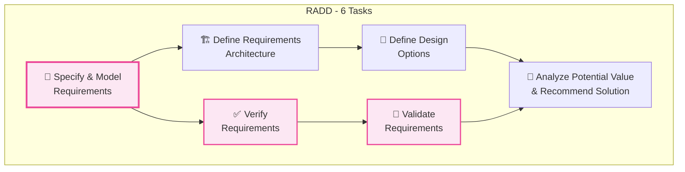
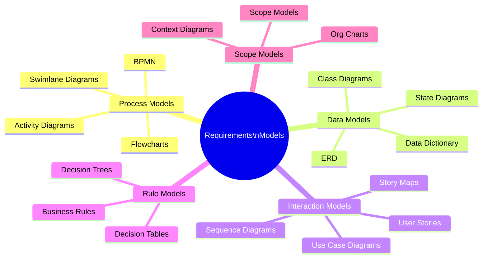
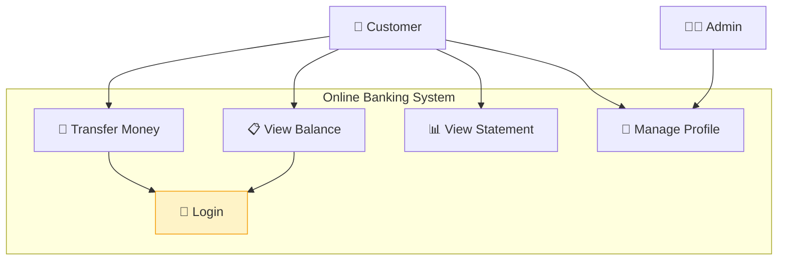
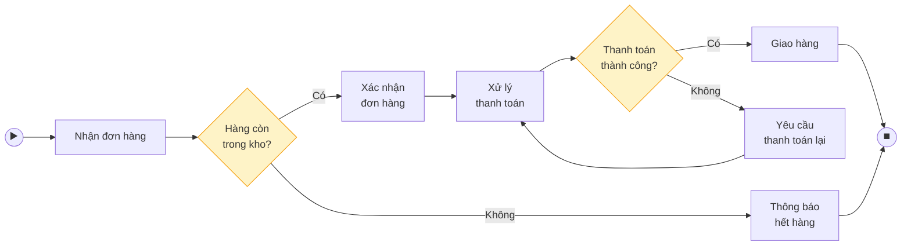
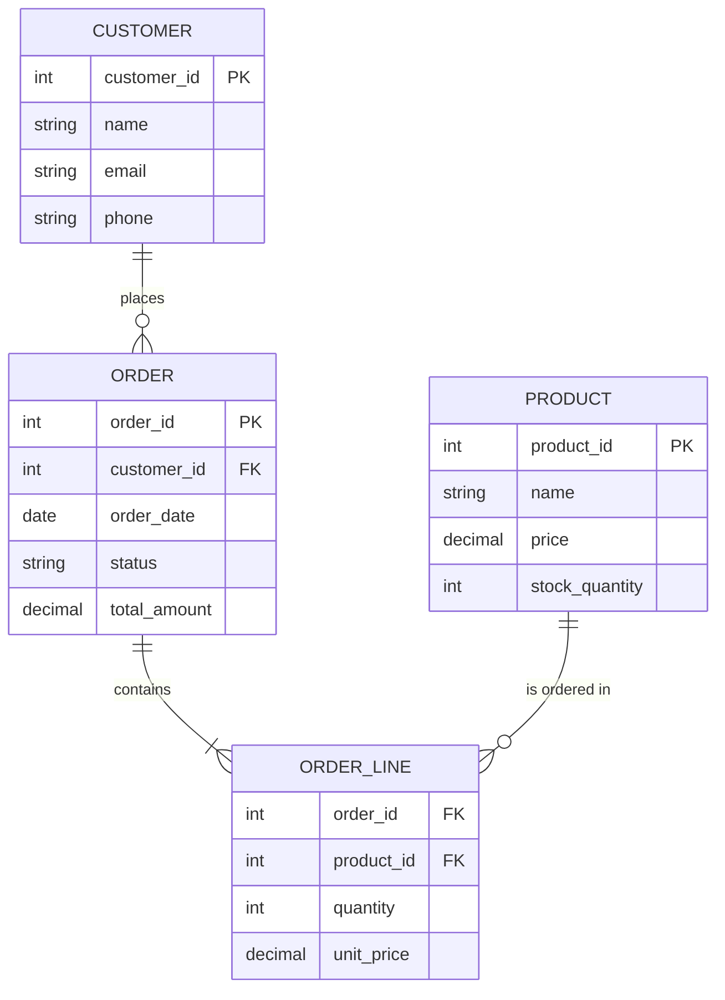
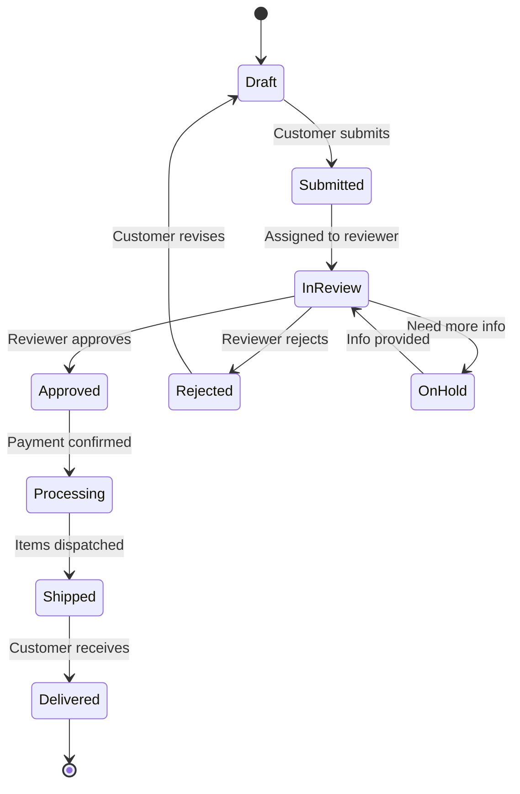
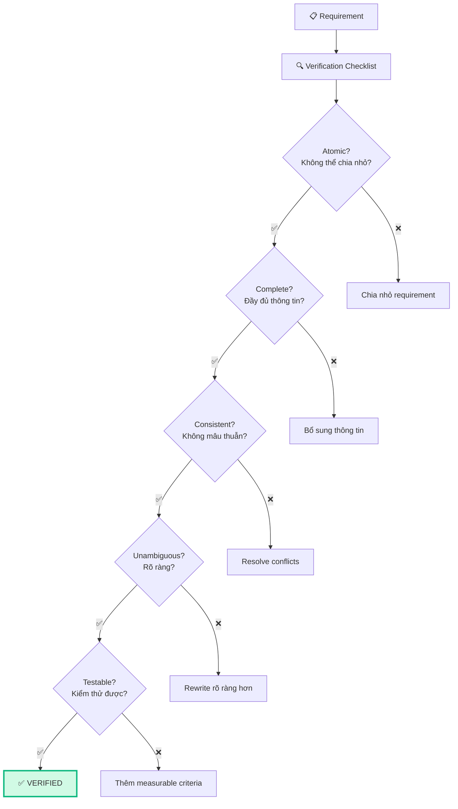
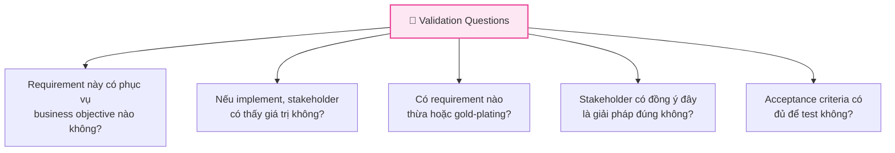

## Tổng quan RADD

**Requirements Analysis & Design Definition (RADD)** chiếm **32% đề thi CCBA** (~42 câu) — đây là Knowledge Area **quan trọng nhất**, quyết định pass/fail. RADD bao gồm toàn bộ hoạt động từ **đặc tả yêu cầu** → **mô hình hóa** → **verify/validate** → **thiết kế giải pháp**.



**Bài này (Phần 1):** Tasks 1-3 — Specify, Model, Verify, Validate  
**Bài sau (Phần 2):** Tasks 4-6 — Architecture, Design Options, Recommend

## Task 1: Specify and Model Requirements

### Mục đích
Chuyển yêu cầu từ dạng **raw/informal** thành dạng **formal/structured** sử dụng text và/hoặc models.

### Requirements Specification

#### Đặc tả bằng Text

**User Story format:**
```
As a [role],
I want to [action],
So that [benefit].

Acceptance Criteria:
- Given [context], When [action], Then [result]
- Given [context], When [action], Then [result]
```

**Ví dụ:**
```
As a warehouse manager,
I want to scan barcodes to update inventory automatically,
So that I can reduce manual counting errors by 90%.

Acceptance Criteria:
- Given a valid barcode, When scanned, Then inventory count updates in < 2 seconds
- Given an invalid barcode, When scanned, Then system displays error message
- Given a product at zero stock, When scanned for outbound, Then system blocks and alerts
```

#### Characteristics of Good Requirements

| Characteristic | Giải thích | Bad Example | Good Example |
|---------------|-----------|-------------|-------------|
| **Atomic** | Không thể chia nhỏ hơn | "Login and register" | "Login" (separate from "Register") |
| **Complete** | Đầy đủ thông tin | "System fast" | "Page loads in < 2 seconds" |
| **Consistent** | Không mâu thuẫn | "Must and should not..." | Chỉ một statement rõ ràng |
| **Concise** | Ngắn gọn, súc tích | Paragraph dài dòng | 1-2 câu rõ ràng |
| **Feasible** | Khả thi kỹ thuật | "100% uptime" | "99.9% uptime" |
| **Unambiguous** | Không mơ hồ | "User-friendly" | "Max 3 clicks to complete task" |
| **Testable** | Có thể kiểm thử | "Should work well" | "Response time < 500ms" |
| **Traceable** | Truy vết được nguồn | Không có ID/source | REQ-042, source: Workshop 03/15 |

<Callout type="warning" title="Verify = đúng chất lượng, Validate = đúng mục tiêu">
- **Verify**: "Are we building the product RIGHT?" (đặc tả có đúng standards không?)
- **Validate**: "Are we building the RIGHT product?" (giải pháp có đáp ứng business need không?)
</Callout>

### Đặc tả bằng Models (Mô hình hóa)

#### Các loại mô hình trong BABOK



#### 1. Use Case Diagram



#### 2. Process Flow (BPMN-style)



#### 3. Entity Relationship Diagram (ERD)



#### 4. State Diagram



#### 5. Decision Table

| | Rule 1 | Rule 2 | Rule 3 | Rule 4 |
|---|:---:|:---:|:---:|:---:|
| **Conditions** | | | | |
| Order > $1000? | Y | Y | N | N |
| VIP Customer? | Y | N | Y | N |
| **Actions** | | | | |
| Discount % | 20% | 10% | 15% | 0% |
| Free shipping? | ✅ | ✅ | ✅ | ❌ |

### Khi nào dùng Text vs Model?

| Tiêu chí | Text (User Stories, BRD) | Model (Diagrams) |
|---------|:---:|:---:|
| Complex logic | ❌ | ✅ Decision tables, state diagrams |
| Sequential process | ⭐ | ✅✅ Flowcharts, BPMN |
| Data relationships | ❌ | ✅✅ ERD, Class diagrams |
| User interactions | ⭐ | ✅ Use cases, wireframes |
| Business rules | ✅ | ✅ Decision tables |
| Simple requirements | ✅✅ | ❌ Overkill |
| Non-technical audience | ✅ | ⭐ (if visual) |

## Task 2: Verify Requirements

### Mục đích
Kiểm tra requirements có **đúng chất lượng** không — đúng format, không mơ hồ, nhất quán.

### Verification Checklist



### Verification vs Validation

| | Verification | Validation |
|---|-------------|-----------|
| **Câu hỏi** | "Building it RIGHT?" | "Building RIGHT thing?" |
| **Focus** | Quality of requirements | Alignment with goals |
| **Who** | BA, QA, Dev | Stakeholder, Business |
| **When** | During specification | After specification |
| **Method** | Checklist, peer review | Walkthrough, prototype |

## Task 3: Validate Requirements

### Mục đích
Đảm bảo requirements **đáp ứng đúng business need** — giải pháp từ requirements sẽ thực sự giải quyết vấn đề.

### Validation Techniques

| Technique | Mô tả | Khi nào |
|----------|--------|--------|
| **Structured Walkthrough** | Đi qua từng requirement với stakeholder | After specification |
| **Prototyping** | Demo prototype cho stakeholder | Complex UI/UX |
| **Acceptance Criteria Review** | Review AC với stakeholder & QA | Before development |
| **Simulation** | Mô phỏng quy trình với requirements mới | Process changes |
| **Day-in-the-Life Testing** | Stakeholder "sống" với requirements 1 ngày | Major changes |

### Validation Questions



## Ví dụ Scenario câu hỏi CCBA

> **Scenario:** Một tổ chức duy trì kho dữ liệu trung tâm cho sản phẩm mới, được xây dựng hơn 10 năm trước, ban đầu là spreadsheet, sau đó qua nhiều phiên bản custom solution. Hệ thống hiện tại có nhiều vấn đề và không có bộ yêu cầu baseline rõ ràng. BA được giao nhiệm vụ bắt đầu thu thập yêu cầu. BA nên làm gì?
>
> A. **Document the current solution's existing functionality** ✅  
> B. Develop the performance measures for the new solution  
> C. Create a wish list of desired performance functionality  
> D. Review the features of commercial off-the-shelf products
>
> → Đáp án A: Khi không có baseline requirements, bước đầu tiên là **document hiện trạng** (current state analysis) trước khi làm bất cứ điều gì khác.

## 📝 Tóm tắt kiến thức nổi bật

<Callout type="success" title="Key Takeaways — Bài 8">
- RADD chiếm **32% đề thi** (~42 câu) — **KA QUAN TRỌNG NHẤT**, quyết định pass/fail
- **6 Tasks**: Specify & Model Requirements, Verify Requirements, Validate Requirements, Define Requirements Architecture, Define Design Options, Analyze Potential Value
- **5+ loại Models**: Use Case Diagram, BPMN/Process Flow, ERD, State Diagram, Decision Table
- **Verify vs Validate**: Verify = đúng chất lượng (correct, complete, consistent); Validate = đúng mục tiêu business
- **Requirements Characteristics**: Complete, Consistent, Correct, Feasible, Modifiable, Necessary, Prioritized, Testable, Traceable, Unambiguous
- **Decision Table**: Biểu diễn business rules phức tạp (conditions + actions) rõ ràng và đầy đủ
</Callout>

## Tóm tắt & Checklist ôn tập

- [ ] Hiểu 6 Tasks trong RADD
- [ ] Nắm vững Characteristics of Good Requirements
- [ ] Biết dùng 5+ loại models (Use Case, BPMN, ERD, State, Decision Table)
- [ ] Phân biệt Verify vs Validate
- [ ] Hiểu Verification Checklist
- [ ] Biết Validation Techniques

---

## 📋 Bài kiểm tra trắc nghiệm — Bài 8

<Callout type="info" title="Hướng dẫn làm bài">
Làm **10 câu** bên dưới trong **14 phút**. Chọn **MỘT đáp án đúng nhất**. Đáp án ở cuối bài.
</Callout>

**Câu 1.** BA cần mô tả các bước xử lý order bao gồm rẽ nhánh, đường song song, và swimlanes cho các roles. Model nào phù hợp nhất?

- A. ERD
- B. Use Case Diagram
- C. BPMN / Process Flow Diagram
- D. State Diagram

**Câu 2.** "Requirements đáp ứng đúng business objectives" — đây là:

- A. Verification
- B. Validation
- C. Prioritization
- D. Traceability

**Câu 3.** Requirement "Hệ thống nên nhanh" vi phạm characteristic nào?

- A. Complete
- B. Testable
- C. Unambiguous
- D. Cả B và C

**Câu 4.** BA cần mô tả mối quan hệ giữa Customer, Order, Product. Model nào phù hợp?

- A. BPMN
- B. ERD (Entity Relationship Diagram)
- C. State Diagram
- D. Use Case Diagram

**Câu 5.** Decision Table phù hợp nhất khi:

- A. Mô tả quy trình nghiệp vụ
- B. Mô tả mối quan hệ dữ liệu
- C. Mô tả business rules phức tạp với nhiều điều kiện
- D. Mô tả trạng thái của entity

**Câu 6.** Verify requirements kiểm tra các tiêu chí nào?

- A. Chỉ kiểm tra requirements có đúng business objectives không
- B. Kiểm tra requirements có correct, complete, consistent, testable không
- C. Chỉ kiểm tra requirements có feasible không
- D. Kiểm tra user acceptance

**Câu 7.** BA phát hiện 2 requirements mâu thuẫn: REQ-001 nói "hệ thống cho phép trả hàng trong 30 ngày", REQ-015 nói "không cho phép trả hàng". Characteristic nào bị vi phạm?

- A. Complete
- B. Correct
- C. Consistent
- D. Testable

**Câu 8.** Use Case Diagram thể hiện:

- A. Data flow giữa các systems
- B. Mối quan hệ giữa Actors và Use Cases (system functions)
- C. Trạng thái của objects
- D. Database schema

**Câu 9.** State Diagram phù hợp nhất cho:

- A. Mô tả quy trình nghiệp vụ end-to-end
- B. Mô tả mối quan hệ giữa entities
- C. Mô tả lifecycle states của một entity (Draft → Submitted → Approved)
- D. Mô tả user interface

**Câu 10.** BA vừa specify xong requirements. Bước tiếp theo theo RADD là:

- A. Gửi cho dev team implement
- B. Verify requirements (kiểm tra chất lượng)
- C. Approve requirements
- D. Prioritize requirements

---

### 🔑 Đáp án & Giải thích

| Câu | Đáp án | Giải thích |
|:---:|:------:|-----------|
| 1 | **C** | BPMN / Process Flow cho phép vẽ swimlanes (roles), gateways (rẽ nhánh), parallel paths. |
| 2 | **B** | Validation = requirements meet business objectives. Verification = quality check. |
| 3 | **D** | "nên nhanh" = vừa Ambiguous (nhanh nghĩa là gì?) vừa not Testable (không đo được). Nên: "Response time < 2 seconds". |
| 4 | **B** | ERD mô tả entities và relationships giữa chúng — Customer has many Orders, Order contains Products. |
| 5 | **C** | Decision Table = conditions (rows) × actions (columns) — ideal cho multiple business rules phức tạp. |
| 6 | **B** | Verify = quality check: correct, complete, consistent, testable, unambiguous, feasible... |
| 7 | **C** | 2 requirements mâu thuẫn nhau = vi phạm Consistency. |
| 8 | **B** | Use Case Diagram = Actors (who) + Use Cases (what system does) + relationships. |
| 9 | **C** | State Diagram mô tả lifecycle states và transitions của một entity — ví dụ Order: Draft → Submitted → Approved → Shipped. |
| 10 | **B** | Specify → Verify (quality) → Validate (business fit) → Architecture → Design → Analysis. |

### 📊 Thang đánh giá

| Số câu đúng | Đánh giá | Hành động |
|:-----------:|---------|-----------|
| 9-10 | ⭐ Xuất sắc | RADD Part 1 nắm chắc! |
| 7-8 | ✅ Tốt | Ôn lại Verify vs Validate và model selection |
| 5-6 | ⚠️ Trung bình | RADD 32% — đây là KA quyết định, cần ôn kỹ! |
| < 5 | ❌ Cần ôn lại | Nguy hiểm — RADD chiếm 1/3 đề, phải master! |

---

## Tiếp theo

Bài tiếp theo sẽ hoàn thành RADD với **Phần 2** — Define Requirements Architecture, Design Options và Analyze Potential Value.

---

*Model it to understand it! 📊*
