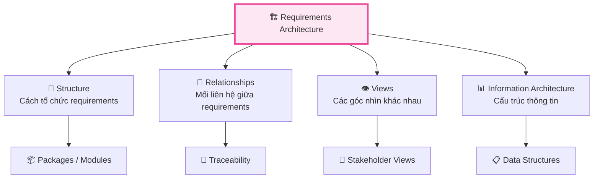
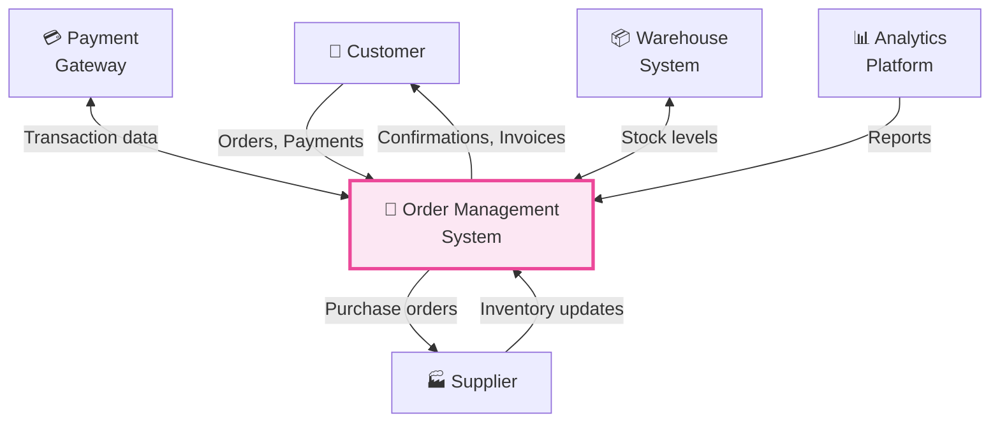
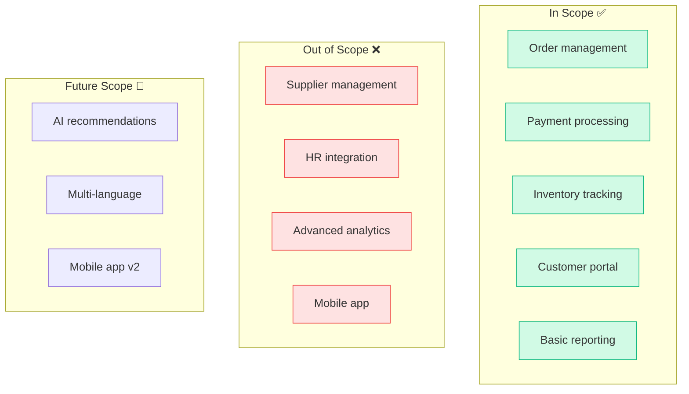
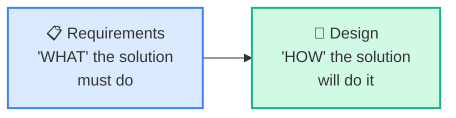
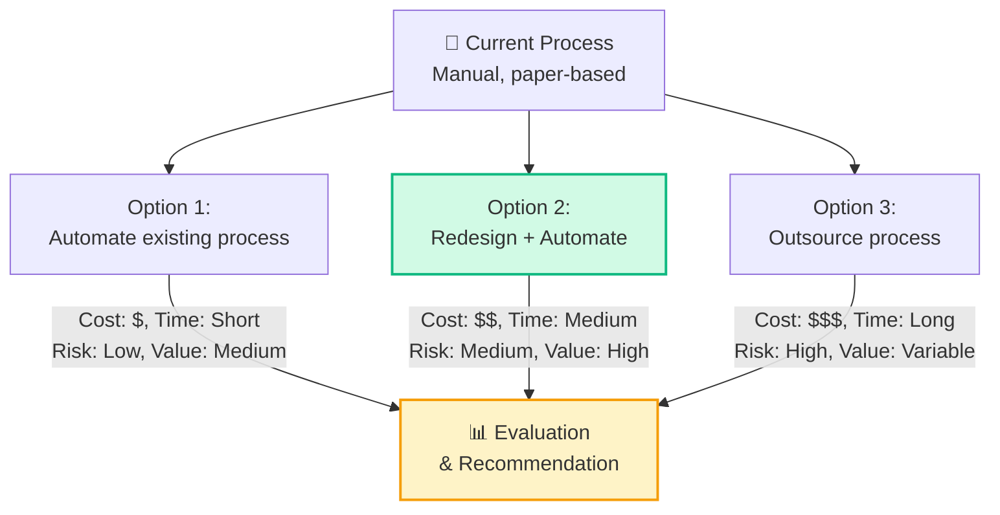
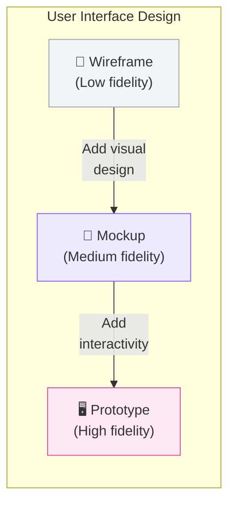
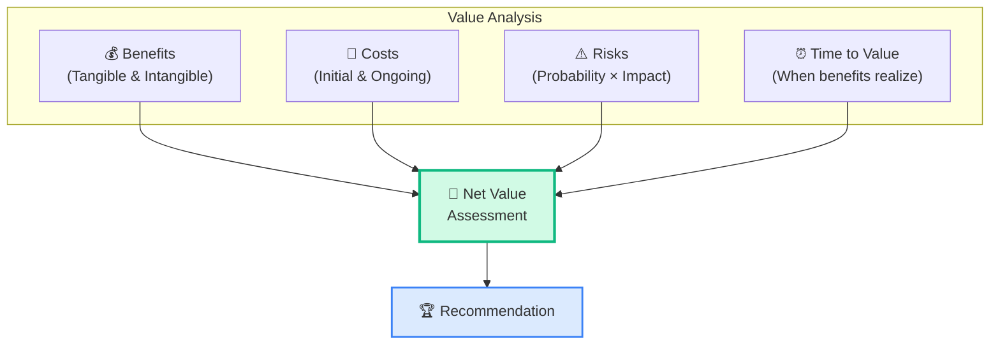
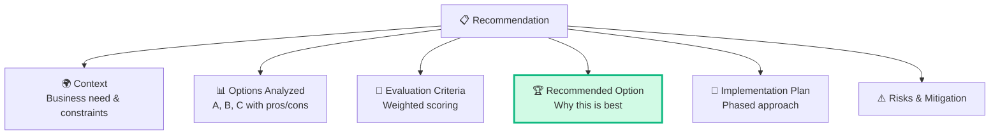

## RADD Phần 2: Từ Requirements đến Solution Design

Bài trước chúng ta đã nắm Tasks 1-3 (Specify, Verify, Validate). Bài này hoàn thành RADD với 3 Tasks còn lại — **kiến trúc yêu cầu**, **phương án thiết kế** và **đề xuất giải pháp**.

## Task 4: Define Requirements Architecture

### Mục đích
Tổ chức requirements thành một **cấu trúc có hệ thống**, đảm bảo requirements **đầy đủ, nhất quán** và hỗ trợ cho việc thiết kế giải pháp.

### Requirements Architecture Components

### Organizing Requirements

| Cách tổ chức | Khi nào dùng | Ví dụ |
|-------------|-------------|-------|
| **By Feature** | Product development | Login, Dashboard, Reports |
| **By Process** | Process improvement | Order → Payment → Delivery |
| **By Stakeholder** | Multiple user groups | Customer view, Admin view |
| **By Priority** | Resource constraints | Must-have → Nice-to-have |
| **By Release** | Phased delivery | MVP → v1.1 → v2.0 |

### Context Diagram

### Scope Definition

## Task 5: Define Design Options

### Mục đích
Xác định các **phương án thiết kế** có thể đáp ứng requirements, và phân tích ưu/nhược điểm của từng phương án.

### Design vs Requirements

| | Requirements | Design |
|---|-------------|--------|
| **Focus** | WHAT | HOW |
| **Owner** | BA + Stakeholder | BA + Solution Team |
| **Level** | What system must do | How system will do it |
| **Ví dụ** | "User can search products" | "Search uses Elasticsearch, auto-suggest after 3 chars" |

### Design Option Categories

#### 1. Build vs Buy vs Outsource

| Option | Pros | Cons |
|--------|------|------|
| **Build custom** | 100% fit, full control | Expensive, time-consuming |
| **Buy COTS** | Fast, proven, cheaper | Limited customization |
| **SaaS/Cloud** | No infrastructure, scalable | Vendor lock-in, data privacy |
| **Outsource** | Cost-effective, expertise | Communication overhead |
| **Hybrid** | Best of both worlds | Complexity, integration |

#### 2. Process Design Options

### Non-Functional Requirements trong Design

| NFR Category | Metrics | Design Impact |
|-------------|---------|-------------|
| **Performance** | Response time, throughput | Architecture choices, caching |
| **Scalability** | Users, data volume | Cloud vs on-premise, microservices |
| **Security** | Authentication, authorization | Security framework, encryption |
| **Availability** | Uptime %, recovery time | Redundancy, failover |
| **Usability** | Ease of use, accessibility | UI framework, UX patterns |
| **Maintainability** | Code quality, documentation | Technology stack, standards |
| **Compatibility** | Browser, OS, devices | Cross-platform, responsive |

### Interface Design

## Task 6: Analyze Potential Value & Recommend Solution

### Mục đích
Phân tích **giá trị tiềm năng** của mỗi design option và đưa ra **đề xuất chọn giải pháp tối ưu**.

### Value Analysis Framework

### Tangible vs Intangible Benefits

| | Tangible Benefits | Intangible Benefits |
|---|-----------------|-------------------|
| **Đo được** | ✅ Yes, quantified | ❌ Hard to quantify |
| **Ví dụ** | Giảm chi phí $50K/năm | Tăng employee satisfaction |
| | Tăng doanh thu 15% | Cải thiện brand reputation |
| | Giảm 200 giờ/tháng manual work | Better decision making |
| | Giảm error rate 80% | Competitive advantage |

### Financial Analysis

| Metric | Công thức | Ý nghĩa |
|--------|---------|---------|
| **ROI** | (Benefits - Costs) / Costs × 100% | Tỷ suất hoàn vốn |
| **NPV** | Σ (Cash Flow / (1+r)^t) | Giá trị hiện tại ròng |
| **Payback Period** | Initial Investment / Annual Benefits | Thời gian hoàn vốn |
| **IRR** | Rate where NPV = 0 | Tỷ suất thu hồi nội bộ |

### Decision Matrix (Weighted Scoring)

| Criteria | Weight | Option A: Build | Option B: Buy | Option C: Hybrid |
|---------|:------:|:---:|:---:|:---:|
| Business fit | 30% | 9 (2.7) | 6 (1.8) | 8 (2.4) |
| Cost | 25% | 4 (1.0) | 8 (2.0) | 6 (1.5) |
| Time to market | 20% | 3 (0.6) | 9 (1.8) | 7 (1.4) |
| Risk | 15% | 5 (0.75) | 7 (1.05) | 6 (0.9) |
| Scalability | 10% | 8 (0.8) | 5 (0.5) | 7 (0.7) |
| **Total Score** | | **5.85** | **7.15** | **6.90** |
| **Rank** | | #3 | **#1** ⭐ | #2 |

### Recommendation Structure

## Techniques cho RADD

| Technique | Tasks | Mô tả |
|----------|:-----:|--------|
| **Data Modelling** | T1, T4 | ERD, data dictionary |
| **Process Modelling** | T1, T4 | BPMN, flowcharts, swimlanes |
| **Use Cases** | T1 | Actor-system interactions |
| **User Stories** | T1 | Agile requirements format |
| **Prototyping** | T1, T5 | Visual representation |
| **State Modelling** | T1, T4 | State transitions |
| **Decision Tables** | T1 | Business rules specification |
| **Acceptance Criteria** | T2, T3 | Testable conditions |
| **Reviews** | T2 | Peer review, walkthrough |
| **Decision Analysis** | T5, T6 | Weighted scoring, comparison |
| **Financial Analysis** | T6 | ROI, NPV, IRR |
| **Risk Analysis** | T6 | Probability/Impact matrix |
| **Non-Functional Analysis** | T5 | Performance, security, usability |
| **Interface Analysis** | T4, T5 | System boundaries |

## 📝 Tóm tắt kiến thức nổi bật

<Callout type="success" title="Key Takeaways — Bài 9">
- **Requirements Architecture**: Tổ chức requirements theo cấu trúc — Context Diagram → Requirements Packages → Traceability
- **Context Diagram**: Biểu diễn system boundary, actors bên ngoài, data flows vào/ra
- **Design Options**: Build (custom) vs Buy (COTS) vs SaaS — đánh giá theo Cost, Fit, Risk, Time, Control
- **NFR Categories**: Performance, Security, Availability, Scalability, Usability, Maintainability, Compliance
- **Financial Analysis**: ROI = (Gain - Cost) / Cost × 100%; NPV tính giá trị hiện tại; Payback Period = thời gian hoàn vốn
- **Recommendation Structure**: Problem Statement → Options Analyzed → Recommended Option → Rationale → Risks → Implementation Plan
</Callout>

## Tóm tắt & Checklist ôn tập

- [ ] Hiểu Requirements Architecture và cách tổ chức requirements
- [ ] Vẽ được Context Diagram
- [ ] Phân biệt Requirements vs Design
- [ ] Nắm Build vs Buy vs SaaS options
- [ ] Hiểu NFR categories và design impact
- [ ] Biết cách làm Decision Matrix (weighted scoring)
- [ ] Nắm Financial Analysis metrics (ROI, NPV, Payback)
- [ ] Cấu trúc Recommendation đầy đủ

---

## 📋 Bài kiểm tra trắc nghiệm — Bài 9

<Callout type="info" title="Hướng dẫn làm bài">
Làm **10 câu** bên dưới trong **14 phút**. Chọn **MỘT đáp án đúng nhất**. Đáp án ở cuối bài.
</Callout>

**Câu 1.** Context Diagram thể hiện điều gì?

- A. Internal system components chi tiết
- B. System boundary, external actors, và data flows vào/ra hệ thống
- C. Database schema
- D. User interface wireframes

**Câu 2.** Công ty cần hệ thống CRM nhanh. Có 3 options: Build custom, Buy Salesforce, dùng HubSpot SaaS. Core business process rất đặc thù. Option nào phù hợp nhất?

- A. Buy Salesforce vì phổ biến
- B. HubSpot SaaS vì rẻ
- C. Build custom vì core process đặc thù cần customization cao
- D. Không cần CRM

**Câu 3.** ROI = 150% nghĩa là:

- A. Lỗ 150%
- B. Lợi nhuận bằng 150% chi phí đầu tư
- C. Chi phí là 150% budget
- D. Break-even

**Câu 4.** NFR "Hệ thống available 99.9% uptime" thuộc category nào?

- A. Performance
- B. Security
- C. Availability
- D. Scalability

**Câu 5.** Sự khác biệt giữa Requirements và Design là:

- A. Không có sự khác biệt
- B. Requirements = WHAT (cần làm gì); Design = HOW (làm như thế nào)
- C. Requirements cho dev team; Design cho BA
- D. Design đến trước Requirements

**Câu 6.** BA cần đánh giá 3 vendors. Mỗi vendor có scores khác nhau về Cost, Features, Support. Technique nào phù hợp?

- A. SWOT Analysis
- B. Weighted Scoring Matrix / Decision Matrix
- C. Fishbone Diagram
- D. Brainstorming

**Câu 7.** Payback Period = 2 năm nghĩa là:

- A. Dự án kéo dài 2 năm
- B. Sau 2 năm, tổng benefits bằng tổng costs đầu tư (hoàn vốn)
- C. ROI = 200%
- D. NPV dương sau 2 năm

**Câu 8.** BA đề xuất recommendation nhưng KHÔNG bao gồm risks. Điều này sai vì:

- A. Risks không quan trọng
- B. Recommendation phải bao gồm cả risks để stakeholder ra quyết định informed
- C. Chỉ cần nêu benefits
- D. Risks do PM quản lý, không phải BA

**Câu 9.** Khi nào nên chọn Buy (COTS) thay vì Build custom?

- A. Khi requirements rất đặc thù
- B. Khi off-the-shelf solution đáp ứng ~80%+ requirements và time-to-market quan trọng
- C. Khi budget không giới hạn
- D. Khi team dev rất mạnh

**Câu 10.** NFR ảnh hưởng đến design decisions như thế nào?

- A. NFR không ảnh hưởng design
- B. NFR quyết định architecture choices (database, hosting, caching, security layer...)
- C. NFR chỉ ảnh hưởng testing
- D. NFR chỉ được xem xét sau khi implement

---

### 🔑 Đáp án & Giải thích

| Câu | Đáp án | Giải thích |
|:---:|:------:|-----------|
| 1 | **B** | Context Diagram = big picture: system boundary (the box), external actors, data flows (arrows in/out). |
| 2 | **C** | Core process đặc thù → COTS/SaaS khó customize → Build custom cho flexibility cao nhất. |
| 3 | **B** | ROI 150% = mỗi $1 đầu tư → thu về $1.50 lợi nhuận (tổng $2.50). |
| 4 | **C** | 99.9% uptime = Availability requirement. Performance liên quan đến speed/throughput. |
| 5 | **B** | Requirements = WHAT the system needs to do. Design = HOW it will be implemented. |
| 6 | **B** | Weighted Scoring Matrix = criteria × weights × scores — so sánh objective giữa options. |
| 7 | **B** | Payback Period = thời gian hoàn vốn — khi total benefits = total costs. |
| 8 | **B** | Recommendation phải transparent — bao gồm benefits, risks, assumptions, constraints. |
| 9 | **B** | Buy khi solution có sẵn đáp ứng phần lớn requirements và speed-to-market quan trọng. |
| 10 | **B** | NFR drives architecture decisions — performance → caching; security → encryption layers; scalability → cloud. |

### 📊 Thang đánh giá

| Số câu đúng | Đánh giá | Hành động |
|:-----------:|---------|-----------|
| 9-10 | ⭐ Xuất sắc | RADD Part 2 nắm vững! |
| 7-8 | ✅ Tốt | Ôn lại Build vs Buy vs SaaS và Financial Analysis |
| 5-6 | ⚠️ Trung bình | Đọc lại NFR categories và Requirements Architecture |
| < 5 | ❌ Cần ôn lại | RADD 32% — phần này cực kỳ quan trọng |

---

## Tiếp theo

Bài tiếp theo sẽ đi vào **Solution Evaluation (6%)** — đánh giá giải pháp sau triển khai.

---

*From requirements to solutions — that's what BA does! 🏗️*
