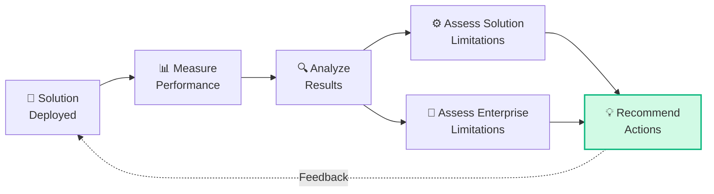
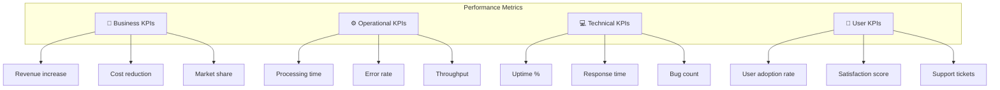
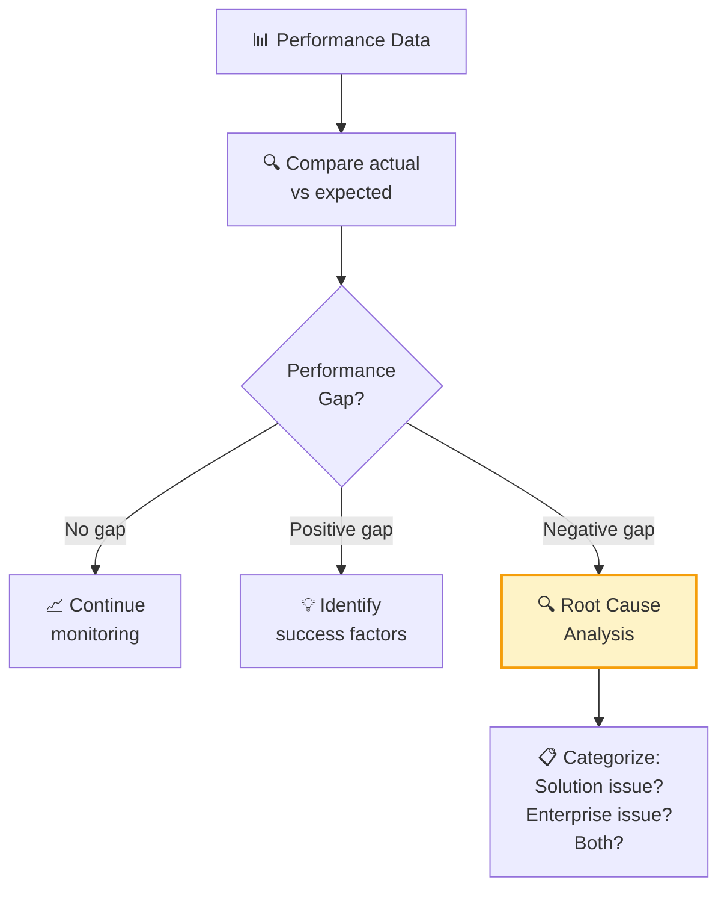
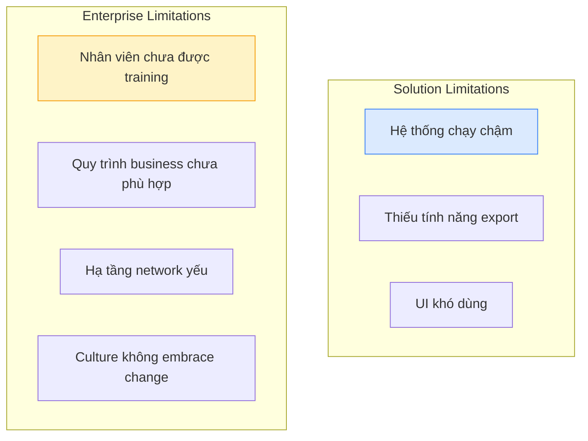
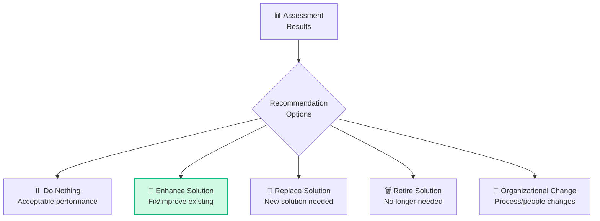

## Tổng quan Solution Evaluation

**Solution Evaluation (SE)** chiếm **6% đề thi CCBA** (~8 câu) — tỷ trọng thấp nhất nhưng vẫn quan trọng vì đây là giai đoạn **"khép vòng"** — đánh giá xem giải pháp có thực sự giải quyết được vấn đề không.

## 5 Tasks trong Solution Evaluation

### Task 1: Measure Solution Performance

#### Mục đích
Xác định **metrics** phù hợp và **đo lường thực tế** hiệu suất giải pháp so với kỳ vọng.

#### KPI Framework

#### Performance Measurement Example

| Metric | Target | Actual | Status | Gap |
|--------|:------:|:------:|:------:|:---:|
| Processing time | < 30 min | 25 min | ✅ | -17% |
| Error rate | < 2% | 5% | ❌ | +150% |
| User adoption | > 90% | 75% | ⚠️ | -17% |
| Customer satisfaction | > 4.0/5 | 4.2/5 | ✅ | +5% |
| System uptime | 99.9% | 99.5% | ⚠️ | -0.4% |

### Task 2: Analyze Performance Measures

#### Mục đích
Phân tích kết quả đo lường để xác định **nguyên nhân gốc rễ** của performance gaps.

#### Gap Analysis Flow

### Task 3: Assess Solution Limitations

#### Mục đích
Xác định **hạn chế của giải pháp** — những gì solution không làm được hoặc làm chưa tốt.

#### Solution Limitation Categories

| Category | Ví dụ | Impact |
|---------|-------|--------|
| **Functional** | Missing features, workarounds | User productivity |
| **Performance** | Slow under load | User experience |
| **Scalability** | Can't handle growth | Business expansion |
| **Integration** | Poor API compatibility | Data silos |
| **Usability** | Complex UI, poor UX | User adoption |
| **Security** | Vulnerabilities | Compliance risk |
| **Maintenance** | Hard to update | Long-term cost |

<Callout type="info" title="Khi nào đánh giá Solution Limitations?">
Theo BABOK, đánh giá hạn chế giải pháp nên diễn ra **khi solution đang được sử dụng (in use)** — không phải khi đang design hay sau khi elicitation. Đây là câu hỏi thường gặp trong đề thi!
</Callout>

### Task 4: Assess Enterprise Limitations

#### Solution Limitations vs Enterprise Limitations

| | Solution Limitations | Enterprise Limitations |
|---|---------------------|----------------------|
| **Nguồn** | Từ bản thân giải pháp | Từ tổ chức/môi trường |
| **Fix** | Enhance/replace solution | Organizational change |
| **Ví dụ** | Bug, missing feature | Lack of training, culture |
| **Owner** | Solution team | Business leadership |

### Task 5: Recommend Actions to Increase Solution Value

#### Recommendation Options

| Action | Khi nào | Risk Level |
|--------|--------|:----------:|
| **Do Nothing** | Solution meets objectives OK | Low |
| **Enhance** | Gap nhỏ, fix được | Low-Medium |
| **Replace** | Gap lớn, fundamental issues | High |
| **Retire** | Solution không còn cần thiết | Medium |
| **Org Change** | Enterprise limitation | Medium-High |

## Techniques cho Solution Evaluation

| Technique | Task | Mô tả |
|----------|:----:|--------|
| **Acceptance & Evaluation Criteria** | T1 | Tiêu chí đánh giá performance |
| **Benchmarking** | T2 | So sánh với industry standards |
| **Root Cause Analysis** | T2, T3 | Tìm nguyên nhân gốc rễ |
| **Survey/Questionnaire** | T1, T2 | Thu thập feedback users |
| **SWOT Analysis** | T3, T4 | Đánh giá strengths/weaknesses |
| **Decision Analysis** | T5 | Đánh giá options |
| **Risk Analysis** | T5 | Phân tích rủi ro các recommendations |
| **Financial Analysis** | T5 | Cost-benefit of recommendations |

## Ví dụ Scenario câu hỏi CCBA

> **Scenario:** BA đang định nghĩa BA approach để đảm bảo phù hợp với các hoạt động dự án. Là một phần công việc, BA phải lên kế hoạch cho thời điểm đánh giá hạn chế của giải pháp đề xuất. Đánh giá này nên diễn ra khi nào trong project lifecycle?
>
> A. Khi giải pháp được thiết kế  
> B. Khi giải pháp được triển khai hoàn toàn  
> C. Khi hoạt động elicitation hoàn tất  
> D. **Khi giải pháp đang được sử dụng (in some form)** ✅
>
> → Đáp án D: Solution limitations chỉ có thể đánh giá đầy đủ khi giải pháp **đang hoạt động thực tế**. Điều này có thể là pilot, beta, hoặc full deployment.

## 📝 Tóm tắt kiến thức nổi bật

<Callout type="success" title="Key Takeaways — Bài 10">
- Solution Evaluation chiếm **6% đề thi** (~8 câu) — ít nhất nhưng đừng bỏ qua
- **5 Tasks**: Measure Solution Performance, Analyze Performance Measures, Assess Solution Limitations, Assess Enterprise Limitations, Recommend Actions
- **KPI Framework**: Business KPIs (revenue, market share) + Operational KPIs (efficiency) + Technical KPIs (uptime, response time) + User KPIs (adoption, satisfaction)
- **Solution Limitations vs Enterprise Limitations**: Solution = hệ thống không đáp ứng được; Enterprise = tổ chức/quy trình chưa sẵn sàng
- **5 Recommendation Options**: Do Nothing, Improve, Replace, Retire, Restructure
- Luôn đánh giá root cause trước khi recommend action
</Callout>

## Tóm tắt & Checklist ôn tập

- [ ] Hiểu 5 Tasks trong Solution Evaluation
- [ ] Nắm KPI Framework (Business, Operational, Technical, User)
- [ ] Phân biệt Solution vs Enterprise Limitations
- [ ] Biết 5 Recommendation Options
- [ ] Hiểu khi nào đánh giá Solution Limitations
- [ ] Nắm Techniques cho SE

---

## 📋 Bài kiểm tra trắc nghiệm — Bài 10

<Callout type="info" title="Hướng dẫn làm bài">
Làm **10 câu** bên dưới trong **14 phút**. Chọn **MỘT đáp án đúng nhất**. Đáp án ở cuối bài.
</Callout>

**Câu 1.** Giải pháp mới triển khai 6 tháng nhưng user adoption chỉ 30% (target 80%). BA nên làm gì TRƯỚC TIÊN?

- A. Đề xuất thay thế giải pháp mới
- B. Phân tích root cause tại sao adoption thấp
- C. Training thêm cho tất cả users
- D. Báo cáo failure cho sponsor

**Câu 2.** Solution limitation là:

- A. Tổ chức chưa sẵn sàng thay đổi
- B. Hệ thống không đáp ứng được một requirement cụ thể
- C. Budget không đủ
- D. Team chưa được training

**Câu 3.** KPI "System uptime 99.5%" thuộc nhóm nào?

- A. Business KPI
- B. Operational KPI
- C. Technical KPI
- D. User KPI

**Câu 4.** Sau khi phân tích, BA nhận thấy hệ thống CRM hoạt động tốt nhưng quy trình sales team vẫn dùng Excel song song. Đây là:

- A. Solution Limitation
- B. Enterprise Limitation
- C. Technical bug
- D. Design error

**Câu 5.** BA recommend "Improve" solution nghĩa là:

- A. Thay thế solution mới hoàn toàn
- B. Nâng cấp, cải tiến solution hiện tại để đáp ứng tốt hơn
- C. Gỡ bỏ solution
- D. Không làm gì

**Câu 6.** Khi nào BA nên recommend "Replace" solution?

- A. Khi solution chỉ có minor issues
- B. Khi solution có lỗi nhỏ có thể fix
- C. Khi solution fundamentally không đáp ứng business objectives và improve không khả thi
- D. Khi user chưa quen sử dụng

**Câu 7.** KPI "Customer satisfaction score ≥ 4.5/5" thuộc nhóm:

- A. Business KPI
- B. Technical KPI
- C. Operational KPI
- D. User KPI

**Câu 8.** BA đang đo solution performance. Actual performance đạt 90% target. BA nên:

- A. Không cần làm gì — 90% đã đủ tốt
- B. Analyze gap 10%, identify root cause, assess if improvement needed
- C. Immediately replace solution
- D. Ignore và move on

**Câu 9.** Enterprise limitation khác solution limitation ở chỗ:

- A. Enterprise limitation liên quan đến con người, quy trình, culture; solution limitation liên quan đến hệ thống/technology
- B. Không có sự khác biệt
- C. Enterprise limitation nghiêm trọng hơn
- D. Solution limitation không fix được

**Câu 10.** Recommend action "Do Nothing" phù hợp khi:

- A. Never — luôn phải làm gì đó
- B. Khi cost of change lớn hơn benefit, và current state acceptable
- C. Khi không biết làm gì
- D. Khi stakeholder không quan tâm

---

### 🔑 Đáp án & Giải thích

| Câu | Đáp án | Giải thích |
|:---:|:------:|-----------|
| 1 | **B** | Luôn analyze root cause trước — adoption thấp có thể do UX kém, resistance, thiếu training, hoặc solution không fit. |
| 2 | **B** | Solution limitation = system-level — hệ thống không đáp ứng requirement. Enterprise limitation = org-level. |
| 3 | **C** | System uptime = Technical KPI — đo performance kỹ thuật của hệ thống. |
| 4 | **B** | Quy trình/con người chưa adapt = Enterprise Limitation. System hoạt động tốt → không phải solution limitation. |
| 5 | **B** | Improve = nâng cấp/cải tiến solution hiện tại (fix bugs, add features, optimize). |
| 6 | **C** | Replace khi solution fundamentally không đáp ứng và improve không khả thi — biện pháp mạnh nhất. |
| 7 | **D** | Customer satisfaction = User KPI — đo trải nghiệm và sự hài lòng của user. |
| 8 | **B** | 90% target = có gap. BA cần analyze tại sao, xem gap có acceptable không, và đề xuất improvement nếu cần. |
| 9 | **A** | Enterprise = people, process, culture. Solution = system, technology, functionality. |
| 10 | **B** | "Do Nothing" khi cost of change > benefit VÀ current state chấp nhận được — đây là valid option. |

### 📊 Thang đánh giá

| Số câu đúng | Đánh giá | Hành động |
|:-----------:|---------|-----------|
| 9-10 | ⭐ Xuất sắc | Solution Evaluation nắm vững! |
| 7-8 | ✅ Tốt | Ôn lại Solution vs Enterprise Limitations |
| 5-6 | ⚠️ Trung bình | Đọc lại KPI Framework và Recommendation Options |
| < 5 | ❌ Cần ôn lại | Tuy chỉ 6% nhưng là 8 câu "free" nếu nắm chắc |

---

## Tiếp theo

Bài tiếp theo sẽ tổng hợp **50 Kỹ thuật BA cốt lõi** trong BABOK — flashcard-style để ôn thi hiệu quả.

---

*Evaluate to improve — the BA cycle never stops! ✅*
