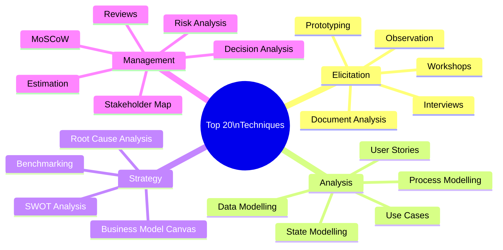
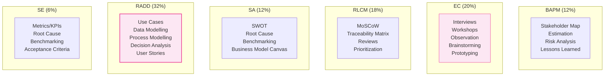

## Tại sao cần nắm 50 Techniques?

BABOK Guide v3 định nghĩa **50 kỹ thuật (Techniques)** mà BA có thể áp dụng xuyên suốt 6 Knowledge Areas. Đề thi CCBA thường **không hỏi trực tiếp** "kỹ thuật X là gì?" mà hỏi dưới dạng **scenario**: "Trong tình huống này, BA nên dùng kỹ thuật nào?" → Bạn cần hiểu _khi nào dùng_ mỗi kỹ thuật.

<Callout type="tip" title="Mẹo ôn thi">
Không cần nhớ hết 50 kỹ thuật chi tiết. Hãy tập trung vào **20 kỹ thuật quan trọng nhất** (đánh dấu ⭐ bên dưới) và hiểu rõ **context sử dụng**.
</Callout>

## Nhóm 1: Elicitation Techniques (Thu thập)

| # | Technique | Mô tả | KA chính |
|:-:|----------|--------|:--------:|
| 1 | ⭐ **Brainstorming** | Tạo ý tưởng nhóm, không phê bình | EC, BAPM |
| 2 | ⭐ **Document Analysis** | Phân tích tài liệu hiện có | EC |
| 3 | ⭐ **Focus Groups** | Thảo luận nhóm có facilitator | EC |
| 4 | ⭐ **Interface Analysis** | Phân tích điểm giao tiếp hệ thống | EC, RADD |
| 5 | ⭐ **Interviews** | Phỏng vấn 1-on-1 hoặc nhóm nhỏ | EC |
| 6 | ⭐ **Observation** | Quan sát quy trình thực tế | EC |
| 7 | ⭐ **Prototyping** | Tạo mẫu thử để validate | EC, RADD |
| 8 | **Survey/Questionnaire** | Khảo sát số lượng lớn | EC |
| 9 | ⭐ **Workshops** | Hội thảo thu thập yêu cầu nhóm | EC |
| 10 | **Collaborative Games** | Trò chơi nhóm để khám phá ý tưởng | EC |

## Nhóm 2: Analysis & Modeling Techniques (Phân tích & Mô hình)

| # | Technique | Mô tả | KA chính |
|:-:|----------|--------|:--------:|
| 11 | **Acceptance & Evaluation Criteria** | Tiêu chí chấp nhận và đánh giá | RADD, SE |
| 12 | ⭐ **Business Rules Analysis** | Phân tích quy tắc kinh doanh | RADD, RLCM |
| 13 | ⭐ **Data Modelling** | Mô hình dữ liệu (ERD, data dictionary) | RADD |
| 14 | ⭐ **Decision Modelling** | Decision tables, decision trees | RADD |
| 15 | **Functional Decomposition** | Phân tách chức năng thành components | RADD, SA |
| 16 | **Organizational Modelling** | Mô hình tổ chức (org chart, roles) | BAPM, SA |
| 17 | ⭐ **Process Modelling** | BPMN, flowcharts, swimlanes | RADD, SA |
| 18 | **Roles & Permissions Matrix** | Ma trận vai trò và quyền hạn | RADD |
| 19 | **Scope Modelling** | Context diagram, scope definition | RADD, SA |
| 20 | ⭐ **Sequence Diagrams** | Tương tác tuần tự giữa actors/systems | RADD |
| 21 | ⭐ **State Modelling** | State transitions, state diagrams | RADD |
| 22 | ⭐ **Use Cases and Scenarios** | Actor-system interactions | RADD |
| 23 | ⭐ **User Stories** | As a..., I want..., So that... | RADD |

## Nhóm 3: Strategy & Planning Techniques (Chiến lược)

| # | Technique | Mô tả | KA chính |
|:-:|----------|--------|:--------:|
| 24 | **Balanced Scorecard** | Financial, Customer, Process, Learning | SA |
| 25 | ⭐ **Benchmarking** | So sánh với best practices ngành | SA, SE |
| 26 | **Business Capability Analysis** | Phân tích năng lực kinh doanh | SA |
| 27 | ⭐ **Business Model Canvas** | 9 building blocks của business model | SA |
| 28 | ⭐ **SWOT Analysis** | Strengths, Weaknesses, Opportunities, Threats | SA |
| 29 | **Concept Modelling** | Mô hình khái niệm (ontology) | SA, RADD |
| 30 | ⭐ **Root Cause Analysis** | 5 Whys, Fishbone diagram | SA, SE |
| 31 | **Vendor Assessment** | Đánh giá nhà cung cấp | SA, RADD |

## Nhóm 4: Management & Evaluation Techniques (Quản lý)

| # | Technique | Mô tả | KA chính |
|:-:|----------|--------|:--------:|
| 32 | **Backlog Management** | Quản lý product backlog | RLCM |
| 33 | ⭐ **Estimation** | Ước lượng effort, cost, duration | BAPM |
| 34 | **Financial Analysis** | ROI, NPV, Payback period | SA, SE |
| 35 | ⭐ **Item Tracking** | Theo dõi issues, actions, decisions | BAPM, RLCM |
| 36 | **Lessons Learned** | Rút kinh nghiệm sau dự án | BAPM |
| 37 | **Metrics and KPIs** | Xác định và theo dõi metrics | SE |
| 38 | ⭐ **MoSCoW** | Must, Should, Could, Won't | RLCM |
| 39 | ⭐ **Prioritization** | Ưu tiên hóa yêu cầu/features | RLCM |
| 40 | ⭐ **Reviews** | Formal/informal review | RADD, RLCM |
| 41 | ⭐ **Risk Analysis & Management** | Probability × Impact, mitigation | SA, BAPM |
| 42 | ⭐ **Stakeholder List, Map, or Personas** | Xác định và phân tích stakeholder | BAPM |
| 43 | **Traceability Matrix** | Ma trận truy vết requirements | RLCM |

## Nhóm 5: Decision & Communication Techniques (Quyết định)

| # | Technique | Mô tả | KA chính |
|:-:|----------|--------|:--------:|
| 44 | ⭐ **Decision Analysis** | Weighted scoring, decision matrix | RADD, SA |
| 45 | **Decision Tables** | Bảng quyết định logic | RADD |
| 46 | **Mind Mapping** | Bản đồ tư duy | EC, SA |
| 47 | ⭐ **Data Flow Diagrams** | Luồng dữ liệu trong hệ thống | RADD |
| 48 | **Data Dictionary** | Định nghĩa data elements | RADD |
| 49 | **Glossary** | Từ điển thuật ngữ dự án | BAPM |
| 50 | **Non-Functional Requirements Analysis** | Phân tích NFRs | RADD |

## 20 Techniques quan trọng nhất — Quick Reference

## Technique Selection Guide

### Theo tình huống

| Tình huống | Techniques phù hợp |
|-----------|-------------------|
| Hiểu quy trình hiện tại | Process Modelling, Observation, Document Analysis |
| Thu thập yêu cầu từ stakeholder | Interviews, Workshops, Brainstorming |
| Phân tích dữ liệu hệ thống | Data Modelling, Data Flow Diagrams, Data Dictionary |
| Đánh giá lựa chọn giải pháp | Decision Analysis, SWOT, Financial Analysis |
| Ưu tiên hóa yêu cầu | MoSCoW, Prioritization, Timeboxing |
| Xác định stakeholder | Stakeholder Map, RACI, Organizational Modelling |
| Validate requirements | Prototyping, Reviews, Acceptance Criteria |
| Đánh giá rủi ro | Risk Analysis, Root Cause Analysis |
| Mô tả hành vi hệ thống | State Modelling, Sequence Diagrams, Use Cases |
| Phân tích business rules | Decision Tables, Business Rules Analysis |

### Theo Knowledge Area

## Ví dụ câu hỏi Scenario

> **Scenario:** BA đang làm việc để xác định pain points trong quy trình quản lý bảo trì phần mềm phi tập trung. 4 stakeholder chính tham gia quy trình này. Các stakeholder không rõ ai đang làm gì và kỳ vọng gì. BA nên làm gì để phân định vai trò?
>
> A. **Tạo RACI Matrix** ✅  
> B. Giám sát stakeholder engagement  
> C. Giao stakeholders nhiệm vụ cụ thể  
> D. Dành thời gian cho thảo luận nhóm
>
> → Đáp án A: **RACI Matrix** là kỹ thuật phù hợp nhất để phân định ai Responsible, Accountable, Consulted, Informed.

## 📝 Tóm tắt kiến thức nổi bật

<Callout type="success" title="Key Takeaways — Bài 11">
- BABOK v3 có **50 Techniques** — thi CCBA thường hỏi **technique nào phù hợp cho tình huống nào**
- **Top 5 quan trọng nhất**: Interviews, Workshops, Document Analysis, Process Modelling, Use Cases
- **Techniques theo KA**: Mỗi KA có techniques riêng, nhưng nhiều technique dùng chung cross-KA
- **Thi không hỏi "kể tên technique"** — mà hỏi "trong tình huống X, kỹ thuật nào phù hợp nhất?"
- **Nhóm techniques**: Elicitation (8) → Analysis (12) → Design (10) → Management (10) → Evaluation (10)
- Nắm **context sử dụng** quan trọng hơn nhớ tên — khi nào dùng Brainstorming vs Workshop vs Interview
</Callout>

## Tóm tắt & Checklist ôn tập

- [ ] Nắm 50 Techniques theo nhóm chức năng
- [ ] Tập trung 20 Techniques quan trọng nhất (⭐)
- [ ] Hiểu context sử dụng từng technique
- [ ] Biết technique nào thuộc KA nào
- [ ] Luyện scenario questions về technique selection

---

## 📋 Bài kiểm tra trắc nghiệm — Bài 11

<Callout type="info" title="Hướng dẫn làm bài">
Làm **10 câu** bên dưới trong **14 phút**. Các câu đều là **scenario-based** — chọn technique phù hợp nhất. Đáp án ở cuối bài.
</Callout>

**Câu 1.** BA cần thu thập ý kiến từ 200 users ở nhiều chi nhánh khác nhau. Technique nào hiệu quả nhất?

- A. Interviews
- B. Workshops
- C. Surveys/Questionnaires
- D. Focus Groups

**Câu 2.** Team cần generate nhiều ý tưởng sáng tạo cho feature mới. Chưa cần đánh giá nào. Technique nào phù hợp?

- A. Interview
- B. Brainstorming
- C. Document Analysis
- D. Decision Table

**Câu 3.** BA cần hiểu data entities, attributes, và relationships của hệ thống. Technique nào phù hợp?

- A. Data Modelling (ERD)
- B. Process Modelling (BPMN)
- C. Use Cases
- D. Mind Mapping

**Câu 4.** BA cần đánh giá 4 vendors dựa trên 6 criteria với different weights. Technique nào phù hợp?

- A. SWOT Analysis
- B. Decision Analysis (Weighted Scoring)
- C. Risk Analysis
- D. Brainstorming

**Câu 5.** BA muốn validate rằng requirements đáp ứng business needs bằng cách tạo visual representation cho stakeholder review. Technique nào phù hợp?

- A. Document Analysis
- B. Prototyping
- C. Estimation
- D. Benchmarking

**Câu 6.** Stakeholder không thể articulate quy trình phức tạp. BA nên dùng technique nào?

- A. Survey
- B. Document Analysis
- C. Observation
- D. Brainstorming

**Câu 7.** BA cần phân tích root cause tại sao quy trình order xử lý chậm. Technique nào phù hợp nhất?

- A. SWOT Analysis
- B. Root Cause Analysis (Fishbone/5 Whys)
- C. MoSCoW
- D. Estimation

**Câu 8.** BA cần xác định boundaries của system — những gì nằm trong và ngoài scope. Technique nào phù hợp?

- A. Process Modelling
- B. Scope Modelling (Context Diagram)
- C. Data Modelling
- D. Use Case Diagram

**Câu 9.** PM cần BA estimate effort cho mỗi requirement. Technique nào phù hợp?

- A. Risk Analysis
- B. Estimation (Story Points, T-shirt sizing, Expert Judgment)
- C. Benchmarking
- D. Brainstorming

**Câu 10.** BA cần prioritize requirements dựa trên business value vs complexity. Technique nào phù hợp nhất?

- A. MoSCoW Priority
- B. Decision Analysis
- C. Business Value vs Complexity Matrix
- D. Timeboxing

---

### 🔑 Đáp án & Giải thích

| Câu | Đáp án | Giải thích |
|:---:|:------:|-----------|
| 1 | **C** | 200 users, many locations → Surveys scalable nhất, cost-effective. Interviews/Workshops không scalable. |
| 2 | **B** | Brainstorming = generate ideas, defer judgment. Không đánh giá, chỉ tạo ý tưởng. |
| 3 | **A** | Data Modelling (ERD) = entities, attributes, relationships. BPMN cho processes, not data. |
| 4 | **B** | Decision Analysis / Weighted Scoring = criteria × weights → objective comparison. |
| 5 | **B** | Prototyping = visual representation cho stakeholder review/validate — interactive và tangible. |
| 6 | **C** | Observation = watch stakeholder perform → understand tacit knowledge that can't be articulated. |
| 7 | **B** | Root Cause Analysis (Fishbone/Ishikawa, 5 Whys) — systematic analysis of why something happens. |
| 8 | **B** | Scope Modelling / Context Diagram = define system boundary, in-scope vs out-of-scope. |
| 9 | **B** | Estimation techniques: Story Points, T-shirt sizing (XS/S/M/L/XL), Expert Judgment, Analogous. |
| 10 | **C** | Business Value vs Complexity Matrix = 2×2 grid → Quick Wins (high value, low complexity) first. |

### 📊 Thang đánh giá

| Số câu đúng | Đánh giá | Hành động |
|:-----------:|---------|-----------|
| 9-10 | ⭐ Xuất sắc | Technique selection nắm vững! |
| 7-8 | ✅ Tốt | Ôn lại context cho từng nhóm technique |
| 5-6 | ⚠️ Trung bình | Luyện thêm scenario-based technique questions |
| < 5 | ❌ Cần ôn lại | Tạo flashcards cho 50 techniques |

---

## Tiếp theo

Bài cuối cùng sẽ tổng hợp **Chiến lược thi CCBA** — tips quản lý thời gian, cách giải câu hỏi scenario, và đề thi thử.

---

*Know your techniques, know your exam! 🛠️*
