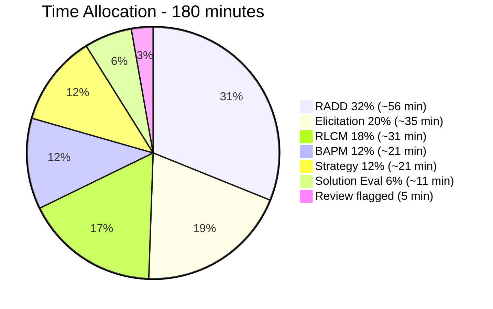
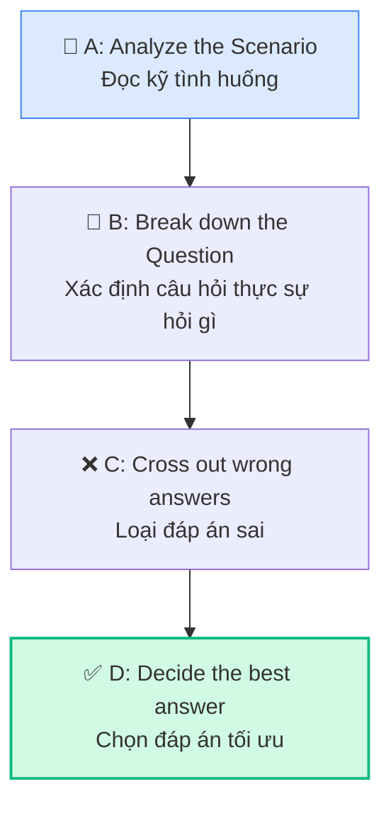
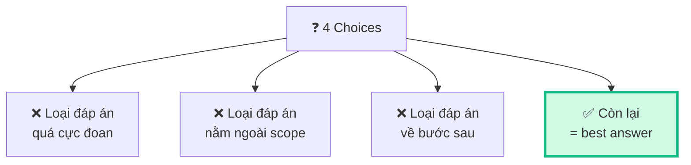
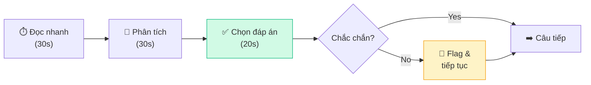

## Chiến lược tổng thể cho kỳ thi CCBA

### Thông số đề thi

| Thông số | Chi tiết |
|---------|---------|
| Số câu | 130 câu multiple choice |
| Thời gian | 180 phút (3 giờ) |
| Thời gian/câu | ~1.4 phút/câu |
| Dạng câu | Scenario-based |
| Pass/Fail | Không công bố điểm, chỉ Pass/Fail |
| Hình thức | Online proctored hoặc PSI center |

### Phân bổ thời gian đề xuất

## Kỹ thuật giải câu hỏi Scenario-based

### Framework ABCD

### Bước 1: Đọc kỹ Scenario

**Keywords cần chú ý:**

| Keyword | Gợi ý Knowledge Area |
|---------|---------------------|
| "first step", "initially" | BA Planning & Monitoring |
| "stakeholder disagrees", "conflict" | Elicitation & Collaboration |
| "requirements changed", "baseline" | Requirements Life Cycle |
| "current state", "future state", "SWOT" | Strategy Analysis |
| "model", "specify", "design" | RADD |
| "solution performance", "limitations" | Solution Evaluation |
| "elicit", "interview", "workshop" | Elicitation |
| "prioritize", "approve", "trace" | RLCM |

### Bước 2: Xác định câu hỏi hỏi gì

| Dạng câu hỏi | Cách tiếp cận |
|-------------|-------------|
| "What should BA do **FIRST**?" | Tìm bước đầu tiên logic (thường là stakeholder analysis hoặc understand current state) |
| "What is the **BEST** approach?" | Tìm đáp án toàn diện nhất |
| "What technique should BA use?" | Match technique với context |
| "What is the **PRIMARY** concern?" | Tìm concern chính, không phải secondary |
| "What **OUTPUT** would result?" | Nhớ Input → Task → Output |

### Bước 3: Elimination Strategy

**Red flags trong đáp án sai:**
- 🚩 "Always", "Never", "Must always" → Quá tuyệt đối
- 🚩 "Skip to...", "Directly proceed..." → Bỏ bước
- 🚩 "BA decides alone..." → BA không quyết định đơn phương
- 🚩 "Ignore stakeholder..." → Luôn respect stakeholder
- 🚩 "Leading questions..." → Biased elicitation

**Green flags trong đáp án đúng:**
- ✅ "Stakeholder analysis" khi bắt đầu dự án
- ✅ "Collaborate", "Negotiate", "Win-win"
- ✅ "Assess impact", "Analyze root cause"
- ✅ "Prioritize based on business value"
- ✅ "Verify and validate" trước khi approve

## Đề thi thử — 20 câu mẫu

### Câu 1 (BAPM)
> Một dự án mới bắt đầu, scope chưa rõ ràng, nhiều khả năng thay đổi liên tục. BA nên chọn approach nào?
>
> A. Predictive approach với BRD chi tiết  
> B. **Adaptive approach với iterative delivery** ✅  
> C. Hybrid approach 50/50  
> D. Không cần plan approach, bắt đầu luôn

### Câu 2 (EC)
> Stakeholder mô tả quy trình nhưng BA không hiểu dù đã interview nhiều lần. BA nên:
>
> A. Đọc thêm tài liệu  
> B. Interview stakeholder khác  
> C. **Quan sát stakeholder thực hiện quy trình** ✅  
> D. Yêu cầu stakeholder viết ra

### Câu 3 (RLCM)
> Sau khi requirements đã baseline, một stakeholder yêu cầu thêm feature mới. BA nên:
>
> A. Thêm vào requirements luôn  
> B. **Thực hiện impact analysis trước khi quyết định** ✅  
> C. Từ chối vì đã baseline  
> D. Chuyển cho PM quyết định

### Câu 4 (SA)
> BA nhận thấy business objective "Tăng doanh số" nhưng không có con số cụ thể. BA nên:
>
> A. Tự đặt target 20%  
> B. **Làm việc với stakeholder để define SMART objective** ✅  
> C. Bỏ qua, focus vào requirements  
> D. Dùng industry benchmark

### Câu 5 (RADD)
> BA cần mô tả các bước xử lý đơn hàng, bao gồm các điều kiện rẽ nhánh. Kỹ thuật nào phù hợp nhất?
>
> A. ERD  
> B. **Process Flow Diagram / BPMN** ✅  
> C. Use Case Diagram  
> D. State Diagram

### Câu 6 (SE)
> Giải pháp đã triển khai 3 tháng, user adoption chỉ 40% (target 90%). BA nên:
>
> A. Đề xuất thay thế giải pháp  
> B. **Phân tích root cause của low adoption** ✅  
> C. Training thêm cho users  
> D. Báo cáo failure cho sponsor

### Câu 7 (EC)
> Trong workshop, một stakeholder senior liên tục chi phối thảo luận. BA-facilitator nên:
>
> A. Để tự nhiên vì seniority  
> B. **Sử dụng round-robin hoặc anonymous voting** ✅  
> C. Yêu cầu người đó im lặng  
> D. Hủy workshop, chuyển sang interview

### Câu 8 (RLCM)
> BA cần xác định thứ tự triển khai requirements. Stakeholder A nói feature X quan trọng nhất, stakeholder B nói feature Y. BA nên:
>
> A. Triển khai feature X vì A senior hơn  
> B. **Sử dụng kỹ thuật prioritization (MoSCoW, Business Value)** ✅  
> C. Triển khai cả hai cùng lúc  
> D. Để PM quyết định

### Câu 9 (SA)
> SWOT analysis cho thấy công ty có đội BA mạnh (Strength) và thị trường đang tăng trưởng (Opportunity). Chiến lược phù hợp là:
>
> A. WT — Minimize weakness, avoid threats  
> B. **SO — Dùng strength để khai thác opportunity** ✅  
> C. ST — Dùng strength để chống threat  
> D. WO — Khắc phục weakness để tận dụng opportunity

### Câu 10 (RADD)
> BA cần mô tả trạng thái của một đơn hàng (Draft → Submitted → Approved → Shipped → Delivered). Mô hình nào phù hợp nhất?
>
> A. ERD  
> B. Use Case Diagram  
> C. Process Flow  
> D. **State Diagram** ✅

## Tips quản lý thời gian

### 10 tips vàng

1. **Không dừng lâu ở 1 câu** — Max 2 phút, nếu không chắc → flag → quay lại
2. **Đọc câu hỏi trước, scenario sau** — Biết cần tìm gì
3. **Loại đáp án sai trước** — Dễ hơn tìm đáp án đúng
4. **"FIRST" = bước đầu tiên** — Thường là understand/analyze trước khi act
5. **"BEST" = toàn diện nhất** — Không phải nhanh nhất
6. **BA không quyết định đơn phương** — Luôn collaborate với stakeholder
7. **Requirements trước Design** — Hiểu "what" trước "how"
8. **Baseline = change control** — Mọi thay đổi phải qua process
9. **Verify ≠ Validate** — Verify = đúng chất lượng, Validate = đúng mục tiêu
10. **Dùng elimination** — 2 đáp án thường loại dễ, chọn giữa 2 còn lại

## Checklist trước ngày thi

- [ ] Đọc BABOK ít nhất 2 lần
- [ ] Làm ít nhất 3 bộ đề thử (130 câu)
- [ ] Nắm 50 Techniques theo context
- [ ] Hiểu 30 Tasks và Input/Output
- [ ] Review toàn bộ 12 bài trong series này
- [ ] Kiểm tra setup thi online (nếu thi remote)
- [ ] Ngủ đủ giấc trước ngày thi
- [ ] Chuẩn bị ID, environment yên tĩnh

## 📝 Tóm tắt kiến thức nổi bật

<Callout type="success" title="Key Takeaways — Bài 12">
- **130 câu / 180 phút** = ~1.4 phút/câu — không được dừng lâu ở 1 câu
- **Framework ABCD**: Analyze scenario → Break down question → Cross out wrong → Decide best answer
- **Keywords gợi ý KA**: "first step" → BAPM; "stakeholder disagrees" → EC; "baseline/changed" → RLCM; "current/future state" → SA; "model/specify" → RADD; "solution performance" → SE
- **Red flags đáp án sai**: "Always", "Never", "Skip to", "BA decides alone", "Ignore stakeholder"
- **Green flags đáp án đúng**: "Stakeholder analysis", "Collaborate", "Assess impact", "Verify and validate"
- **"FIRST" = bước đầu tiên** (thường analyze/understand); **"BEST" = toàn diện nhất** (không phải nhanh nhất)
- Verify ≠ Validate: Verify = correct quality; Validate = meets business objectives
</Callout>

<Callout type="success" title="Bạn đã sẵn sàng!">
Nếu bạn đã hoàn thành toàn bộ 12 bài trong series này, đọc BABOK 2 lần, và làm đề thử đạt >70%, bạn **hoàn toàn có thể pass CCBA**! Tự tin lên và chinh phục nó! 🏆
</Callout>

---

*Chinh phục CCBA — bạn làm được! 🏅*
