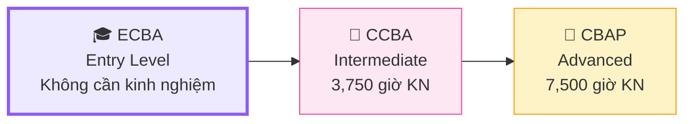
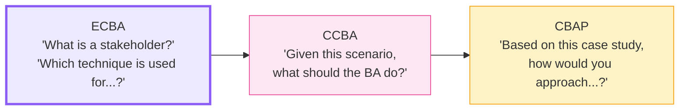
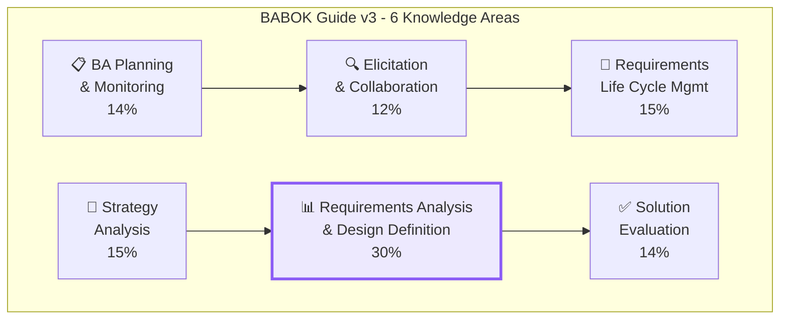
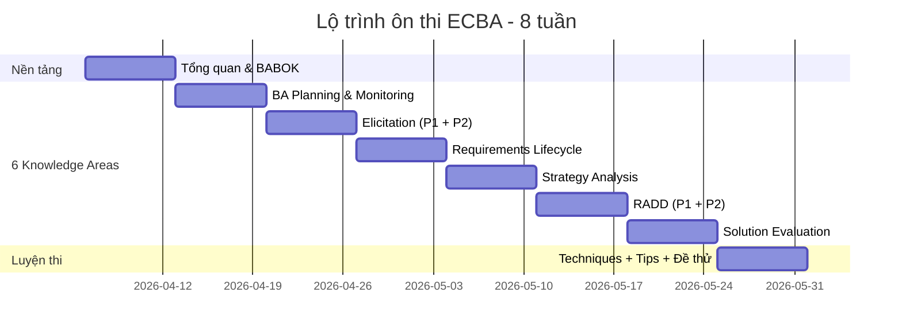

## ECBA — Bước đầu tiên vào nghề BA chuyên nghiệp

**Entry Certificate in Business Analysis (ECBA)** là chứng chỉ đầu vào (entry-level) của IIBA, dành cho những ai **mới bắt đầu** hoặc muốn chuyển sang nghề Business Analysis. Không yêu cầu kinh nghiệm, ECBA là cánh cửa đầu tiên khẳng định bạn hiểu **nền tảng kiến thức BA** theo chuẩn quốc tế.

<Callout type="info" title="ECBA phù hợp với ai?">
- Fresh graduate muốn theo nghề BA
- QA, PM, Developer muốn chuyển sang BA
- Business staff muốn nâng cao kỹ năng phân tích
- Ai muốn có chứng chỉ BA quốc tế đầu tiên mà **không cần kinh nghiệm**
</Callout>

## Lộ trình chứng chỉ IIBA

## Yêu cầu thi ECBA

### Điều kiện — Rất đơn giản!

| Tiêu chí | Chi tiết | Lưu ý |
|----------|---------|-------|
| **Kinh nghiệm BA** | ❌ Không yêu cầu | Khác CCBA/CBAP! |
| **Professional Development** | 21 giờ trong 4 năm | Workshops, courses, self-study |
| **References** | Không cần | Chỉ CCBA/CBAP mới cần |
| **Code of Conduct** | Đồng ý tuân thủ | Đạo đức nghề nghiệp IIBA |
| **Phí thi** | $150 (member) / $300 (non-member) | Tiết kiệm $150 nếu là thành viên IIBA |
| **Bằng cấp** | Không yêu cầu | Ai cũng có thể thi |

<Callout type="tip" title="Cách tích lũy 21 giờ Professional Development">
- Đọc series "Ôn thi ECBA" trên BA Tập Sự (self-study)
- Xem webinar miễn phí trên IIBA.org
- Tham gia workshop/khóa học BA online (Udemy, Coursera...)
- Đọc BABOK Guide v3
- IIBA tính cả self-study — ghi lại log giờ học
</Callout>

## Cấu trúc đề thi ECBA

### Tổng quan

- **50 câu hỏi** trắc nghiệm (multiple choice)
- **1 giờ** làm bài
- Dạng câu hỏi: **Knowledge-based** (kiểm tra kiến thức nền tảng)
- Thi online (remote proctoring) hoặc tại trung tâm PSI
- Kết quả: **Pass / Fail** (không công bố điểm cụ thể)

### So sánh 3 cấp chứng chỉ IIBA

| | ECBA | CCBA | CBAP |
|---|:---:|:---:|:---:|
| **Số câu** | 50 | 130 | 120 |
| **Thời gian** | 1 giờ | 3 giờ | 3.5 giờ |
| **Dạng câu hỏi** | Knowledge | Scenario | Case Study |
| **Kinh nghiệm** | 0 giờ | 3,750 giờ | 7,500 giờ |
| **Phí (non-member)** | $300 | $450 | $525 |
| **Mức tư duy** | Nhớ & Hiểu | Áp dụng | Phân tích & Tổng hợp |

### Tỷ trọng đề thi theo Knowledge Area

| Knowledge Area | Tỷ trọng | Số câu ước tính |
|---------------|:--------:|:---------------:|
| Requirements Analysis & Design Definition (RADD) | **30%** | ~15 câu |
| Elicitation & Collaboration (EC) | **12%** | ~6 câu |
| Requirements Life Cycle Management (RLCM) | **15%** | ~8 câu |
| BA Planning & Monitoring (BAPM) | **14%** | ~7 câu |
| Strategy Analysis (SA) | **15%** | ~8 câu |
| Solution Evaluation (SE) | **14%** | ~7 câu |

<Callout type="warning" title="Trọng tâm ôn thi ECBA">
**RADD (30%)** chiếm gần 1/3 đề thi — nhưng khác CCBA/CBAP, ECBA phân bổ **đều hơn** giữa các KA. Bạn cần ôn **tất cả 6 KA**, không được bỏ KA nào!
</Callout>

### Đặc điểm câu hỏi ECBA

ECBA kiểm tra **kiến thức nền tảng** — bạn chỉ cần **nhớ và hiểu** khái niệm:

**Ví dụ câu hỏi ECBA:**

> Kỹ thuật nào sau đây PHÙ HỢP NHẤT để thu thập yêu cầu từ một nhóm lớn người dùng ở nhiều địa điểm khác nhau?
>
> A. Phỏng vấn 1-1  
> B. **Khảo sát / Questionnaire** ✅  
> C. Workshop  
> D. Observation

→ Đáp án B: Survey/Questionnaire phù hợp cho số lượng lớn, phân tán địa lý.

## 6 Knowledge Areas — Giới thiệu tổng quan

BABOK Guide v3 chia kiến thức BA thành **6 Knowledge Areas**:

| KA | Tóm tắt một câu | Câu hỏi trả lời |
|---|---|---|
| **BA Planning** | Lên kế hoạch làm BA như thế nào | "Sẽ làm BA cách nào?" |
| **Elicitation** | Thu thập thông tin từ stakeholder | "Lấy yêu cầu từ đâu?" |
| **RLM** | Quản lý yêu cầu suốt dự án | "Quản lý yêu cầu ra sao?" |
| **Strategy** | Phân tích hiện tại → tương lai | "Tại sao cần thay đổi?" |
| **RADD** | Phân tích và thiết kế giải pháp | "Giải pháp trông như thế nào?" |
| **Solution Eval** | Đánh giá giải pháp sau triển khai | "Giải pháp có hiệu quả không?" |

## Lộ trình ôn thi 8 tuần

### Phân bổ thời gian

| Tuần | Nội dung | Thời gian/ngày | Trọng tâm |
|:----:|---------|:--------------:|----------|
| 1 | Bài 1-2: Tổng quan + BABOK | 30-60 phút | Hiểu cấu trúc tổng thể |
| 2 | Bài 3: BA Planning & Monitoring | 30-60 phút | Stakeholder, BA Plan |
| 3 | Bài 4-5: Elicitation & Collaboration | 30-60 phút | Kỹ thuật thu thập |
| 4 | Bài 6: Requirements Life Cycle | 30-60 phút | Traceability, Prioritization |
| 5 | Bài 7: Strategy Analysis | 30-60 phút | Current/Future State |
| 6 | Bài 8-9: RADD | 45-90 phút | ⭐ KA quan trọng nhất |
| 7 | Bài 10: Solution Evaluation | 30 phút | Assessment, KPI |
| 8 | Bài 11-12: Techniques + Đề thử | 60-90 phút | Giải đề, ôn flashcards |

<Callout type="tip" title="Lời khuyên cho người mới">
- Không cần đọc BABOK Guide 800 trang — series này tóm tắt đầy đủ cho bạn
- Mỗi ngày chỉ cần **30-60 phút** — kiên trì quan trọng hơn cường độ
- Làm quiz cuối mỗi bài để kiểm tra hiểu bài
- Ghi chú bằng **flashcards** — đặc biệt thuật ngữ và techniques
</Callout>

## Tài liệu ôn thi

### Đủ dùng
1. **Series ôn thi ECBA trên BA Tập Sự** — Bạn đang đọc đây! 🎓
2. **ECBA Certification Handbook** — Tải miễn phí trên IIBA.org

### Muốn đọc thêm
3. **BABOK Guide v3** — Nền tảng kiến thức gốc (800 trang, không bắt buộc đọc hết)
4. **Business Analysis for Dummies** — Nhập môn BA dễ hiểu
5. **BA Blocks / Watermark Learning** — Practice exams online

## 📝 Tóm tắt kiến thức nổi bật

<Callout type="success" title="Key Takeaways — Bài 1">
- **ECBA** là chứng chỉ entry-level của IIBA — **không yêu cầu kinh nghiệm**, chỉ cần 21 giờ Professional Development
- Đề thi gồm **50 câu knowledge-based** trong **1 giờ** (~1.2 phút/câu), kết quả Pass/Fail
- ECBA kiểm tra mức **Nhớ & Hiểu** (Bloom's Level 1-2), khác CCBA/CBAP kiểm tra Áp dụng/Phân tích
- **6 Knowledge Areas** cần ôn đều, trọng tâm RADD (30%)
- Lộ trình ôn thi **8 tuần**, mỗi ngày 30-60 phút — phù hợp người đi làm
- Phí thi $150 (member) / $300 (non-member) — tiết kiệm $150 nếu đăng ký thành viên IIBA
</Callout>

---

## 📋 Bài kiểm tra trắc nghiệm — Bài 1

<Callout type="info" title="Hướng dẫn làm bài">
Làm **10 câu** bên dưới trong **12 phút** (giống tốc độ thi thật). Chọn **MỘT đáp án đúng nhất**. Đáp án và giải thích ở cuối bài.
</Callout>

**Câu 1.** ECBA yêu cầu bao nhiêu giờ kinh nghiệm BA?

- A. 1,500 giờ
- B. 3,750 giờ
- C. 0 giờ — không yêu cầu kinh nghiệm
- D. 7,500 giờ

**Câu 2.** Đề thi ECBA có bao nhiêu câu hỏi và thời gian bao lâu?

- A. 130 câu / 3 giờ
- B. 50 câu / 1 giờ
- C. 120 câu / 3.5 giờ
- D. 75 câu / 2 giờ

**Câu 3.** Knowledge Area nào chiếm tỷ trọng lớn nhất trong đề thi ECBA?

- A. Elicitation & Collaboration
- B. Strategy Analysis
- C. Requirements Analysis & Design Definition (RADD)
- D. Solution Evaluation

**Câu 4.** ECBA kiểm tra mức tư duy nào theo Bloom's Taxonomy?

- A. Áp dụng (Application)
- B. Nhớ và Hiểu (Knowledge & Comprehension)
- C. Phân tích (Analysis)
- D. Tổng hợp (Synthesis)

**Câu 5.** Trong lộ trình chứng chỉ IIBA, thứ tự từ thấp đến cao là:

- A. CCBA → ECBA → CBAP
- B. CBAP → CCBA → ECBA
- C. ECBA → CCBA → CBAP
- D. ECBA → CBAP → CCBA

**Câu 6.** Professional Development hours cho ECBA yêu cầu:

- A. 35 giờ trong 4 năm
- B. 21 giờ trong 4 năm
- C. 0 giờ
- D. 50 giờ không giới hạn

**Câu 7.** Câu hỏi ECBA chủ yếu ở dạng nào?

- A. Scenario-based (tình huống thực tế)
- B. Case study (nghiên cứu tình huống dài)
- C. Knowledge-based (kiểm tra kiến thức nền tảng)
- D. Essay (tự luận)

**Câu 8.** BABOK Guide v3 có bao nhiêu Knowledge Areas?

- A. 4
- B. 5
- C. 6
- D. 8

**Câu 9.** Kết quả thi ECBA được thông báo như thế nào?

- A. Điểm cụ thể từ 0-100%
- B. Pass / Fail không công bố điểm
- C. Xếp hạng A/B/C/D/F
- D. Pass với điểm từng KA

**Câu 10.** Ai có thể thi ECBA?

- A. Chỉ người có bằng đại học ngành IT
- B. Chỉ người đang làm BA
- C. Bất kỳ ai — không yêu cầu kinh nghiệm hay bằng cấp
- D. Chỉ người có reference từ BA manager

---

### 🔑 Đáp án & Giải thích

| Câu | Đáp án | Giải thích |
|:---:|:------:|-----------|
| 1 | **C** | ECBA không yêu cầu kinh nghiệm BA. 3,750 giờ là CCBA, 7,500 giờ là CBAP. |
| 2 | **B** | ECBA: 50 câu / 1 giờ. CCBA: 130 câu / 3 giờ. CBAP: 120 câu / 3.5 giờ. |
| 3 | **C** | RADD chiếm 30% — lớn nhất trong ECBA. |
| 4 | **B** | ECBA kiểm tra Nhớ & Hiểu (Bloom's Level 1-2). CCBA mới ở mức Áp dụng. |
| 5 | **C** | ECBA (entry) → CCBA (intermediate) → CBAP (advanced). |
| 6 | **B** | ECBA yêu cầu 21 giờ PD trong 4 năm — giống CCBA. |
| 7 | **C** | ECBA = knowledge-based (nhớ kiến thức). CCBA = scenario-based. CBAP = case study. |
| 8 | **C** | BABOK v3 có 6 Knowledge Areas. |
| 9 | **B** | Tất cả kỳ thi IIBA đều chỉ thông báo Pass/Fail. |
| 10 | **C** | ECBA mở cho tất cả — không yêu cầu kinh nghiệm, bằng cấp, hay reference. |

### 📊 Thang đánh giá

| Số câu đúng | Đánh giá | Hành động |
|:-----------:|---------|-----------|
| 9-10 | ⭐ Xuất sắc | Sẵn sàng học tiếp bài 2! |
| 7-8 | ✅ Tốt | Ôn lại phần cấu trúc đề thi |
| 5-6 | ⚠️ Trung bình | Đọc lại bài, chú ý bảng so sánh 3 chứng chỉ |
| < 5 | ❌ Cần ôn lại | Đọc kỹ lại toàn bộ bài |

---

## Tiếp theo

Bài tiếp theo sẽ giới thiệu **BABOK Guide v3** — cấu trúc, khái niệm nền tảng, và cách 6 Knowledge Areas liên kết với nhau. Đây là nền tảng để hiểu toàn bộ nội dung thi ECBA.

---

*Hành trình chinh phục ECBA bắt đầu từ đây! 🎓*
