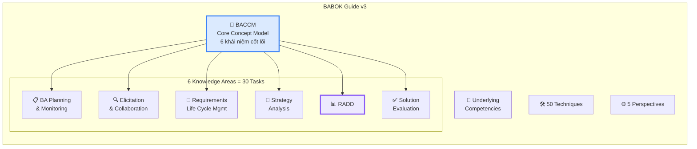
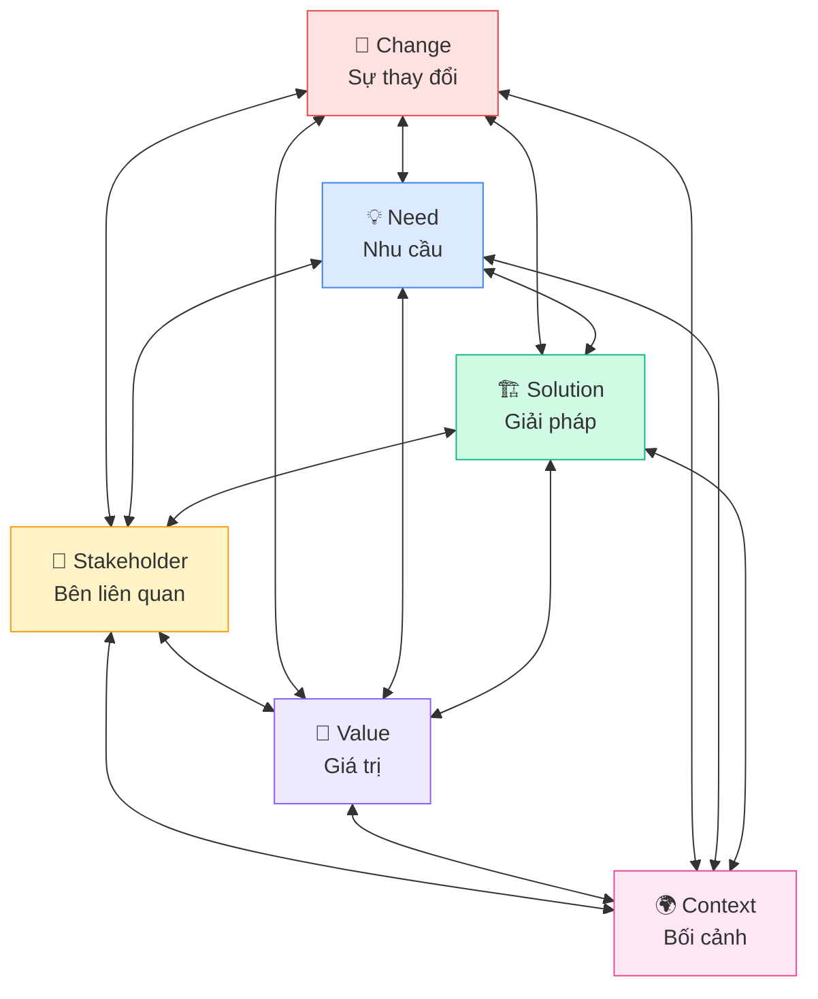
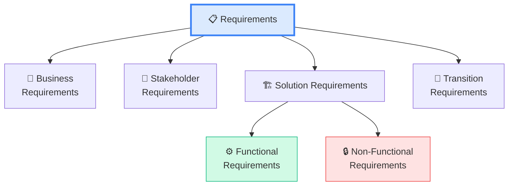
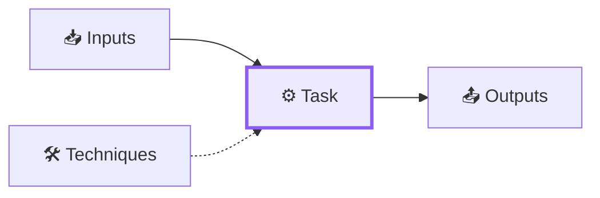

## BABOK Guide v3 là gì?

**Business Analysis Body of Knowledge (BABOK) Guide v3** là tài liệu tham chiếu chuẩn quốc tế của IIBA, mô tả toàn bộ kiến thức cần thiết cho nghề Business Analysis. Đây là **nguồn chính để ra đề thi ECBA** — hiểu BABOK = hiểu đề thi.

<Callout type="info" title="Điểm cần nhớ">
BABOK **không phải** là methodology (phương pháp) hay framework (khung). Nó là **knowledge standard** — mô tả BA **"làm gì"**, không phải **"làm như thế nào trong dự án cụ thể"**.
</Callout>

## Cấu trúc tổng thể BABOK Guide v3

Gồm:
- **1 Core Concept Model** (BACCM) — 6 khái niệm cốt lõi
- **6 Knowledge Areas** — 30 Tasks tổng cộng
- **50 Techniques** — Kỹ thuật áp dụng xuyên suốt
- **Underlying Competencies** — Năng lực nền tảng của BA
- **5 Perspectives** — Góc nhìn theo context dự án

## Business Analysis Core Concept Model (BACCM)

BACCM là **trái tim của BABOK** — 6 khái niệm liên kết TẤT CẢ với nhau:

| Khái niệm | Nghĩa đơn giản | Ví dụ dễ hiểu |
|-----------|----------------|---------------|
| **Change** | Sự thay đổi cần thực hiện | Chuyển từ nhập tay sang tự động |
| **Need** | Vấn đề hoặc cơ hội | Nhân viên mất 4 giờ/ngày nhập liệu |
| **Solution** | Cách giải quyết nhu cầu | Phần mềm OCR tự động đọc hóa đơn |
| **Stakeholder** | Ai liên quan đến thay đổi | Nhân viên, quản lý, BA, developer |
| **Value** | Giá trị mang lại | Tiết kiệm 4 giờ/ngày = giảm chi phí |
| **Context** | Bối cảnh xung quanh | Công ty tài chính, tuân thủ pháp luật |

<Callout type="tip" title="Cách nhớ BACCM">
Nhớ câu: **"Changes in Context create Needs for Solutions that deliver Value to Stakeholders"**

Hoặc viết tắt: **CCNSVS** — Change, Context, Need, Solution, Value, Stakeholder.
</Callout>

## Phân loại Requirements (Yêu cầu)

BABOK chia requirements thành **4 loại** — đây là kiến thức HAY RA ĐỀ THI nhất:

| Loại | Là gì? | Ví dụ |
|------|--------|-------|
| **Business** | Mục tiêu cấp cao của tổ chức | "Tăng doanh thu online 30%" |
| **Stakeholder** | Nhu cầu cụ thể của người dùng | "Tôi cần xem báo cáo real-time" |
| **Functional** | Hệ thống phải LÀM GÌ | "Cho phép lọc đơn hàng theo ngày" |
| **Non-Functional** | Hệ thống phải TỐT NHƯ THẾ NÀO | "Trang web load trong 2 giây" |
| **Transition** | Cần khi chuyển đổi, tạm thời | "Di chuyển dữ liệu từ hệ thống cũ" |

<Callout type="warning" title="Phân biệt Functional vs Non-Functional — Hay ra đề!">
- **Functional** = hệ thống **LÀM GÌ** (behavior, chức năng)
- **Non-Functional** = hệ thống **** **NHƯ THẾ NÀO** (performance, security, usability)

Ví dụ: "Hệ thống cho phép thanh toán qua thẻ" = **Functional**. "Hệ thống xử lý 1,000 giao dịch/giây" = **Non-Functional**.
</Callout>

## 6 Knowledge Areas — Tổng quan

Mỗi Knowledge Area được cấu trúc theo pattern:

### Tóm tắt 30 Tasks trong 6 Knowledge Areas

| KA | Số Tasks | Tasks chính |
|---|:---:|---|
| **BA Planning & Monitoring** | 5 | Plan BA Approach, Plan Stakeholder Engagement, Plan Governance, Info Management, Performance |
| **Elicitation & Collaboration** | 5 | Prepare, Conduct, Confirm Results, Communicate, Manage Collaboration |
| **Requirements Life Cycle Mgmt** | 5 | Trace, Maintain, Prioritize, Assess Changes, Approve |
| **Strategy Analysis** | 5 | Analyze Current State, Define Future State, Assess Risks, Define Change Strategy |
| **RADD** | 6 | Specify & Model, Verify, Validate, Define Architecture, Design Options, Recommend |
| **Solution Evaluation** | 5 | Measure Performance, Analyze, Assess Solution Limitations, Enterprise Limitations, Recommend |

## Underlying Competencies — Năng lực nền tảng

Ngoài kiến thức chuyên môn, BA cần có những năng lực nền tảng:

| Competency | Giải thích đơn giản |
|-----------|-------------------|
| **Analytical Thinking** | Biết phân tích vấn đề, chia nhỏ để giải quyết |
| **Communication Skills** | Nói và viết rõ ràng, hiệu quả |
| **Interaction Skills** | Làm việc nhóm, facilitating, thương lượng |
| **Business Knowledge** | Hiểu ngành, tổ chức, giải pháp |
| **Behavioural Characteristics** | Đạo đức, chủ động, linh hoạt |
| **Tools & Technology** | Sử dụng công cụ phần mềm phù hợp |

## 5 Perspectives — Góc nhìn theo context

| Perspective | Khi nào áp dụng |
|------------|----------------|
| **Agile** | Dự án, bàn Product Backlog, Sprint, Scrum |
| **Business Intelligence** | Phân tích dữ liệu, báo cáo, data warehouse |
| **Information Technology** | Phát triển phần mềm, hệ thống IT |
| **Business Architecture** | Chiến lược doanh nghiệp, cấp tổ chức |
| **Business Process Management** | Tối ưu quy trình nghiệp vụ |

<Callout type="info" title="Mẹo cho ECBA">
Đề thi ECBA ít hỏi trực tiếp về Perspectives, nhưng hiểu context giúp bạn **loại trừ đáp án sai** nhanh hơn.
</Callout>

## 📝 Tóm tắt kiến thức nổi bật

<Callout type="success" title="Key Takeaways — Bài 2">
- **BACCM** gồm 6 khái niệm cốt lõi: Change, Need, Solution, Stakeholder, Value, Context — TẤT CẢ liên kết với nhau
- **6 Knowledge Areas** chứa tổng **30 Tasks** — mỗi Task có Input → Task → Output
- **4 loại Requirements**: Business → Stakeholder → Solution (Functional + Non-Functional) → Transition
- Phân biệt **Functional** (LÀM GÌ) vs **Non-Functional** (TỐT NHƯ THẾ NÀO) — hay ra đề thi
- **5 Perspectives**: Agile, BI, IT, Business Architecture, BPM
- **Underlying Competencies**: Analytical Thinking, Communication, Business Knowledge...
</Callout>

---

## 📋 Bài kiểm tra trắc nghiệm — Bài 2

<Callout type="info" title="Hướng dẫn làm bài">
Làm **10 câu** bên dưới trong **12 phút**. Chọn **MỘT đáp án đúng nhất**. Đáp án ở cuối bài.
</Callout>

**Câu 1.** BACCM bao gồm bao nhiêu khái niệm cốt lõi?

- A. 4
- B. 5
- C. 6
- D. 8

**Câu 2.** "Need" trong BACCM nghĩa là gì?

- A. Nhu cầu mua phần mềm
- B. Vấn đề hoặc cơ hội cần giải quyết
- C. Nhu cầu tuyển thêm nhân viên
- D. Yêu cầu từ khách hàng bên ngoài

**Câu 3.** "Hệ thống phải mã hóa dữ liệu bằng AES-256" thuộc loại requirement nào?

- A. Business Requirement
- B. Functional Requirement
- C. Non-Functional Requirement
- D. Transition Requirement

**Câu 4.** BABOK v3 có tổng cộng bao nhiêu Techniques?

- A. 30
- B. 40
- C. 50
- D. 60

**Câu 5.** "Migrate dữ liệu từ hệ thống cũ sang mới trước ngày go-live" là:

- A. Business Requirement
- B. Stakeholder Requirement
- C. Functional Requirement
- D. Transition Requirement

**Câu 6.** Mỗi Task trong BABOK được cấu trúc theo pattern nào?

- A. Plan → Do → Check → Act
- B. Input → Task → Output
- C. Requirement → Design → Test
- D. Analyze → Design → Implement

**Câu 7.** "Tăng doanh thu online 20% trong 12 tháng" thuộc loại requirement nào?

- A. Business Requirement
- B. Stakeholder Requirement
- C. Functional Requirement
- D. Non-Functional Requirement

**Câu 8.** Underlying Competency nào giúp BA làm việc nhóm hiệu quả?

- A. Analytical Thinking
- B. Tools & Technology
- C. Interaction Skills
- D. Business Knowledge

**Câu 9.** Khi dự án áp dụng Scrum với Sprint và Backlog, nên xem ở Perspective nào?

- A. Business Intelligence
- B. Agile
- C. Business Architecture
- D. BPM

**Câu 10.** "Cho phép người dùng reset mật khẩu qua email" thuộc loại requirement nào?

- A. Business Requirement
- B. Non-Functional Requirement
- C. Functional Requirement
- D. Transition Requirement

---

### 🔑 Đáp án & Giải thích

| Câu | Đáp án | Giải thích |
|:---:|:------:|-----------|
| 1 | **C** | BACCM = 6 core concepts: Change, Need, Solution, Stakeholder, Value, Context. |
| 2 | **B** | Need = vấn đề cần giải quyết hoặc cơ hội cần nắm bắt. |
| 3 | **C** | Mã hóa AES-256 = yêu cầu bảo mật = quality attribute = Non-Functional. |
| 4 | **C** | BABOK v3 có 50 Techniques. 30 là số Tasks. |
| 5 | **D** | Data migration chỉ cần trong giai đoạn chuyển đổi = Transition Requirement. |
| 6 | **B** | Mỗi Task trong BABOK theo pattern: Input → Task → Output. |
| 7 | **A** | Mục tiêu cấp cao của tổ chức = Business Requirement. |
| 8 | **C** | Interaction Skills = teamwork, facilitation, negotiation, leadership. |
| 9 | **B** | Scrum, Sprint, Backlog = Agile Perspective. |
| 10 | **C** | Reset mật khẩu = hành vi cụ thể hệ thống cần LÀM = Functional Requirement. |

### 📊 Thang đánh giá

| Số câu đúng | Đánh giá | Hành động |
|:-----------:|---------|-----------|
| 9-10 | ⭐ Xuất sắc | Nền tảng vững chắc! |
| 7-8 | ✅ Tốt | Ôn lại Requirements Classification |
| 5-6 | ⚠️ Trung bình | Đọc lại BACCM và phân loại requirements |
| < 5 | ❌ Cần ôn lại | BABOK nền tảng — cần nắm chắc trước khi tiếp |

---

## Tiếp theo

Bài tiếp theo đi vào **Knowledge Area đầu tiên: BA Planning & Monitoring** — nơi BA bắt đầu lên kế hoạch, xác định stakeholder, và tổ chức công việc.

---

*Nắm vững BABOK = nắm vững nền tảng thi ECBA! 📚*
