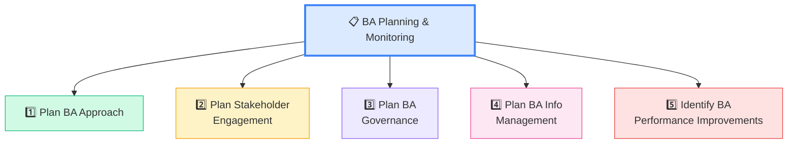
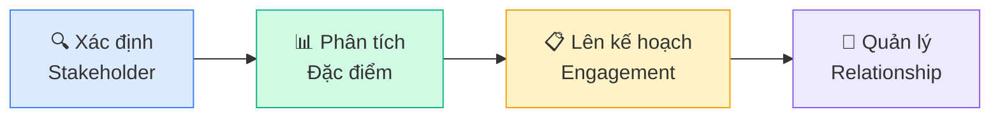
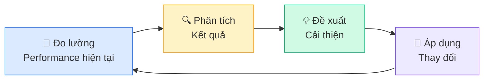

## BA Planning & Monitoring là gì?

**BA Planning & Monitoring** là Knowledge Area đầu tiên trong BABOK — mô tả cách BA **lên kế hoạch, tổ chức, và theo dõi** công việc phân tích nghiệp vụ. Nói đơn giản: **"trước khi làm gì, phải plan trước."**

<Callout type="info" title="Tại sao KA này quan trọng?">
BA Planning & Monitoring **không phải** là Project Planning. Đây là planning cho **công việc BA** — xác định approach, stakeholder, governance, cách quản lý thông tin, và đo lường performance.
</Callout>

## Tổng quan 5 Tasks

## Task 1: Plan BA Approach

**Mục đích:** Xác định **cách tiếp cận BA** cho initiative — dùng Predictive hay Adaptive?

| Yếu tố | Predictive (Waterfall) | Adaptive (Agile) |
|--------|----------------------|------------------|
| Kế hoạch | Lên chi tiết từ đầu | Lên từng iteration |
| Thay đổi | Ít, kiểm soát chặt | Chào đón thay đổi |
| Deliverables | BRD, SRS đầy đủ | User Stories, Backlog |
| Thích hợp | Hệ thống ổn định, compliance | Sản phẩm mới, market nhanh |

**Elements chính:**
- **Methodology selection** — Chọn approach phù hợp context
- **Timing of BA work** — Khi nào BA bắt đầu và kết thúc
- **Complexity & risk** — Đánh giá độ phức tạp
- **Deliverables & activities** — BA sẽ tạo ra gì

<Callout type="tip" title="Mẹo thi ECBA">
Đề thi thường hỏi: **"BA nên làm gì ĐẦU TIÊN?"** → Đáp án thường liên quan đến **Plan BA Approach** — vì phải lên kế hoạch trước khi làm bất cứ điều gì.
</Callout>

## Task 2: Plan Stakeholder Engagement

**Mục đích:** Xác định stakeholder, phân tích và lên kế hoạch tương tác.

### Stakeholder Roles phổ biến trong BABOK

| Role | Mô tả ngắn |
|------|-----------|
| **Business Analyst** | Thực hiện BA activities |
| **Customer** | Người sử dụng sản phẩm/dịch vụ |
| **Domain SME** | Chuyên gia lĩnh vực, cung cấp domain knowledge |
| **End User** | Người dùng cuối, tương tác trực tiếp với solution |
| **Implementation SME** | Dev, Tester, DBA — người xây dựng solution |
| **Project Manager** | Quản lý project scope, schedule, budget |
| **Regulator** | Cơ quan quản lý, ban hành quy định |
| **Sponsor** | Người tài trợ, authority cao nhất |

### RACI Matrix — Kỹ thuật phân vai

| | BA | Sponsor | PM | Dev |
|---|:---:|:---:|:---:|:---:|
| Elicitation | **R** | C | I | I |
| Approve Requirements | I | **A** | C | I |
| Solution Design | C | I | I | **R** |

- **R** = Responsible (Người thực hiện)
- **A** = Accountable (Người chịu trách nhiệm cuối cùng)
- **C** = Consulted (Được hỏi ý kiến)
- **I** = Informed (Được thông báo)

## Task 3: Plan BA Governance

**Mục đích:** Xác định **quy trình ra quyết định** cho BA work.

Governance bao gồm:
- **Ai có quyền approve** requirements?
- **Quy trình change request** hoạt động thế nào?
- **Metrics** để đo lường BA performance?
- **Escalation path** khi có bất đồng?

<Callout type="warning" title="Phân biệt Governance vs Management">
- **Governance** = QUY TẮC chơi (ai có quyền, quy trình quyết định)
- **Management** = CÁCH CHƠI theo quy tắc (thực hiện hàng ngày)

Ví dụ: Governance nói "Sponsor phải approve BR" — Management thực hiện việc gửi BR cho sponsor ký.
</Callout>

## Task 4: Plan BA Information Management

**Mục đích:** Xác định cách **tổ chức, lưu trữ, và truy cập** thông tin BA.

Các quyết định cần đưa ra:

| Quyết định | Giải thích | Ví dụ |
|-----------|-----------|-------|
| **Level of detail** | Chi tiết đến mức nào? | User stories vs formal SRS |
| **Storage** | Lưu ở đâu? | SharePoint, Confluence, Jira |
| **Access** | Ai được xem gì? | Stakeholder matrix + ACL |
| **Traceability** | Liên kết giữa các requirements | Traceability matrix |
| **Reuse** | Dùng lại requirements cũ? | Requirements library |

## Task 5: Identify BA Performance Improvements

**Mục đích:** Đánh giá và **cải thiện hiệu quả** công việc BA.

**Performance Metrics** cho BA:
- Thời gian hoàn thành elicitation
- Số lượng defects do requirements sai
- Stakeholder satisfaction score
- Requirements stability index

<Callout type="info" title="Lưu ý ECBA">
Task 5 thường là task ÍT ra đề thi ECBA nhất trong KA này, nhưng vẫn cần nắm khái niệm cơ bản.
</Callout>

## Techniques thường dùng trong BA Planning

| Technique | Áp dụng cho Task nào | Mục đích |
|-----------|---------------------|---------|
| **Brainstorming** | Nhiều tasks | Thu thập ý tưởng nhanh từ nhóm |
| **Stakeholder Map** | Plan Stakeholder Engagement | Trực quan hóa stakeholder relationships |
| **RACI Matrix** | Plan Governance | Phân rõ vai trò trách nhiệm |
| **Lessons Learned** | Performance Improvements | Rút kinh nghiệm từ dự án trước |
| **Estimation** | Plan BA Approach | Ước lượng effort và timeline |

---

## 📝 Tóm tắt kiến thức nổi bật

<Callout type="success" title="Key Takeaways — Bài 3">
- BA Planning & Monitoring gồm **5 Tasks** — tất cả liên quan đến PLANNING công việc BA
- **Plan BA Approach**: Chọn Predictive hay Adaptive — câu hỏi "BA nên làm gì đầu tiên?"
- **Plan Stakeholder Engagement**: Xác định + Phân tích + Lên kế hoạch tương tác stakeholder
- **Plan Governance**: Quy tắc ra quyết định — AI approve, quy trình change, escalation
- **Plan Info Management**: Tổ chức lưu trữ, traceability, reuse
- **Performance Improvements**: Đo lường → Phân tích → Cải thiện (continuous improvement)
- Phân biệt **Governance** (quy tắc) vs **Management** (thực hiện)
</Callout>

---

## 📋 Bài kiểm tra trắc nghiệm — Bài 3

<Callout type="info" title="Hướng dẫn làm bài">
Làm **10 câu** bên dưới trong **12 phút**. Chọn **MỘT đáp án đúng nhất**. Đáp án ở cuối bài.
</Callout>

**Câu 1.** BA Planning & Monitoring gồm bao nhiêu Tasks?

- A. 4
- B. 5
- C. 6
- D. 7

**Câu 2.** Task nào xác định cách tiếp cận BA — Predictive hay Adaptive?

- A. Plan Stakeholder Engagement
- B. Plan BA Approach
- C. Plan BA Governance
- D. Plan BA Info Management

**Câu 3.** Trong RACI Matrix, "A" nghĩa là gì?

- A. Analyst
- B. Agreed
- C. Accountable
- D. Approved

**Câu 4.** Sponsor trong dự án có vai trò gì?

- A. Viết user stories
- B. Test phần mềm
- C. Authority cao nhất, tài trợ dự án
- D. Thiết kế giao diện

**Câu 5.** BA Governance focus vào điều gì?

- A. Viết tài liệu requirements
- B. Quy trình ra quyết định và phê duyệt
- C. Thiết kế solution
- D. Test và đánh giá solution

**Câu 6.** "BA nên lưu requirements ở đâu, ai được truy cập?" — thuộc Task nào?

- A. Plan BA Approach
- B. Plan Stakeholder Engagement
- C. Plan BA Governance
- D. Plan BA Information Management

**Câu 7.** Dự án nào phù hợp với Adaptive (Agile) approach?

- A. Hệ thống tuân thủ quy định y tế nghiêm ngặt
- B. Sản phẩm startup cần ra thị trường nhanh
- C. Hệ thống kế toán theo chuẩn nhà nước
- D. Phần mềm cho nhà máy điện hạt nhân

**Câu 8.** Task nào đánh giá và cải thiện hiệu quả công việc BA?

- A. Plan BA Approach
- B. Plan BA Governance
- C. Plan BA Info Management
- D. Identify BA Performance Improvements

**Câu 9.** "SME" trong stakeholder roles nghĩa là gì?

- A. Senior Management Executive
- B. Subject Matter Expert
- C. System Management Expert
- D. Strategic Marketing Expert

**Câu 10.** Khi BA cần xác định "ai sẽ tham gia review requirements?", đó thuộc Task nào?

- A. Plan BA Approach
- B. Plan Stakeholder Engagement
- C. Plan BA Governance
- D. Plan BA Info Management

---

### 🔑 Đáp án & Giải thích

| Câu | Đáp án | Giải thích |
|:---:|:------:|-----------|
| 1 | **B** | BA Planning & Monitoring có 5 Tasks. |
| 2 | **B** | Plan BA Approach xác định BA methodology — Predictive hay Adaptive. |
| 3 | **C** | A = Accountable = Người chịu trách nhiệm cuối cùng, có quyền quyết định. |
| 4 | **C** | Sponsor = authority cao nhất, tài trợ và phê duyệt quyết định quan trọng. |
| 5 | **B** | Governance = quy trình ra quyết định, phê duyệt, escalation path. |
| 6 | **D** | Plan BA Info Management — quản lý nơi lưu trữ, access, traceability. |
| 7 | **B** | Startup cần nhanh, chấp nhận thay đổi = Adaptive/Agile phù hợp nhất. |
| 8 | **D** | Identify BA Performance Improvements — đo lường, phân tích, cải thiện. |
| 9 | **B** | SME = Subject Matter Expert — chuyên gia lĩnh vực. |
| 10 | **B** | Xác định ai tham gia review = Plan Stakeholder Engagement. |

### 📊 Thang đánh giá

| Số câu đúng | Đánh giá | Hành động |
|:-----------:|---------|-----------|
| 9-10 | ⭐ Xuất sắc | Sẵn sàng cho KA tiếp theo! |
| 7-8 | ✅ Tốt | Ôn lại sự khác nhau giữa 5 Tasks |
| 5-6 | ⚠️ Trung bình | Đọc lại phần Governance vs Management |
| < 5 | ❌ Cần ôn lại | Đọc lại toàn bộ bài |

---

## Tiếp theo

Bài tiếp theo: **Elicitation & Collaboration (Phần 1)** — Kỹ thuật thu thập yêu cầu, giao tiếp với stakeholder — KA thực hành nhiều nhất của BA!

---

*Plan trước, action sau — nguyên tắc vàng của BA! 📋*
