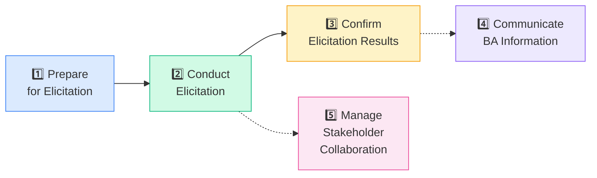
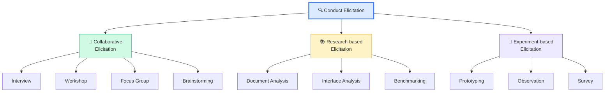
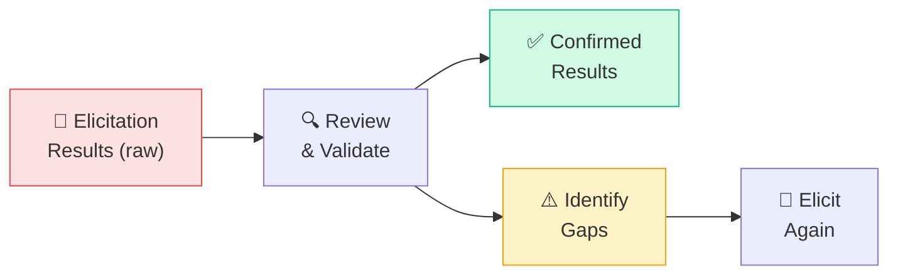
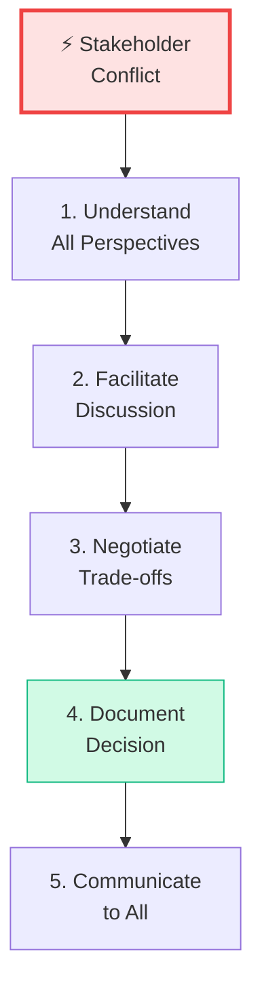

## Elicitation & Collaboration là gì?

**Elicitation & Collaboration** là Knowledge Area mô tả cách BA **thu thập thông tin từ stakeholder** và **cộng tác hiệu quả** trong suốt quá trình phân tích. Đây là KA **thực hành nhiều nhất** — BA làm elicitation hàng ngày.

<Callout type="info" title="Elicitation ≠ Requirements Gathering">
"**Elicitation**" (khơi gợi) khác với "gathering" (thu thập). Gathering nghe như stakeholder biết sẵn yêu cầu, BA chỉ cần gom lại. Thực tế, stakeholder thường **chưa biết rõ** họ cần gì — BA phải **khơi gợi** thông tin từ nhiều nguồn.
</Callout>

## Tổng quan 5 Tasks

## Task 1: Prepare for Elicitation

**Mục đích:** Chuẩn bị mọi thứ TRƯỚC khi thu thập — ai, ở đâu, khi nào, dùng kỹ thuật gì.

### Preparation Checklist

| Chuẩn bị | Chi tiết |
|----------|---------|
| **Objectives** | Mục tiêu elicitation session — cần biết gì? |
| **Scope** | Phạm vi — chỉ hỏi về module nào? |
| **Participants** | Ai tham gia? Đã confirm chưa? |
| **Techniques** | Dùng Interview, Workshop, hay Survey? |
| **Logistics** | Phòng họp, thời gian, công cụ (Zoom/Teams?) |
| **Questions** | Danh sách câu hỏi chuẩn bị trước |

<Callout type="tip" title="Mẹo thi">
Đề thi thường hỏi "BA nên làm gì TRƯỚC KHI conduct elicitation?" → Đáp án: **Prepare** — xác định objectives, participants, technique.
</Callout>

## Task 2: Conduct Elicitation

**Mục đích:** Thực hiện elicitation — **thu thập thông tin** từ stakeholder hoặc nguồn khác.

### 3 loại Elicitation

| Loại | Khi nào dùng | Ví dụ |
|------|-------------|-------|
| **Collaborative** | Cần trao đổi trực tiếp với người | Workshop với team, Interview PM |
| **Research** | Tìm hiểu hệ thống/tài liệu có sẵn | Đọc SRS cũ, phân tích API |
| **Experiment** | Cần verify bằng thực nghiệm | Prototype UI để test với user |

### Kỹ thuật Elicitation phổ biến nhất

| Technique | Mô tả | Ưu điểm | Nhược điểm |
|-----------|--------|---------|-----------|
| **Interview** | Hỏi đáp 1:1 hoặc nhóm nhỏ | Sâu, chi tiết, linh hoạt | Tốn thời gian, phụ thuộc người hỏi |
| **Workshop** | Họp nhóm có cấu trúc, facilitated | Nhanh, đa góc nhìn | Cần facilitator giỏi |
| **Observation** | Xem người dùng làm việc thực tế | Thấy thực tế, không bị bias | Người bị quan sát có thể thay đổi hành vi |
| **Survey** | Gửi bảng khảo sát | Scale lớn, nhanh | Thiếu chi tiết, tỉ lệ phản hồi thấp |
| **Document Analysis** | Đọc tài liệu có sẵn | Không mất thời gian stakeholder | Tài liệu có thể outdated |
| **Prototyping** | Tạo UI demo, wireframe | Stakeholder "thấy" sản phẩm | Stakeholder có thể nghĩ đã xong |

<Callout type="warning" title="Observation — Hawthorne Effect">
Khi **quan sát** người dùng, họ có thể **thay đổi hành vi** vì biết đang bị xem. Đây gọi là **Hawthorne Effect**. BA cần nhận biết hiện tượng này.
</Callout>

## Task 3: Confirm Elicitation Results

**Mục đích:** Xác nhận thông tin đã thu thập là **chính xác và đầy đủ**.

**Hoạt động:**
- **Compare** notes/recording với hiểu biết của BA
- **Walk-through** kết quả với stakeholder để xác nhận
- **Identify gaps** — thiếu thông tin gì? mâu thuẫn gì?
- **Schedule follow-up** nếu cần elicit thêm

## Task 4: Communicate BA Information

**Mục đích:** Truyền đạt thông tin BA đến đúng người, đúng format, đúng mức chi tiết.

| Yếu tố | Giải thích |
|--------|-----------|
| **Audience** | Khán giả — sponsor cần tóm tắt, developer cần chi tiết |
| **Format** | Text, diagram, presentation, demo? |
| **Level of detail** | Executive summary vs detailed specification |
| **Frequency** | Gửi một lần hay update thường xuyên? |
| **Channel** | Email, meeting, Slack, wiki? |

<Callout type="tip" title="Nguyên tắc Communication">
BA cần **điều chỉnh cách truyền đạt** theo từng stakeholder:
- **Sponsor**: Tóm tắt, focus business value
- **Developer**: Chi tiết kỹ thuật, acceptance criteria
- **End User**: Demo, prototype, ngôn ngữ đơn giản
</Callout>

## Task 5: Manage Stakeholder Collaboration

**Mục đích:** Duy trì **mối quan hệ tốt** và **giải quyết xung đột** giữa stakeholders.

### Xung đột stakeholder phổ biến

| Xung đột | Ví dụ | BA nên làm gì |
|---------|-------|--------------|
| **Conflicting requirements** | Marketing muốn A, Security muốn B | Facilitate thảo luận, tìm trade-off |
| **Lack of engagement** | Stakeholder không phản hồi | Escalate, tìm hiểu nguyên nhân |
| **Scope creep** | Yêu cầu ngày càng nhiều thêm | Dùng Governance process, prioritize |
| **Resistance to change** | User không muốn hệ thống mới | Communicate benefits, involve sớm |

---

## 📝 Tóm tắt kiến thức nổi bật

<Callout type="success" title="Key Takeaways — Bài 4">
- **Elicitation ≠ Gathering** — BA phải **khơi gợi** chứ không chỉ thu thập
- **5 Tasks**: Prepare → Conduct → Confirm → Communicate → Manage Collaboration
- **3 loại Elicitation**: Collaborative (interview, workshop), Research (document), Experiment (prototype)
- **Prepare TRƯỚC** — đề thi hay hỏi "BA nên làm gì đầu tiên?"
- **Confirm kết quả** — walk-through với stakeholder, tìm gaps
- **Communication** phải phù hợp audience — sponsor cần tóm tắt, dev cần chi tiết
- **Hawthorne Effect** — người bị quan sát thay đổi hành vi
</Callout>

---

## 📋 Bài kiểm tra trắc nghiệm — Bài 4

<Callout type="info" title="Hướng dẫn làm bài">
Làm **10 câu** bên dưới trong **12 phút**. Chọn **MỘT đáp án đúng nhất**. Đáp án ở cuối bài.
</Callout>

**Câu 1.** Tại sao BABOK dùng từ "Elicitation" thay vì "Gathering"?

- A. Vì Gathering không chuyên nghiệp
- B. Vì stakeholder thường chưa biết rõ yêu cầu, BA cần khơi gợi
- C. Vì Elicitation nghe hay hơn
- D. Vì IIBA muốn khác biệt

**Câu 2.** Trước khi conduct elicitation, BA nên làm gì?

- A. Viết BRD
- B. Prepare — xác định objectives, participants, technique
- C. Design solution
- D. Test prototype

**Câu 3.** Interview thuộc loại elicitation nào?

- A. Research-based
- B. Experiment-based
- C. Collaborative
- D. Observation-based

**Câu 4.** Khi BA cần thu thập ý kiến từ 500 nhân viên, technique nào phù hợp nhất?

- A. Interview
- B. Workshop
- C. Survey
- D. Observation

**Câu 5.** Hawthorne Effect là gì?

- A. Người dùng quá hài lòng khi được hỏi ý kiến
- B. Người bị quan sát thay đổi hành vi vì biết đang bị xem
- C. Stakeholder không muốn trả lời phỏng vấn
- D. BA bị bias khi phỏng vấn

**Câu 6.** Khi trình bày requirements cho sponsor, BA nên focus vào gì?

- A. Technical details và database schema
- B. API endpoints và error codes
- C. Tóm tắt và business value
- D. Test cases và acceptance criteria

**Câu 7.** Marketing muốn feature A nhưng Security phản đối. BA nên làm gì?

- A. Chọn bên Marketing vì họ tạo doanh thu
- B. Chọn bên Security vì bảo mật quan trọng hơn
- C. Facilitate thảo luận và tìm trade-off
- D. Escalate lên CEO để quyết định

**Câu 8.** Confirm Elicitation Results nhằm mục đích gì?

- A. Xác nhận budget dự án
- B. Xác nhận thông tin thu thập là chính xác và đầy đủ
- C. Xác nhận solution đã pass test
- D. Xác nhận dự án hoàn thành

**Câu 9.** Prototyping thuộc loại elicitation nào?

- A. Collaborative
- B. Research-based
- C. Experiment-based
- D. Documentation-based

**Câu 10.** Elicitation & Collaboration gồm bao nhiêu Tasks?

- A. 4
- B. 5
- C. 6
- D. 7

---

### 🔑 Đáp án & Giải thích

| Câu | Đáp án | Giải thích |
|:---:|:------:|-----------|
| 1 | **B** | Elicitation = khơi gợi, vì stakeholder thường chưa rõ yêu cầu. |
| 2 | **B** | Prepare for Elicitation — xác định mục tiêu, người tham gia, kỹ thuật. |
| 3 | **C** | Interview = trao đổi trực tiếp = Collaborative elicitation. |
| 4 | **C** | Survey — scale lớn, thu thập từ nhiều người hiệu quả nhất. |
| 5 | **B** | Hawthorne Effect = thay đổi hành vi khi bị quan sát. |
| 6 | **C** | Sponsor cần tóm tắt và hiểu business value, không cần chi tiết kỹ thuật. |
| 7 | **C** | BA facilitate thảo luận giữa các bên, tìm trade-off/compromise. |
| 8 | **B** | Confirm = xác nhận thông tin chính xác, đầy đủ, tìm gaps. |
| 9 | **C** | Prototyping = tạo demo rồi test = Experiment-based. |
| 10 | **B** | Elicitation & Collaboration có 5 Tasks. |

### 📊 Thang đánh giá

| Số câu đúng | Đánh giá | Hành động |
|:-----------:|---------|-----------|
| 9-10 | ⭐ Xuất sắc | Bạn đã hiểu rõ Elicitation! |
| 7-8 | ✅ Tốt | Ôn lại 3 loại elicitation |
| 5-6 | ⚠️ Trung bình | Đọc lại phần Techniques |
| < 5 | ❌ Cần ôn lại | Đọc lại toàn bộ bài |

---

## Tiếp theo

Phần 2 sẽ đi sâu vào **các kỹ thuật elicitation nâng cao** — Interview techniques, Workshop facilitation, Observation methods, và cách chọn technique phù hợp cho từng tình huống.

---

*Elicitation là kỹ năng #1 của BA — practice makes perfect! 🔍*
