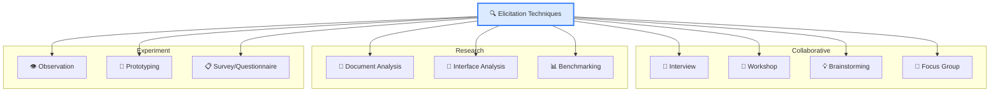
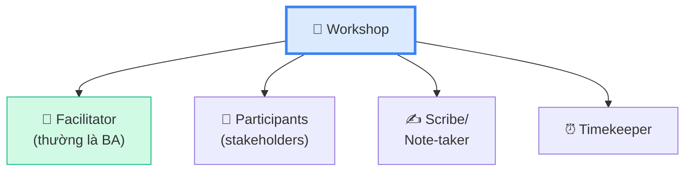
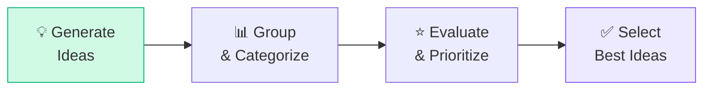
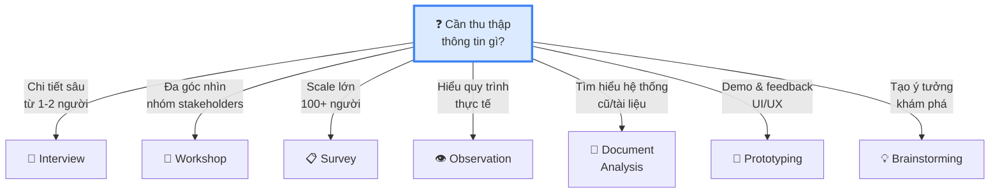

## Tổng quan Elicitation Techniques

Trong bài 4 đã giới thiệu 3 loại Elicitation. Bài này đi sâu vào **từng kỹ thuật** — cách thực hiện, ưu nhược điểm, và khi nào nên dùng.

## Interview — Phỏng vấn

Interview là kỹ thuật **phổ biến nhất** — BA hỏi stakeholder trực tiếp (1:1 hoặc nhóm nhỏ).

### 2 kiểu Interview

| Kiểu | Đặc điểm | Khi nào dùng |
|------|----------|-------------|
| **Structured** | Câu hỏi chuẩn bị sẵn, theo thứ tự | Cần dữ liệu chuẩn hóa, so sánh nhiều người |
| **Unstructured** | Tự do, theo dòng chảy cuộc trò chuyện | Khám phá ý tưởng mới, tìm hiểu tổng quan |

### Câu hỏi mở vs đóng

| Loại | Ví dụ | Khi nào |
|------|-------|--------|
| **Open-ended** | "Anh mong muốn gì ở hệ thống mới?" | Khám phá, tìm hiểu nhu cầu |
| **Closed-ended** | "Báo cáo cần xuất PDF không?" | Xác nhận chi tiết cụ thể |
| **Probing** | "Tại sao lại cần feature đó?" | Đào sâu root cause |

<Callout type="tip" title="Kỹ thuật phỏng vấn hay ra đề">
Luôn bắt đầu bằng câu **Open-ended** để stakeholder nói tự do, rồi mới chuyển sang **Closed-ended** để confirm chi tiết. Đề thi hay hỏi: "BA nên dùng loại câu hỏi nào để bắt đầu interview?"
</Callout>

## Workshop — Hội thảo

Workshop là buổi họp nhóm **có cấu trúc** (facilitated) với **mục tiêu rõ ràng**.

### Vai trò trong Workshop

| Yếu tố Workshop | Best Practice |
|-----------------|--------------|
| **Mục tiêu** | Xác định rõ TRƯỚC — "kết thúc workshop, chúng ta sẽ có..." |
| **Participants** | 5-12 người, đúng stakeholders |
| **Duration** | 1-4 giờ, KHÔNG quá nửa ngày |
| **Ground rules** | Không ngắt lời, phone silent, staying on topic |
| **Output** | Meeting minutes, action items, decisions made |

<Callout type="warning" title="Workshop ≠ Meeting">
**Workshop** = có facilitator, có mục tiêu, tạo ra output cụ thể (requirements list, process map).
**Meeting** = thảo luận chung, có thể không có output rõ ràng.
</Callout>

## Observation — Quan sát

BA **xem người dùng làm việc** thực tế để hiểu quy trình hiện tại.

### 2 kiểu Observation

| Kiểu | Đặc điểm | Ưu điểm | Nhược điểm |
|------|----------|---------|-----------|
| **Active** | BA hỏi câu hỏi trong khi quan sát | Hiểu sâu, clarify ngay | Gián đoạn công việc user |
| **Passive** | BA chỉ xem, không hỏi | Không ảnh hưởng user | Có thể hiểu nhầm |

<Callout type="info" title="Nhớ lại Hawthorne Effect!">
Khi quan sát, user có thể làm việc **cẩn thận hơn bình thường**. BA cần nhận biết bias này và quan sát nhiều lần.
</Callout>

## Document Analysis — Phân tích tài liệu

BA đọc và phân tích **tài liệu có sẵn** — không cần stakeholder time.

| Loại tài liệu | Ví dụ |
|---------------|-------|
| **Business documents** | Báo cáo hàng năm, chiến lược công ty |
| **Technical documents** | SRS cũ, API docs, database schema |
| **Process documents** | SOP, quy trình nghiệp vụ |
| **Regulatory documents** | Luật, quy định ngành, compliance |
| **Training materials** | Tài liệu đào tạo, user manuals |

**Ưu điểm:** Không tốn thời gian stakeholder.
**Nhược điểm:** Tài liệu có thể **cũ, không chính xác**, hoặc không phản ánh thực tế.

## Brainstorming — Tạo ý tưởng

Thu thập **nhiều ý tưởng nhất có thể** trong thời gian ngắn. Không đánh giá trong lúc brainstorm.

### Rules of Brainstorming

1. **No criticism** — Không phê bình ý tưởng lúc brainstorm
2. **Quantity over quality** — Càng nhiều ý tưởng càng tốt
3. **Build on ideas** — Xây dựng thêm trên ý tưởng người khác
4. **Wild ideas welcome** — Ý tưởng táo bạo được chào đón

## Prototyping — Tạo mẫu thử

Tạo bản demo/mockup để stakeholder **"thấy"** trước solution.

| Loại Prototype | Chi tiết | Tool ví dụ |
|---------------|---------|-----------|
| **Low-fidelity** | Vẽ tay, wireframe đơn giản | Giấy, Balsamiq |
| **High-fidelity** | Gần giống sản phẩm thật | Figma, Adobe XD |
| **Throwaway** | Tạo để demo rồi bỏ | Quick mockup |
| **Evolutionary** | Phát triển thành sản phẩm thật | Phần mềm thử nghiệm |

<Callout type="warning" title="Rủi ro Prototyping — Hay ra đề!">
Stakeholder nhìn prototype đẹp có thể **nghĩ sản phẩm đã gần xong** → expectations mismatch. BA cần **communicate rõ** đây chỉ là demo.
</Callout>

## Survey / Questionnaire — Khảo sát

Thu thập ý kiến từ **nhiều người** cùng lúc bằng bảng hỏi.

| Loại câu hỏi | Ví dụ |
|-------------|-------|
| **Multiple choice** | "Bạn dùng tool nào? ☐ Excel ☐ Jira ☐ Trello" |
| **Likert scale** | "Hệ thống dễ dùng? 1⭐ đến 5⭐" |
| **Open text** | "Bạn mong muốn gì ở hệ thống mới?" |
| **Ranking** | "Xếp hạng 5 tính năng theo mức quan trọng" |

**Tip:** Kết hợp **closed-ended** (dễ phân tích) với **1-2 open-ended** (khám phá).

## Chọn Technique phù hợp

| Tình huống | Technique phù hợp nhất |
|-----------|----------------------|
| Tìm hiểu workflow kế toán hàng ngày | **Observation** + **Interview** |
| Thu thập ý kiến 200 nhân viên về intranet | **Survey** |
| Xác nhận layout giao diện thanh toán | **Prototyping** |
| Hiểu chiến lược kinh doanh từ CEO | **Interview** (structured) |
| Brainstorm tính năng mới cho app | **Brainstorming** + **Workshop** |
| Tìm hiểu tích hợp với payment gateway | **Document/Interface Analysis** |

---

## 📝 Tóm tắt kiến thức nổi bật

<Callout type="success" title="Key Takeaways — Bài 5">
- **Interview**: Structured (câu hỏi sẵn) vs Unstructured (tự do). Bắt đầu bằng open-ended → closed-ended
- **Workshop**: Có facilitator, ground rules, output cụ thể. Workshop ≠ Meeting
- **Observation**: Active (hỏi khi xem) vs Passive (chỉ xem). Cẩn thận Hawthorne Effect
- **Prototyping**: Low vs High fidelity. Rủi ro: stakeholder nghĩ sản phẩm gần xong
- **Survey**: Scale lớn, kết hợp closed + open questions
- **Brainstorming**: KHÔNG phê bình lúc brainstorm, quantity > quality
- Chọn technique phù hợp theo **mục tiêu** và **context** — đề thi hay hỏi "technique nào phù hợp nhất khi..."
</Callout>

---

## 📋 Bài kiểm tra trắc nghiệm — Bài 5

<Callout type="info" title="Hướng dẫn làm bài">
Làm **10 câu** bên dưới trong **12 phút**. Chọn **MỘT đáp án đúng nhất**. Đáp án ở cuối bài.
</Callout>

**Câu 1.** BA nên dùng loại câu hỏi nào để BẮT ĐẦU interview?

- A. Closed-ended
- B. Yes/No
- C. Open-ended
- D. Leading

**Câu 2.** Trong Workshop, ai chịu trách nhiệm giữ cho cuộc thảo luận đi đúng hướng?

- A. Sponsor
- B. Project Manager
- C. Facilitator
- D. Scribe

**Câu 3.** BA cần thu thập ý kiến từ 300 nhân viên. Technique nào hiệu quả nhất?

- A. Interview từng người
- B. Workshop
- C. Focus Group
- D. Survey

**Câu 4.** Passive Observation nghĩa là gì?

- A. BA không đến văn phòng, quan sát qua camera
- B. BA chỉ xem, không hỏi câu hỏi trong lúc quan sát
- C. Stakeholder tự quay video gửi cho BA
- D. BA đọc report thay vì quan sát

**Câu 5.** Rủi ro lớn nhất khi dùng High-Fidelity Prototype là gì?

- A. Tốn nhiều thời gian thiết kế
- B. Stakeholder nghĩ sản phẩm sắp xong
- C. Developer không thích prototype
- D. Chi phí tool cao

**Câu 6.** Nguyên tắc nào ĐÚNG khi Brainstorming?

- A. Chỉ chấp nhận ý tưởng khả thi
- B. Đánh giá ngay từng ý tưởng
- C. Không phê bình, quantity over quality
- D. Chỉ senior mới được đóng góp ý tưởng

**Câu 7.** Nhược điểm chính của Document Analysis là gì?

- A. Tốn thời gian stakeholder
- B. Tài liệu có thể outdated hoặc không chính xác
- C. Cần nhiều BA thực hiện
- D. Chỉ áp dụng cho dự án IT

**Câu 8.** BA cần hiểu cách nhân viên nhập liệu thực tế hàng ngày. Technique nào tốt nhất?

- A. Survey
- B. Brainstorming
- C. Observation
- D. Document Analysis

**Câu 9.** Structured Interview khác Unstructured Interview ở điểm nào?

- A. Có nhiều người tham gia hơn
- B. Câu hỏi chuẩn bị sẵn, theo thứ tự
- C. Luôn record bằng video
- D. Chỉ dành cho C-level stakeholders

**Câu 10.** Interface Analysis dùng để làm gì?

- A. Phân tích giao diện người dùng
- B. Phân tích interaction giữa các hệ thống
- C. Phân tích stakeholder interfaces
- D. Phân tích network interfaces

---

### 🔑 Đáp án & Giải thích

| Câu | Đáp án | Giải thích |
|:---:|:------:|-----------|
| 1 | **C** | Open-ended giúp stakeholder chia sẻ tự do, BA khám phá nhu cầu. |
| 2 | **C** | Facilitator giữ cuộc thảo luận đi đúng hướng, đúng mục tiêu. |
| 3 | **D** | Survey scale lớn, nhanh, thu thập từ nhiều người hiệu quả. |
| 4 | **B** | Passive = chỉ quan sát, không can thiệp hay hỏi trong lúc xem. |
| 5 | **B** | High-fidelity đẹp → stakeholder nghĩ "gần xong rồi" → expectations sai. |
| 6 | **C** | Brainstorming rule #1: No criticism! Quantity > quality lúc brainstorm. |
| 7 | **B** | Tài liệu có thể cũ, không cập nhật, không phản ánh quy trình thực tế. |
| 8 | **C** | Observation — xem thực tế cách người dùng làm việc hàng ngày. |
| 9 | **B** | Structured = câu hỏi chuẩn bị sẵn, theo thứ tự nhất định. |
| 10 | **B** | Interface Analysis = phân tích giao tiếp/tích hợp giữa các hệ thống. |

### 📊 Thang đánh giá

| Số câu đúng | Đánh giá | Hành động |
|:-----------:|---------|-----------|
| 9-10 | ⭐ Xuất sắc | Master Elicitation Techniques! |
| 7-8 | ✅ Tốt | Ôn lại phần Prototype risks |
| 5-6 | ⚠️ Trung bình | Đọc lại bảng chọn technique |
| < 5 | ❌ Cần ôn lại | Đọc lại cả Bài 4 và Bài 5 |

---

## Tiếp theo

Bài tiếp theo: **Requirements Life Cycle Management** — Cách BA quản lý requirements từ lúc sinh ra đến khi hết giá trị: tracing, maintaining, prioritizing, change assessment, approval.

---

*Practice elicitation techniques = practice being a BA! 🎤*
