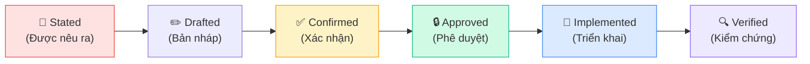
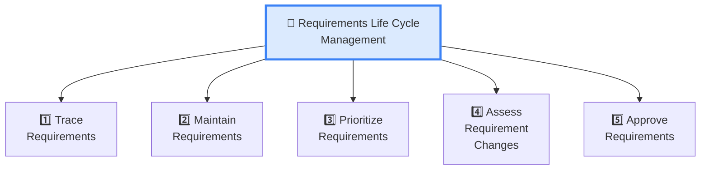
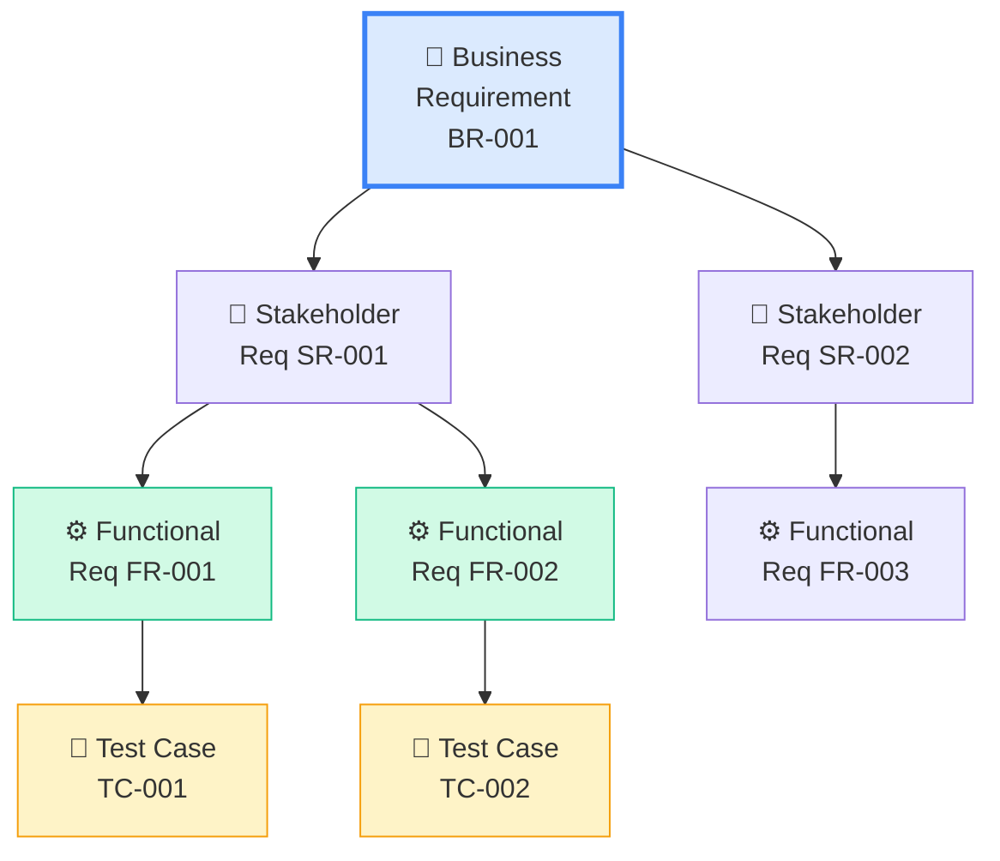
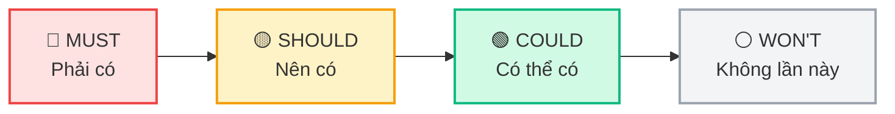
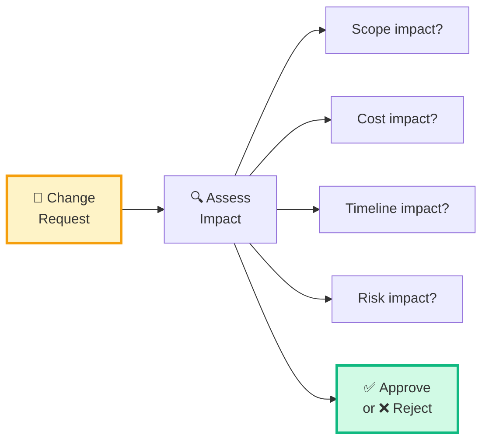

## Requirements Life Cycle Management là gì?

**Requirements Life Cycle Management (RLCM)** mô tả cách BA **quản lý requirements** xuyên suốt vòng đời — từ khi được xác định, qua giai đoạn phát triển, đến khi solution được triển khai hoặc retired.

<Callout type="info" title="Tại sao RLCM quan trọng?">
Requirements **không tĩnh** — chúng thay đổi, được ưu tiên lại, cần cập nhật. RLCM giúp BA đảm bảo requirements luôn **chính xác, nhất quán, và traceable**.
</Callout>

## Vòng đời của một Requirement

## 5 Tasks trong RLCM

## Task 1: Trace Requirements

**Mục đích:** Tạo và duy trì **mối liên kết** giữa requirements với nhau và với các artifact khác.

### Traceability Matrix

| Từ | Đến | Mục đích |
|----|-----|---------|
| Business Req → Stakeholder Req | Derive | BR nào sinh ra SR nào? |
| Stakeholder Req → Functional Req | Satisfy | FR nào đáp ứng SR nào? |
| Functional Req → Test Case | Verify | Test case nào kiểm tra FR nào? |
| Functional Req → Design | Implement | Design nào thực hiện FR nào? |

<Callout type="tip" title="Tại sao Traceability quan trọng — Hay ra đề!">
Traceability giúp:
- **Impact analysis** — biết thay đổi FR-001 ảnh hưởng test case nào
- **Coverage** — kiểm tra mọi BR đều có FR tương ứng
- **Gold plating** — phát hiện FR **không liên kết** với BR nào → yêu cầu thừa
</Callout>

## Task 2: Maintain Requirements

**Mục đích:** Giữ requirements luôn **chính xác, nhất quán, và cập nhật**.

### Các hoạt động Maintain

| Hoạt động | Giải thích |
|----------|-----------|
| **Version control** | Đánh version khi thay đổi (v1.0, v1.1, v2.0) |
| **Baselining** | Đánh dấu version "approved" làm baseline |
| **Conflict resolution** | Phát hiện và giải quyết mâu thuẫn giữa requirements |
| **Reuse** | Tận dụng requirements từ dự án trước |
| **Retire** | Đánh dấu requirements không còn cần thiết |

<Callout type="warning" title="Baseline — Khái niệm quan trọng!">
**Baseline** = snapshot "đóng băng" của requirements tại một thời điểm. Sau khi baseline, mọi thay đổi phải đi qua **change control process**.
</Callout>

## Task 3: Prioritize Requirements

**Mục đích:** Xác định **thứ tự ưu tiên** để triển khai requirements.

### Kỹ thuật Prioritization

| Technique | Cách làm | Ưu điểm |
|-----------|---------|---------|
| **MoSCoW** | Must / Should / Could / Won't | Đơn giản, dễ hiểu |
| **Timeboxing** | Fit vào sprint/release timeframe | Thực tế, phù hợp Agile |
| **Voting** | Stakeholder bỏ phiếu (dot voting) | Nhanh, dân chủ |
| **Business Value** | Xếp theo giá trị kinh doanh | Focus ROI |

### MoSCoW — Phổ biến nhất cho ECBA

| Mức | Giải thích | Ví dụ |
|-----|-----------|-------|
| **Must** | PHẢI có — không có thì fail | Thanh toán online |
| **Should** | NÊN có — quan trọng nhưng có workaround | Lọc đơn hàng theo ngày |
| **Could** | CÓ THỂ có nếu còn thời gian | Dark mode |
| **Won't** | KHÔNG làm đợt này (maybe later) | AI recommendation |

### Các yếu tố ảnh hưởng Priority

- **Business value** — Giá trị kinh doanh mang lại
- **Cost** — Chi phí implement
- **Risk** — Rủi ro nếu không làm
- **Dependencies** — Phụ thuộc kỹ thuật
- **Time sensitivity** — Deadline, compliance
- **Stakeholder agreement** — Các bên đồng ý không

## Task 4: Assess Requirement Changes

**Mục đích:** Đánh giá **tác động** của thay đổi requirements trước khi quyết định.

**Impact Analysis bao gồm:**
- Ảnh hưởng **scope** — phải thay đổi gì?
- Ảnh hưởng **cost** — tốn thêm bao nhiêu?
- Ảnh hưởng **schedule** — chậm bao lâu?
- Ảnh hưởng **requirements khác** — dùng traceability matrix
- Ảnh hưởng **risk** — rủi ro tăng hay giảm?

## Task 5: Approve Requirements

**Mục đích:** Đạt được **sự đồng ý chính thức** từ stakeholder có thẩm quyền.

| Approval Approach | Khi nào | Ví dụ |
|------------------|--------|-------|
| **Formal sign-off** | Predictive/Waterfall | Sign-off BRD, SRS |
| **Consensus** | Nhóm nhỏ, collaborative | Team đồng ý user stories |
| **Unanimous** | Tất cả đồng ý 100% | Hiếm, compliance project |
| **Majority** | Đa số đồng ý | Voting tại workshop |

<Callout type="info" title="Ai Approve?">
BA **KHÔNG** approve requirements. Người approve là **Sponsor** hoặc **Business Owner** — người có **authority** và chịu trách nhiệm cuối cùng.
</Callout>

---

## 📝 Tóm tắt kiến thức nổi bật

<Callout type="success" title="Key Takeaways — Bài 6">
- **RLCM** gồm 5 Tasks: Trace, Maintain, Prioritize, Assess Changes, Approve
- **Traceability** liên kết BR → SR → FR → Test Case — giúp impact analysis và phát hiện gold plating
- **Baseline** = snapshot "đóng băng" requirements. Thay đổi sau baseline phải qua change control
- **MoSCoW**: Must / Should / Could / Won't — kỹ thuật prioritization phổ biến nhất
- **Impact Analysis** — đánh giá scope, cost, time, risk TRƯỚC khi approve change
- BA **KHÔNG approve** requirements — Sponsor/Business Owner mới có quyền
</Callout>

---

## 📋 Bài kiểm tra trắc nghiệm — Bài 6

<Callout type="info" title="Hướng dẫn làm bài">
Làm **10 câu** bên dưới trong **12 phút**. Chọn **MỘT đáp án đúng nhất**. Đáp án ở cuối bài.
</Callout>

**Câu 1.** RLCM gồm bao nhiêu Tasks?

- A. 4
- B. 5
- C. 6
- D. 7

**Câu 2.** Traceability giúp BA phát hiện điều gì?

- A. Bug trong code
- B. Requirements thừa (gold plating)
- C. Performance bottleneck
- D. Security vulnerability

**Câu 3.** "M" trong MoSCoW nghĩa là gì?

- A. Maximum
- B. Minimum
- C. Must have
- D. Most important

**Câu 4.** Khi requirement đã baseline, muốn thay đổi phải làm gì?

- A. Sửa trực tiếp trong tài liệu
- B. Email thông báo cho team
- C. Đi qua change control process
- D. Tạo requirement mới hoàn toàn

**Câu 5.** Ai có quyền APPROVE requirements theo BABOK?

- A. Business Analyst
- B. Project Manager
- C. Developer
- D. Sponsor/Business Owner

**Câu 6.** Impact Analysis đánh giá yếu tố nào?

- A. Chỉ cost
- B. Chỉ schedule
- C. Scope, cost, timeline, risk
- D. Chỉ technical feasibility

**Câu 7.** FR-001 không liên kết với bất kỳ BR nào. Điều này cho thấy gì?

- A. FR-001 rất quan trọng
- B. FR-001 là gold plating — yêu cầu thừa
- C. FR-001 cần priority cao hơn
- D. Traceability matrix bị lỗi

**Câu 8.** Task nào xác định thứ tự ưu tiên của requirements?

- A. Trace Requirements
- B. Maintain Requirements
- C. Prioritize Requirements
- D. Approve Requirements

**Câu 9.** Version control trong Maintain Requirements giúp gì?

- A. Kiểm soát phiên bản code
- B. Theo dõi lịch sử thay đổi của requirements
- C. Kiểm soát truy cập tài liệu
- D. Backup tài liệu tự động

**Câu 10.** Trong MoSCoW, "W" nghĩa là gì?

- A. Want
- B. Wish
- C. Won't have this time
- D. Will do later

---

### 🔑 Đáp án & Giải thích

| Câu | Đáp án | Giải thích |
|:---:|:------:|-----------|
| 1 | **B** | RLCM có 5 Tasks: Trace, Maintain, Prioritize, Assess Changes, Approve. |
| 2 | **B** | Traceability phát hiện FR không liên kết BR → gold plating (yêu cầu thừa). |
| 3 | **C** | M = Must have — yêu cầu bắt buộc, không có thì solution fail. |
| 4 | **C** | Sau baseline, mọi thay đổi phải đi qua change control process. |
| 5 | **D** | Sponsor/Business Owner approve — BA phân tích, không phê duyệt. |
| 6 | **C** | Impact Analysis đánh giá: scope, cost, timeline, risk, và requirements liên quan. |
| 7 | **B** | FR không liên kết BR nào = có thể là gold plating — thêm feature không ai yêu cầu. |
| 8 | **C** | Prioritize Requirements — xác định thứ tự ưu tiên. |
| 9 | **B** | Version control requirements = theo dõi lịch sử thay đổi (version 1.0 → 1.1...). |
| 10 | **C** | W = Won't have this time — không làm đợt này, maybe future release. |

### 📊 Thang đánh giá

| Số câu đúng | Đánh giá | Hành động |
|:-----------:|---------|-----------|
| 9-10 | ⭐ Xuất sắc | Requirements management vững chắc! |
| 7-8 | ✅ Tốt | Ôn lại MoSCoW và Traceability |
| 5-6 | ⚠️ Trung bình | Đọc lại Baseline và Impact Analysis |
| < 5 | ❌ Cần ôn lại | Đọc lại toàn bộ bài |

---

## Tiếp theo

Bài tiếp theo: **Strategy Analysis** — BA tham gia định hướng chiến lược: phân tích hiện trạng, định nghĩa tương lai, đánh giá rủi ro, và xác định chiến lược thay đổi.

---

*Requirements sống và thở — BA phải quản lý chúng suốt vòng đời! 🔄*
