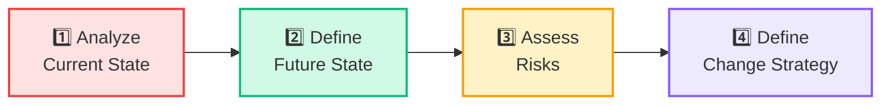
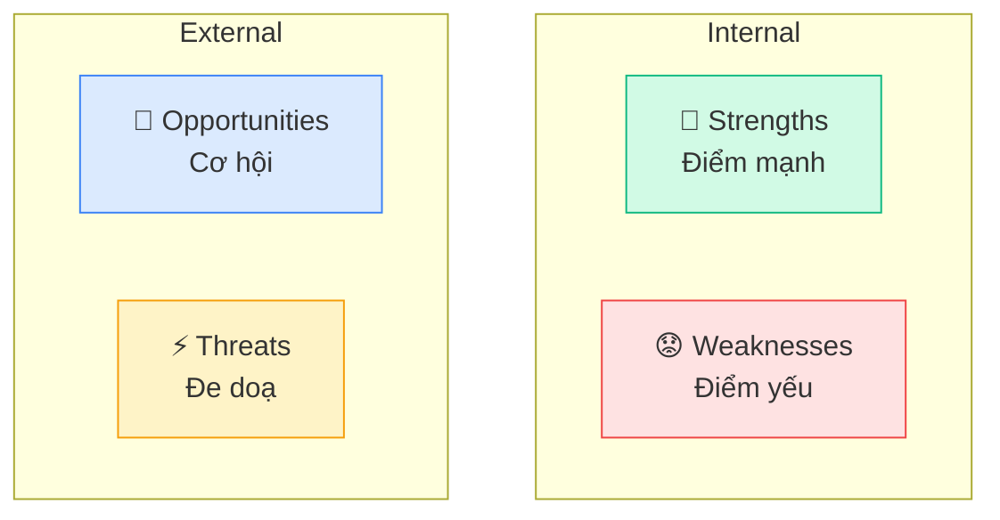
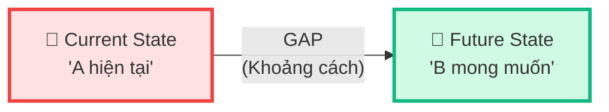
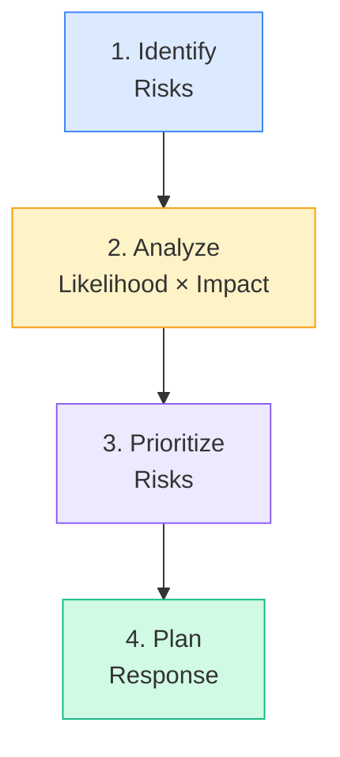
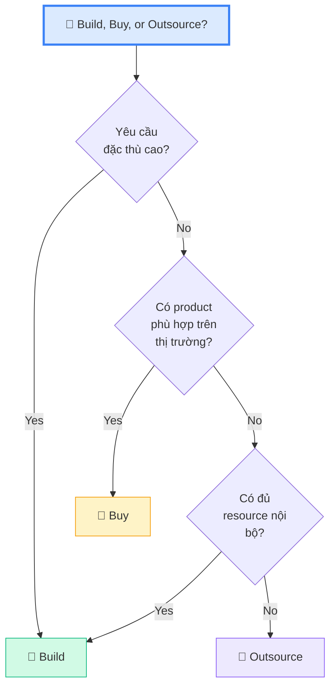

## Strategy Analysis là gì?

**Strategy Analysis** là Knowledge Area mô tả cách BA **xác định nhu cầu kinh doanh** (business need) và **chiến lược thay đổi** để đạt mục tiêu. Nói đơn giản: tìm hiểu **TẠI SAO** cần thay đổi và **CÁI GÌ** cần thay đổi.

<Callout type="info" title='Strategy Analysis = "Trước khi bắt tay làm"'>
Trước khi viết requirements chi tiết, BA phải hiểu: Hiện trạng ra sao? Mục tiêu là gì? Rủi ro gì? Chiến lược thay đổi nào phù hợp?
</Callout>

## 4 Tasks trong Strategy Analysis

<Callout type="tip" title="Trình tự logic">
Current State → Future State = **Gap Analysis** (khoảng cách giữa hiện tại và mục tiêu)
Gap → Change Strategy = CON ĐƯỜNG từ hiện tại đến mục tiêu  
Risks = **rủi ro** trên con đường đó
</Callout>

## Task 1: Analyze Current State

**Mục đích:** Hiểu **hiện trạng** của tổ chức — đang ở đâu, vấn đề gì, năng lực gì.

### Dùng SWOT Analysis

| Phần | Loại | Ví dụ |
|------|------|-------|
| **Strengths** | Internal, Positive | Đội ngũ IT giỏi, hệ thống ổn định |
| **Weaknesses** | Internal, Negative | Quy trình thủ công, thiếu nhân sự |
| **Opportunities** | External, Positive | Thị trường e-commerce tăng trưởng |
| **Threats** | External, Negative | Đối thủ ra sản phẩm mới, luật mới |

### Các element cần phân tích

| Element | Phân tích cái gì |
|---------|-----------------|
| **Business Processes** | Quy trình hiện tại hoạt động thế nào |
| **Organizational Structure** | Cơ cấu tổ chức, vai trò |
| **People** | Năng lực, skills của nhân viên |
| **Technology** | Hệ thống, phần mềm hiện tại |
| **External Factors** | Thị trường, đối thủ, quy định |

## Task 2: Define Future State

**Mục đích:** Mô tả **mục tiêu** mong muốn — tổ chức sẽ như thế nào sau khi thay đổi.

### Gap Analysis

| Yếu tố | Current State | Future State | Gap |
|--------|--------------|-------------|-----|
| Quy trình đặt hàng | Manual, tốn 2 giờ | Tự động, 5 phút | Cần phần mềm, training |
| Báo cáo | Excel hàng tuần | Dashboard real-time | Cần BI tool + data pipeline |
| Satisfaction | CSAT 3.2/5 | CSAT 4.5/5 | Cải thiện UX, giảm chờ đợi |

### Business Requirements — Output quan trọng

Từ Gap Analysis, BA tạo ra **Business Requirements**:
- **Goal/Objective** — Mục tiêu cụ thể, đo lường được
- **Success Metrics** (KPI) — Đo bằng gì?
- **Scope** — Phạm vi thay đổi

<Callout type="tip" title="SMART Goals — Hay ra đề!">
Business Requirements nên theo SMART:
- **S**pecific — Cụ thể
- **M**easurable — Đo lường được
- **A**chievable — Khả thi
- **R**elevant — Liên quan
- **T**ime-bound — Có timeline

Ví dụ: "Tăng doanh thu online **30%** trong **12 tháng**" ✅
</Callout>

## Task 3: Assess Risks

**Mục đích:** Xác định và đánh giá **rủi ro** liên quan đến thay đổi.

### Risk Assessment

### Risk Response Strategies

| Strategy | Giải thích | Ví dụ |
|---------|-----------|-------|
| **Avoid** | Loại bỏ risk hoàn toàn | Bỏ feature, thay đổi scope |
| **Mitigate** | Giảm likelihood hoặc impact | Thêm testing, training |
| **Transfer** | Chuyển risk cho bên khác | Bảo hiểm, outsource |
| **Accept** | Chấp nhận nếu impact nhỏ | Document và monitor |

### Hai loại Risk

| Loại | Giải thích |
|------|-----------|
| **Risk of change** | Rủi ro KHI thay đổi — implementation fail, over budget |
| **Risk of NOT changing** | Rủi ro KHÔNG thay đổi — mất thị phần, đối thủ vượt qua |

<Callout type="warning" title="">
Đề thi ECBA có thể hỏi: "Cái nào KHÔNG phải risk response strategy?" — Nhớ 4 cái: Avoid, Mitigate, Transfer, Accept.
</Callout>

## Task 4: Define Change Strategy

**Mục đích:** Xác định **cách tiếp cận** để đi từ Current State → Future State.

### Solution Scope

| Element | Mô tả |
|---------|-------|
| **Solution Approach** | Build, Buy, or Outsource? |
| **Solution Scope** | Bao gồm những gì? Loại trừ gì? |
| **Feasibility** | Khả thi về kỹ thuật, tài chính, thời gian? |
| **Dependencies** | Phụ thuộc project/system nào? |
| **Transition** | Phased rollout hay big bang? |

### Build vs Buy vs Outsource

| Option | Ưu điểm | Nhược điểm |
|--------|---------|-----------|
| **Build** (custom) | Đúng nhu cầu 100% | Tốn thời gian, chi phí cao |
| **Buy** (COTS/SaaS) | Nhanh, proven, support | Có thể không fit 100%, vendor lock-in |
| **Outsource** | Không cần internal resource | Mất kiểm soát, communication overhead |

---

## 📝 Tóm tắt kiến thức nổi bật

<Callout type="success" title="Key Takeaways — Bài 7">
- **Strategy Analysis** = TẠI SAO thay đổi + CÁI GÌ thay đổi (trước khi nghĩ HOW)
- **4 Tasks**: Analyze Current State → Define Future State → Assess Risks → Define Change Strategy
- **SWOT**: Strengths/Weaknesses (internal), Opportunities/Threats (external)
- **Gap Analysis**: So sánh Current vs Future → xác định khoảng cách cần bridge
- **Business Requirements** nên **SMART** — Specific, Measurable, Achievable, Relevant, Time-bound
- **4 Risk Responses**: Avoid, Mitigate, Transfer, Accept
- **Change Strategy**: Build vs Buy vs Outsource — cân nhắc theo nhu cầu, budget, timeline
</Callout>

---

## 📋 Bài kiểm tra trắc nghiệm — Bài 7

<Callout type="info" title="Hướng dẫn làm bài">
Làm **10 câu** bên dưới trong **12 phút**. Chọn **MỘT đáp án đúng nhất**. Đáp án ở cuối bài.
</Callout>

**Câu 1.** Strategy Analysis gồm bao nhiêu Tasks?

- A. 3
- B. 4
- C. 5
- D. 6

**Câu 2.** SWOT — "S" nghĩa là gì?

- A. Strategy
- B. Solution
- C. Strengths
- D. Scope

**Câu 3.** Gap Analysis so sánh cái gì?

- A. Budget vs Actual Cost
- B. Current State vs Future State
- C. Functional vs Non-Functional
- D. BA vs PM responsibilities

**Câu 4.** Business Requirement nào viết đúng chuẩn SMART?

- A. "Cải thiện hệ thống"
- B. "Tăng doanh thu online 30% trong 12 tháng"
- C. "Làm hệ thống tốt hơn"
- D. "Triển khai phần mềm mới"

**Câu 5.** Risk response nào loại bỏ rủi ro hoàn toàn?

- A. Mitigate
- B. Transfer
- C. Accept
- D. Avoid

**Câu 6.** "Đối thủ vừa ra app mobile" — đây thuộc phần nào trong SWOT?

- A. Strengths
- B. Weaknesses
- C. Opportunities
- D. Threats

**Câu 7.** Khi tổ chức chọn mua phần mềm có sẵn thay vì tự xây, gọi là gì?

- A. Build
- B. Buy
- C. Outsource
- D. Prototype

**Câu 8.** Task nào trong Strategy Analysis xác định rủi ro?

- A. Analyze Current State
- B. Define Future State
- C. Assess Risks
- D. Define Change Strategy

**Câu 9.** Nhược điểm chính của Buy (mua phần mềm sẵn) là gì?

- A. Tốn nhiều thời gian phát triển
- B. Có thể không phù hợp 100% nhu cầu
- C. Cần đội ngũ lập trình lớn
- D. Không có support

**Câu 10.** "Weaknesses" trong SWOT thuộc loại nào?

- A. External, Positive
- B. External, Negative
- C. Internal, Positive
- D. Internal, Negative

---

### 🔑 Đáp án & Giải thích

| Câu | Đáp án | Giải thích |
|:---:|:------:|-----------|
| 1 | **B** | Strategy Analysis có 4 Tasks (ít nhất trong 6 KAs). |
| 2 | **C** | S = Strengths — Điểm mạnh nội bộ. |
| 3 | **B** | Gap Analysis = so sánh Current State vs Future State. |
| 4 | **B** | SMART: cụ thể (30%), đo lường được, có thời hạn (12 tháng). |
| 5 | **D** | Avoid = loại bỏ rủi ro hoàn toàn bằng cách thay đổi scope/approach. |
| 6 | **D** | Đối thủ ra sản phẩm mới = External + Negative = Threats. |
| 7 | **B** | Buy = mua COTS/SaaS thay vì tự phát triển. |
| 8 | **C** | Assess Risks — xác định và đánh giá rủi ro. |
| 9 | **B** | Buy có thể không fit 100%, vendor lock-in, customization hạn chế. |
| 10 | **D** | Weaknesses = Internal + Negative — điểm yếu nội bộ tổ chức. |

### 📊 Thang đánh giá

| Số câu đúng | Đánh giá | Hành động |
|:-----------:|---------|-----------|
| 9-10 | ⭐ Xuất sắc | Strategic thinking tuyệt vời! |
| 7-8 | ✅ Tốt | Ôn lại Risk Responses |
| 5-6 | ⚠️ Trung bình | Đọc lại SWOT và Gap Analysis |
| < 5 | ❌ Cần ôn lại | Đọc lại toàn bộ bài |

---

## Tiếp theo

Bài tiếp theo bắt đầu **Requirements Analysis & Design Definition (RADD) - Phần 1** — KA lớn nhất với 6 Tasks, chiếm tỉ trọng cao nhất trong đề thi ECBA!

---

*Chiến lược đúng = giải pháp đúng! 🎯*
