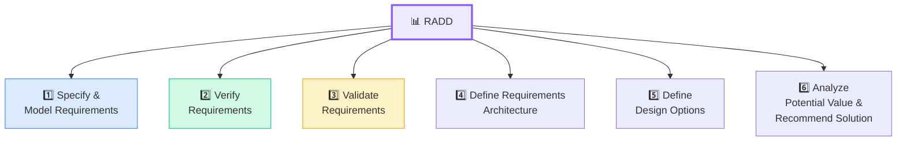
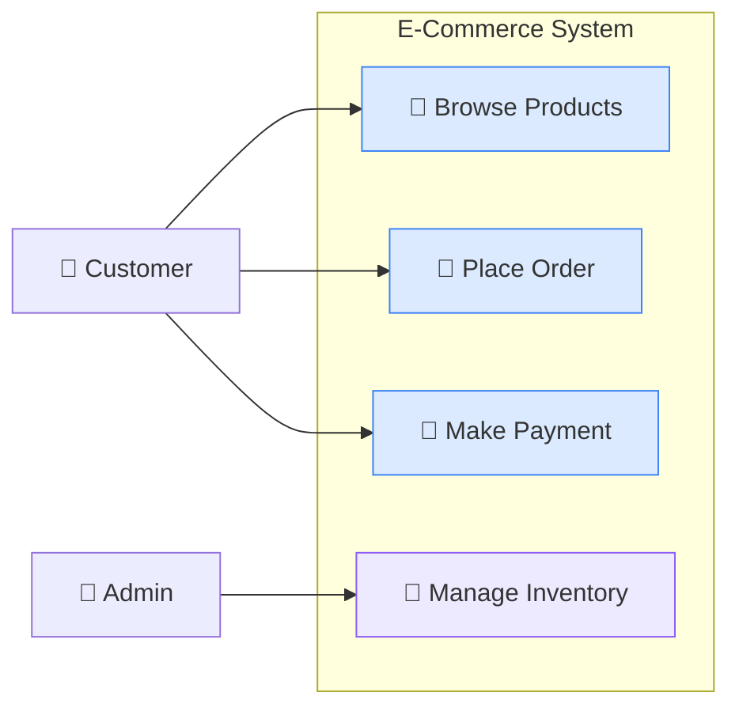
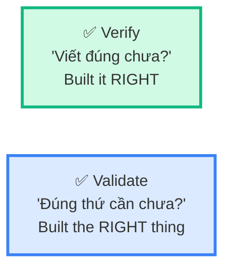
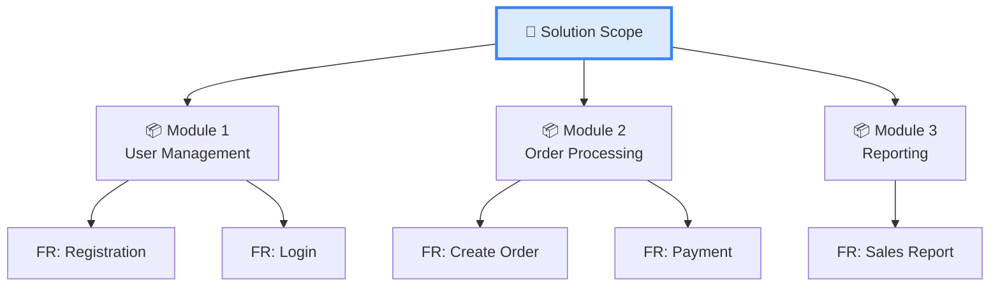

## RADD là gì?

**Requirements Analysis & Design Definition (RADD)** là Knowledge Area MÔ TẢ cách BA **phân tích, mô hình hóa, và thiết kế** requirements thành solution. Đây là KA **lớn nhất** trong BABOK (6 Tasks) và **chiếm tỉ trọng cao nhất** trong đề thi ECBA (~30%).

<Callout type="warning" title="Chiếm 30% đề thi!">
RADD là KA phải **nắm chắc nhất** cho ECBA. Hiểu rõ từng Task, biết Verify vs Validate, nắm các kỹ thuật mô hình hóa.
</Callout>

## Tổng quan 6 Tasks



## Task 1: Specify & Model Requirements

**Mục đích:** Biểu diễn requirements ở dạng **rõ ràng, chi tiết** bằng text, diagrams, hoặc models.

### Các kỹ thuật mô hình hóa chính

| Technique | Dùng để | Visual |
|-----------|--------|--------|
| **Use Case Diagram** | Ai sử dụng hệ thống, làm gì | Actors + Use Cases |
| **User Stories** | Yêu cầu ngắn gọn theo format chuẩn | As a... I want... So that... |
| **Process Flow** | Quy trình nghiệp vụ step-by-step | Flowchart |
| **Data Model** | Cấu trúc dữ liệu, relationships | ERD |
| **State Diagram** | Trạng thái và chuyển đổi trạng thái | State machine |
| **Decision Table** | Logic phức tạp với nhiều conditions | Truth table |

### Use Case — Kỹ thuật hay ra đề nhất



**Thành phần Use Case:**
- **Actor** — Người hoặc hệ thống tương tác
- **Use Case** — Hành vi hệ thống cung cấp
- **Precondition** — Điều kiện trước (Customer đã login)
- **Postcondition** — Điều kiện sau (Order được tạo)
- **Main Flow** — Happy path
- **Alternative Flow** — Nhánh thay thế
- **Exception Flow** — Khi lỗi xảy ra

### User Story — Format chuẩn

```
As a [role],
I want [feature],
So that [benefit].
```

| Ví dụ | Role | Feature | Benefit |
|-------|------|---------|---------|
| 1 | Customer | tìm kiếm sản phẩm theo tên | tìm nhanh sản phẩm cần mua |
| 2 | Admin | xem báo cáo doanh thu theo tháng | theo dõi kinh doanh |
| 3 | User | reset mật khẩu qua email | truy cập tài khoản khi quên password |

### Acceptance Criteria — INVEST

User Story tốt nên theo **INVEST**:

| Letter | Nghĩa | Giải thích |
|--------|-------|-----------|
| **I** | Independent | Không phụ thuộc story khác |
| **N** | Negotiable | Có thể thương lượng |
| **V** | Valuable | Mang giá trị cho user/business |
| **E** | Estimable | Dev có thể estimate effort |
| **S** | Small | Nhỏ gọn, fit 1 sprint |
| **T** | Testable | Có thể test được |

<Callout type="tip" title="INVEST — Hay ra đề ECBA!">
Đề thi thường hỏi: "Đặc tính nào mô tả User Story tốt?" hoặc "Story nào KHÔNG đạt INVEST?". Nhớ: story quá lớn = KHÔNG Small, story không test được = KHÔNG Testable.
</Callout>

## Task 2: Verify Requirements

**Mục đích:** Kiểm tra requirements có **viết đúng** không — đúng format, rõ ràng, nhất quán.

### Verification = "Built the thing RIGHT"

| Tiêu chí | Kiểm tra cái gì | Ví dụ |
|---------|-----------------|-------|
| **Correct** | Đúng sự thật | "Thuế VAT 10%" — đúng không? |
| **Clear** | Không mơ hồ | "Nhanh" ❌ → "Load trong 2 giây" ✅ |
| **Complete** | Đầy đủ thông tin | Có acceptance criteria chưa? |
| **Consistent** | Không mâu thuẫn | FR-001 nói "bắt buộc email", FR-005 nói "email optional" ❌ |
| **Feasible** | Khả thi | "Predict 100% chính xác" ❌ |
| **Testable** | Test được | Có điều kiện pass/fail rõ ràng |

<Callout type="warning" title="">
Verify = kiểm tra **CHẤT LƯỢNG** của requirement. Requirement CÓ THỂ viết đúng format nhưng KHÔNG phải thứ khách hàng cần → đó là vấn đề Validate, không phải Verify.
</Callout>

## Task 3: Validate Requirements

**Mục đích:** Kiểm tra requirements có **đúng thứ cần** không — có giải quyết đúng business need không.

### Validation = "Built the RIGHT thing"



| | Verify | Validate |
|---|--------|----------|
| **Hỏi** | Viết requirement đúng chưa? | Đúng requirement cần viết chưa? |
| **Kiểm tra** | Quality, consistency, clarity | Alignment với business need |
| **Ai làm** | BA review | Stakeholder confirm |
| **Khi nào** | Sau khi viết requirement | Sau verify, trước approve |

<Callout type="tip" title="Cách nhớ Verify vs Validate — ĐỀ THI HAY HỎI!">
- **Verify** = "Tôi viết requirement **ĐÚNG** chưa?" (internal check)
- **Validate** = "Tôi viết **ĐÚNG REQUIREMENT** chưa?" (stakeholder check)

Hoặc nhớ: **V**erify = **V**iết đúng, **V**alidate = đúng **V**alue
</Callout>

## Task 4: Define Requirements Architecture

**Mục đích:** Tổ chức requirements thành **cấu trúc có hệ thống**, hiểu relationships giữa các requirements.

### Requirements Architecture là gì?

Không phải technical architecture! Đây là **cách sắp xếp requirements** để:
- Hiểu tổng thể scope
- Thấy dependencies giữa requirements
- Identify gaps (requirements thiếu)
- Prioritize dễ dàng hơn



---

## 📝 Tóm tắt kiến thức nổi bật

<Callout type="success" title="Key Takeaways — Bài 8">
- **RADD** là KA lớn nhất (6 Tasks) — chiếm ~30% đề thi ECBA
- **Specify & Model**: Use Cases, User Stories, Process Flows, Data Models
- **Use Case**: Actor, Precondition, Main/Alternative/Exception Flow, Postcondition
- **User Story**: As a [role], I want [feature], So that [benefit] — đạt chuẩn **INVEST**
- **Verify** = "Viết ĐÚNG chưa?" (quality check) vs **Validate** = "ĐÚNG thứ cần chưa?" (value check)
- **Requirements Architecture** = tổ chức requirements có hệ thống, KHÔNG PHẢI technical architecture
</Callout>

---

## 📋 Bài kiểm tra trắc nghiệm — Bài 8

<Callout type="info" title="Hướng dẫn làm bài">
Làm **10 câu** bên dưới trong **12 phút**. Chọn **MỘT đáp án đúng nhất**. Đáp án ở cuối bài.
</Callout>

**Câu 1.** RADD gồm bao nhiêu Tasks?

- A. 4
- B. 5
- C. 6
- D. 7

**Câu 2.** "As a customer, I want to search products, so that I find what I need" — đây là gì?

- A. Use Case
- B. User Story
- C. Business Rule
- D. Business Requirement

**Câu 3.** INVEST — "S" nghĩa là gì?

- A. Specific
- B. Simple
- C. Small
- D. Scalable

**Câu 4.** Verify Requirements kiểm tra điều gì?

- A. Requirement có giải quyết business need không
- B. Requirement có viết đúng, rõ ràng, nhất quán không
- C. Requirement có được approve chưa
- D. Solution đã implement đúng chưa

**Câu 5.** "Hệ thống phải load nhanh" — requirement này có vấn đề gì?

- A. Không testable — "nhanh" không rõ ràng
- B. Quá chi tiết
- C. Không phải requirement
- D. Đã đúng chuẩn

**Câu 6.** Validate Requirements kiểm tra điều gì?

- A. Code chạy đúng chưa
- B. Requirement đúng format chưa
- C. Requirement có giải quyết đúng business need không
- D. Budget dự án đủ chưa

**Câu 7.** Trong Use Case, "Precondition" nghĩa là gì?

- A. Bước đầu tiên của flow
- B. Điều kiện phải đúng TRƯỚC khi use case bắt đầu
- C. Kết quả sau khi hoàn thành
- D. Actor chính của use case

**Câu 8.** Decision Table dùng khi nào?

- A. Vẽ quy trình nghiệp vụ
- B. Mô hình hóa dữ liệu
- C. Logic phức tạp với nhiều conditions và outcomes
- D. Xác định stakeholders

**Câu 9.** Requirements Architecture giúp gì?

- A. Thiết kế kiến trúc phần mềm
- B. Tổ chức requirements có cấu trúc, thấy dependencies
- C. Xác định server và infrastructure
- D. Viết database schema

**Câu 10.** User Story nào KHÔNG đạt chuẩn INVEST?

- A. Story có acceptance criteria rõ ràng
- B. Story nhỏ, fit 1 sprint
- C. Story phụ thuộc 5 story khác mới test được
- D. Story mang giá trị cho end user

---

### 🔑 Đáp án & Giải thích

| Câu | Đáp án | Giải thích |
|:---:|:------:|-----------|
| 1 | **C** | RADD có 6 Tasks — nhiều nhất trong 6 KAs. |
| 2 | **B** | Format "As a... I want... So that..." = User Story. |
| 3 | **C** | S = Small — story nhỏ gọn, fit trong 1 sprint. |
| 4 | **B** | Verify = kiểm tra chất lượng: đúng, rõ ràng, nhất quán, testable. |
| 5 | **A** | "Nhanh" là mơ hồ, không testable. Nên viết: "Load trong 2 giây". |
| 6 | **C** | Validate = kiểm tra requirement có giải quyết đúng business need. |
| 7 | **B** | Precondition = điều kiện phải thỏa mãn TRƯỚC khi use case thực hiện. |
| 8 | **C** | Decision Table cho logic phức tạp: nhiều conditions → nhiều outcomes. |
| 9 | **B** | Requirements Architecture = tổ chức requirements, thấy gaps và dependencies. |
| 10 | **C** | Phụ thuộc 5 story khác = KHÔNG Independent (I trong INVEST). |

### 📊 Thang đánh giá

| Số câu đúng | Đánh giá | Hành động |
|:-----------:|---------|-----------|
| 9-10 | ⭐ Xuất sắc | RADD master! |
| 7-8 | ✅ Tốt | Ôn lại Verify vs Validate |
| 5-6 | ⚠️ Trung bình | Đọc lại User Story + INVEST |
| < 5 | ❌ Cần ôn lại | RADD quan trọng nhất — đọc lại kỹ! |

---

## Tiếp theo

Phần 2 sẽ đi vào **Define Design Options, Analyze Potential Value, và Recommend Solution** — phần BA giúp tổ chức chọn giải pháp tối ưu.

---

*RADD = trái tim của BA — phân tích rõ ràng, thiết kế đúng đắn! 📊*
