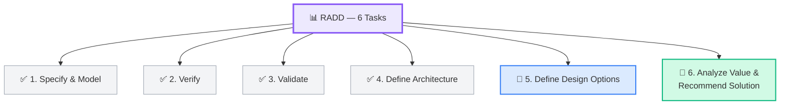
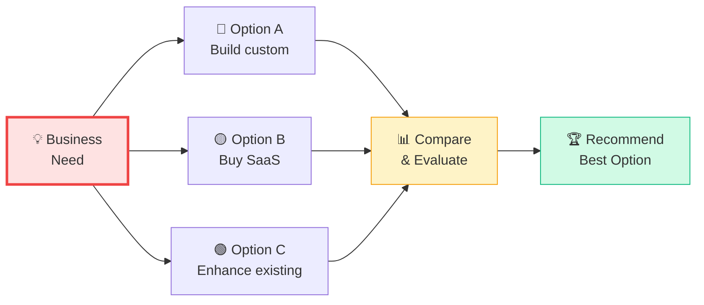
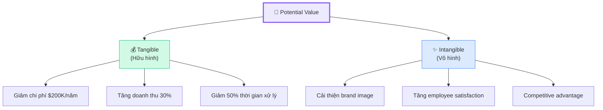
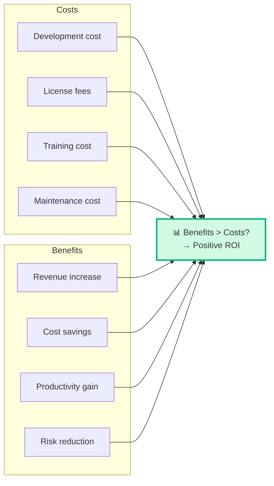
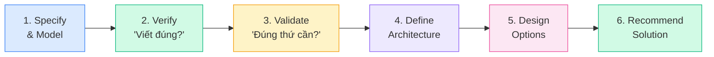

## Recap RADD — 6 Tasks

Bài 8 đã cover Tasks 1-4. Bài này focus vào **Tasks 5-6** và tổng hợp toàn bộ RADD:

## Task 5: Define Design Options

**Mục đích:** Xác định và so sánh **các phương án thiết kế** solution khả thi.

### Approach

BA cần identify **nhiều options** (ít nhất 2-3) rồi phân tích ưu nhược điểm:

### Ví dụ: So sánh 3 Design Options

| Tiêu chí | Option A: Build Custom | Option B: Buy Salesforce | Option C: Nâng cấp hệ thống cũ |
|---------|----------------------|------------------------|-------------------------------|
| **Cost** | $500K | $200K/year | $100K |
| **Timeline** | 12 tháng | 3 tháng | 6 tháng |
| **Fit** | 100% custom | 80% fit | 60% fit |
| **Risk** | High (new tech) | Low (proven) | Medium |
| **Scalability** | High | High | Limited |
| **Maintenance** | Internal team | Vendor support | Internal team |

<Callout type="info" title="Luôn có Option "Do Nothing"">
Trong BABOK, **"Do Nothing"** (không làm gì) cũng là một design option hợp lệ. BA cần đánh giá cost của việc KHÔNG thay đổi (opportunity cost).
</Callout>

### Kỹ thuật so sánh Design Options

| Technique | Mô tả |
|-----------|-------|
| **Decision Matrix** | Chấm điểm theo nhiều tiêu chí, có trọng số |
| **Cost-Benefit Analysis** | So sánh tổng chi phí vs lợi ích |
| **Feasibility Analysis** | Đánh giá khả thi: technical, operational, economic |
| **Vendor Assessment** | Đánh giá nhà cung cấp (nếu Buy) |
| **Proof of Concept** | Thử nghiệm nhỏ để kiểm chứng |

### Decision Matrix — Weighted Scoring

| Tiêu chí | Weight | Option A | Score A | Option B | Score B |
|---------|:------:|:-------:|:------:|:-------:|:------:|
| Cost | 30% | 3 | 0.9 | 4 | 1.2 |
| Fit | 25% | 5 | 1.25 | 3 | 0.75 |
| Timeline | 20% | 2 | 0.4 | 5 | 1.0 |
| Risk | 15% | 2 | 0.3 | 4 | 0.6 |
| Scalability | 10% | 5 | 0.5 | 4 | 0.4 |
| **Total** | **100%** | | **3.35** | | **3.95** |

→ Option B (Buy Salesforce) thắng! 🏆

## Task 6: Analyze Potential Value & Recommend Solution

**Mục đích:** Phân tích **giá trị tiềm năng** của mỗi option và **đề xuất** giải pháp tốt nhất.

### Value Analysis

| Loại Value | Đo lường | Ví dụ |
|-----------|---------|-------|
| **Tangible** | Có thể đo bằng số | ROI = 150%, giảm $200K/năm |
| **Intangible** | Khó đo chính xác | Brand image, employee morale |

### Feasibility Analysis — 3 góc

| Feasibility | Hỏi gì | Ví dụ Pass | Ví dụ Fail |
|------------|--------|-----------|-----------|
| **Technical** | Công nghệ có hỗ trợ không? | Team biết React → build React app ✅ | Team chưa biết AI/ML → build AI ❌ |
| **Operational** | Người dùng chấp nhận? Có training? | User sẵn sàng dùng ✅ | User phản đối mạnh ❌ |
| **Economic** | Có đủ budget? ROI có xứng? | ROI > 100% trong 2 năm ✅ | Tốn $5M, lợi $500K ❌ |

### Cost-Benefit Analysis

### BA Recommendation

BA **đề xuất** nhưng **KHÔNG quyết định**. Recommendation bao gồm:

| Element | Mô tả |
|---------|-------|
| **Recommended option** | Option nào được đề xuất |
| **Rationale** | Lý do tại sao chọn option này |
| **Trade-offs** | Compromises — mất gì, được gì |
| **Risks** | Rủi ro còn lại |
| **Next steps** | Bước tiếp theo nếu approved |

<Callout type="warning" title="BA Recommend, KHÔNG quyết định!">
BA phân tích, so sánh, đề xuất — nhưng **quyết định cuối cùng** thuộc về **Sponsor/Decision Maker**. Đây là điểm hay ra đề thi: "Ai có quyền chọn solution?"
</Callout>

## Tổng hợp RADD — Mối liên kết 6 Tasks

---

## 📝 Tóm tắt kiến thức nổi bật

<Callout type="success" title="Key Takeaways — Bài 9">
- **Define Design Options**: Luôn đưa ra ít nhất 2-3 options, bao gồm cả "Do Nothing"
- **Decision Matrix**: Weighted scoring — chấm điểm theo tiêu chí có trọng số
- **Value**: Tangible (đo được bằng số) vs Intangible (khó đo chính xác)
- **Feasibility**: Technical + Operational + Economic — cả 3 đều phải khả thi
- **Cost-Benefit Analysis**: Benefits phải > Costs → Positive ROI
- **BA đề xuất (Recommend)** nhưng **KHÔNG quyết định** — Decision Maker chọn final
- RADD chiếm ~30% đề thi ECBA — nắm chắc Verify vs Validate, INVEST, Options
</Callout>

---

## 📋 Bài kiểm tra trắc nghiệm — Bài 9

<Callout type="info" title="Hướng dẫn làm bài">
Làm **10 câu** bên dưới trong **12 phút**. Chọn **MỘT đáp án đúng nhất**. Đáp án ở cuối bài.
</Callout>

**Câu 1.** Khi đánh giá Design Options, BA nên đưa ra bao nhiêu options?

- A. Luôn chính xác 2
- B. Ít nhất 2-3, bao gồm "Do Nothing"
- C. Càng nhiều càng tốt (10+)
- D. Chỉ cần 1 option tốt nhất

**Câu 2.** "Tăng doanh thu 30%" thuộc loại value nào?

- A. Intangible
- B. Tangible
- C. Abstract
- D. Hypothetical

**Câu 3.** Ai có quyền QUYẾT ĐỊNH chọn solution cuối cùng?

- A. Business Analyst
- B. Developer
- C. Sponsor/Decision Maker
- D. Project Manager

**Câu 4.** Feasibility Analysis đánh giá 3 góc nào?

- A. Past, Present, Future
- B. Technical, Operational, Economic
- C. Planning, Implementation, Testing
- D. Scope, Time, Cost

**Câu 5.** "Cải thiện brand image" thuộc loại value nào?

- A. Tangible
- B. Financial
- C. Intangible
- D. Operational

**Câu 6.** Decision Matrix dùng phương pháp nào để so sánh?

- A. Random selection
- B. Weighted scoring — chấm điểm theo trọng số
- C. First-come-first-served
- D. Majority voting

**Câu 7.** Trong Cost-Benefit Analysis, khi nào project ĐÁNG làm?

- A. Khi cost bằng benefit
- B. Khi benefits > costs (Positive ROI)
- C. Khi cost < $100K
- D. Khi sponsor đồng ý

**Câu 8.** Tại sao "Do Nothing" cũng là một Design Option hợp lệ?

- A. Vì luôn cần một option miễn phí
- B. Vì cần đánh giá cost/risk của việc KHÔNG thay đổi
- C. Vì BABOK bắt buộc
- D. Vì stakeholder luôn muốn option này

**Câu 9.** BA Recommendation nên bao gồm element nào?

- A. Decision cuối cùng
- B. Recommended option, rationale, trade-offs, risks
- C. Chỉ cần tên option thắng
- D. Code implementation plan

**Câu 10.** Operational Feasibility đánh giá gì?

- A. Công nghệ có hỗ trợ không
- B. Budget có đủ không
- C. Người dùng có chấp nhận và sử dụng được không
- D. Timeline có hợp lý không

---

### 🔑 Đáp án & Giải thích

| Câu | Đáp án | Giải thích |
|:---:|:------:|-----------|
| 1 | **B** | Ít nhất 2-3 options, bao gồm "Do Nothing" để stakeholder so sánh. |
| 2 | **B** | "30%" = đo lường được bằng số = Tangible value. |
| 3 | **C** | Sponsor/Decision Maker quyết định. BA chỉ recommend. |
| 4 | **B** | Technical (kỹ thuật), Operational (vận hành), Economic (kinh tế). |
| 5 | **C** | Brand image khó đo chính xác = Intangible value. |
| 6 | **B** | Decision Matrix = weighted scoring — điểm × trọng số cho mỗi tiêu chí. |
| 7 | **B** | Positive ROI = Benefits > Costs → đáng đầu tư. |
| 8 | **B** | Đánh giá opportunity cost — cost/risk khi KHÔNG thay đổi (status quo). |
| 9 | **B** | Recommendation bao gồm: option, rationale, trade-offs, risks, next steps. |
| 10 | **C** | Operational = người dùng chấp nhận, có training, workflow phù hợp. |

### 📊 Thang đánh giá

| Số câu đúng | Đánh giá | Hành động |
|:-----------:|---------|-----------|
| 9-10 | ⭐ Xuất sắc | RADD hoàn thành xuất sắc! |
| 7-8 | ✅ Tốt | Ôn lại Feasibility 3 góc |
| 5-6 | ⚠️ Trung bình | Đọc lại Value + Cost-Benefit |
| < 5 | ❌ Cần ôn lại | Quay lại đọc Bài 8 + 9 |

---

## Tiếp theo

Bài tiếp theo: **Solution Evaluation** — KA cuối cùng: đánh giá solution sau khi triển khai. Solution có hoạt động đúng? Có đáp ứng business need? Cần cải thiện gì?

---

*Recommend đúng, analyze kỹ — BA tạo ra giá trị cho doanh nghiệp! 💎*
