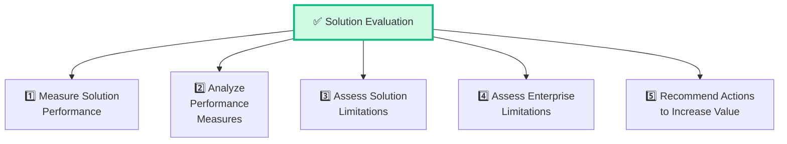
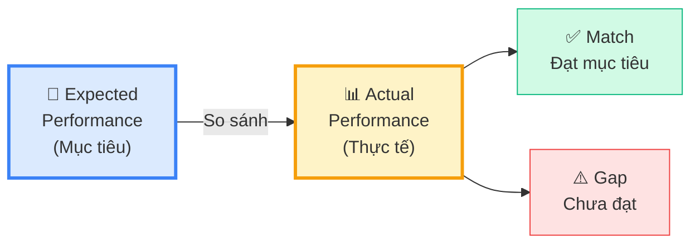
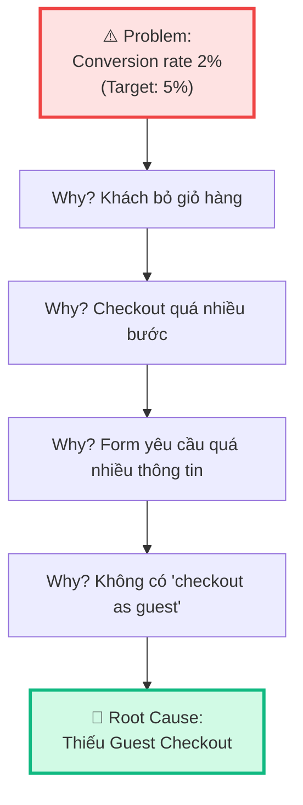
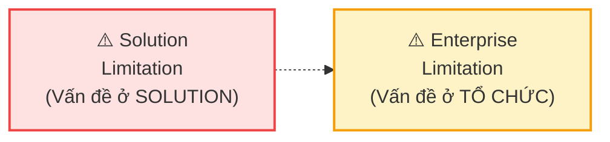
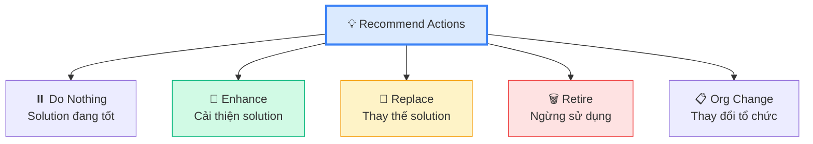
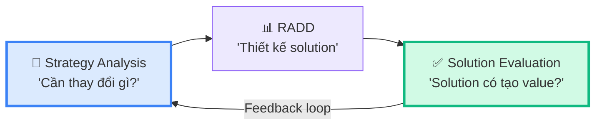

## Solution Evaluation là gì?

**Solution Evaluation** là Knowledge Area cuối cùng trong BABOK — mô tả cách BA **đánh giá** xem solution đã triển khai có **đáp ứng business need** không và **cần cải thiện** gì.

<Callout type="info" title="Vòng đời BA không dừng ở delivery!">
Nhiều BA nghĩ công việc kết thúc khi solution go-live. Thực tế, BA còn phải **đo lường** và **đánh giá** solution để đảm bảo nó tạo ra **value** thật sự.
</Callout>

## 5 Tasks trong Solution Evaluation

## Task 1: Measure Solution Performance

**Mục đích:** Định nghĩa và đo lường **KPIs** để biết solution hoạt động thế nào.

### Các loại Performance Measures

| Loại | Đo gì | Ví dụ |
|------|-------|-------|
| **Efficiency** | Tốn bao nhiêu resource | Xử lý đơn hàng trong 5 phút vs 30 phút |
| **Effectiveness** | Đạt mục tiêu chưa | 80% khách hàng hoàn thành checkout |
| **Quality** | Chất lượng output | Tỉ lệ lỗi < 1% |
| **Satisfaction** | User hài lòng? | NPS score > 50, CSAT > 4.0/5 |

### So sánh Expected vs Actual

<Callout type="tip" title="KPI vs Metric — Phân biệt!">
- **Metric** = bất kỳ số đo nào (page views, login count)
- **KPI** = metric GẮN VỚI MỤC TIÊU kinh doanh (conversion rate so với target)

Mọi KPI đều là metric, nhưng không phải metric nào cũng là KPI.
</Callout>

## Task 2: Analyze Performance Measures

**Mục đích:** Phân tích kết quả đo lường để **tìm nguyên nhân** gap.

### Root Cause Analysis

<Callout type="info" title="5 Whys — Kỹ thuật tìm Root Cause">
Hỏi **"Tại sao?"** liên tục (thường 5 lần) để đào đến **nguyên nhân gốc rễ** thay vì chỉ xử lý triệu chứng. Đề thi ECBA có thể hỏi kỹ thuật này.
</Callout>

## Task 3: Assess Solution Limitations

**Mục đích:** Xác định **hạn chế của solution** — điều gì solution KHÔNG LÀM ĐƯỢC.

### Các loại Solution Limitations

| Loại | Ví dụ |
|------|-------|
| **Technical** | Hệ thống không scale trên 10,000 users |
| **Functional** | Chưa support thanh toán crypto |
| **Performance** | Load chậm khi data > 1TB |
| **Usability** | Giao diện khó dùng trên mobile |
| **Integration** | Không kết nối được ERP cũ |

### Solution Limitation vs Enterprise Limitation

## Task 4: Assess Enterprise Limitations

**Mục đích:** Xác định hạn chế **ở cấp tổ chức** ảnh hưởng đến value của solution.

| Enterprise Limitation | Ví dụ |
|----------------------|-------|
| **Culture** | Tổ chức ngại thay đổi, chưa sẵn sàng adopt |
| **Process** | Quy trình cũ chưa adapt theo solution mới |
| **People** | Nhân viên chưa được training đầy đủ |
| **Structure** | Cơ cấu tổ chức không phù hợp |
| **External** | Quy định pháp luật thay đổi |

<Callout type="warning" title="Solution tốt + Tổ chức chưa sẵn sàng = Fail!">
Solution hoàn hảo nhưng nếu **tổ chức không adopt** thì vẫn fail. BA cần đánh giá Enterprise Limitations để recommend change management.
</Callout>

## Task 5: Recommend Actions to Increase Value

**Mục đích:** Dựa trên phân tích, **đề xuất hành động** để tăng giá trị từ solution.

### Các loại actions

| Action | Khi nào | Ví dụ |
|--------|--------|-------|
| **Do Nothing** | Solution đáp ứng tốt, KPI đạt | Hệ thống ổn định, user hài lòng |
| **Enhance** | Cải thiện để tăng value | Thêm feature, improve performance |
| **Replace** | Solution cũ, không viable nữa | Thay CRM cũ bằng hệ thống mới |
| **Retire** | Không còn business need | Ngừng module ít người dùng |
| **Organizational Change** | Vấn đề ở tổ chức, không phải solution | Training, process redesign |

## Mối liên kết Strategy Analysis ↔ Solution Evaluation

<Callout type="info" title="">
Solution Evaluation có thể trigger lại Strategy Analysis — nếu solution không đạt, BA quay lại phân tích current state và define new change strategy.
</Callout>

---

## 📝 Tóm tắt kiến thức nổi bật

<Callout type="success" title="Key Takeaways — Bài 10">
- **Solution Evaluation** = đánh giá solution SAU triển khai — có đáp ứng business need không
- **5 Tasks**: Measure → Analyze → Assess Solution Limitations → Assess Enterprise Limitations → Recommend
- **KPI vs Metric**: KPI gắn với mục tiêu kinh doanh, metric là số đo chung
- **5 Whys**: Hỏi "tại sao" liên tục để tìm root cause
- **Solution vs Enterprise Limitations**: Vấn đề ở sản phẩm vs vấn đề ở tổ chức
- **5 actions**: Do Nothing, Enhance, Replace, Retire, Org Change
- Solution Evaluation có thể **trigger lại** Strategy Analysis — continuous improvement loop
</Callout>

---

## 📋 Bài kiểm tra trắc nghiệm — Bài 10

<Callout type="info" title="Hướng dẫn làm bài">
Làm **10 câu** bên dưới trong **12 phút**. Chọn **MỘT đáp án đúng nhất**. Đáp án ở cuối bài.
</Callout>

**Câu 1.** Solution Evaluation gồm bao nhiêu Tasks?

- A. 4
- B. 5
- C. 6
- D. 7

**Câu 2.** KPI khác Metric ở điểm nào?

- A. KPI đo performance, metric đo quality
- B. KPI gắn với mục tiêu kinh doanh cụ thể
- C. KPI chỉ dùng cho IT, metric cho business
- D. KPI là số, metric là phần trăm

**Câu 3.** Kỹ thuật "5 Whys" dùng để làm gì?

- A. Validate 5 requirements quan trọng nhất
- B. Tìm root cause bằng cách hỏi "tại sao" liên tục
- C. Interview 5 stakeholders
- D. Đánh giá 5 design options

**Câu 4.** "Hệ thống CRM mới nhưng nhân viên chưa được training" — đây là gì?

- A. Solution Limitation
- B. Enterprise Limitation
- C. Technical Limitation
- D. Design flaw

**Câu 5.** Khi solution không còn business need, BA nên recommend gì?

- A. Enhance
- B. Replace
- C. Retire
- D. Do Nothing

**Câu 6.** "Hệ thống không scale trên 10,000 users" — đây thuộc loại nào?

- A. Enterprise Limitation
- B. Solution Limitation
- C. Business Requirement
- D. Transition Requirement

**Câu 7.** Solution Evaluation có thể trigger lại KA nào?

- A. Elicitation & Collaboration
- B. BA Planning & Monitoring
- C. Strategy Analysis
- D. RADD

**Câu 8.** Task nào so sánh Expected vs Actual performance?

- A. Assess Solution Limitations
- B. Measure Solution Performance
- C. Recommend Actions
- D. Assess Enterprise Limitations

**Câu 9.** Solution hoạt động tốt nhưng user adoption thấp vì văn hóa tổ chức. BA nên recommend gì?

- A. Replace solution
- B. Retire solution
- C. Organizational Change (change management, training)
- D. Do Nothing

**Câu 10.** Tại sao BA cần đánh giá solution SAU khi go-live?

- A. Để tìm bug trong code
- B. Để đảm bảo solution tạo ra value thật sự cho business
- C. Để viết test cases
- D. Để training developer

---

### 🔑 Đáp án & Giải thích

| Câu | Đáp án | Giải thích |
|:---:|:------:|-----------|
| 1 | **B** | Solution Evaluation có 5 Tasks. |
| 2 | **B** | KPI = metric gắn với mục tiêu kinh doanh cụ thể (target). |
| 3 | **B** | 5 Whys = hỏi "tại sao" liên tục để đào đến root cause. |
| 4 | **B** | Chưa training = vấn đề ở tổ chức, không phải solution = Enterprise Limitation. |
| 5 | **C** | Không còn business need → Retire (ngừng sử dụng). |
| 6 | **B** | Hạn chế khả năng scale = vấn đề của solution = Solution Limitation. |
| 7 | **C** | Solution Evaluation → trigger Strategy Analysis để phân tích lại. |
| 8 | **B** | Measure Solution Performance = đo expected vs actual. |
| 9 | **C** | Vấn đề văn hóa/adoption = cần Org Change, training, change management. |
| 10 | **B** | Đánh giá sau go-live để đảm bảo solution tạo ra business value thật sự. |

### 📊 Thang đánh giá

| Số câu đúng | Đánh giá | Hành động |
|:-----------:|---------|-----------|
| 9-10 | ⭐ Xuất sắc | Đã nắm đủ 6 Knowledge Areas! |
| 7-8 | ✅ Tốt | Ôn lại Solution vs Enterprise Limitations |
| 5-6 | ⚠️ Trung bình | Đọc lại phần Recommend Actions |
| < 5 | ❌ Cần ôn lại | Đọc lại toàn bộ bài |

---

## Tiếp theo

Bài tiếp theo: **50 Kỹ thuật BA** — Tổng hợp tất cả techniques trong BABOK v3: nhóm theo mục đích, bảng tra nhanh, và mẹo nhớ cho ngày thi.

---

*Đánh giá đúng = cải thiện đúng — BA tạo value liên tục! ✅*
