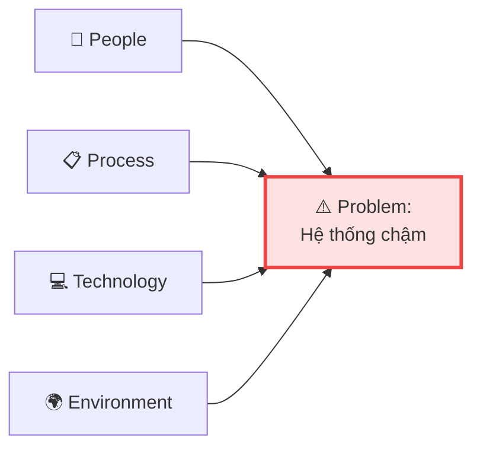

## Tại sao cần biết 50 Techniques?

BABOK v3 định nghĩa **50 Techniques** — các kỹ thuật BA có thể áp dụng xuyên suốt 6 Knowledge Areas. Đề thi ECBA **không yêu cầu nhớ hết 50**, nhưng cần:

- Biết **tên** và **mục đích** của techniques phổ biến nhất
- Biết technique nào **phù hợp** cho tình huống nào
- Phân biệt các techniques có tên tương tự

<Callout type="info" title="Mẹo ôn thi">
Tập trung vào **20 techniques hay ra đề nhất** (đánh dấu ⭐ trong bài). 30 techniques còn lại chỉ cần biết tên và mục đích chung.
</Callout>

## Phân nhóm 50 Techniques theo mục đích

### Nhóm 1: Elicitation — Thu thập thông tin

| # | Technique | Mục đích | Hay thi |
|:-:|-----------|---------|:-------:|
| 1 | **Brainstorming** | Thu thập nhiều ý tưởng nhanh | ⭐ |
| 2 | **Document Analysis** | Phân tích tài liệu có sẵn | ⭐ |
| 3 | **Focus Groups** | Thảo luận nhóm nhỏ có chọn lọc | |
| 4 | **Interface Analysis** | Phân tích giao tiếp giữa systems | ⭐ |
| 5 | **Interviews** | Hỏi đáp 1:1 hoặc nhóm nhỏ | ⭐ |
| 6 | **Observation** | Xem user làm việc thực tế | ⭐ |
| 7 | **Prototyping** | Tạo mẫu thử để lấy feedback | ⭐ |
| 8 | **Survey/Questionnaire** | Khảo sát scale lớn | ⭐ |
| 9 | **Workshops** | Hội thảo có facilitator | ⭐ |

### Nhóm 2: Analysis — Phân tích

| # | Technique | Mục đích | Hay thi |
|:-:|-----------|---------|:-------:|
| 10 | **Acceptance Criteria** | Điều kiện pass/fail cho requirement | ⭐ |
| 11 | **Benchmarking** | So sánh với best practices ngành | |
| 12 | **Business Model Canvas** | Mô hình kinh doanh 9 blocks | |
| 13 | **Business Rules Analysis** | Phân tích luật nghiệp vụ | ⭐ |
| 14 | **Concept Modelling** | Mô hình hóa khái niệm, quan hệ | |
| 15 | **Data Dictionary** | Định nghĩa chi tiết dữ liệu | |
| 16 | **Data Flow Diagrams** | Luồng dữ liệu trong hệ thống | ⭐ |
| 17 | **Data Modelling** | Thiết kế cấu trúc dữ liệu (ERD) | ⭐ |
| 18 | **Decision Analysis** | Phân tích quyết định, weighted scoring | ⭐ |
| 19 | **Decision Modelling** | Mô hình hóa logic quyết định | |
| 20 | **Financial Analysis** | ROI, NPV, Payback Period | ⭐ |
| 21 | **Functional Decomposition** | Chia nhỏ chức năng phức tạp | ⭐ |
| 22 | **Glossary** | Danh sách thuật ngữ chuẩn | |
| 23 | **Mind Mapping** | Sơ đồ tư duy | |
| 24 | **Non-Functional Req Analysis** | Phân tích NFR (performance, security) | ⭐ |
| 25 | **Process Modelling** | Mô hình hóa quy trình (BPMN) | ⭐ |
| 26 | **Root Cause Analysis** | Tìm nguyên nhân gốc rễ (5 Whys, Fishbone) | ⭐ |
| 27 | **Scope Modelling** | Xác định ranh giới scope | |
| 28 | **Sequence Diagrams** | Tương tác theo thời gian giữa objects | |
| 29 | **State Modelling** | Trạng thái và chuyển đổi trạng thái | |
| 30 | **Use Cases/Scenarios** | Actor + System interactions | ⭐ |
| 31 | **User Stories** | As a... I want... So that... | ⭐ |

### Nhóm 3: Stakeholder & Planning

| # | Technique | Mục đích | Hay thi |
|:-:|-----------|---------|:-------:|
| 32 | **Collaborative Games** | Trò chơi nhóm để khám phá yêu cầu | |
| 33 | **Lessons Learned** | Rút kinh nghiệm từ quá khứ | |
| 34 | **Organizational Modelling** | Mô hình cơ cấu tổ chức | |
| 35 | **Roles & Permissions Matrix** | Ma trận vai trò + quyền truy cập | |
| 36 | **Stakeholder List/Map/Personas** | Xác định và phân tích stakeholder | ⭐ |
| 37 | **RACI Matrix** | Phân vai Responsible/Accountable/... | ⭐ |

### Nhóm 4: Prioritization & Evaluation

| # | Technique | Mục đích | Hay thi |
|:-:|-----------|---------|:-------:|
| 38 | **Backlog Management** | Quản lý Product Backlog (Agile) | |
| 39 | **Estimation** | Ước lượng effort, size | |
| 40 | **Item Tracking** | Theo dõi trạng thái items | |
| 41 | **Metrics & KPIs** | Đo lường performance | ⭐ |
| 42 | **MoSCoW** | Must/Should/Could/Won't | ⭐ |
| 43 | **Prioritization** | Xếp hạng requirements | ⭐ |
| 44 | **Risk Analysis** | Đánh giá rủi ro | ⭐ |
| 45 | **Reviews** | Peer review, walkthrough | |
| 46 | **Vendor Assessment** | Đánh giá nhà cung cấp | |

### Nhóm 5: Strategy & Big Picture

| # | Technique | Mục đích | Hay thi |
|:-:|-----------|---------|:-------:|
| 47 | **Balanced Scorecard** | Đo lường 4 perspectives chiến lược | |
| 48 | **Business Capability Analysis** | Đánh giá năng lực tổ chức | |
| 49 | **SWOT Analysis** | S/W/O/T — phân tích nội-ngoại | ⭐ |
| 50 | **Gap Analysis** | So sánh Current vs Future State | ⭐ |

## 20 Techniques hay ra đề nhất — Bảng tra nhanh

```mermaid
graph TB
    TOP20["⭐ Top 20 Techniques ECBA"]

    subgraph "Elicitation"
        INT["Interview"]
        WS["Workshop"]
        OBS["Observation"]
        SV["Survey"]
        PT["Prototyping"]
        BS["Brainstorming"]
    end

    subgraph "Modeling"
        UC["Use Cases"]
        US["User Stories"]
        PM["Process Model"]
        DM["Data Model"]
        DFD["Data Flow Diagram"]
    end

    subgraph "Analysis"
        SWOT["SWOT"]
        GAP["Gap Analysis"]
        RCA["Root Cause"]
        DA["Decision Analysis"]
        FA["Financial Analysis"]
    end

    subgraph "Management"
        MOSC["MoSCoW"]
        RACI["RACI"]
        RISK["Risk Analysis"]
        KPI["Metrics/KPIs"]
    end

    TOP20 --> INT & WS & OBS & SV & PT & BS
    TOP20 --> UC & US & PM & DM & DFD
    TOP20 --> SWOT & GAP & RCA & DA & FA
    TOP20 --> MOSC & RACI & RISK & KPI

    style TOP20 fill:#EDE9FE,stroke:#8B5CF6,color:#333,stroke-width:3px
```

## Bảng: Technique nào dùng ở KA nào?

| Technique | BAPM | E&C | RLCM | SA | RADD | SE |
|-----------|:----:|:---:|:----:|:--:|:----:|:--:|
| Brainstorming | ✅ | ✅ | | ✅ | ✅ | |
| Interview | | ✅ | | | | |
| Workshop | | ✅ | | | ✅ | |
| SWOT | | | | ✅ | | |
| Gap Analysis | | | | ✅ | | |
| MoSCoW | | | ✅ | | | |
| Use Cases | | | | | ✅ | |
| User Stories | | | | | ✅ | |
| Process Model | | | | ✅ | ✅ | |
| RACI | ✅ | | | | | |
| Root Cause | | | | | | ✅ |
| Risk Analysis | | | | ✅ | | |
| Decision Analysis | | | | | ✅ | ✅ |
| Financial Analysis | | | | ✅ | ✅ | ✅ |
| Metrics/KPIs | ✅ | | | | | ✅ |

<Callout type="tip" title="Mẹo nhớ">
- **BAPM** → RACI, Estimation, Metrics
- **E&C** → Interview, Workshop, Observation, Survey, Brainstorming
- **RLCM** → MoSCoW, Prioritization, Traceability
- **SA** → SWOT, Gap Analysis, Risk, Financial Analysis
- **RADD** → Use Cases, User Stories, Process Model, Data Model, Decision Analysis
- **SE** → Root Cause, Metrics/KPIs, Decision Analysis
</Callout>

## Financial Analysis — Các chỉ số cần biết

| Chỉ số | Công thức | Ý nghĩa |
|--------|----------|---------|
| **ROI** | (Benefit - Cost) / Cost × 100% | Tỉ suất hoàn vốn — càng cao càng tốt |
| **Payback Period** | Cost / Annual Benefit | Thời gian hoàn vốn — càng ngắn càng tốt |
| **NPV** | Σ (Cash Flow / (1+r)^n) | Giá trị hiện tại ròng — dương là tốt |

Ví dụ:
- Cost = $100K, Annual Benefit = $50K
- **ROI** = ($50K × 3 năm - $100K) / $100K = **50%**
- **Payback Period** = $100K / $50K = **2 năm**

<Callout type="warning" title="NPV — Đề thi thường hỏi khái niệm">
NPV dương → project đáng đầu tư. NPV âm → chi phí cao hơn lợi ích. ECBA hỏi **khái niệm**, ít khi yêu cầu tính toán.
</Callout>

## Root Cause Analysis — 2 kỹ thuật phổ biến

### 5 Whys

Hỏi "Tại sao?" liên tục (5 lần) để tìm nguyên nhân gốc.

### Fishbone Diagram (Ishikawa)

Phân tích nguyên nhân theo **categories**: People, Process, Technology, Environment (hoặc Man, Machine, Method, Material).

---

## 📝 Tóm tắt kiến thức nổi bật

<Callout type="success" title="Key Takeaways — Bài 11">
- BABOK v3 có **50 Techniques** — ECBA tập trung **20 techniques phổ biến nhất**
- Techniques áp dụng **xuyên suốt** các KAs — cùng 1 technique dùng ở nhiều KA
- **Elicitation**: Interview, Workshop, Observation, Survey, Prototyping, Brainstorming
- **Modeling**: Use Cases, User Stories, Process Model, Data Model, DFD
- **Strategy**: SWOT, Gap Analysis, Risk Analysis, Financial Analysis (ROI, NPV, Payback)
- **Management**: MoSCoW, RACI, Metrics/KPIs
- **Root Cause**: 5 Whys (hỏi tại sao) + Fishbone (phân loại nguyên nhân)
</Callout>

---

## 📋 Bài kiểm tra trắc nghiệm — Bài 11

<Callout type="info" title="Hướng dẫn làm bài">
Làm **10 câu** bên dưới trong **12 phút**. Chọn **MỘT đáp án đúng nhất**. Đáp án ở cuối bài.
</Callout>

**Câu 1.** BABOK v3 có tổng cộng bao nhiêu Techniques?

- A. 30
- B. 40
- C. 50
- D. 60

**Câu 2.** Technique nào dùng để phân vai Responsible, Accountable, Consulted, Informed?

- A. SWOT
- B. RACI Matrix
- C. MoSCoW
- D. Decision Matrix

**Câu 3.** ROI = 150% nghĩa là gì?

- A. Chi phí gấp 1.5 lần lợi ích
- B. Lợi ích gấp 1.5 lần chi phí (sau trừ chi phí)
- C. Dự án mất 150 ngày
- D. 150 stakeholders hài lòng

**Câu 4.** Fishbone Diagram còn gọi là gì?

- A. Gantt Chart
- B. Ishikawa Diagram
- C. Pareto Chart
- D. Burndown Chart

**Câu 5.** Technique nào phù hợp nhất để xác định Must/Should/Could/Won't?

- A. SWOT
- B. RACI
- C. MoSCoW
- D. Gap Analysis

**Câu 6.** BA cần hiểu cấu trúc dữ liệu và quan hệ giữa entities. Nên dùng technique nào?

- A. Process Modelling
- B. Data Modelling (ERD)
- C. Use Cases
- D. SWOT Analysis

**Câu 7.** NPV dương (positive) nghĩa là gì?

- A. Dự án tốn nhiều tiền
- B. Dự án đáng đầu tư — benefits > costs (tính theo giá trị hiện tại)
- C. Dự án sẽ hoàn thành sớm
- D. Stakeholder đồng ý

**Câu 8.** Technique nào áp dụng trong Strategy Analysis để so sánh Current vs Future State?

- A. MoSCoW
- B. RACI
- C. Gap Analysis
- D. User Stories

**Câu 9.** Brainstorming có thể áp dụng trong bao nhiêu Knowledge Areas?

- A. Chỉ 1 (Elicitation)
- B. 2-3 KAs
- C. 4+ KAs — xuyên suốt nhiều KAs
- D. Không thuộc KA nào

**Câu 10.** Cost = $200K, Annual Benefit = $100K. Payback Period là bao lâu?

- A. 1 năm
- B. 2 năm
- C. 3 năm
- D. 0.5 năm

---

### 🔑 Đáp án & Giải thích

| Câu | Đáp án | Giải thích |
|:---:|:------:|-----------|
| 1 | **C** | BABOK v3 có 50 Techniques. |
| 2 | **B** | RACI = Responsible, Accountable, Consulted, Informed. |
| 3 | **B** | ROI 150% = lợi ích netto gấp 1.5 lần chi phí bỏ ra. |
| 4 | **B** | Fishbone = Ishikawa Diagram = Cause-and-Effect Diagram. |
| 5 | **C** | MoSCoW = Must / Should / Could / Won't. |
| 6 | **B** | Data Modelling (ERD) = mô hình hóa entities và relationships. |
| 7 | **B** | NPV dương = giá trị hiện tại của benefits > costs → đáng đầu tư. |
| 8 | **C** | Gap Analysis = so sánh Current State vs Future State. |
| 9 | **C** | Brainstorming áp dụng ở BAPM, E&C, SA, RADD — xuyên suốt. |
| 10 | **B** | Payback = $200K ÷ $100K/năm = 2 năm hoàn vốn. |

### 📊 Thang đánh giá

| Số câu đúng | Đánh giá | Hành động |
|:-----------:|---------|-----------|
| 9-10 | ⭐ Xuất sắc | Nắm vững 50 techniques! |
| 7-8 | ✅ Tốt | Ôn lại Financial Analysis |
| 5-6 | ⚠️ Trung bình | Đọc lại bảng technique-KA mapping |
| < 5 | ❌ Cần ôn lại | Tập trung 20 techniques ⭐ |

---

## Tiếp theo

Bài cuối trước thi: **Chiến lược thi ECBA** — phân bổ thời gian, kỹ thuật loại trừ đáp án, mẹo quản lý tâm lý ngày thi, và checklist ôn tập cuối cùng.

---

*50 techniques = 50 vũ khí trong kho — biết chọn đúng vũ khí cho đúng trận! 🛠️*
