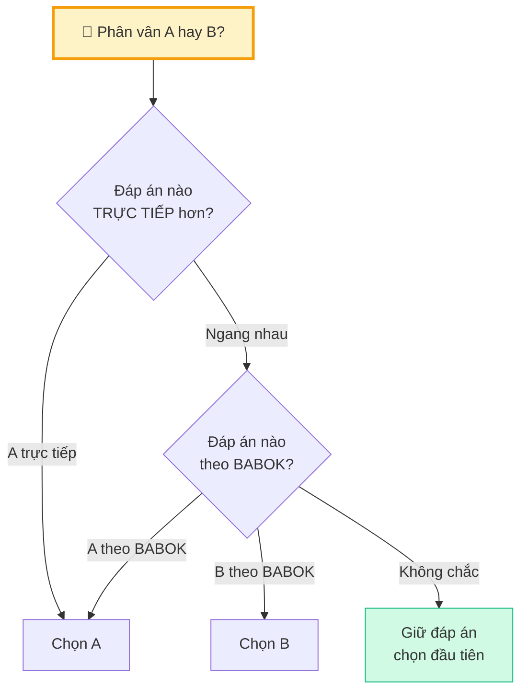
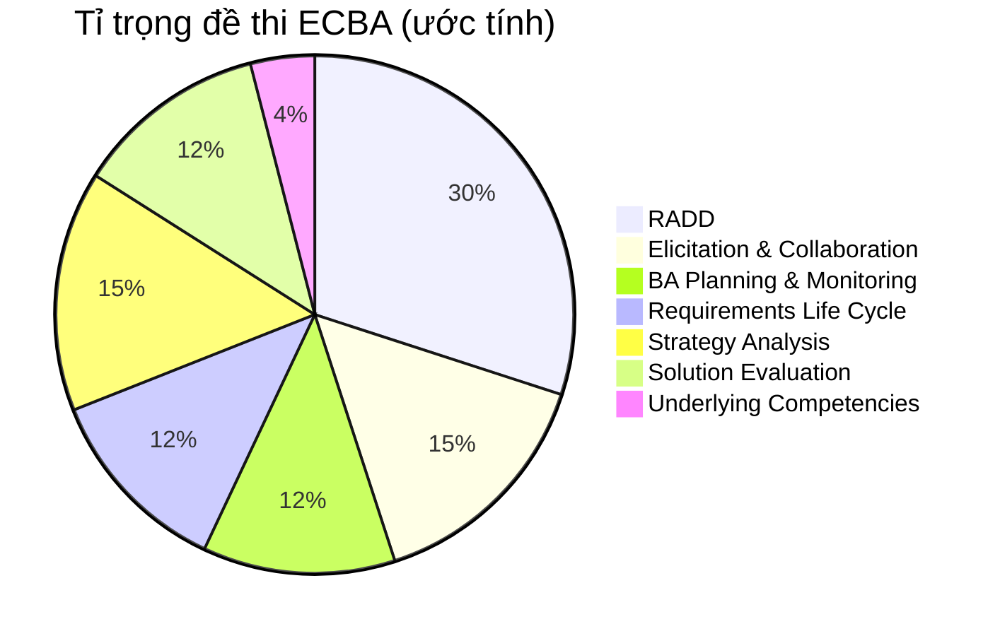

## Cấu trúc đề thi ECBA

Trước khi bàn chiến lược, cần nắm rõ **format đề thi**:

| Yếu tố | Chi tiết |
|--------|---------|
| **Số câu** | 50 câu trắc nghiệm |
| **Thời gian** | 60 phút |
| **Passing score** | 70% (35/50 câu) |
| **Format** | Multiple choice — chọn 1 đáp án |
| **Ngôn ngữ** | Tiếng Anh |
| **Hình thức** | Online proctored |
| **Bloom's Level** | Level 1-2 (Remember & Understand) |

<Callout type="info" title="Bloom's Level 1-2 — Tin vui cho ECBA!">
ECBA chỉ hỏi **Remember** (nhớ định nghĩa) và **Understand** (hiểu khái niệm). KHÔNG có **Apply** (áp dụng tình huống phức tạp) như CCBA/CBAP. Nghĩa là: nắm chắc lý thuyết = pass!
</Callout>

## Phân bổ thời gian thi

```mermaid
gantt
    title Chiến lược thời gian — 60 phút, 50 câu
    dateFormat X
    axisFormat %s phút

    section Lượt 1
    Đọc nhanh + trả lời chắc chắn (35-40 câu) :0, 35

    section Lượt 2
    Review câu đánh dấu (10-15 câu) :35, 50

    section Lượt 3
    Kiểm tra cuối + submit :50, 60
```

### Chiến lược 3 lượt

| Lượt | Thời gian | Làm gì |
|:----:|:---------:|--------|
| **1** | 0-35 phút | Đọc nhanh, trả lời câu **chắc chắn**. Đánh dấu câu không chắc. Mỗi câu ~1 phút |
| **2** | 35-50 phút | Quay lại câu đã đánh dấu. Suy nghĩ kỹ, loại trừ đáp án |
| **3** | 50-60 phút | Review nhanh toàn bộ. Kiểm tra chưa bỏ sót câu nào. Submit |

<Callout type="warning" title="ĐỪNG dành quá 2 phút cho 1 câu!">
Nếu suy nghĩ quá 2 phút mà chưa chắc → **đánh dấu, bỏ qua**, quay lại sau. Thời gian là tài nguyên quý nhất trong phòng thi.
</Callout>

## Kỹ thuật loại trừ đáp án

### 1. Loại đáp án "quá tuyệt đối"

Các từ **tuyệt đối** thường SAI:
- "ALWAYS" (luôn luôn)
- "NEVER" (không bao giờ)
- "MUST always" (bắt buộc luôn)
- "Only way" (cách duy nhất)

→ BABOK hiếm khi nói "luôn luôn" hay "không bao giờ"

### 2. Loại đáp án "ngoài scope BA"

BA **KHÔNG**:
- Code / implement solution
- Approve requirements (Sponsor làm)
- Quyết định chọn solution (Decision Maker làm)
- Manage project schedule (PM làm)

→ Đáp án nào gán việc KHÔNG phải của BA → loại

### 3. Tìm từ khóa trong đề

| Từ khóa trong đề | Gợi ý KA / Concept |
|------------------|-------------------|
| "first", "before" | BA Planning → Plan BA Approach |
| "stakeholder disagreement" | E&C → Manage Collaboration |
| "trace", "link" | RLCM → Trace Requirements |
| "current state", "SWOT" | Strategy Analysis |
| "verify", "consistent" | RADD → Verify Requirements |
| "validate", "business need" | RADD → Validate Requirements |
| "measure", "KPI" | Solution Evaluation |
| "MoSCoW", "prioritize" | RLCM → Prioritize |

### 4. Khi phân vân giữa 2 đáp án

<Callout type="tip" title="Nguyên tắc vàng">
Khi phân vân 50/50, **giữ đáp án đầu tiên** bạn chọn. Nghiên cứu cho thấy "gut feeling" đầu tiên thường đúng hơn việc đổi đáp án.
</Callout>

## Trọng tâm ôn tập theo tỉ trọng đề thi

### Checklist ôn tập — 7 ngày cuối

| Ngày | Focus | Hoạt động |
|:----:|-------|----------|
| **7** | RADD (30%) | Verify vs Validate, Use Cases, User Stories, INVEST |
| **6** | Elicitation (15%) | 3 loại, techniques, Hawthorne Effect |
| **5** | Strategy Analysis (15%) | SWOT, Gap Analysis, Risk Responses, SMART goals |
| **4** | RLCM + BA Planning (24%) | MoSCoW, Traceability, Baseline, 5 Tasks BAPM |
| **3** | Solution Eval + Techniques (16%) | KPI vs Metric, Root Cause, Financial Analysis |
| **2** | Thi thử + Review sai | Làm đề thi thử, ghi chú câu sai |
| **1** | Review nhẹ + Nghỉ ngơi | Đọc lại Key Takeaways, NGỦ SỚM |

## Những lỗi thường gặp — TRÁNH!

| Lỗi | Hậu quả | Cách tránh |
|-----|---------|-----------|
| **Đọc lướt đề** | Hiểu sai câu hỏi | Đọc **2 lần**, gạch chân từ khóa |
| **Không đọc hết 4 đáp án** | Bỏ lỡ đáp án tốt hơn | LUÔN đọc hết 4 đáp án rồi mới chọn |
| **Dành quá nhiều thời gian 1 câu** | Hết giờ, bỏ câu dễ sau | Max 2 phút/câu, đánh dấu rồi đi tiếp |
| **Đổi đáp án khi phân vân** | Đổi từ đúng sang sai | Chỉ đổi khi có LÝ DO RÕ RÀNG |
| **Ôn học thuộc lòng** | Không hiểu → không nhận ra khi đề hỏi khác | Hiểu **concept**, không chỉ nhớ chữ |

## Quản lý tâm lý ngày thi

### Trước thi

- ✅ Ngủ đủ 7-8 tiếng đêm trước
- ✅ Setup phòng thi yên tĩnh, internet ổn định
- ✅ Test webcam + mic trước 30 phút
- ✅ Chuẩn bị giấy tờ tùy thân (ID)
- ❌ KHÔNG ôn cram đêm trước — não cần nghỉ

### Trong thi

- 😤 Gặp câu khó → **bình tĩnh, đánh dấu, đi tiếp**
- 🧘 Hít thở sâu nếu cảm thấy panic
- ⏰ Check thời gian mỗi 15-20 câu
- 💡 Nhớ: chỉ cần **35/50** câu đúng = PASS

<Callout type="success" title="Mindset đúng">
ECBA là entry-level — thiết kế để bạn **CÓ THỂ pass** nếu ôn tập nghiêm túc. 70% passing score đã có buffer cho ~7 câu sai. Bạn KHÔNG cần perfect — bạn cần **đủ tốt**.
</Callout>

## Tổng hợp: "BA nên làm gì ĐẦU TIÊN?"

Đề thi hay hỏi "What should BA do FIRST?" — Bảng tra nhanh:

| Tình huống | BA nên làm ĐẦU TIÊN |
|-----------|-------------------|
| Bắt đầu dự án mới | Plan BA Approach |
| Chuẩn bị elicitation | Prepare for Elicitation — xác định objectives |
| Requirements mâu thuẫn | Understand all perspectives (Manage Collaboration) |
| Stakeholder yêu cầu thay đổi | Assess impact of change (RLCM) |
| Solution đã deploy | Measure Solution Performance |
| Cần prioritize requirements | Xác định prioritization criteria |
| Requirement mơ hồ | Verify — kiểm tra clarity |

---

## 📝 Tóm tắt — Toàn bộ khóa học

<Callout type="success" title="Key Takeaways — Bài 12 (Cuối cùng!)">
- ECBA: **50 câu, 60 phút, 70% pass** — Bloom's Level 1-2
- Chiến lược **3 lượt**: trả lời chắc → review đánh dấu → kiểm tra cuối
- **Loại trừ**: từ tuyệt đối, ngoài scope BA, không theo BABOK
- **Trọng tâm**: RADD (30%) > E&C = SA (15%) > RLCM = BAPM = SE (12%)
- **7 ngày cuối**: Ôn theo tỉ trọng, thi thử, review sai, nghỉ ngơi
- **Tâm lý**: bình tĩnh, max 2 phút/câu, giữ đáp án đầu tiên khi phân vân
- **35/50 = PASS** — bạn hoàn toàn có thể làm được!
</Callout>

---

## 📋 Bài kiểm tra trắc nghiệm — Bài 12

<Callout type="info" title="Hướng dẫn làm bài">
Làm **10 câu** bên dưới trong **12 phút**. Chọn **MỘT đáp án đúng nhất**. Đáp án ở cuối bài.
</Callout>

**Câu 1.** Đề thi ECBA yêu cầu Bloom's Level nào?

- A. Level 1-2 (Remember & Understand)
- B. Level 3-4 (Apply & Analyze)
- C. Level 5-6 (Evaluate & Create)
- D. Tất cả 6 levels

**Câu 2.** Passing score ECBA là bao nhiêu?

- A. 50%
- B. 60%
- C. 70%
- D. 80%

**Câu 3.** Khi gặp câu khó trong thi, BA nên làm gì?

- A. Dành 5 phút suy nghĩ kỹ
- B. Bỏ qua không trả lời
- C. Đánh dấu, chọn tạm, quay lại sau
- D. Hỏi proctor

**Câu 4.** Từ nào trong đáp án thường là DẤU HIỆU SAI?

- A. "Sometimes"
- B. "Typically"
- C. "ALWAYS"
- D. "Often"

**Câu 5.** Khi đề hỏi "What should BA do FIRST at the start of a new initiative?":

- A. Write requirements
- B. Plan BA Approach
- C. Design solution
- D. Test prototype

**Câu 6.** KA nào chiếm tỉ trọng CAO NHẤT trong đề thi ECBA?

- A. BA Planning & Monitoring
- B. Elicitation & Collaboration
- C. RADD
- D. Solution Evaluation

**Câu 7.** Khi phân vân 50/50 giữa 2 đáp án, nên làm gì?

- A. Luôn chọn C
- B. Giữ đáp án chọn đầu tiên
- C. Đổi sang đáp án kia
- D. Bỏ trống

**Câu 8.** Đêm trước thi nên làm gì?

- A. Ôn cram suốt đêm
- B. Đọc lại toàn bộ BABOK 800 trang
- C. Ngủ đủ giấc, review nhẹ Key Takeaways
- D. Thi thử 5 đề liên tiếp

**Câu 9.** BA có quyền APPROVE requirements không?

- A. Có, BA luôn approve
- B. Không, Sponsor/Business Owner approve
- C. Có, nếu PM đồng ý
- D. Chỉ khi BA là team lead

**Câu 10.** Cần đúng bao nhiêu câu để pass ECBA (50 câu)?

- A. 25 câu
- B. 30 câu
- C. 35 câu
- D. 40 câu

---

### 🔑 Đáp án & Giải thích

| Câu | Đáp án | Giải thích |
|:---:|:------:|-----------|
| 1 | **A** | ECBA = Level 1 (Remember) + Level 2 (Understand). |
| 2 | **C** | ECBA passing score = 70%. |
| 3 | **C** | Đánh dấu, chọn tạm đáp án, quay lại sau — tiết kiệm thời gian. |
| 4 | **C** | "ALWAYS" = tuyệt đối. BABOK hiếm khi dùng từ tuyệt đối. |
| 5 | **B** | New initiative → Plan BA Approach = bước đầu tiên. |
| 6 | **C** | RADD chiếm ~30% — tỉ trọng cao nhất. |
| 7 | **B** | First instinct thường đúng. Chỉ đổi khi có lý do rõ ràng. |
| 8 | **C** | Ngủ đủ giấc = não hoạt động tốt hơn ôn cram đêm. |
| 9 | **B** | BA phân tích và recommend. Sponsor/Business Owner approve. |
| 10 | **C** | 70% × 50 = 35 câu đúng để pass. |

### 📊 Thang đánh giá

| Số câu đúng | Đánh giá | Hành động |
|:-----------:|---------|-----------|
| 9-10 | ⭐ Xuất sắc | SẴN SÀNG THI! 🏆 |
| 7-8 | ✅ Tốt | Review lại chiến lược loại trừ |
| 5-6 | ⚠️ Trung bình | Ôn lại trọng tâm và "BA nên làm gì đầu tiên" |
| < 5 | ❌ Cần ôn lại | Quay lại ôn từ Bài 1, dành thêm thời gian |

---

## Bước tiếp theo

Bạn đã hoàn thành **toàn bộ 12 bài lý thuyết**! Giờ hãy:

1. 📝 **Làm đề thi thử** → [Bài 13: Đề thi thử ECBA](/blog/ecba-de-thi-thu)
2. 🔄 **Review bài sai** → Quay lại bài tương ứng ôn lại
3. 📊 **Đạt 80%+ thi thử** → Đăng ký thi thật!

---

*12 bài hoàn thành — bạn đã sẵn sàng cho ECBA! Chúc bạn thi đỗ! 🎓🏆*
