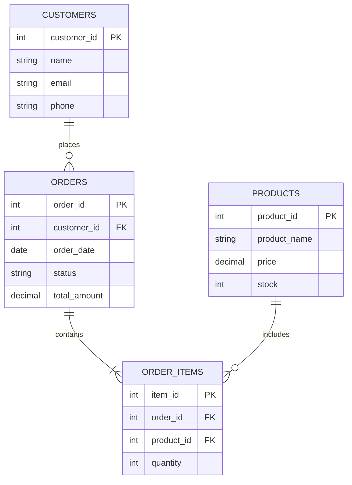

## Tại sao BA cần biết SQL?

Biết SQL là một **lợi thế cực lớn** cho BA:

- 🔍 **Tự verify dữ liệu** thay vì nhờ dev
- 📊 **Phân tích data** để đưa ra quyết định chính xác
- 🐛 **Debug nhanh** khi có bug liên quan đến data
- 💪 **Tự tin hơn** khi thiết kế database schema

<Callout type="info" title="BA không cần biết SQL nâng cao">
Bạn chỉ cần thành thạo SELECT, WHERE, JOIN, GROUP BY là đã cover 80% nhu cầu công việc rồi!
</Callout>

## Cấu trúc database cơ bản



## Bắt đầu với SELECT

```sql
-- Lấy danh sách tất cả khách hàng
SELECT customer_name, email, phone
FROM customers;
```

## Lọc dữ liệu với WHERE

```sql
SELECT *
FROM orders
WHERE status = 'completed'
  AND total_amount > 1000000;
```

### Các toán tử phổ biến

| Toán tử | Ý nghĩa | Ví dụ |
|---------|---------|-------|
| `=` | Bằng | `status = 'active'` |
| `!=` | Khác | `status != 'deleted'` |
| `LIKE` | Tìm pattern | `name LIKE '%Nguyễn%'` |
| `IN` | Trong danh sách | `city IN ('HCM', 'HN')` |
| `BETWEEN` | Trong khoảng | `date BETWEEN '2026-01-01' AND '2026-12-31'` |
| `IS NULL` | Giá trị null | `email IS NULL` |

## JOIN — Kết hợp nhiều bảng

### INNER JOIN

Chỉ lấy records khớp ở **cả 2 bảng**:

```sql
SELECT c.customer_name, o.order_date, o.total_amount
FROM customers c
INNER JOIN orders o ON c.customer_id = o.customer_id;
```

### LEFT JOIN

Lấy **tất cả** records từ bảng bên trái:

```sql
-- Tìm khách hàng chưa có đơn hàng nào
SELECT c.customer_name, o.order_id
FROM customers c
LEFT JOIN orders o ON c.customer_id = o.customer_id
WHERE o.order_id IS NULL;
```

<Callout type="tip" title="LEFT JOIN + IS NULL">
Đây là trick phổ biến nhất để tìm "records không có quan hệ" — ví dụ: khách chưa mua hàng, sản phẩm chưa bán được, user chưa đăng nhập...
</Callout>

## Thống kê với GROUP BY

```sql
-- Thống kê doanh thu theo tháng
SELECT
  DATE_FORMAT(order_date, '%Y-%m') AS month,
  COUNT(*) AS total_orders,
  SUM(total_amount) AS revenue,
  AVG(total_amount) AS avg_order_value
FROM orders
WHERE status = 'completed'
GROUP BY DATE_FORMAT(order_date, '%Y-%m')
ORDER BY month DESC;
```

## Ví dụ thực tế: Report cho Stakeholder

```sql
-- Top 10 khách hàng mua nhiều nhất
SELECT
  c.customer_name,
  COUNT(o.order_id) AS total_orders,
  SUM(o.total_amount) AS total_spent,
  MAX(o.order_date) AS last_order_date
FROM customers c
INNER JOIN orders o ON c.customer_id = o.customer_id
WHERE o.status = 'completed'
  AND o.order_date >= '2026-01-01'
GROUP BY c.customer_id, c.customer_name
HAVING total_spent > 5000000
ORDER BY total_spent DESC
LIMIT 10;
```

<Callout type="warning" title="Lưu ý quan trọng">
Không bao giờ chạy DELETE/UPDATE trên production mà chưa backup! Luôn test query trên staging environment trước.
</Callout>

## Tips cho BA khi viết SQL

1. **Luôn dùng alias** cho bảng để code dễ đọc
2. **SELECT cột cụ thể** thay vì `SELECT *`
3. **Test với LIMIT** trước khi chạy query lớn
4. **Comment SQL** để giải thích logic phức tạp
5. **Dùng formatting tool** để SQL dễ đọc hơn

---

*Bài tiếp theo mình sẽ chia sẻ về Subquery và Window Functions nhé! 📊*
