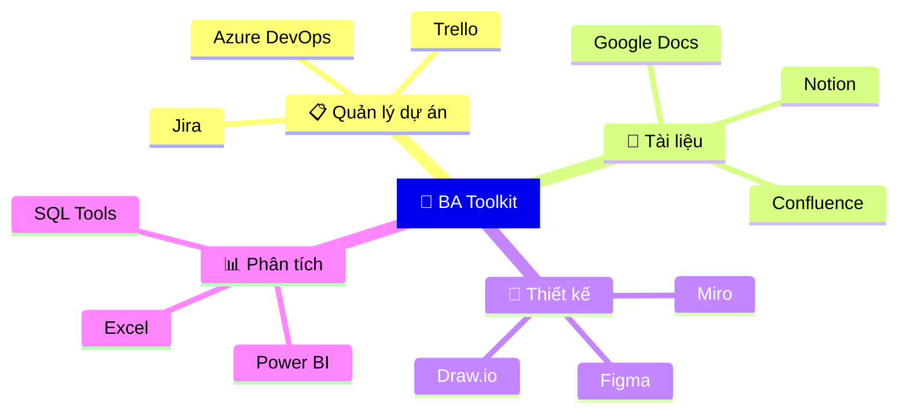

## Bộ công cụ của BA

Một BA hiệu quả cần **bộ công cụ phù hợp** để hỗ trợ công việc hàng ngày. Dưới đây là 10 tool mình recommend nhất!

## 1. 📋 Jira — Quản lý dự án & Backlog

**Jira** là công cụ **số 1** cho Agile project management.

**BA dùng Jira để:**
- ✍️ Tạo và quản lý User Stories, Tasks, Bugs
- 📊 Theo dõi Sprint Board & Burndown chart
- 🔗 Link requirements với các tasks
- 📈 Tạo report cho stakeholders

<Callout type="tip" title="Jira tip cho BA">
Tạo custom fields trong Jira để track: Priority (MoSCoW), Effort, Business Value. Giúp PO dễ dàng ưu tiên backlog!
</Callout>

| Tính năng | Free | Standard | Premium |
|-----------|:----:|:--------:|:-------:|
| Boards (Scrum/Kanban) | ✅ | ✅ | ✅ |
| Roadmap | ❌ | ✅ | ✅ |
| Advanced search (JQL) | ✅ | ✅ | ✅ |
| Automation | Limited | ✅ | ✅ |

## 2. 📝 Confluence — Tài liệu & Knowledge Base

**"Nơi lưu trữ mọi kiến thức của team"**

BA dùng Confluence để viết:
- 📄 BRD (Business Requirements Document)
- 📋 Meeting notes & Decision logs
- 📖 Process documentation
- 🗂️ Knowledge base cho team

## 3. 🎨 Figma — Wireframe & Mockup

Figma giúp BA **visualize** ý tưởng thay vì giải thích bằng chữ.

**BA cần biết Figma ở mức:**
- Tạo wireframe cơ bản (lo-fi)
- Comment & collaborate với designer
- Tạo interactive prototype đơn giản
- Export assets cho dev

<Callout type="info" title="BA không cần design đẹp">
BA chỉ cần tạo wireframe để truyền đạt ý tưởng. Phần design đẹp để cho UX/UI Designer lo!
</Callout>

## 4. 🗺️ Miro — Whiteboard & Diagramming

**Miro** là "bảng trắng ảo" tuyệt vời cho:
- 🧠 Brainstorming sessions
- 📐 User Story Mapping
- 🔄 Process mapping (BPMN)
- 🗺️ Customer Journey Map

## 5. 📊 Draw.io — Vẽ sơ đồ miễn phí

Tool **miễn phí** và mạnh mẽ để vẽ:
- Flowchart & BPMN
- ER Diagram (database)
- Architecture diagrams
- Sequence diagrams

## 6. 💬 Notion — All-in-one Workspace

Notion kết hợp: Notes + Wiki + Task management + Database + Calendar.

<Callout type="tip" title="Notion cho freelance BA">
Nếu bạn là freelance BA, Notion là lựa chọn hoàn hảo vì nó miễn phí cho cá nhân và thay thế được nhiều tools khác!
</Callout>

## 7. 📊 Microsoft Excel / Google Sheets

Đừng coi thường Excel! BA dùng để:
- 📋 Requirement traceability matrix
- 📊 Data analysis cơ bản
- 📈 Tạo charts & dashboards
- 🔢 Cost-benefit analysis

## 8. 🗄️ SQL Tools (DBeaver, DataGrip)

Để query database trực tiếp:
- Verify data sau khi dev implement
- Phân tích data hiện tại
- Tạo report ad-hoc

## 9. 📈 Power BI / Tableau — Data Visualization

Tạo dashboard và report chuyên nghiệp cho management.

## 10. 🤖 AI Tools (ChatGPT, Claude)

BA dùng AI để:
- 🚀 Draft requirements nhanh hơn
- 💡 Brainstorm edge cases
- 📝 Generate test scenarios
- ✍️ Viết email & communication

<Callout type="warning" title="Lưu ý khi dùng AI">
AI là trợ thủ, không phải thay thế! Luôn review output từ AI và customize theo context cụ thể của dự án.
</Callout>

## Bộ tool recommend theo level

| Level | Essential | Nice to have |
|-------|-----------|-------------|
| 🌱 Junior | Jira, Confluence, Draw.io, Excel | Notion, Figma |
| 🌿 Mid | + Figma, Miro, SQL Tools | Power BI, AI Tools |
| 🌳 Senior | + Power BI, AI Tools | Tableau, Custom scripts |

---

*Bạn đang dùng tool nào? Chia sẻ với mình nhé! 🛠️*
