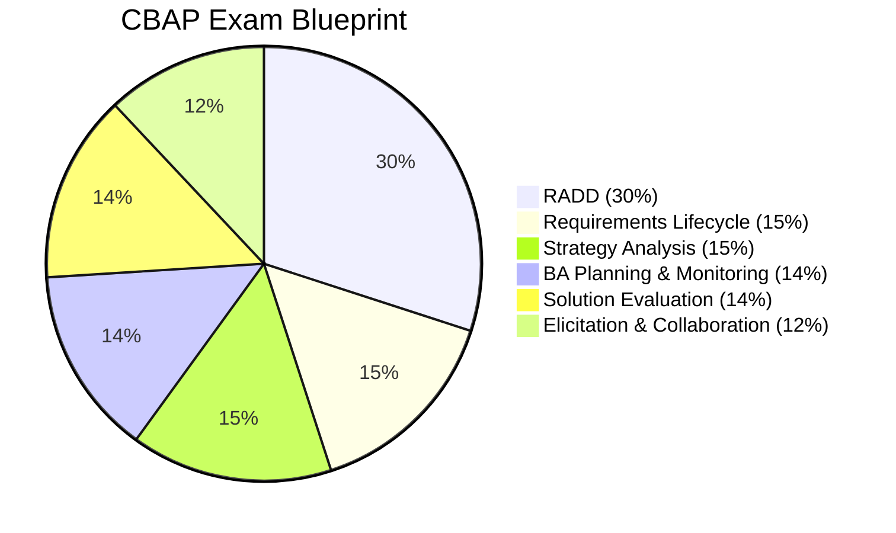
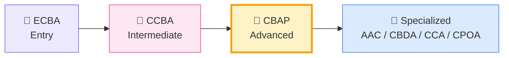
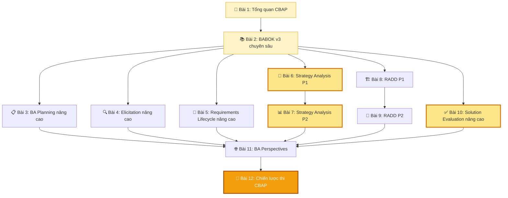

## CBAP là gì?

**Certified Business Analysis Professional (CBAP)** là chứng chỉ cao cấp nhất trong hệ thống IIBA, dành cho những Senior BA có nhiều năm kinh nghiệm. CBAP chứng minh bạn có khả năng **phân tích, tổng hợp và dẫn dắt** hoạt động BA ở cấp chiến lược. Đây là "đỉnh cao" mà mọi BA đều hướng tới!

## Ai nên thi CBAP?

- 👨‍💼 Senior BA với 5+ năm kinh nghiệm
- 🎯 BA Lead, BA Manager muốn khẳng định năng lực quốc tế
- 🌍 Đã có CCBA và muốn chinh phục đỉnh cao
- 💰 Muốn tăng thu nhập (CBAP holders kiếm cao hơn 13% so với non-certified)
- 🏢 Consultants, Product Managers, Change Managers muốn chứng minh năng lực BA

## Yêu cầu thi

| Tiêu chí | Yêu cầu |
|----------|---------|
| Kinh nghiệm | Tối thiểu 7,500 giờ BA work (trong 10 năm gần nhất) |
| Phân bổ KA | Tối thiểu 900 giờ × 4 KAs (tổng ≥ 3,600 giờ) |
| Đào tạo | Tối thiểu 35 giờ Professional Development (trong 4 năm) |
| Phí thi | ~$325 (thành viên IIBA) / ~$525 (không thành viên) |
| Hình thức | Thi online hoặc tại trung tâm PSI, trắc nghiệm |
| Số câu hỏi | 120 câu (scenario & case study-based) |
| Thời gian | 3.5 giờ |
| Tham khảo | 2 references từ đồng nghiệp/quản lý |

## Exam Blueprint — Tỷ trọng các Knowledge Area

| Knowledge Area | Tỷ trọng | So với CCBA | Mô tả |
|---------------|:--------:|:-----------:|-------|
| Requirements Analysis & Design Definition | 30% | 32% ↓ | Phân tích yêu cầu, thiết kế giải pháp nâng cao |
| Requirements Life Cycle Management | 15% | 18% ↓ | Governance, traceability chuyên sâu |
| Strategy Analysis | 15% | 12% ↑ | Phân tích chiến lược cấp enterprise |
| BA Planning & Monitoring | 14% | 12% ↑ | Quản trị hoạt động BA ở tầm tổ chức |
| Solution Evaluation | 14% | 6% ↑↑ | Đánh giá, tối ưu hóa giải pháp |
| Elicitation & Collaboration | 12% | 20% ↓ | Stakeholder phức tạp, kỹ thuật nâng cao |

<Callout type="info" title="Điểm khác biệt lớn nhất so với CCBA">
CBAP tăng mạnh tỷ trọng **Solution Evaluation** (6% → 14%) và **Strategy Analysis** (12% → 15%), đồng thời giảm **Elicitation** (20% → 12%). Điều này phản ánh kỳ vọng Senior BA phải tập trung nhiều hơn vào **tư duy chiến lược** và **đánh giá giải pháp tổng thể**.
</Callout>

## Lộ trình chứng chỉ IIBA

## Lộ trình 12 bài học

## Series này sẽ giúp bạn

✅ Phân tích chuyên sâu từng Knowledge Area ở level **tổng hợp & đánh giá**  
✅ Case studies thực tế từ các dự án enterprise lớn  
✅ Chiến lược làm bài cho câu hỏi **case study phức tạp**  
✅ Hiểu rõ **5 BA Perspectives**: Agile, BI, IT, Architecture, Business Process  
✅ Nắm vững **50 Techniques** ở mức ứng dụng nâng cao  
✅ Kinh nghiệm thi thực tế từ những người đã đỗ CBAP  
✅ Trở thành Certified Business Analysis Professional! 👑
