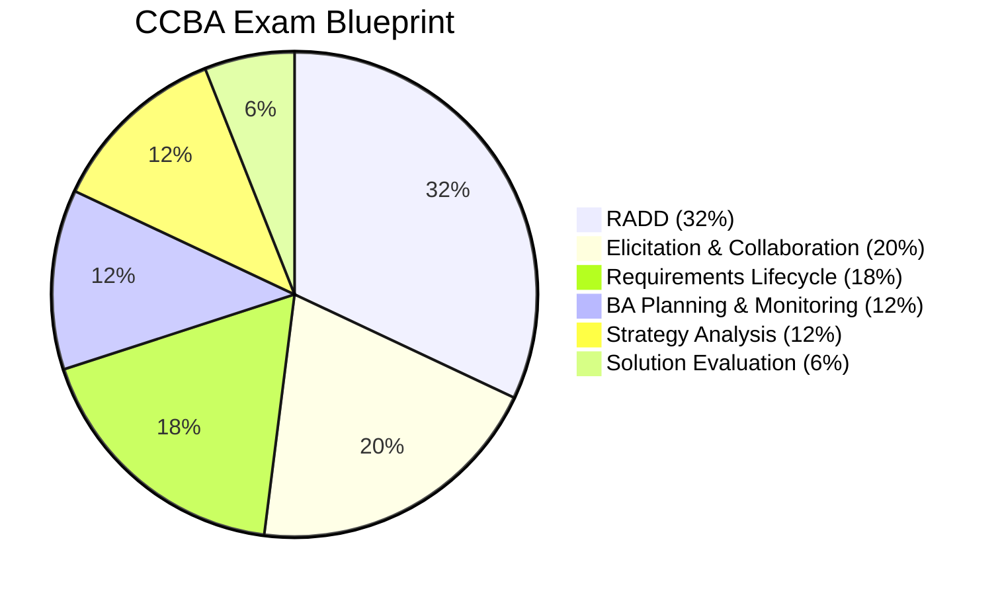
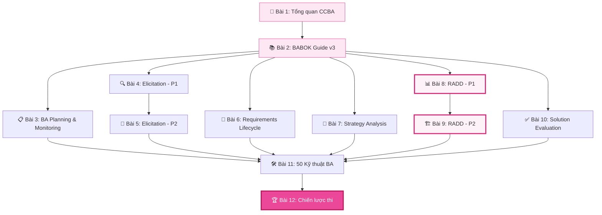

## CCBA là gì?

**Certification of Capability in Business Analysis (CCBA)** là chứng chỉ cấp trung của IIBA (International Institute of Business Analysis), dành cho những BA đã có kinh nghiệm thực tế và muốn chứng minh năng lực chuyên môn ở mức ứng dụng. CCBA cho thấy bạn có khả năng **áp dụng kiến thức BA** vào các dự án thực tế một cách hiệu quả.

## Ai nên thi CCBA?

- 💼 BA có 2-3 năm kinh nghiệm làm việc thực tế
- 📈 Muốn nâng level từ Junior lên Mid-level BA
- 🎯 Đã thi ECBA và muốn tiến xa hơn
- 🏢 Cần chứng chỉ quốc tế để nâng cao cơ hội nghề nghiệp
- 🔄 Product Manager, QA, PM muốn chuyển sang hoặc mở rộng sang BA

## Yêu cầu thi

| Tiêu chí | Yêu cầu |
|----------|---------|
| Kinh nghiệm | Tối thiểu 3,750 giờ BA work (trong 7 năm gần nhất) |
| Phân bổ KA | 900 giờ/KA × 2 KAs hoặc 500 giờ/KA × 4 KAs |
| Đào tạo | Tối thiểu 21 giờ Professional Development (trong 4 năm) |
| Phí thi | ~$250 (thành viên IIBA) / ~$450 (không thành viên) |
| Hình thức | Thi online hoặc tại trung tâm PSI, trắc nghiệm |
| Số câu hỏi | 130 câu scenario-based |
| Thời gian | 3 giờ |
| Tham khảo | Cung cấp references |

## Exam Blueprint — Tỷ trọng các Knowledge Area

| Knowledge Area | Tỷ trọng | Mô tả |
|---------------|:--------:|-------|
| Requirements Analysis & Design Definition | 32% | Phân tích yêu cầu, mô hình hóa, thiết kế giải pháp |
| Elicitation & Collaboration | 20% | Thu thập yêu cầu, phối hợp stakeholder |
| Requirements Life Cycle Management | 18% | Quản lý vòng đời yêu cầu, traceability |
| BA Planning & Monitoring | 12% | Lập kế hoạch và giám sát hoạt động BA |
| Strategy Analysis | 12% | Phân tích chiến lược, current/future state |
| Solution Evaluation | 6% | Đánh giá giải pháp |

## So sánh ECBA vs CCBA vs CBAP

| | ECBA | CCBA | CBAP |
|---|------|------|------|
| Cấp độ | Entry | Intermediate | Advanced |
| Kinh nghiệm | Không yêu cầu | 3,750 giờ | 7,500 giờ |
| Độ khó | ⭐⭐ | ⭐⭐⭐⭐ | ⭐⭐⭐⭐⭐ |
| Câu hỏi | 50 câu / 1h | 130 câu / 3h | 120 câu / 3.5h |
| Phạm vi | Kiến thức cơ bản | Ứng dụng thực tế | Phân tích & tổng hợp |
| Dạng câu hỏi | Knowledge-based | Scenario-based | Case study & Scenario |

## Lộ trình 12 bài học

## Series này sẽ giúp bạn

✅ Ôn tập chuyên sâu 6 Knowledge Areas theo đúng tỷ trọng đề thi  
✅ Nắm vững 50 kỹ thuật BA trong BABOK Guide v3  
✅ Luyện kỹ năng phân tích tình huống (scenario-based questions)  
✅ Hiểu rõ Input → Task → Output → Techniques của từng Knowledge Area  
✅ Chiến lược quản lý thời gian khi làm 130 câu trong 3 giờ  
✅ Chia sẻ kinh nghiệm thi thực tế từ người đã đỗ  
✅ Chinh phục CCBA một cách tự tin! 🏆
